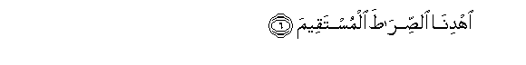

# اُهْدِنَا اُلصِّرَاطَ اُلْمُسْتَقِيمَ

## Ihdina alssirata almustaqeema

## 翻译(Translation)：

| Translator | 译文(Translation)          |
| :--------: | -------------------------- |
|    马坚    | 求你引领我们正路，         |
|  YUSUFALI  | Show us the straight way,  |
| PICKTHALL  | Show us the straight path, |
|   SHAKIR   | Keep us on the right path. |

---

## 对位释义(Words Interpretation)：

| No    |  العربية | 中文                                               | English      |
| ----- | -------: | -------------------------------------------------- | ------------ |
| 序号  |     阿文 | Chinese                                            | 英文         |
| 1:6.1 |    اُهْدِنَا | 指导我们，引领，你一定要引导我们，你千万要引导我们 | Guide us     |
| 1:6.2 |   اُلصِّرَاطَ | 道路，方向                                         | the path     |
|       |       ال | 该                                                 | the          |
|       |     صراط | 路径                                               | path, way    |
| 1:6.3 | اُلْمُسْتَقِيمَ | 笔直，正确的，在端正的                             | the straight |

---

