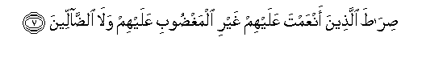

# صِرَاطَ اُلَّذِينَ أَنْعَمْتَ عَلَيْهِمْ غَيْرِ اُلْمَغْضُوبِ عَلَيْهِمْ وَلَا اُلضَّاَلِّينَ
## Sirata allatheena anAAamta AAalayhim ghayri almaghdoobi AAalayhim wala alddalleena
## 翻译(Translation)：
|Translator | 译文(Translation)|
|:---:|---|
|马坚  |	你所祐助者的路，不是受谴怒者的路，也不是迷误者的路。|
|YUSUFALI  |	The way of those on whom Thou hast bestowed Thy Grace, those whose (portion) is not wrath, and who go not astray. |
|PICKTHAL  |	The path of those whom Thou hast favoured; Not the (path) of those who earn Thine anger nor of those who go astray. |
|SHAKIR  |	The path of those upon whom Thou hast bestowed favors. Not (the path) of those upon whom Thy wrath is brought down, nor of those who go astray.|
---
## 对位释义(Words Interpretation)：
|No | العربية | 中文 | English | 曾用词|
|---|---:|---|---|---|
|序号|阿文|Chinese|英文|Before|
|1:7.1 | صراط |路径 | path, way | 参1:6.2|
|1:7.2 | الذين | 谁，那些 |	who, those	||
|1:7.3 | أنعمت | 赋予，你曾经施与恩惠 | bestowed	||
|1:7.4 | عليهم | 在他们 | on they	||
|1:7.5 | غير | 非，除了，除开，不是，但 | non, but	||
|1:7.6 | المغضوب | 愤怒，谴怒，使恼怒的，受恼怒的，被谴责的 | anger	||
|1:7.7 | عليهم | 在他们 | on they | 见1:7.4|
|1:7.8 | ولا | 也不 | and not	||
|1:7.9 | الضالين | 走错，迷误，走入歧途者，走入邪路者 | astray	||
---
