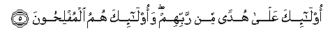
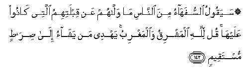
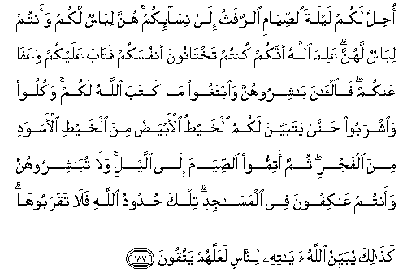

# البقرة
# 百格勒(黄牛章）
# Sūra II.: Baqara, or the Heifer.
- 麦地那(286)

---

## بِسْمِ اللَّهِ الرَّحْمَٰنِ الرَّحِيمِ
---
## ٢:١

### [2:1](002_001.md) الم
### 2:1 Alif-lam-meem
### 2:1 艾列弗，俩目，米目。
### 2:1 A.L.M.
---
## ٢:٢

### [2:2](002_002.md) ذَٰلِكَ الْكِتَابُ لَا رَيْبَ ۛ فِيهِ ۛ هُدًى لِلْمُتَّقِينَ
### 2:2 Thalika alkitabu la rayba feehi hudan lilmuttaqeena
### 2:2 这部经，其中毫无可疑，是敬畏者的向导。
### 2:2 This is the Book; in it is guidance sure, without doubt, to those who fear Allah;
---
## ٢:٣

### [2:3](002_003.md) ٱلَّذِينَ يُؤْمِنُونَ بِٱلْغَيْبِ وَيُقِيمُونَ ٱلصَّلَاوةَ وَمِمَّا رَزَقْنَاهُمْ يُنفِقُونَ
### 2:3 Allatheena yu/minoona bialghaybi wayuqeemoona alssalata wamimma razaqnahum yunfiqoona
### 2:3 他们确信幽玄，谨守拜功，并分舍我所给与他们的。
### 2:3 Who believe in the Unseen, are steadfast in prayer, and spend out of what We have provided for them;
---
## ٢:٤

### [2:4](002_004.md) وَٱلَّذِينَ يُؤْمِنونَ بِمَآ أُنْزِلَ إِلَيْكَ وَمَآ أُنْزِلَ مِنْ قَبْلِكَ وَبِٱلْأَخِرَةِ هُمْ يُوقِنُونَ
### 2:4 Waallatheena yu/minoona bima onzila ilayka wama onzila min qablika wabial-akhirati hum yooqinoona
### 2:4 他们确信降示你的经典，和在你以前降示的经典，并且笃信後世。
### 2:4 And who believe in the Revelation sent to thee, and sent before thy time, and (in their hearts) have the assurance of the Hereafter.
---
## ٢:٥

### [2:5](002_005.md) أُوْلَٰٓئِكَ عَلَىٰ هُدًى مِّنْ رَّبِّهِمْ وَأُوْلَٰٓئِكَ هُمُ ٱلْمُفْلِحُونَ
### 2:5 Ola-ika AAala hudan min rabbihim waola-ika humu almuflihoona
### 2:5 这等人，是遵守他们的主的正道的；这等人，确是成功的。
### 2:5 They are on (true) guidance, from their Lord, and it is these who will prosper.
---
## ٢:٦

### [2:6](002_006.md) إِنَّ الَّذِينَ كَفَرُوا سَوَاءٌ عَلَيْهِمْ أَأَنْذَرْتَهُمْ أَمْ لَمْ تُنْذِرْهُمْ لَا يُؤْمِنُونَ
### 2:6 Inna allatheena kafaroo sawaon AAalayhim aanthartahum am lam tunthirhum la yu/minoona
### 2:6 不信道者，你对他们加以警告与否，这在他们是一样的，他们毕竟不信道。
### 2:6 As to those who reject Faith, it is the same to them whether thou warn them or do not warn them; they will not believe.
---
## ٢:٧

### [2:7](002_007.md) خَتَمَ اللَّهُ عَلَىٰ قُلُوبِهِمْ وَعَلَىٰ سَمْعِهِمْ ۖ وَعَلَىٰ أَبْصَارِهِمْ غِشَاوَةٌ ۖ وَلَهُمْ عَذَابٌ عَظِيمٌ
### 2:7 Khatama Allahu AAala quloobihim waAAala samAAihim waAAala absarihim ghishawatun walahum AAathabun AAatheemun
### 2:7 真主已封闭他们的心和耳，他们的眼上有翳膜；他们将受重大的刑罚。
### 2:7 Allah hath set a seal on their hearts and on their hearing, and on their eyes is a veil; great is the penalty they (incur).
---
## ٢:٨

### [2:8](002_008.md) وَمِنَ النَّاسِ مَنْ يَقُولُ آمَنَّا بِاللَّهِ وَبِالْيَوْمِ الْآخِرِ وَمَا هُمْ بِمُؤْمِنِينَ
### 2:8 Wamina alnnasi man yaqoolu amanna biAllahi wabialyawmi al-akhiri wama hum bimu/mineena
### 2:8 有些人说：我们已信真主和末日了。其实，他们绝不是信士。
### 2:8 Of the people there are some who say: "We believe in Allah and the Last Day;" but they do not (really) believe.
---
## ٢:٩

### [2:9](002_009.md) يُخَادِعُونَ اللَّهَ وَالَّذِينَ آمَنُوا وَمَا يَخْدَعُونَ إِلَّا أَنْفُسَهُمْ وَمَا يَشْعُرُونَ
### 2:9 YukhadiAAoona Allaha waallatheena amanoo wama yakhdaAAoona illa anfusahum wamayashAAuroona
### 2:9 他们想欺瞒真主和信士，其实，他们只是自欺，却不觉悟。
### 2:9 Fain would they deceive Allah and those who believe, but they only deceive themselves, and realise (it) not!
---
## ٢:١٠

### [2:10](002_010.md) فِي قُلُوبِهِمْ مَرَضٌ فَزَادَهُمُ اللَّهُ مَرَضًا ۖ وَلَهُمْ عَذَابٌ أَلِيمٌ بِمَا كَانُوا يَكْذِبُونَ
### 2:10 Fee quloobihim maradun fazadahumu Allahu maradan walahum AAathabun aleemun bima kanoo yakthiboona
### 2:10 他们的心里有病，故真主增加他们的心病；他们将为说谎而遭受重大的刑罚。
### 2:10 In their hearts is a disease; and Allah has increased their disease: And grievous is the penalty they (incur), because they are false (to themselves).
---
## ٢:١١

### [2:11](002_011.md) وَإِذَا قِيلَ لَهُمْ لَا تُفْسِدُوا فِي الْأَرْضِ قَالُوا إِنَّمَا نَحْنُ مُصْلِحُونَ
### 2:11 Wa-itha qeela lahum la tufsidoo fee al-ardi qaloo innama nahnu muslihoona
### 2:11 有人对他们说：你们不要在地方上作恶。他们就说：我们只是调解的人。
### 2:11 When it is said to them: "Make not mischief on the earth," they say: "Why, we only Want to make peace!"
---
## ٢:١٢

### [2:12](002_012.md) أَلَا إِنَّهُمْ هُمُ الْمُفْسِدُونَ وَلَٰكِنْ لَا يَشْعُرُونَ
### 2:12 Ala innahum humu almufsidoona walakin la yashAAuroona
### 2:12 真的，他们确是作恶者，但他们不觉悟。
### 2:12 Of a surety, they are the ones who make mischief, but they realise (it) not.
---
## ٢:١٣

### [2:13](002_013.md) وَإِذَا قِيلَ لَهُمْ آمِنُوا كَمَا آمَنَ النَّاسُ قَالُوا أَنُؤْمِنُ كَمَا آمَنَ السُّفَهَاءُ ۗ أَلَا إِنَّهُمْ هُمُ السُّفَهَاءُ وَلَٰكِنْ لَا يَعْلَمُونَ
### 2:13 Wa-itha qeela lahum aminoo kama amana alnnasu qaloo anu/minu kama amana alssufahao alainnahum humu alssufahao walakin la yaAAlamoona
### 2:13 有人对他们说：你们应当象众人那样信道。他们就说：我们能象愚人那样轻信吗？真的，他们确是愚人，但他们不知道。
### 2:13 When it is said to them: "Believe as the others believe:" They say: "Shall we believe as the fools believe?" Nay, of a surety they are the fools, but they do not know.
---
## ٢:١٤

### [2:14](002_014.md) وَإِذَا لَقُوا الَّذِينَ آمَنُوا قَالُوا آمَنَّا وَإِذَا خَلَوْا إِلَىٰ شَيَاطِينِهِمْ قَالُوا إِنَّا مَعَكُمْ إِنَّمَا نَحْنُ مُسْتَهْزِئُونَ
### 2:14 Wa-itha laqoo allatheena amanoo qaloo amanna wa-itha khalaw ila shayateenihim qaloo innamaAAakum innama nahnu mustahzi-oona
### 2:14 他们遇见信士们就说：我们已信道了。他们回去见了自己的恶魔，就说：我们确是你们的同党，我们不过是愚弄他们罢了。
### 2:14 When they meet those who believe, they say: "We believe;" but when they are alone with their evil ones, they say: "We are really with you: We (were) only jesting."
---
## ٢:١٥

### [2:15](002_015.md) اللَّهُ يَسْتَهْزِئُ بِهِمْ وَيَمُدُّهُمْ فِي طُغْيَانِهِمْ يَعْمَهُونَ
### 2:15 Allahu yastahzi-o bihim wayamudduhum fee tughyanihim yaAAmahoona
### 2:15 真主将用他们的愚弄还报他们，将任随他们彷徨於悖逆之中。
### 2:15 Allah will throw back their mockery on them, and give them rope in their trespasses; so they will wander like blind ones (To and fro).
---
## ٢:١٦

### [2:16](002_016.md) أُولَٰئِكَ الَّذِينَ اشْتَرَوُا الضَّلَالَةَ بِالْهُدَىٰ فَمَا رَبِحَتْ تِجَارَتُهُمْ وَمَا كَانُوا مُهْتَدِينَ
### 2:16 Ola-ika allatheena ishtarawoo alddalalata bialhuda fama rabihat tijaratuhum wama kanoo muhtadeena
### 2:16 这等人，以正道换取迷误，所以他们的交易并未获利，他们不是遵循正道的。
### 2:16 These are they who have bartered Guidance for error: But their traffic is profitless, and they have lost true direction,
---
## ٢:١٧

### [2:17](002_017.md) مَثَلُهُمْ كَمَثَلِ الَّذِي اسْتَوْقَدَ نَارًا فَلَمَّا أَضَاءَتْ مَا حَوْلَهُ ذَهَبَ اللَّهُ بِنُورِهِمْ وَتَرَكَهُمْ فِي ظُلُمَاتٍ لَا يُبْصِرُونَ
### 2:17 Mathaluhum kamathali allathee istawqada naran falamma adaat ma hawlahu thahaba Allahu binoorihim watarakahum fee thulumatin la yubsiroona
### 2:17 他们譬如燃火的人，当火光照亮了他们的四周的时候，真主把他们的火光拿去，让他们在重重的黑暗中，甚麽也看不见。
### 2:17 Their similitude is that of a man who kindled a fire; when it lighted all around him, Allah took away their light and left them in utter darkness. So they could not see.
---
## ٢:١٨

### [2:18](002_018.md) صُمٌّ بُكْمٌ عُمْيٌ فَهُمْ لَا يَرْجِعُونَ
### 2:18 Summun bukmun AAumyun fahum la yarjiAAoona
### 2:18 （他们）是聋的，是哑的，是瞎的，所以他们执迷不悟。
### 2:18 Deaf, dumb, and blind, they will not return (to the path).
---
## ٢:١٩

### [2:19](002_019.md) أَوْ كَصَيِّبٍ مِنَ السَّمَاءِ فِيهِ ظُلُمَاتٌ وَرَعْدٌ وَبَرْقٌ يَجْعَلُونَ أَصَابِعَهُمْ فِي آذَانِهِمْ مِنَ الصَّوَاعِقِ حَذَرَ الْمَوْتِ ۚ وَاللَّهُ مُحِيطٌ بِالْكَافِرِينَ
### 2:19 Aw kasayyibin mina alssama-i feehi thulumatun waraAAdun wabarqun yajAAaloona asabiAAahum fee athanihim mina alssawaAAiqi hathara almawti waAllahu muheetun bialkafireena
### 2:19 或者如遭遇倾盆大雨者，雨里有重重黑暗，又有雷和电，他们恐怕震死，故用手指塞住耳朵，以避疾雷。真主是周知不信道的人们的。
### 2:19 Or (another similitude) is that of a rain-laden cloud from the sky: In it are zones of darkness, and thunder and lightning: They press their fingers in their ears to keep out the stunning thunder-clap, the while they are in terror of death. But Allah is ever round the rejecters of Faith!
---
## ٢:٢٠

### [2:20](002_020.md) يَكَادُ الْبَرْقُ يَخْطَفُ أَبْصَارَهُمْ ۖ كُلَّمَا أَضَاءَ لَهُمْ مَشَوْا فِيهِ وَإِذَا أَظْلَمَ عَلَيْهِمْ قَامُوا ۚ وَلَوْ شَاءَ اللَّهُ لَذَهَبَ بِسَمْعِهِمْ وَأَبْصَارِهِمْ ۚ إِنَّ اللَّهَ عَلَىٰ كُلِّ شَيْءٍ قَدِيرٌ
### 2:20 Yakadu albarqu yakhtafu absarahum kullama adaa lahum mashaw feehi wa-itha athlama AAalayhim qamoo walaw shaa Allahu lathahaba bisamAAihim waabsarihim inna Allaha AAala kulli shay-in qadeerun
### 2:20 电光几乎夺了他们的视觉，每逢电光为他们而照耀的时候，他们在电光中前进；黑暗的时候，他们就站住。假如真主意欲，他必褫夺他们的听觉和视觉。真主对於万事确是全能的。
### 2:20 The lightning all but snatches away their sight; every time the light (Helps) them, they walk therein, and when the darkness grows on them, they stand still. And if Allah willed, He could take away their faculty of hearing and seeing; for Allah hath power over all things.
---
## ٢:٢١

### [2:21](002_021.md) يَا أَيُّهَا النَّاسُ اعْبُدُوا رَبَّكُمُ الَّذِي خَلَقَكُمْ وَالَّذِينَ مِنْ قَبْلِكُمْ لَعَلَّكُمْ تَتَّقُونَ
### 2:21 Ya ayyuha alnnasu oAAbudoo rabbakumu allathee khalaqakum waallatheena min qablikum laAAallakum tattaqoona
### 2:21 众人啊！你们的主，创造了你们，和你们以前的人，你们当崇拜他，以便你们敬畏。
### 2:21 O ye people! Adore your Guardian-Lord, who created you and those who came before you, that ye may have the chance to learn righteousness;
---
## ٢:٢٢

### [2:22](002_022.md) الَّذِي جَعَلَ لَكُمُ الْأَرْضَ فِرَاشًا وَالسَّمَاءَ بِنَاءً وَأَنْزَلَ مِنَ السَّمَاءِ مَاءً فَأَخْرَجَ بِهِ مِنَ الثَّمَرَاتِ رِزْقًا لَكُمْ ۖ فَلَا تَجْعَلُوا لِلَّهِ أَنْدَادًا وَأَنْتُمْ تَعْلَمُونَ
### 2:22 Allathee jaAAala lakumu al-arda firashan waalssamaa binaan waanzala mina alssama-i maan faakhraja bihi mina alththamarati rizqan lakum fala tajAAaloo lillahi andadan waantum taAAlamoona
### 2:22 他以大地为你们的席，以天空为你们的幕，并且从云中降下雨水，而借雨水生许多果实，做你们的给养，所以你们不要明知故犯地给真主树立匹敌。
### 2:22 Who has made the earth your couch, and the heavens your canopy; and sent down rain from the heavens; and brought forth therewith Fruits for your sustenance; then set not up rivals unto Allah when ye know (the truth).
---
## ٢:٢٣

### [2:23](002_023.md) وَإِنْ كُنْتُمْ فِي رَيْبٍ مِمَّا نَزَّلْنَا عَلَىٰ عَبْدِنَا فَأْتُوا بِسُورَةٍ مِنْ مِثْلِهِ وَادْعُوا شُهَدَاءَكُمْ مِنْ دُونِ اللَّهِ إِنْ كُنْتُمْ صَادِقِينَ
### 2:23 Wa-in kuntum fee raybin mimma nazzalna AAala AAabdina fa/too bisooratin min mithlihi waodAAoo shuhadaakum min dooni Allahi in kuntum sadiqeena
### 2:23 如果你们怀疑我所降示给我的仆人的经典，那末，你们试拟作一章，并舍真主而祈祷你们的见证，如果你们是诚实的。
### 2:23 And if ye are in doubt as to what We have revealed from time to time to Our servant, then produce a Sura like thereunto; and call your witnesses or helpers (If there are any) besides Allah, if your (doubts) are true.
---
## ٢:٢٤

### [2:24](002_024.md) فَإِنْ لَمْ تَفْعَلُوا وَلَنْ تَفْعَلُوا فَاتَّقُوا النَّارَ الَّتِي وَقُودُهَا النَّاسُ وَالْحِجَارَةُ ۖ أُعِدَّتْ لِلْكَافِرِينَ
### 2:24 Fa-in lam tafAAaloo walan tafAAaloo faittaqoo alnnara allatee waqooduha alnnasu waalhijaratu oAAiddat lilkafireena
### 2:24 如果你们不能作──你们绝不能作──那末，你们当防备火狱，那是用人和石做燃料的，已为不信道的人们预备好了。
### 2:24 But if ye cannot- and of a surety ye cannot- then fear the Fire whose fuel is men and stones,- which is prepared for those who reject Faith.
---
## ٢:٢٥

### [2:25](002_025.md) وَبَشِّرِ الَّذِينَ آمَنُوا وَعَمِلُوا الصَّالِحَاتِ أَنَّ لَهُمْ جَنَّاتٍ تَجْرِي مِنْ تَحْتِهَا الْأَنْهَارُ ۖ كُلَّمَا رُزِقُوا مِنْهَا مِنْ ثَمَرَةٍ رِزْقًا ۙ قَالُوا هَٰذَا الَّذِي رُزِقْنَا مِنْ قَبْلُ ۖ وَأُتُوا بِهِ مُتَشَابِهًا ۖ وَلَهُمْ فِيهَا أَزْوَاجٌ مُطَهَّرَةٌ ۖ وَهُمْ فِيهَا خَالِدُونَ
### 2:25 Wabashshiri allatheena amanoo waAAamiloo alssalihati anna lahum jannatin tajree min tahtiha al-anharu kullama ruziqoo minha min thamaratin rizqan qaloo hatha allathee ruziqna min qablu waotoo bihi mutashabihan walahum feeha azwajun mutahharatun wahum feeha khalidoona
### 2:25 你当向信道而行善的人报喜；他们将享有许多下临诸河的乐园，每当他们得以园里的一种水果为给养的时候，他们都说：这是我们以前所受赐的。其实，他们所受赐的是类似的。他们在乐园里将享有纯洁的配偶，他们将永居其中。
### 2:25 But give glad tidings to those who believe and work righteousness, that their portion is Gardens, beneath which rivers flow. Every time they are fed with fruits therefrom, they say: "Why, this is what we were fed with before," for they are given things in similitude; and they have therein companions pure (and holy); and they abide therein (for ever).
---
## ٢:٢٦

### [2:26](002_026.md) ۞ إِنَّ اللَّهَ لَا يَسْتَحْيِي أَنْ يَضْرِبَ مَثَلًا مَا بَعُوضَةً فَمَا فَوْقَهَا ۚ فَأَمَّا الَّذِينَ آمَنُوا فَيَعْلَمُونَ أَنَّهُ الْحَقُّ مِنْ رَبِّهِمْ ۖ وَأَمَّا الَّذِينَ كَفَرُوا فَيَقُولُونَ مَاذَا أَرَادَ اللَّهُ بِهَٰذَا مَثَلًا ۘ يُضِلُّ بِهِ كَثِيرًا وَيَهْدِي بِهِ كَثِيرًا ۚ وَمَا يُضِلُّ بِهِ إِلَّا الْفَاسِقِينَ
### 2:26 Inna Allaha la yastahyee an yadriba mathalan ma baAAoodatan fama fawqaha faamma allatheenaamanoo fayaAAlamoona annahu alhaqqu min rabbihim waamma allatheena kafaroo fayaqooloona matha arada Allahu bihatha mathalan yudillu bihi katheeran wayahdee bihi katheeran wama yudillu bihi illa alfasiqeena
### 2:26 真主的确不嫌以蚊子或更小的事物设任何譬喻；信道者，都知道那是从他们的主降示的真理；不信道者，却说：真主设这个譬喻的宗旨是甚麽？他以譬喻使许多人入迷途，也以譬喻使许多人上正路；但除悖逆者外，他不以譬喻使人入迷途。
### 2:26 Allah disdains not to use the similitude of things, lowest as well as highest. Those who believe know that it is truth from their Lord; but those who reject Faith say: "What means Allah by this similitude?" By it He causes many to stray, and many He leads into the right path; but He causes not to stray, except those who forsake (the path),-
---
## ٢:٢٧

### [2:27](002_027.md) الَّذِينَ يَنْقُضُونَ عَهْدَ اللَّهِ مِنْ بَعْدِ مِيثَاقِهِ وَيَقْطَعُونَ مَا أَمَرَ اللَّهُ بِهِ أَنْ يُوصَلَ وَيُفْسِدُونَ فِي الْأَرْضِ ۚ أُولَٰئِكَ هُمُ الْخَاسِرُونَ
### 2:27 Allatheena yanqudoona AAahda Allahi min baAAdi meethaqihi wayaqtaAAoona ma amara Allahu bihi an yoosala wayufsidoona fee al-ardi ola-ika humu alkhasiroona
### 2:27 他们与真主缔约之後，并断绝真主命人联络的，且在地方上作恶；这等人，确是亏折的。
### 2:27 Those who break Allah's Covenant after it is ratified, and who sunder what Allah Has ordered to be joined, and do mischief on earth: These cause loss (only) to themselves.
---
## ٢:٢٨

### [2:28](002_028.md) كَيْفَ تَكْفُرُونَ بِاللَّهِ وَكُنْتُمْ أَمْوَاتًا فَأَحْيَاكُمْ ۖ ثُمَّ يُمِيتُكُمْ ثُمَّ يُحْيِيكُمْ ثُمَّ إِلَيْهِ تُرْجَعُونَ
### 2:28 Kayfa takfuroona biAllahi wakuntum amwatan faahyakum thumma yumeetukum thumma yuhyeekum thumma ilayhi turjaAAoona
### 2:28 你们怎麽不信真主呢？你们原是死的，而他以生命赋予你们，然後使你们死亡，然後使你们复活；然後你们要被召归於他。
### 2:28 How can ye reject the faith in Allah?- seeing that ye were without life, and He gave you life; then will He cause you to die, and will again bring you to life; and again to Him will ye return.
---
## ٢:٢٩

### [2:29](002_029.md) هُوَ الَّذِي خَلَقَ لَكُمْ مَا فِي الْأَرْضِ جَمِيعًا ثُمَّ اسْتَوَىٰ إِلَى السَّمَاءِ فَسَوَّاهُنَّ سَبْعَ سَمَاوَاتٍ ۚ وَهُوَ بِكُلِّ شَيْءٍ عَلِيمٌ
### 2:29 Huwa allathee khalaqa lakum ma fee al-ardi jameeAAan thumma istawa ila alssama-i fasawwahunna sabAAa samawatin wahuwa bikulli shay-in AAaleemun
### 2:29 他已为你们创造了大地上的一切事物，复经营诸天，完成了七层天。他对於万物是全知的。
### 2:29 It is He Who hath created for you all things that are on earth; Moreover His design comprehended the heavens, for He gave order and perfection to the seven firmaments; and of all things He hath perfect knowledge.
---
## ٢:٣٠

### [2:30](002_030.md) وَإِذْ قَالَ رَبُّكَ لِلْمَلَائِكَةِ إِنِّي جَاعِلٌ فِي الْأَرْضِ خَلِيفَةً ۖ قَالُوا أَتَجْعَلُ فِيهَا مَنْ يُفْسِدُ فِيهَا وَيَسْفِكُ الدِّمَاءَ وَنَحْنُ نُسَبِّحُ بِحَمْدِكَ وَنُقَدِّسُ لَكَ ۖ قَالَ إِنِّي أَعْلَمُ مَا لَا تَعْلَمُونَ
### 2:30 Wa-ith qala rabbuka lilmala-ikati innee jaAAilun fee al-ardi khaleefatan qaloo atajAAalu feeha man yufsidu feeha wayasfiku alddimaa wanahnu nusabbihu bihamdika wanuqaddisu laka qala innee aAAlamu ma la taAAlamoona
### 2:30 当时，你的主对众天神说：我必定在大地上设置一个代理人。他们说：我们赞你超绝，我们赞你清净，你还要在大地上设置作恶和流血者吗？他说：我知道你们所不知道的。
### 2:30 Behold, thy Lord said to the angels: "I will create a vicegerent on earth." They said: "Wilt Thou place therein one who will make mischief therein and shed blood?- whilst we do celebrate Thy praises and glorify Thy holy (name)?" He said: "I know what ye know not."
---
## ٢:٣١

### [2:31](002_031.md) وَعَلَّمَ آدَمَ الْأَسْمَاءَ كُلَّهَا ثُمَّ عَرَضَهُمْ عَلَى الْمَلَائِكَةِ فَقَالَ أَنْبِئُونِي بِأَسْمَاءِ هَٰؤُلَاءِ إِنْ كُنْتُمْ صَادِقِينَ
### 2:31 WaAAallama adama al-asmaa kullaha thumma AAaradahum AAala almala-ikati faqala anbi-oonee bi-asma-i haola-i in kuntum sadiqeena
### 2:31 他将万物的名称，都教授阿丹，然後以万物昭示众天神，说：你们把这些事物的名称告诉我吧，如果你们是诚实的。
### 2:31 And He taught Adam the names of all things; then He placed them before the angels, and said: "Tell me the names of these if ye are right."
---
## ٢:٣٢

### [2:32](002_032.md) قَالُوا سُبْحَانَكَ لَا عِلْمَ لَنَا إِلَّا مَا عَلَّمْتَنَا ۖ إِنَّكَ أَنْتَ الْعَلِيمُ الْحَكِيمُ
### 2:32 Qaloo subhanaka la AAilma lana illa ma AAallamtana innaka anta alAAaleemu alhakeemu
### 2:32 他们说：赞你超绝，除了你所教授我们的知识外，我们毫无知识，你确是全知的，确是至睿的。
### 2:32 They said: "Glory to Thee, of knowledge We have none, save what Thou Hast taught us: In truth it is Thou Who art perfect in knowledge and wisdom."
---
## ٢:٣٣

### [2:33](002_033.md) قَالَ يَا آدَمُ أَنْبِئْهُمْ بِأَسْمَائِهِمْ ۖ فَلَمَّا أَنْبَأَهُمْ بِأَسْمَائِهِمْ قَالَ أَلَمْ أَقُلْ لَكُمْ إِنِّي أَعْلَمُ غَيْبَ السَّمَاوَاتِ وَالْأَرْضِ وَأَعْلَمُ مَا تُبْدُونَ وَمَا كُنْتُمْ تَكْتُمُونَ
### 2:33 Qala ya adamu anbi/hum bi-asma-ihim falamma anbaahum bi-asma-ihim qala alam aqul lakum innee aAAlamu ghayba alssamawati waal-ardi waaAAlamu ma tubdoona wama kuntum taktumoona
### 2:33 他说：阿丹啊！你把这些事物的名称告诉他们吧。当他把那些事物的名称告诉他们的时候，真主说：难道我没有对你们说过吗？我的确知道天地的幽玄，我的确知道你们所表白的，和你们所隐讳的。
### 2:33 He said: "O Adam! Tell them their names." When he had told them, Allah said: "Did I not tell you that I know the secrets of heaven and earth, and I know what ye reveal and what ye conceal?"
---
## ٢:٣٤

### [2:34](002_034.md) وَإِذْ قُلْنَا لِلْمَلَائِكَةِ اسْجُدُوا لِآدَمَ فَسَجَدُوا إِلَّا إِبْلِيسَ أَبَىٰ وَاسْتَكْبَرَ وَكَانَ مِنَ الْكَافِرِينَ
### 2:34 Wa-ith qulna lilmala-ikati osjudoo li-adama fasajadoo illa ibleesa aba waistakbara wakana mina alkafireena
### 2:34 当时，我对众天神说：你们向阿丹叩头吧！他们就叩头，惟有易卜劣厮不肯，他自大，他原是不信道的。
### 2:34 And behold, We said to the angels: "Bow down to Adam" and they bowed down. Not so Iblis: he refused and was haughty: He was of those who reject Faith.
---
## ٢:٣٥

### [2:35](002_035.md) وَقُلْنَا يَا آدَمُ اسْكُنْ أَنْتَ وَزَوْجُكَ الْجَنَّةَ وَكُلَا مِنْهَا رَغَدًا حَيْثُ شِئْتُمَا وَلَا تَقْرَبَا هَٰذِهِ الشَّجَرَةَ فَتَكُونَا مِنَ الظَّالِمِينَ
### 2:35 Waqulna ya adamu oskun anta wazawjuka aljannata wakula minha raghadan haythu shi/tuma walataqraba hathihi alshshajarata fatakoona mina alththalimeena
### 2:35 我说：阿丹啊！你和你的妻子同住乐园吧！你们俩可以任意吃园里所有丰富的食物，你们俩不要临近这棵树；否则，就要变成不义的人。
### 2:35 We said: "O Adam! dwell thou and thy wife in the Garden; and eat of the bountiful things therein as (where and when) ye will; but approach not this tree, or ye run into harm and transgression."
---
## ٢:٣٦

### [2:36](002_036.md) فَأَزَلَّهُمَا الشَّيْطَانُ عَنْهَا فَأَخْرَجَهُمَا مِمَّا كَانَا فِيهِ ۖ وَقُلْنَا اهْبِطُوا بَعْضُكُمْ لِبَعْضٍ عَدُوٌّ ۖ وَلَكُمْ فِي الْأَرْضِ مُسْتَقَرٌّ وَمَتَاعٌ إِلَىٰ حِينٍ
### 2:36 Faazallahuma alshshaytanu AAanha faakhrajahuma mimma kana feehi waqulna ihbitoo baAAdukum libaAAdin AAaduwwun walakum fee al-ardi mustaqarrun wamataAAun ila heenin
### 2:36 然後，恶魔使他们俩为那棵树而犯罪，遂将他们俩人从所居的乐园中诱出。我说：你们互相仇视下去吧。大地上有你们暂时的住处和享受。
### 2:36 Then did Satan make them slip from the (garden), and get them out of the state (of felicity) in which they had been. We said: "Get ye down, all (ye people), with enmity between yourselves. On earth will be your dwelling-place and your means of livelihood - for a time."
---
## ٢:٣٧

### [2:37](002_037.md) فَتَلَقَّىٰ آدَمُ مِنْ رَبِّهِ كَلِمَاتٍ فَتَابَ عَلَيْهِ ۚ إِنَّهُ هُوَ التَّوَّابُ الرَّحِيمُ
### 2:37 Fatalaqqa adamu min rabbihi kalimatin fataba AAalayhi innahu huwa alttawwabu alrraheemu
### 2:37 然後，阿丹奉到从主降示的几件诫命，主就恕宥了他。主确是至宥的，确是至慈的。
### 2:37 Then learnt Adam from his Lord words of inspiration, and his Lord Turned towards him; for He is Oft-Returning, Most Merciful.
---
## ٢:٣٨

### [2:38](002_038.md) قُلْنَا اهْبِطُوا مِنْهَا جَمِيعًا ۖ فَإِمَّا يَأْتِيَنَّكُمْ مِنِّي هُدًى فَمَنْ تَبِعَ هُدَايَ فَلَا خَوْفٌ عَلَيْهِمْ وَلَا هُمْ يَحْزَنُونَ 
### 2:38 Qulna ihbitoo minha jameeAAan fa-imma ya/tiyannakum minnee hudan faman tabiAAa hudaya falakhawfun AAalayhim wala hum yahzanoona
### 2:38 我说：你们都从这里下去吧！我的引导如果到达你们，那末，谁遵守我的引导，谁在将来没有恐惧，也不愁。
### 2:38 We said: "Get ye down all from here; and if, as is sure, there comes to you Guidance from me, whosoever follows My guidance, on them shall be no fear, nor shall they grieve.
---
## ٢:٣٩

### [2:39](002_039.md) وَالَّذِينَ كَفَرُوا وَكَذَّبُوا بِآيَاتِنَا أُولَٰئِكَ أَصْحَابُ النَّارِ ۖ هُمْ فِيهَا خَالِدُونَ
### 2:39 Waallatheena kafaroo wakaththaboo bi-ayatina ola-ika as-habu alnnari hum feeha khalidoona
### 2:39 不信道而且否认我的迹象的人，是火狱的居民，他们将永居其中。
### 2:39 "But those who reject Faith and belie Our Signs, they shall be companions of the Fire; they shall abide therein."
---
## ٢:٤٠

### [2:40](002_040.md) يَا بَنِي إِسْرَائِيلَ اذْكُرُوا نِعْمَتِيَ الَّتِي أَنْعَمْتُ عَلَيْكُمْ وَأَوْفُوا بِعَهْدِي أُوفِ بِعَهْدِكُمْ وَإِيَّايَ فَارْهَبُونِ
### 2:40 Ya banee isra-eela othkuroo niAAmatiya allatee anAAamtu AAalaykum waawfoo biAAahdee oofi biAAahdikum wa-iyyaya fairhabooni
### 2:40 以色列的後裔啊！你们当铭记我所赐你们的恩惠，你们当履行对我的约言，我就履行对你们的约言；你们应当只畏惧我。
### 2:40 O Children of Israel! call to mind the (special) favour which I bestowed upon you, and fulfil your covenant with Me as I fulfil My Covenant with you, and fear none but Me.
---
## ٢:٤١

### [2:41](002_041.md) وَآمِنُوا بِمَا أَنْزَلْتُ مُصَدِّقًا لِمَا مَعَكُمْ وَلَا تَكُونُوا أَوَّلَ كَافِرٍ بِهِ ۖ وَلَا تَشْتَرُوا بِآيَاتِي ثَمَنًا قَلِيلًا وَإِيَّايَ فَاتَّقُونِ
### 2:41 Waaminoo bima anzaltu musaddiqan lima maAAakum wala takoonoo awwala kafirin bihi walatashtaroo bi-ayatee thamanan qaleelan wa-iyyaya faittaqooni
### 2:41 你们当信我所降示的，这能证实你们所有的经典，你们不要做首先不信的人，不要以廉价出卖我的迹象，你们应当只敬畏我。
### 2:41 And believe in what I reveal, confirming the revelation which is with you, and be not the first to reject Faith therein, nor sell My Signs for a small price; and fear Me, and Me alone.
---
## ٢:٤٢

### [2:42](002_042.md) وَلَا تَلْبِسُوا الْحَقَّ بِالْبَاطِلِ وَتَكْتُمُوا الْحَقَّ وَأَنْتُمْ تَعْلَمُونَ
### 2:42 Wala talbisoo alhaqqa bialbatili wataktumoo alhaqqa waantum taAAlamoona
### 2:42 你们不要明知故犯地以伪乱真，隐讳真理。
### 2:42 And cover not Truth with falsehood, nor conceal the Truth when ye know (what it is).
---
## ٢:٤٣

### [2:43](002_043.md) وَأَقِيمُوا الصَّلَاةَ وَآتُوا الزَّكَاةَ وَارْكَعُوا مَعَ الرَّاكِعِينَ
### 2:43 Waaqeemoo alssalata waatoo alzzakata wairkaAAoo maAAa alrrakiAAeena
### 2:43 你们当谨守拜功，完纳天课，与鞠躬者同齐鞠躬。
### 2:43 And be steadfast in prayer; practise regular charity; and bow down your heads with those who bow down (in worship).
---
## ٢:٤٤

### [2:44](002_044.md) ۞ أَتَأْمُرُونَ النَّاسَ بِالْبِرِّ وَتَنْسَوْنَ أَنْفُسَكُمْ وَأَنْتُمْ تَتْلُونَ الْكِتَابَ ۚ أَفَلَا تَعْقِلُونَ
### 2:44 Ata/muroona alnnasa bialbirri watansawna anfusakum waantum tatloona alkitaba afala taAAqiloona
### 2:44 你们是读经的人，怎麽劝人为善，而忘却自身呢？难道你们不了解吗？
### 2:44 Do ye enjoin right conduct on the people, and forget (To practise it) yourselves, and yet ye study the Scripture? Will ye not understand?
---
## ٢:٤٥

### [2:45](002_045.md) وَاسْتَعِينُوا بِالصَّبْرِ وَالصَّلَاةِ ۚ وَإِنَّهَا لَكَبِيرَةٌ إِلَّا عَلَى الْخَاشِعِينَ
### 2:45 WaistaAAeenoo bialssabri waalssalati wa-innaha lakabeeratun illa AAala alkhashiAAeena
### 2:45 你们当借坚忍和礼拜而求佑助。礼拜确是一件难事，但对恭敬的人却不难。
### 2:45 Nay, seek (Allah's) help with patient perseverance and prayer: It is indeed hard, except to those who bring a lowly spirit,-
---
## ٢:٤٦

### [2:46](002_046.md) الَّذِينَ يَظُنُّونَ أَنَّهُمْ مُلَاقُو رَبِّهِمْ وَأَنَّهُمْ إِلَيْهِ رَاجِعُونَ
### 2:46 Allatheena yathunnoona annahum mulaqoo rabbihim waannahum ilayhi rajiAAoona
### 2:46 他们确信自己必定见主，必定归主。
### 2:46 Who bear in mind the certainty that they are to meet their Lord, and that they are to return to Him.
---
## ٢:٤٧

### [2:47](002_047.md) يَا بَنِي إِسْرَائِيلَ اذْكُرُوا نِعْمَتِيَ الَّتِي أَنْعَمْتُ عَلَيْكُمْ وَأَنِّي فَضَّلْتُكُمْ عَلَى الْعَالَمِينَ
### 2:47 Ya banee isra-eela othkuroo niAAmatiya allatee anAAamtu AAalaykum waannee faddaltukum AAalaalAAalameena
### 2:47 以色列的後裔啊！你们当铭记我所赐你们的恩典，并铭记我曾使你们超越世人。
### 2:47 Children of Israel! call to mind the (special) favour which I bestowed upon you, and that I preferred you to all other (for My Message).
---
## ٢:٤٨

### [2:48](002_048.md) وَاتَّقُوا يَوْمًا لَا تَجْزِي نَفْسٌ عَنْ نَفْسٍ شَيْئًا وَلَا يُقْبَلُ مِنْهَا شَفَاعَةٌ وَلَا يُؤْخَذُ مِنْهَا عَدْلٌ وَلَا هُمْ يُنْصَرُونَ
### 2:48 Waittaqoo yawman la tajzee nafsun AAan nafsin shay-an wala yuqbalu minha shafaAAatun walayu/khathu minha AAadlun wala hum yunsaroona
### 2:48 你们当防备将来有这样的一日：任何人不能替任何人帮一点忙，任何人的说情，都不蒙接受，任何人的赎金，都不蒙采纳，他们也不获援助。
### 2:48 Then guard yourselves against a day when one soul shall not avail another nor shall intercession be accepted for her, nor shall compensation be taken from her, nor shall anyone be helped (from outside).
---
## ٢:٤٩

### [2:49](002_049.md) وَإِذْ نَجَّيْنَاكُمْ مِنْ آلِ فِرْعَوْنَ يَسُومُونَكُمْ سُوءَ الْعَذَابِ يُذَبِّحُونَ أَبْنَاءَكُمْ وَيَسْتَحْيُونَ نِسَاءَكُمْ ۚ وَفِي ذَٰلِكُمْ بَلَاءٌ مِنْ رَبِّكُمْ عَظِيمٌ
### 2:49 Wa-ith najjaynakum min ali firAAawna yasoomoonakum soo-a alAAathabi yuthabbihoona abnaakum wayastahyoona nisaakum wafee thalikum balaon min rabbikum AAatheemun
### 2:49 当时，我拯救你们脱离了法老的百姓。他们使你们遭受酷刑；屠杀你们的儿子，留存你们的女子；这是从你们的主降下的大难。
### 2:49 And remember, We delivered you from the people of Pharaoh: They set you hard tasks and punishments, slaughtered your sons and let your women-folk live; therein was a tremendous trial from your Lord.
---
## ٢:٥٠

### [2:50](002_050.md) وَإِذْ فَرَقْنَا بِكُمُ الْبَحْرَ فَأَنْجَيْنَاكُمْ وَأَغْرَقْنَا آلَ فِرْعَوْنَ وَأَنْتُمْ تَنْظُرُونَ
### 2:50 Wa-ith faraqna bikumu albahra faanjaynakum waaghraqna ala firAAawna waantum tanthuroona
### 2:50 我为你们分开海水，拯救了你们，并溺杀了法老的百姓，这是你们看著的。
### 2:50 And remember We divided the sea for you and saved you and drowned Pharaoh's people within your very sight.
---
## ٢:٥١

### [2:51](002_051.md) وَإِذْ وَاعَدْنَا مُوسَىٰ أَرْبَعِينَ لَيْلَةً ثُمَّ اتَّخَذْتُمُ الْعِجْلَ مِنْ بَعْدِهِ وَأَنْتُمْ ظَالِمُونَ
### 2:51 Wa-ith waAAadna moosa arbaAAeena laylatan thumma ittakhathtumu alAAijla min baAAdihi waantum thalimoona
### 2:51 当时，我与穆萨约期四十日，在他离别你们之後，你们认犊为神，你们是不义的。
### 2:51 And remember We appointed forty nights for Moses, and in his absence ye took the calf (for worship), and ye did grievous wrong.
---
## ٢:٥٢

### [2:52](002_052.md) ثُمَّ عَفَوْنَا عَنْكُمْ مِنْ بَعْدِ ذَٰلِكَ لَعَلَّكُمْ تَشْكُرُونَ
### 2:52 Thumma AAafawna AAankum min baAAdi thalika laAAallakum tashkuroona
### 2:52 在那件事之後，我恕饶了你们，以便你们感谢。
### 2:52 Even then We did forgive you; there was a chance for you to be grateful.
---
## ٢:٥٣

### [2:53](002_053.md) وَإِذْ آتَيْنَا مُوسَى الْكِتَابَ وَالْفُرْقَانَ لَعَلَّكُمْ تَهْتَدُونَ
### 2:53 Wa-ith atayna moosa alkitaba waalfurqana laAAallakum tahtadoona
### 2:53 当时，我以经典和证据赏赐穆萨，以便你们遵循正道。
### 2:53 And remember We gave Moses the Scripture and the Criterion (Between right and wrong): There was a chance for you to be guided aright.
---
## ٢:٥٤

### [2:54](002_054.md) وَإِذْ قَالَ مُوسَىٰ لِقَوْمِهِ يَا قَوْمِ إِنَّكُمْ ظَلَمْتُمْ أَنْفُسَكُمْ بِاتِّخَاذِكُمُ الْعِجْلَ فَتُوبُوا إِلَىٰ بَارِئِكُمْ فَاقْتُلُوا أَنْفُسَكُمْ ذَٰلِكُمْ خَيْرٌ لَكُمْ عِنْدَ بَارِئِكُمْ فَتَابَ عَلَيْكُمْ ۚ إِنَّهُ هُوَ التَّوَّابُ الرَّحِيمُ
### 2:54 Wa-ith qala moosa liqawmihi ya qawmi innakum thalamtum anfusakum biittikhathikumu alAAijla fatooboo ila bari-ikum faoqtuloo anfusakum thalikum khayrun lakum AAinda bari-ikum fataba AAalaykum innahu huwa alttawwabu alrraheemu
### 2:54 当时，穆萨对他的宗族说：我的宗族啊！你们确因认犊为神而自欺，故你们当向造物主悔罪，当处死罪人。在真主看来，这对於你们确是更好的。他就恕宥你们。他确是至宥的，确是至慈的。
### 2:54 And remember Moses said to his people: "O my people! Ye have indeed wronged yourselves by your worship of the calf: So turn (in repentance) to your Maker, and slay yourselves (the wrong-doers); that will be better for you in the sight of your Maker." Then He turned towards you (in forgiveness): For He is Oft-Returning, Most Merciful.
---
## ٢:٥٥

### [2:55](002_055.md) وَإِذْ قُلْتُمْ يَا مُوسَىٰ لَنْ نُؤْمِنَ لَكَ حَتَّىٰ نَرَى اللَّهَ جَهْرَةً فَأَخَذَتْكُمُ الصَّاعِقَةُ وَأَنْتُمْ تَنْظُرُونَ
### 2:55 Wa-ith qultum ya moosa lan nu/mina laka hatta nara Allaha jahratan faakhathatkumu alssaAAiqatu waantum tanthuroona
### 2:55 当时，你们说：穆萨啊！我们绝不信你，直到我们亲眼看见真主。故疾雷袭击了你们，这是你们看着的。
### 2:55 And remember ye said: "O Moses! We shall never believe in thee until we see Allah manifestly," but ye were dazed with thunder and lighting even as ye looked on.
---
## ٢:٥٦

### [2:56](002_056.md) ثُمَّ بَعَثْنَاكُمْ مِنْ بَعْدِ مَوْتِكُمْ لَعَلَّكُمْ تَشْكُرُونَ
### 2:56 Thumma baAAathnakum min baAAdi mawtikum laAAallakum tashkuroona
### 2:56 在你们晕死之後，我使你们苏醒，以便你们感谢。
### 2:56 Then We raised you up after your death: Ye had the chance to be grateful.
---
## ٢:٥٧

### [2:57](002_057.md) وَظَلَّلْنَا عَلَيْكُمُ الْغَمَامَ وَأَنْزَلْنَا عَلَيْكُمُ الْمَنَّ وَالسَّلْوَىٰ ۖ كُلُوا مِنْ طَيِّبَاتِ مَا رَزَقْنَاكُمْ ۖ وَمَا ظَلَمُونَا وَلَٰكِنْ كَانُوا أَنْفُسَهُمْ يَظْلِمُونَ
### 2:57 Wathallalna AAalaykumu alghamama waanzalna AAalaykumu almanna waalssalwa kuloo mintayyibati ma razaqnakum wama thalamoona walakin kanoo anfusahum yathlimoona
### 2:57 我曾使白云荫蔽你们，又降甘露和鹌鹑给你们。你们可以吃我所供给你们的佳美食物。他们没有损害我，但他们自欺。
### 2:57 And We gave you the shade of clouds and sent down to you Manna and quails, saying: "Eat of the good things We have provided for you:" (But they rebelled); to us they did no harm, but they harmed their own souls.
---
## ٢:٥٨

### [2:58](002_058.md) وَإِذْ قُلْنَا ادْخُلُوا هَٰذِهِ الْقَرْيَةَ فَكُلُوا مِنْهَا حَيْثُ شِئْتُمْ رَغَدًا وَادْخُلُوا الْبَابَ سُجَّدًا وَقُولُوا حِطَّةٌ نَغْفِرْ لَكُمْ خَطَايَاكُمْ ۚ وَسَنَزِيدُ الْمُحْسِنِينَ
### 2:58 Wa-ith qulna odkhuloo hathihi alqaryata fakuloo minha haythu shi/tum raghadan waodkhuloo albaba sujjadan waqooloo hittatun naghfir lakum khatayakum wasanazeedu almuhsineena
### 2:58 当时，我说：你们进这城市去，你们可以随意吃其中所有丰富的食物。你们应当鞠躬而进城门，并且说：‘释我重负。’我将赦宥你们的种种罪过，我要厚报善人。
### 2:58 And remember We said: "Enter this town, and eat of the plenty therein as ye wish; but enter the gate with humility, in posture and in words, and We shall forgive you your faults and increase (the portion of) those who do good."
---
## ٢:٥٩

### [2:59](002_059.md) فَبَدَّلَ الَّذِينَ ظَلَمُوا قَوْلًا غَيْرَ الَّذِي قِيلَ لَهُمْ فَأَنْزَلْنَا عَلَى الَّذِينَ ظَلَمُوا رِجْزًا مِنَ السَّمَاءِ بِمَا كَانُوا يَفْسُقُونَ 
### 2:59 Fabaddala allatheena thalamoo qawlan ghayra allathee qeela lahum faanzalna AAala allatheenathalamoo rijzan mina alssama-i bima kanoo yafsuqoona
### 2:59 但不义的人改变了他们所奉的嘱言，故我降天灾於不义者，那是由於他们的犯罪。
### 2:59 But the transgressors changed the word from that which had been given them; so We sent on the transgressors a plague from heaven, for that they infringed (Our command) repeatedly.
---
## ٢:٦٠

### [2:60](002_060.md) ۞ وَإِذِ اسْتَسْقَىٰ مُوسَىٰ لِقَوْمِهِ فَقُلْنَا اضْرِبْ بِعَصَاكَ الْحَجَرَ ۖ فَانْفَجَرَتْ مِنْهُ اثْنَتَا عَشْرَةَ عَيْنًا ۖ قَدْ عَلِمَ كُلُّ أُنَاسٍ مَشْرَبَهُمْ ۖ كُلُوا وَاشْرَبُوا مِنْ رِزْقِ اللَّهِ وَلَا تَعْثَوْا فِي الْأَرْضِ مُفْسِدِينَ
### 2:60 Wa-ithi istasqa moosa liqawmihi faqulna idrib biAAasaka alhajara fainfajarat minhu ithnata AAashrata AAaynan qad AAalima kullu onasin mashrabahum kuloo waishraboo min rizqi Allahi wala taAAthaw fee al-ardi mufsideena
### 2:60 当时，穆萨替他的宗族祈水，我说：你用手杖打那磐石吧。十二道水泉，就从那磐石里涌出来，各部落都知道自己的饮水处。你们可以吃饮真主的给养，你们不要在地方上为非作歹。
### 2:60 And remember Moses prayed for water for his people; We said: "Strike the rock with thy staff." Then gushed forth therefrom twelve springs. Each group knew its own place for water. So eat and drink of the sustenance provided by Allah, and do no evil nor mischief on the (face of the) earth.
---
## ٢:٦١

### [2:61](002_061.md) وَإِذْ قُلْتُمْ يَا مُوسَىٰ لَنْ نَصْبِرَ عَلَىٰ طَعَامٍ وَاحِدٍ فَادْعُ لَنَا رَبَّكَ يُخْرِجْ لَنَا مِمَّا تُنْبِتُ الْأَرْضُ مِنْ بَقْلِهَا وَقِثَّائِهَا وَفُومِهَا وَعَدَسِهَا وَبَصَلِهَا ۖ قَالَ أَتَسْتَبْدِلُونَ الَّذِي هُوَ أَدْنَىٰ بِالَّذِي هُوَ خَيْرٌ ۚ اهْبِطُوا مِصْرًا فَإِنَّ لَكُمْ مَا سَأَلْتُمْ ۗ وَضُرِبَتْ عَلَيْهِمُ الذِّلَّةُ وَالْمَسْكَنَةُ وَبَاءُوا بِغَضَبٍ مِنَ اللَّهِ ۗ ذَٰلِكَ بِأَنَّهُمْ كَانُوا يَكْفُرُونَ بِآيَاتِ اللَّهِ وَيَقْتُلُونَ النَّبِيِّينَ بِغَيْرِ الْحَقِّ ۗ ذَٰلِكَ بِمَا عَصَوْا وَكَانُوا يَعْتَدُونَ
### 2:61 Wa-ith qultum ya moosa lan nasbira AAala taAAamin wahidin faodAAu lana rabbaka yukhrij lanamimma tunbitu al-ardu min baqliha waqiththa-iha wafoomiha waAAadasiha wabasaliha qala atastabdiloona allathee huwa adna biallathee huwa khayrun ihbitoo misran fa-inna lakum ma saaltum waduribat AAalayhimu alththillatu waalmaskanatu wabaoo bighadabin mina Allahi thalika bi-annahum kanoo yakfuroona bi-ayati Allahi wayaqtuloona alnnabiyyeena bighayri alhaqqi thalika bima AAasaw wakanoo yaAAtadoona
### 2:61 当时，你们说：穆萨啊！专吃一样食物，我们绝不能忍受，所以请你替我们请求你的主，为我们生出大地所产的蔬菜──黄瓜、大蒜、扁豆和玉葱。他说：难道你们要以较贵的换取较贱的吗？你们到一座城里去吧！你们必得自己所请求的食物。他们陷於卑贱和穷困中，他们应受真主的谴怒。这是因为他们不信真主的迹象，而且枉杀众先知；这又是因为他们违抗主命，超越法度。
### 2:61 And remember ye said: "O Moses! we cannot endure one kind of food (always); so beseech thy Lord for us to produce for us of what the earth groweth, -its pot-herbs, and cucumbers, Its garlic, lentils, and onions." He said: "Will ye exchange the better for the worse? Go ye down to any town, and ye shall find what ye want!" They were covered with humiliation and misery; they drew on themselves the wrath of Allah. This because they went on rejecting the Signs of Allah and slaying His Messengers without just cause. This because they rebelled and went on transgressing.
---
## ٢:٦٢

### [2:62](002_062.md) إِنَّ الَّذِينَ آمَنُوا وَالَّذِينَ هَادُوا وَالنَّصَارَىٰ وَالصَّابِئِينَ مَنْ آمَنَ بِاللَّهِ وَالْيَوْمِ الْآخِرِ وَعَمِلَ صَالِحًا فَلَهُمْ أَجْرُهُمْ عِنْدَ رَبِّهِمْ وَلَا خَوْفٌ عَلَيْهِمْ وَلَا هُمْ يَحْزَنُونَ 
### 2:62 Inna allatheena amanoo waallatheena hadoo waalnnasara waalssabi-eena man amana biAllahi waalyawmi al-akhiri waAAamila salihan falahum ajruhum AAinda rabbihim wala khawfun AAalayhim wala hum yahzanoona
### 2:62 信道者、犹太教徒、基督教徒、拜星教徒，凡信真主和末日，并且行善的，将来在主那里必得享受自己的报酬，他们将来没有恐惧，也不忧愁。
### 2:62 Those who believe (in the Qur'an), and those who follow the Jewish (scriptures), and the Christians and the Sabians,- any who believe in Allah and the Last Day, and work righteousness, shall have their reward with their Lord; on them shall be no fear, nor shall they grieve.
---
## ٢:٦٣

### [2:63](002_063.md) وَإِذْ أَخَذْنَا مِيثَاقَكُمْ وَرَفَعْنَا فَوْقَكُمُ الطُّورَ خُذُوا مَا آتَيْنَاكُمْ بِقُوَّةٍ وَاذْكُرُوا مَا فِيهِ لَعَلَّكُمْ تَتَّقُونَ
### 2:63 Wa-ith akhathna meethaqakum warafaAAna fawqakumu alttoora khuthoo ma ataynakum biquwwatin waothkuroo ma feehi laAAallakum tattaqoona
### 2:63 当时，我与你们缔约，并将山树立在你们的上面，我说：你们当坚守我所赐你们的经典，并且当牢记其中的律例，以便你们敬畏。
### 2:63 And remember We took your covenant and We raised above you (The towering height) of Mount (Sinai) : (Saying): "Hold firmly to what We have given you and bring (ever) to remembrance what is therein: Perchance ye may fear Allah."
---
## ٢:٦٤

### [2:64](002_064.md) ثُمَّ تَوَلَّيْتُمْ مِنْ بَعْدِ ذَٰلِكَ ۖ فَلَوْلَا فَضْلُ اللَّهِ عَلَيْكُمْ وَرَحْمَتُهُ لَكُنْتُمْ مِنَ الْخَاسِرِينَ
### 2:64 Thumma tawallaytum min baAAdi thalika falawla fadlu Allahi AAalaykum warahmatuhu lakuntum mina alkhasireena
### 2:64 以後，你们背叛。假若没有真主赏赐你们的恩惠和慈恩，你们必定变成亏折者。
### 2:64 But ye turned back thereafter: Had it not been for the Grace and Mercy of Allah to you, ye had surely been among the lost.
---
## ٢:٦٥

### [2:65](002_065.md) وَلَقَدْ عَلِمْتُمُ الَّذِينَ اعْتَدَوْا مِنْكُمْ فِي السَّبْتِ فَقُلْنَا لَهُمْ كُونُوا قِرَدَةً خَاسِئِينَ
### 2:65 Walaqad AAalimtumu allatheena iAAtadaw minkum fee alssabti faqulna lahum koonoo qiradatan khasi-eena
### 2:65 你们确已认识你们中有些人，在安息日超越法度，故我对他们说：你们变成卑贱的猿猴吧。
### 2:65 And well ye knew those amongst you who transgressed in the matter of the Sabbath: We said to them: "Be ye apes, despised and rejected."
---
## ٢:٦٦

### [2:66](002_066.md) فَجَعَلْنَاهَا نَكَالًا لِمَا بَيْنَ يَدَيْهَا وَمَا خَلْفَهَا وَمَوْعِظَةً لِلْمُتَّقِينَ
### 2:66 FajaAAalnaha nakalan lima bayna yadayha wama khalfaha wamawAAithatan lilmuttaqeena
### 2:66 我以这种刑罚为前人和後人的戒与敬畏者的教训。
### 2:66 So We made it an example to their own time and to their posterity, and a lesson to those who fear Allah.
---
## ٢:٦٧

### [2:67](002_067.md) وَإِذْ قَالَ مُوسَىٰ لِقَوْمِهِ إِنَّ اللَّهَ يَأْمُرُكُمْ أَنْ تَذْبَحُوا بَقَرَةً ۖ قَالُوا أَتَتَّخِذُنَا هُزُوًا ۖ قَالَ أَعُوذُ بِاللَّهِ أَنْ أَكُونَ مِنَ الْجَاهِلِينَ
### 2:67 Wa-ith qala moosa liqawmihi inna Allaha ya/murukum an tathbahoo baqaratan qaloo atattakhithunahuzuwan qala aAAoothu biAllahi an akoona mina aljahileena
### 2:67 当时，穆萨对他的宗族说：真主的确命令你们宰一头牛。他们说：你愚弄我们吗？他说：我求真主保佑我，以免我变成愚人。
### 2:67 And remember Moses said to his people: "Allah commands that ye sacrifice a heifer." They said: "Makest thou a laughing-stock of us?" He said: "Allah save me from being an ignorant (fool)!"
---
## ٢:٦٨

### [2:68](002_068.md) قَالُوا ادْعُ لَنَا رَبَّكَ يُبَيِّنْ لَنَا مَا هِيَ ۚ قَالَ إِنَّهُ يَقُولُ إِنَّهَا بَقَرَةٌ لَا فَارِضٌ وَلَا بِكْرٌ عَوَانٌ بَيْنَ ذَٰلِكَ ۖ فَافْعَلُوا مَا تُؤْمَرُونَ
### 2:68 Qaloo odAAu lana rabbaka yubayyin lana ma hiya qala innahu yaqoolu innaha baqaratun la faridun wala bikrun AAawanun bayna thalika faifAAaloo ma tu/maroona
### 2:68 他们说：请你替我们请求你的主为我们说明那头牛的情状。他说：我的主说：那头牛确是不老不少，年龄适中的。你们遵命而行吧！
### 2:68 They said: "Beseech on our behalf Thy Lord to make plain to us what (heifer) it is!" He said; "He says: The heifer should be neither too old nor too young, but of middling age. Now do what ye are commanded!"
---
## ٢:٦٩

### [2:69](002_069.md) قَالُوا ادْعُ لَنَا رَبَّكَ يُبَيِّنْ لَنَا مَا لَوْنُهَا ۚ قَالَ إِنَّهُ يَقُولُ إِنَّهَا بَقَرَةٌ صَفْرَاءُ فَاقِعٌ لَوْنُهَا تَسُرُّ النَّاظِرِينَ
### 2:69 Qaloo odAAu lana rabbaka yubayyin lana ma lawnuha qala innahu yaqoolu innaha baqaratunsafrao faqiAAun lawnuha tasurru alnnathireena
### 2:69 他们说：请你替我们请求你的主为我们说明那头牛的毛色。他说我的主说：那头牛毛色纯黄，见者喜悦。
### 2:69 They said: "Beseech on our behalf Thy Lord to make plain to us Her colour." He said: "He says: A fawn-coloured heifer, pure and rich in tone, the admiration of beholders!"
---
## ٢:٧٠

### [2:70](002_070.md) قَالُوا ادْعُ لَنَا رَبَّكَ يُبَيِّنْ لَنَا مَا هِيَ إِنَّ الْبَقَرَ تَشَابَهَ عَلَيْنَا وَإِنَّا إِنْ شَاءَ اللَّهُ لَمُهْتَدُونَ
### 2:70 Qaloo odAAu lana rabbaka yubayyin lana ma hiya inna albaqara tashabaha AAalayna wa-inna in shaa Allahu lamuhtadoona
### 2:70 他们说：请你替我们请求你的主为我们说明那头牛的情状，因为在我们看来，牛都是相似的，如果真主意欲，我们必获指导。
### 2:70 They said: "Beseech on our behalf Thy Lord to make plain to us what she is: To us are all heifers alike: We wish indeed for guidance, if Allah wills."
---
## ٢:٧١

### [2:71](002_071.md) قَالَ إِنَّهُ يَقُولُ إِنَّهَا بَقَرَةٌ لَا ذَلُولٌ تُثِيرُ الْأَرْضَ وَلَا تَسْقِي الْحَرْثَ مُسَلَّمَةٌ لَا شِيَةَ فِيهَا ۚ قَالُوا الْآنَ جِئْتَ بِالْحَقِّ ۚ فَذَبَحُوهَا وَمَا كَادُوا يَفْعَلُونَ
### 2:71 Qala innahu yaqoolu innaha baqaratun la thaloolun tutheeru al-arda wala tasqee alhartha musallamatun la shiyata feeha qaloo al-ana ji/ta bialhaqqi fathabahooha wama kadoo yafAAaloona
### 2:71 他说：我的主说：那头牛不是受过训练的，既不耕田地，又不转水车，确是全美无斑的。他们说：现在你揭示真相了。他们就宰了那头牛，但非出自愿。
### 2:71 He said: "He says: A heifer not trained to till the soil or water the fields; sound and without blemish." They said: "Now hast thou brought the truth." Then they offered her in sacrifice, but not with good-will.
---
## ٢:٧٢

### [2:72](002_072.md) وَإِذْ قَتَلْتُمْ نَفْسًا فَادَّارَأْتُمْ فِيهَا ۖ وَاللَّهُ مُخْرِجٌ مَا كُنْتُمْ تَكْتُمُونَ
### 2:72 Wa-ith qataltum nafsan faiddara/tum feeha waAllahu mukhrijun ma kuntum taktumoona
### 2:72 当时，你们杀了一个人，你们互相抵赖。而真主是要揭穿你们所隐讳的事实的。
### 2:72 Remember ye slew a man and fell into a dispute among yourselves as to the crime: But Allah was to bring forth what ye did hide.
---
## ٢:٧٣

### [2:73](002_073.md) فَقُلْنَا اضْرِبُوهُ بِبَعْضِهَا ۚ كَذَٰلِكَ يُحْيِي اللَّهُ الْمَوْتَىٰ وَيُرِيكُمْ آيَاتِهِ لَعَلَّكُمْ تَعْقِلُونَ
### 2:73 Faqulna idriboohu bibaAAdiha kathalika yuhyee Allahu almawta wayureekum ayatihi laAAallakum taAAqiloona
### 2:73 故我说：你们用它的一部分打他吧！真主如此使死者复活，并以他的迹象昭示你们，以便你们了解。
### 2:73 So We said: "Strike the (body) with a piece of the (heifer)." Thus Allah bringeth the dead to life and showeth you His Signs: Perchance ye may understand.
---
## ٢:٧٤

### [2:74](002_074.md) ثُمَّ قَسَتْ قُلُوبُكُمْ مِنْ بَعْدِ ذَٰلِكَ فَهِيَ كَالْحِجَارَةِ أَوْ أَشَدُّ قَسْوَةً ۚ وَإِنَّ مِنَ الْحِجَارَةِ لَمَا يَتَفَجَّرُ مِنْهُ الْأَنْهَارُ ۚ وَإِنَّ مِنْهَا لَمَا يَشَّقَّقُ فَيَخْرُجُ مِنْهُ الْمَاءُ ۚ وَإِنَّ مِنْهَا لَمَا يَهْبِطُ مِنْ خَشْيَةِ اللَّهِ ۗ وَمَا اللَّهُ بِغَافِلٍ عَمَّا تَعْمَلُونَ
### 2:74 Thumma qasat quloobukum min baAAdi thalika fahiya kaalhijarati aw ashaddu qaswatan wa-inna mina alhijarati lama yatafajjaru minhu al-anharu wa-inna minha lama yashshaqqaqu fayakhruju minhu almao wa-inna minha lama yahbitu min khashyati Allahi wama Allahu bighafilin AAamma taAAmaloona
### 2:74 此後，你们的心变硬了，变得像石头一样，或比石头还硬。有些石头，河水从其中涌出；有些石头，自己破裂，而水泉从其中流出；有些石头为惧怕真主而坠落。真主绝不忽视你们的行为。
### 2:74 Thenceforth were your hearts hardened: They became like a rock and even worse in hardness. For among rocks there are some from which rivers gush forth; others there are which when split asunder send forth water; and others which sink for fear of Allah. And Allah is not unmindful of what ye do.
---
## ٢:٧٥

### [2:75](002_075.md) ۞ أَفَتَطْمَعُونَ أَنْ يُؤْمِنُوا لَكُمْ وَقَدْ كَانَ فَرِيقٌ مِنْهُمْ يَسْمَعُونَ كَلَامَ اللَّهِ ثُمَّ يُحَرِّفُونَهُ مِنْ بَعْدِ مَا عَقَلُوهُ وَهُمْ يَعْلَمُونَ
### 2:75 AfatatmaAAoona an yu/minoo lakum waqad kana fareequn minhum yasmaAAoona kalama Allahi thumma yuharrifoonahu min baAAdi ma AAaqaloohu wahum yaAAlamoona
### 2:75 你们还企图他们会为你们的劝化而信道吗？他们当中有一派人，曾听到真主的言语，他们既了解之後，便明知故犯地加以篡改。
### 2:75 Can ye (o ye men of Faith) entertain the hope that they will believe in you?- Seeing that a party of them heard the Word of Allah, and perverted it knowingly after they understood it.
---
## ٢:٧٦

### [2:76](002_076.md) وَإِذَا لَقُوا الَّذِينَ آمَنُوا قَالُوا آمَنَّا وَإِذَا خَلَا بَعْضُهُمْ إِلَىٰ بَعْضٍ قَالُوا أَتُحَدِّثُونَهُمْ بِمَا فَتَحَ اللَّهُ عَلَيْكُمْ لِيُحَاجُّوكُمْ بِهِ عِنْدَ رَبِّكُمْ ۚ أَفَلَا تَعْقِلُونَ
### 2:76 Wa-itha laqoo allatheena amanoo qaloo amanna wa-itha khala baAAduhum ila baAAdin qaloo atuhaddithoonahum bima fataha Allahu AAalaykum liyuhajjookum bihi AAinda rabbikum afalataAAqiloona
### 2:76 他们遇见信士们，就说：我们已信道了。他们彼此私下聚会的时候，他们却说：你们把真主所启示你们的告诉他们，使他们将来得在主那里据此与你们争论吗？难道你们不了解吗？
### 2:76 Behold! when they meet the men of Faith, they say: "We believe": But when they meet each other in private, they say: "Shall you tell them what Allah hath revealed to you, that they may engage you in argument about it before your Lord?"- Do ye not understand (their aim)?
---
## ٢:٧٧

### [2:77](002_077.md) أَوَلَا يَعْلَمُونَ أَنَّ اللَّهَ يَعْلَمُ مَا يُسِرُّونَ وَمَا يُعْلِنُونَ
### 2:77 Awa la yaAAlamoona anna Allaha yaAAlamu ma yusirroona wama yuAAlinoona
### 2:77 难道他们不晓得真主知道他们所隐讳的，和他们所表白的吗？
### 2:77 Know they not that Allah knoweth what they conceal and what they reveal?
---
## ٢:٧٨

### [2:78](002_078.md) وَمِنْهُمْ أُمِّيُّونَ لَا يَعْلَمُونَ الْكِتَابَ إِلَّا أَمَانِيَّ وَإِنْ هُمْ إِلَّا يَظُنُّونَ
### 2:78 Waminhum ommiyyoona la yaAAlamoona alkitaba illa amaniyya wa-in hum illa yathunnoona
### 2:78 他们中有些文盲，不知经典，只知妄言，他们专事猜测。
### 2:78 And there are among them illiterates, who know not the Book, but (see therein their own) desires, and they do nothing but conjecture.
---
## ٢:٧٩

### [2:79](002_079.md) فَوَيْلٌ لِلَّذِينَ يَكْتُبُونَ الْكِتَابَ بِأَيْدِيهِمْ ثُمَّ يَقُولُونَ هَٰذَا مِنْ عِنْدِ اللَّهِ لِيَشْتَرُوا بِهِ ثَمَنًا قَلِيلًا ۖ فَوَيْلٌ لَهُمْ مِمَّا كَتَبَتْ أَيْدِيهِمْ وَوَيْلٌ لَهُمْ مِمَّا يَكْسِبُونَ
### 2:79 Fawaylun lillatheena yaktuboona alkitaba bi-aydeehim thumma yaqooloona hatha min AAindi Allahi liyashtaroo bihi thamanan qaleelan fawaylun lahum mimma katabat aydeehim wawaylun lahum mimmayaksiboona
### 2:79 哀哉！他们亲手写经，然後说：这是真主所降示的。他们欲借此换取些微的代价。哀哉！他们亲手所写的。哀哉！他们自己所营谋的。
### 2:79 Then woe to those who write the Book with their own hands, and then say:"This is from Allah," to traffic with it for miserable price!- Woe to them for what their hands do write, and for the gain they make thereby.
---
## ٢:٨٠

### [2:80](002_080.md) وَقَالُوا لَنْ تَمَسَّنَا النَّارُ إِلَّا أَيَّامًا مَعْدُودَةً ۚ قُلْ أَتَّخَذْتُمْ عِنْدَ اللَّهِ عَهْدًا فَلَنْ يُخْلِفَ اللَّهُ عَهْدَهُ ۖ أَمْ تَقُولُونَ عَلَى اللَّهِ مَا لَا تَعْلَمُونَ
### 2:80 Waqaloo lan tamassana alnnaru illa ayyaman maAAdoodatan qul attakhathtum AAinda Allahi AAahdan falan yukhlifa Allahu AAahdahu am taqooloona AAala Allahi ma la taAAlamoona
### 2:80 他们说：火绝不接触我们，除非若干有数的日子。你说：真主是绝不爽约的，你们曾与真主缔约呢？还是假借真主的名义而说出自己所不知道的事呢？
### 2:80 And they say: "The Fire shall not touch us but for a few numbered days:" Say: "Have ye taken a promise from Allah, for He never breaks His promise? or is it that ye say of Allah what ye do not know?"
---
## ٢:٨١

### [2:81](002_081.md) بَلَىٰ مَنْ كَسَبَ سَيِّئَةً وَأَحَاطَتْ بِهِ خَطِيئَتُهُ فَأُولَٰئِكَ أَصْحَابُ النَّارِ ۖ هُمْ فِيهَا خَالِدُونَ
### 2:81 Bala man kasaba sayyi-atan waahatat bihi khatee-atuhu faola-ika as-habu alnnari hum feehakhalidoona
### 2:81 不然，凡作恶而为其罪孽所包罗者，都是火狱的居民，他们将永居其中。
### 2:81 Nay, those who seek gain in evil, and are girt round by their sins,- they are companions of the Fire: Therein shall they abide (For ever).
---
## ٢:٨٢

### [2:82](002_082.md) وَالَّذِينَ آمَنُوا وَعَمِلُوا الصَّالِحَاتِ أُولَٰئِكَ أَصْحَابُ الْجَنَّةِ ۖ هُمْ فِيهَا خَالِدُونَ
### 2:82 Waallatheena amanoo waAAamiloo alssalihati ola-ika as-habu aljannati hum feeha khalidoona
### 2:82 信道而且行善者，是乐园的居民，他们将永居其中。
### 2:82 But those who have faith and work righteousness, they are companions of the Garden: Therein shall they abide (For ever).
---
## ٢:٨٣

### [2:83](002_083.md) وَإِذْ أَخَذْنَا مِيثَاقَ بَنِي إِسْرَائِيلَ لَا تَعْبُدُونَ إِلَّا اللَّهَ وَبِالْوَالِدَيْنِ إِحْسَانًا وَذِي الْقُرْبَىٰ وَالْيَتَامَىٰ وَالْمَسَاكِينِ وَقُولُوا لِلنَّاسِ حُسْنًا وَأَقِيمُوا الصَّلَاةَ وَآتُوا الزَّكَاةَ ثُمَّ تَوَلَّيْتُمْ إِلَّا قَلِيلًا مِنْكُمْ وَأَنْتُمْ مُعْرِضُونَ
### 2:83 Wa-ith akhathna meethaqa banee isra-eela la taAAbudoona illa Allaha wabialwalidayni ihsanan wathee alqurba waalyatama waalmasakeeni waqooloo lilnnasi husnan waaqeemoo alssalata waatoo alzzakata thumma tawallaytum illa qaleelan minkum waantum muAAridoona
### 2:83 当时，我与以色列的後裔缔约，说：你们应当只崇拜真主，并当孝敬父母，和睦亲戚，怜恤孤儿，赈济贫民，对人说善言，谨守拜功，完纳天课。然後，你们除少数人外，都违背约言，你们是常常爽约的。
### 2:83 And remember We took a covenant from the Children of Israel (to this effect): Worship none but Allah; treat with kindness your parents and kindred, and orphans and those in need; speak fair to the people; be steadfast in prayer; and practise regular charity. Then did ye turn back, except a few among you, and ye backslide (even now).
---
## ٢:٨٤

### [2:84](002_084.md) وَإِذْ أَخَذْنَا مِيثَاقَكُمْ لَا تَسْفِكُونَ دِمَاءَكُمْ وَلَا تُخْرِجُونَ أَنْفُسَكُمْ مِنْ دِيَارِكُمْ ثُمَّ أَقْرَرْتُمْ وَأَنْتُمْ تَشْهَدُونَ
### 2:84 Wa-ith akhathna meethaqakum la tasfikoona dimaakum wala tukhrijoona anfusakum min diyarikum thumma aqrartum waantum tashhadoona
### 2:84 当时，我与你们缔约，说：你们不要自相残杀，不要把同族的人逐出境外。你们已经承诺，而且证实了。
### 2:84 And remember We took your covenant (to this effect): Shed no blood amongst you, nor turn out your own people from your homes: and this ye solemnly ratified, and to this ye can bear witness.
---
## ٢:٨٥

### [2:85](002_085.md) ثُمَّ أَنْتُمْ هَٰؤُلَاءِ تَقْتُلُونَ أَنْفُسَكُمْ وَتُخْرِجُونَ فَرِيقًا مِنْكُمْ مِنْ دِيَارِهِمْ تَظَاهَرُونَ عَلَيْهِمْ بِالْإِثْمِ وَالْعُدْوَانِ وَإِنْ يَأْتُوكُمْ أُسَارَىٰ تُفَادُوهُمْ وَهُوَ مُحَرَّمٌ عَلَيْكُمْ إِخْرَاجُهُمْ ۚ أَفَتُؤْمِنُونَ بِبَعْضِ الْكِتَابِ وَتَكْفُرُونَ بِبَعْضٍ ۚ فَمَا جَزَاءُ مَنْ يَفْعَلُ ذَٰلِكَ مِنْكُمْ إِلَّا خِزْيٌ فِي الْحَيَاةِ الدُّنْيَا ۖ وَيَوْمَ الْقِيَامَةِ يُرَدُّونَ إِلَىٰ أَشَدِّ الْعَذَابِ ۗ وَمَا اللَّهُ بِغَافِلٍ عَمَّا تَعْمَلُونَ
### 2:85 Thumma antum haola-i taqtuloona anfusakum watukhrijoona fareeqan minkum min diyarihim tathaharoona AAalayhim bial-ithmi waalAAudwani wa-in ya/tookum osara tufadoohum wahuwa muharramun AAalaykum ikhrajuhum afatu/minoona bibaAAdi alkitabi watakfuroona bibaAAdin famajazao man yafAAalu thalika minkum illa khizyun fee alhayati alddunya wayawma alqiyamati yuraddoona ila ashaddi alAAathabi wama Allahu bighafilin AAamma taAAmaloona
### 2:85 然後，你们自相残杀，而且把一部分同族的人逐出境外，你们同恶相济，狼狈为奸地对付他们──如果他们被俘来归，你们却替他们赎身──驱逐他们，在你们是犯法的行为。你们确信经典里的一部分律例，而不信别一部分吗？你们中作此事者，其报酬不外在今世生活中受辱，在复活日，被判受最严厉的刑罚。真主绝不忽视你们的行为。
### 2:85 After this it is ye, the same people, who slay among yourselves, and banish a party of you from their homes; assist (Their enemies) against them, in guilt and rancour; and if they come to you as captives, ye ransom them, though it was not lawful for you to banish them. Then is it only a part of the Book that ye believe in, and do ye reject the rest? but what is the reward for those among you who behave like this but disgrace in this life?- and on the Day of Judgment they shall be consigned to the most grievous penalty. For Allah is not unmindful of what ye do.
---
## ٢:٨٦

### [2:86](002_086.md) أُولَٰئِكَ الَّذِينَ اشْتَرَوُا الْحَيَاةَ الدُّنْيَا بِالْآخِرَةِ ۖ فَلَا يُخَفَّفُ عَنْهُمُ الْعَذَابُ وَلَا هُمْ يُنْصَرُونَ
### 2:86 Ola-ika allatheena ishtarawoo alhayata alddunya bial-akhirati fala yukhaffafu AAanhumu alAAathabu wala hum yunsaroona
### 2:86 这等人，是以後世换取今世生活的，故他们所受的刑罚，不被减轻，他们也不被援助。
### 2:86 These are the people who buy the life of this world at the price of the Hereafter: their penalty shall not be lightened nor shall they be helped.
---
## ٢:٨٧

### [2:87](002_087.md) وَلَقَدْ آتَيْنَا مُوسَى الْكِتَابَ وَقَفَّيْنَا مِنْ بَعْدِهِ بِالرُّسُلِ ۖ وَآتَيْنَا عِيسَى ابْنَ مَرْيَمَ الْبَيِّنَاتِ وَأَيَّدْنَاهُ بِرُوحِ الْقُدُسِ ۗ أَفَكُلَّمَا جَاءَكُمْ رَسُولٌ بِمَا لَا تَهْوَىٰ أَنْفُسُكُمُ اسْتَكْبَرْتُمْ فَفَرِيقًا كَذَّبْتُمْ وَفَرِيقًا تَقْتُلُونَ
### 2:87 Walaqad atayna moosa alkitaba waqaffayna min baAAdihi bialrrusuli waatayna AAeesa ibna maryama albayyinati waayyadnahu biroohi alqudusi afakullama jaakum rasoolun bima la tahwaanfusukumu istakbartum fafareeqan kaththabtum wafareeqan taqtuloona
### 2:87 我确已把经典赏赐穆萨，并在他之後继续派遣许多使者，我把许多明证赏赐给麦尔彦之子尔撒，并以玄灵扶助他。难道每逢使者把你们的私心所不喜爱的东西带来给你们的时候，你们总是妄自尊大吗？一部分使者，被你们加以否认；一部分使者，被你们加以杀害。
### 2:87 We gave Moses the Book and followed him up with a succession of messengers; We gave Jesus the son of Mary Clear (Signs) and strengthened him with the holy spirit. Is it that whenever there comes to you a messenger with what ye yourselves desire not, ye are puffed up with pride?- Some ye called impostors, and others ye slay!
---
## ٢:٨٨

### [2:88](002_088.md) وَقَالُوا قُلُوبُنَا غُلْفٌ ۚ بَلْ لَعَنَهُمُ اللَّهُ بِكُفْرِهِمْ فَقَلِيلًا مَا يُؤْمِنُونَ
### 2:88 Waqaloo quloobuna ghulfun bal laAAanahumu Allahu bikufrihim faqaleelan ma yu/minoona
### 2:88 他们说：我们的心是受蒙蔽的。不然，真主为他们不信道而弃绝他们，故他们的信仰是很少的。
### 2:88 They say, "Our hearts are the wrappings (which preserve Allah's Word: we need no more)." Nay, Allah's curse is on them for their blasphemy: Little is it they believe.
---
## ٢:٨٩

### [2:89](002_089.md) وَلَمَّا جَاءَهُمْ كِتَابٌ مِنْ عِنْدِ اللَّهِ مُصَدِّقٌ لِمَا مَعَهُمْ وَكَانُوا مِنْ قَبْلُ يَسْتَفْتِحُونَ عَلَى الَّذِينَ كَفَرُوا فَلَمَّا جَاءَهُمْ مَا عَرَفُوا كَفَرُوا بِهِ ۚ فَلَعْنَةُ اللَّهِ عَلَى الْكَافِرِينَ
### 2:89 Walamma jaahum kitabun min AAindi Allahi musaddiqun lima maAAahum wakanoo min qablu yastaftihoona AAala allatheena kafaroo falamma jaahum ma AAarafoo kafaroo bihi falaAAnatu Allahi AAala alkafireena
### 2:89 当一部经典能证实他们所有的经典，从真主降临他们的时候，（他们不信它）。以前他们常常祈祷，希望借它来克服不信道者，然而当他们业已认识的真理降临他们的时候，他们不信它。故真主的弃绝加於不信道者。
### 2:89 And when there comes to them a Book from Allah, confirming what is with them,- although from of old they had prayed for victory against those without Faith,- when there comes to them that which they (should) have recognised, they refuse to believe in it but the curse of Allah is on those without Faith.
---
## ٢:٩٠

### [2:90](002_090.md) بِئْسَمَا اشْتَرَوْا بِهِ أَنْفُسَهُمْ أَنْ يَكْفُرُوا بِمَا أَنْزَلَ اللَّهُ بَغْيًا أَنْ يُنَزِّلَ اللَّهُ مِنْ فَضْلِهِ عَلَىٰ مَنْ يَشَاءُ مِنْ عِبَادِهِ ۖ فَبَاءُوا بِغَضَبٍ عَلَىٰ غَضَبٍ ۚ وَلِلْكَافِرِينَ عَذَابٌ مُهِينٌ
### 2:90 Bi/sama ishtaraw bihi anfusahum an yakfuroo bima anzala Allahu baghyan an yunazzila Allahu min fadlihi AAala man yashao min AAibadihi fabaoo bighadabin AAala ghadabin walilkafireena AAathabun muheenun
### 2:90 他们因真主把他的恩惠降给他所意欲的仆人，故他们心怀嫉妒，因而不信真主所降示的经典；他们为此而出卖自己，他们所得的代价真恶劣。故他们应受加倍的谴怒。不信道者，将受凌辱的刑罚。
### 2:90 Miserable is the price for which they have sold their souls, in that they deny (the revelation) which Allah has sent down, in insolent envy that Allah of His Grace should send it to any of His servants He pleases: Thus have they drawn on themselves Wrath upon Wrath. And humiliating is the punishment of those who reject Faith.
---
## ٢:٩١

### [2:91](002_091.md) وَإِذَا قِيلَ لَهُمْ آمِنُوا بِمَا أَنْزَلَ اللَّهُ قَالُوا نُؤْمِنُ بِمَا أُنْزِلَ عَلَيْنَا وَيَكْفُرُونَ بِمَا وَرَاءَهُ وَهُوَ الْحَقُّ مُصَدِّقًا لِمَا مَعَهُمْ ۗ قُلْ فَلِمَ تَقْتُلُونَ أَنْبِيَاءَ اللَّهِ مِنْ قَبْلُ إِنْ كُنْتُمْ مُؤْمِنِينَ
### 2:91 Wa-itha qeela lahum aminoo bima anzala Allahu qaloo nu/minu bima onzila AAalayna wayakfuroona bima waraahu wahuwa alhaqqu musaddiqan lima maAAahum qul falima taqtuloona anbiyaa Allahi min qablu in kuntum mu/mineena
### 2:91 有人对他们说：你们应当信真主所降示的经典。他们就说：我们信我们所受的启示。他们不信此後的经典，其实，这部经典是真实的，能证实他们所有的经典。你说：如果你们是信道的人，以前你们为甚麽杀害众先知呢？
### 2:91 When it is said to them, "Believe in what Allah Hath sent down, "they say, "We believe in what was sent down to us:" yet they reject all besides, even if it be Truth confirming what is with them. Say: "Why then have ye slain the prophets of Allah in times gone by, if ye did indeed believe?"
---
## ٢:٩٢

### [2:92](002_092.md) ۞ وَلَقَدْ جَاءَكُمْ مُوسَىٰ بِالْبَيِّنَاتِ ثُمَّ اتَّخَذْتُمُ الْعِجْلَ مِنْ بَعْدِهِ وَأَنْتُمْ ظَالِمُونَ 
### 2:92 Walaqad jaakum moosa bialbayyinati thumma ittakhathtumu alAAijla min baAAdihi waantumthalimoona
### 2:92 穆萨确已昭示你们许多明证，他离开你们之後，你们却认犊为神，你们是不义的。
### 2:92 There came to you Moses with clear (Signs); yet ye worshipped the calf (Even) after that, and ye did behave wrongfully.
---
## ٢:٩٣

### [2:93](002_093.md) وَإِذْ أَخَذْنَا مِيثَاقَكُمْ وَرَفَعْنَا فَوْقَكُمُ الطُّورَ خُذُوا مَا آتَيْنَاكُمْ بِقُوَّةٍ وَاسْمَعُوا ۖ قَالُوا سَمِعْنَا وَعَصَيْنَا وَأُشْرِبُوا فِي قُلُوبِهِمُ الْعِجْلَ بِكُفْرِهِمْ ۚ قُلْ بِئْسَمَا يَأْمُرُكُمْ بِهِ إِيمَانُكُمْ إِنْ كُنْتُمْ مُؤْمِنِينَ
### 2:93 Wa-ith akhathna meethaqakum warafaAAna fawqakumu alttoora khuthoo ma ataynakum biquwwatin waismaAAoo qaloo samiAAna waAAasayna waoshriboo fee quloobihimu alAAijla bikufrihim qul bi/sama ya/murukum bihi eemanukum in kuntum mu/mineena
### 2:93 当时，我与你们缔约，并将山岳树立在你们的上面，我说：你们当坚守我所赐你们的经典，并当听从。他们说：我们听而不从。他们不信道，故对犊之爱，已浸润了他们的心灵。你说：如果你们是信士，那末，你们的信仰所命你们的真恶劣！
### 2:93 And remember We took your covenant and We raised above you (the towering height) of Mount (Sinai): (Saying): "Hold firmly to what We have given you, and hearken (to the Law)": They said:" We hear, and we disobey:" And they had to drink into their hearts (of the taint) of the calf because of their Faithlessness. Say: "Vile indeed are the behests of your Faith if ye have any faith!"
---
## ٢:٩٤

### [2:94](002_094.md) قُلْ إِنْ كَانَتْ لَكُمُ الدَّارُ الْآخِرَةُ عِنْدَ اللَّهِ خَالِصَةً مِنْ دُونِ النَّاسِ فَتَمَنَّوُا الْمَوْتَ إِنْ كُنْتُمْ صَادِقِينَ
### 2:94 Qul in kanat lakumu alddaru al-akhiratu AAinda Allahi khalisatan min dooni alnnasi fatamannawoo almawta in kuntum sadiqeena
### 2:94 你说：如果在真主那里的後世的安宅，是你们私有的，他人不得共享，那末，你们若是诚实的，你们就希望早死吧！
### 2:94 Say: "If the last Home, with Allah, be for you specially, and not for anyone else, then seek ye for death, if ye are sincere."
---
## ٢:٩٥

### [2:95](002_095.md) وَلَنْ يَتَمَنَّوْهُ أَبَدًا بِمَا قَدَّمَتْ أَيْدِيهِمْ ۗ وَاللَّهُ عَلِيمٌ بِالظَّالِمِينَ
### 2:95 Walan yatamannawhu abadan bima qaddamat aydeehim waAllahu AAaleemun bialththalimeena
### 2:95 他们因为曾经犯罪，所以绝不希望早死。真主对於不义的人，是全知的。
### 2:95 But they will never seek for death, on account of the (sins) which their hands have sent on before them. and Allah is well-acquainted with the wrong-doers.
---
## ٢:٩٦

### [2:96](002_096.md) وَلَتَجِدَنَّهُمْ أَحْرَصَ النَّاسِ عَلَىٰ حَيَاةٍ وَمِنَ الَّذِينَ أَشْرَكُوا ۚ يَوَدُّ أَحَدُهُمْ لَوْ يُعَمَّرُ أَلْفَ سَنَةٍ وَمَا هُوَ بِمُزَحْزِحِهِ مِنَ الْعَذَابِ أَنْ يُعَمَّرَ ۗ وَاللَّهُ بَصِيرٌ بِمَا يَعْمَلُونَ
### 2:96 Walatajidannahum ahrasa alnnasi AAala hayatin wamina allatheena ashrakoo yawaddu ahaduhum law yuAAammaru alfa sanatin wama huwa bimuzahzihihi mina alAAathabi an yuAAammara waAllahu baseerun bima yaAAmaloona
### 2:96 你必发现他们比世人还贪生，比那以物配主的还贪生；他们中每个人，都愿享寿千岁，但他们纵享上寿，终不免要受刑罚。真主是明察他们的行为的。
### 2:96 Thou wilt indeed find them, of all people, most greedy of life,-even more than the idolaters: Each one of them wishes He could be given a life of a thousand years: But the grant of such life will not save him from (due) punishment. For Allah sees well all that they do.
---
## ٢:٩٧

### [2:97](002_097.md) قُلْ مَنْ كَانَ عَدُوًّا لِجِبْرِيلَ فَإِنَّهُ نَزَّلَهُ عَلَىٰ قَلْبِكَ بِإِذْنِ اللَّهِ مُصَدِّقًا لِمَا بَيْنَ يَدَيْهِ وَهُدًى وَبُشْرَىٰ لِلْمُؤْمِنِينَ 
### 2:97 Qul man kana AAaduwwan lijibreela fa-innahu nazzalahu AAala qalbika bi-ithni Allahi musaddiqan lima bayna yadayhi wahudan wabushra lilmu/mineena
### 2:97 你说：凡仇视吉卜利里的，都是因为他奉真主的命令把启示降在你的心上，以证实古经，引导世人，并向信士们报喜。
### 2:97 Say: Whoever is an enemy to Gabriel-for he brings down the (revelation) to thy heart by Allah's will, a confirmation of what went before, and guidance and glad tidings for those who believe,-
---
## ٢:٩٨

### [2:98](002_098.md) مَنْ كَانَ عَدُوًّا لِلَّهِ وَمَلَائِكَتِهِ وَرُسُلِهِ وَجِبْرِيلَ وَمِيكَالَ فَإِنَّ اللَّهَ عَدُوٌّ لِلْكَافِرِينَ 
### 2:98 Man kana AAaduwwan lillahi wamala-ikatihi warusulihi wajibreela wameekala fa-inna Allaha AAaduwwun lilkafireena
### 2:98 凡仇视真主、众天神、众使者，以及吉卜利里和米卡里的，须知真主是仇视不信道的人们的。
### 2:98 Whoever is an enemy to Allah and His angels and messengers, to Gabriel and Michael,- Lo! Allah is an enemy to those who reject Faith.
---
## ٢:٩٩

### [2:99](002_099.md) وَلَقَدْ أَنْزَلْنَا إِلَيْكَ آيَاتٍ بَيِّنَاتٍ ۖ وَمَا يَكْفُرُ بِهَا إِلَّا الْفَاسِقُونَ
### 2:99 Walaqad anzalna ilayka ayatin bayyinatin wama yakfuru biha illa alfasiqoona
### 2:99 我确已降示你许多明显的迹象，只有罪人不信它。
### 2:99 We have sent down to thee Manifest Signs (ayat); and none reject them but those who are perverse.
---
## ٢:١٠٠

### [2:100](002_100.md) أَوَكُلَّمَا عَاهَدُوا عَهْدًا نَبَذَهُ فَرِيقٌ مِنْهُمْ ۚ بَلْ أَكْثَرُهُمْ لَا يُؤْمِنُونَ
### 2:100 Awa kullama AAahadoo AAahdan nabathahu fareequn minhum bal aktharuhum la yu/minoona
### 2:100 他们每逢缔结一项盟约，不是就有一部分人抛弃它吗？不然，他们大半是不信道的。
### 2:100 Is it not (the case) that every time they make a covenant, some party among them throw it aside?- Nay, Most of them are faithless.
---
## ٢:١٠١

### [2:101](002_101.md) وَلَمَّا جَاءَهُمْ رَسُولٌ مِنْ عِنْدِ اللَّهِ مُصَدِّقٌ لِمَا مَعَهُمْ نَبَذَ فَرِيقٌ مِنَ الَّذِينَ أُوتُوا الْكِتَابَ كِتَابَ اللَّهِ وَرَاءَ ظُهُورِهِمْ كَأَنَّهُمْ لَا يَعْلَمُونَ
### 2:101 Walamma jaahum rasoolun min AAindi Allahi musaddiqun lima maAAahum nabatha fareequn mina allatheena ootoo alkitaba kitaba Allahi waraa thuhoorihim kaannahum la yaAAlamoona
### 2:101 当一个使者能证实他们所有的经典的，从真主那里来临他们的时候，信奉天经的人中有一部分人，把真主的经典抛弃在他们的背後，好象他们不知道一样。
### 2:101 And when there came to them a messenger from Allah, confirming what was with them, a party of the people of the Book threw away the Book of Allah behind their backs, as if (it had been something) they did not know!
---
## ٢:١٠٢

### [2:102](002_102.md) وَاتَّبَعُوا مَا تَتْلُو الشَّيَاطِينُ عَلَىٰ مُلْكِ سُلَيْمَانَ ۖ وَمَا كَفَرَ سُلَيْمَانُ وَلَٰكِنَّ الشَّيَاطِينَ كَفَرُوا يُعَلِّمُونَ النَّاسَ السِّحْرَ وَمَا أُنْزِلَ عَلَى الْمَلَكَيْنِ بِبَابِلَ هَارُوتَ وَمَارُوتَ ۚ وَمَا يُعَلِّمَانِ مِنْ أَحَدٍ حَتَّىٰ يَقُولَا إِنَّمَا نَحْنُ فِتْنَةٌ فَلَا تَكْفُرْ ۖ فَيَتَعَلَّمُونَ مِنْهُمَا مَا يُفَرِّقُونَ بِهِ بَيْنَ الْمَرْءِ وَزَوْجِهِ ۚ وَمَا هُمْ بِضَارِّينَ بِهِ مِنْ أَحَدٍ إِلَّا بِإِذْنِ اللَّهِ ۚ وَيَتَعَلَّمُونَ مَا يَضُرُّهُمْ وَلَا يَنْفَعُهُمْ ۚ وَلَقَدْ عَلِمُوا لَمَنِ اشْتَرَاهُ مَا لَهُ فِي الْآخِرَةِ مِنْ خَلَاقٍ ۚ وَلَبِئْسَ مَا شَرَوْا بِهِ أَنْفُسَهُمْ ۚ لَوْ كَانُوا يَعْلَمُونَ
### 2:102 WaittabaAAoo ma tatloo alshshayateenu AAala mulki sulaymana wama kafara sulaymanu walakinna alshshayateena kafaroo yuAAallimoona alnnasa alssihra wama onzila AAala almalakayni bibabila haroota wamaroota wama yuAAallimani min ahadin hatta yaqoola innama nahnu fitnatun falatakfur fayataAAallamoona minhuma ma yufarriqoona bihi bayna almar-i wazawjihi wama hum bidarreena bihi min ahadin illa bi-ithni Allahi wayataAAallamoona ma yadurruhum wala yanfaAAuhum walaqad AAalimoo lamani ishtarahu ma lahu fee al-akhirati min khalaqin walabi/sa ma sharaw bihi anfusahum law kanoo yaAAlamoona
### 2:102 他们遵随众恶魔对於素莱曼的国权所宣读的诬蔑言论──素莱曼没有叛道，众恶魔却叛道了──他们教人魔术，并将巴比伦的两个天神哈鲁特和马鲁特所得的魔术教人。他们俩在教授任何人之前，必说：我们只是试验，故你不可叛道。他们就从他们俩学了可以离间夫妻的魔术，但不得真主的许可，他们绝不能用魔术伤害任何人。他们学了对自己有害而无益的东西。他们确已知道谁购取魔术，谁在後世绝无福分。他们只以此出卖自己，这代价真恶劣！假若他们知道，（必不肯学）。
### 2:102 They followed what the evil ones gave out (falsely) against the power of Solomon: the blasphemers Were, not Solomon, but the evil ones, teaching men Magic, and such things as came down at babylon to the angels Harut and Marut. But neither of these taught anyone (Such things) without saying: "We are only for trial; so do not blaspheme." They learned from them the means to sow discord between man and wife. But they could not thus harm anyone except by Allah's permission. And they learned what harmed them, not what profited them. And they knew that the buyers of (magic) would have no share in the happiness of the Hereafter. And vile was the price for which they did sell their souls, if they but knew!
---
## ٢:١٠٣

### [2:103](002_103.md) وَلَوْ أَنَّهُمْ آمَنُوا وَاتَّقَوْا لَمَثُوبَةٌ مِنْ عِنْدِ اللَّهِ خَيْرٌ ۖ لَوْ كَانُوا يَعْلَمُونَ
### 2:103 Walaw annahum amanoo waittaqaw lamathoobatun min AAindi Allahi khayrun law kanoo yaAAlamoona
### 2:103 假若他们信道，而且敬畏，那末，从真主那里降下的报酬，必是更好的；假若他们知道，（必已信道）。
### 2:103 If they had kept their Faith and guarded themselves from evil, far better had been the reward from their Lord, if they but knew!
---
## ٢:١٠٤

### [2:104](002_104.md) يَا أَيُّهَا الَّذِينَ آمَنُوا لَا تَقُولُوا رَاعِنَا وَقُولُوا انْظُرْنَا وَاسْمَعُوا ۗ وَلِلْكَافِرِينَ عَذَابٌ أَلِيمٌ
### 2:104 Ya ayyuha allatheena amanoo la taqooloo raAAina waqooloo onthurna waismaAAoo walilkafireena AAathabun aleemun
### 2:104 信道的人们啊！你们不要（对使者）说：拉仪那，你们应当说：温助尔那，你们应当听从。不信道者，将受痛苦的刑罚。
### 2:104 O ye of Faith! Say not (to the Messenger) words of ambiguous import, but words of respect; and hearken (to him): To those without Faith is a grievous punishment.
---
## ٢:١٠٥

### [2:105](002_105.md) مَا يَوَدُّ الَّذِينَ كَفَرُوا مِنْ أَهْلِ الْكِتَابِ وَلَا الْمُشْرِكِينَ أَنْ يُنَزَّلَ عَلَيْكُمْ مِنْ خَيْرٍ مِنْ رَبِّكُمْ ۗ وَاللَّهُ يَخْتَصُّ بِرَحْمَتِهِ مَنْ يَشَاءُ ۚ وَاللَّهُ ذُو الْفَضْلِ الْعَظِيمِ
### 2:105 Ma yawaddu allatheena kafaroo min ahli alkitabi wala almushrikeena an yunazzala AAalaykum min khayrin min rabbikum waAllahu yakhtassu birahmatihi man yashao waAllahu thoo alfadli alAAatheemi
### 2:105 不信道者──信奉天经的和以物配主的──都不愿有任何福利从你们的主降於你们。真主把他的慈恩专赐给他所意欲的人，真主是有宏恩的。
### 2:105 It is never the wish of those without Faith among the People of the Book, nor of the Pagans, that anything good should come down to you from your Lord. But Allah will choose for His special Mercy whom He will - for Allah is Lord of grace abounding.
---
## ٢:١٠٦

### [2:106](002_106.md) ۞ مَا نَنْسَخْ مِنْ آيَةٍ أَوْ نُنْسِهَا نَأْتِ بِخَيْرٍ مِنْهَا أَوْ مِثْلِهَا ۗ أَلَمْ تَعْلَمْ أَنَّ اللَّهَ عَلَىٰ كُلِّ شَيْءٍ قَدِيرٌ
### 2:106 Ma nansakh min ayatin aw nunsiha na/ti bikhayrin minha aw mithliha alam taAAlam anna Allaha AAala kulli shay-in qadeerun
### 2:106 凡是我所废除的，或使人忘记的启示，我必以更好的或同样的启示代替它。难道你不知道真主对於万事是全能的吗？
### 2:106 None of Our revelations do We abrogate or cause to be forgotten, but We substitute something better or similar: Knowest thou not that Allah Hath power over all things?
---
## ٢:١٠٧

### [2:107](002_107.md) أَلَمْ تَعْلَمْ أَنَّ اللَّهَ لَهُ مُلْكُ السَّمَاوَاتِ وَالْأَرْضِ ۗ وَمَا لَكُمْ مِنْ دُونِ اللَّهِ مِنْ وَلِيٍّ وَلَا نَصِيرٍ
### 2:107 Alam taAAlam anna Allaha lahu mulku alssamawati waal-ardi wama lakum min dooni Allahi min waliyyin wala naseerin
### 2:107 难道你不知道真主有天地的国权吗？除真主之外，你们既没有任何保护者，又没有任何援助者。
### 2:107 Knowest thou not that to Allah belongeth the dominion of the heavens and the earth? And besides Him ye have neither patron nor helper.
---
## ٢:١٠٨

### [2:108](002_108.md) أَمْ تُرِيدُونَ أَنْ تَسْأَلُوا رَسُولَكُمْ كَمَا سُئِلَ مُوسَىٰ مِنْ قَبْلُ ۗ وَمَنْ يَتَبَدَّلِ الْكُفْرَ بِالْإِيمَانِ فَقَدْ ضَلَّ سَوَاءَ السَّبِيلِ
### 2:108 Am tureedoona an tas-aloo rasoolakum kama su-ila moosa min qablu waman yatabaddali alkufra bial-eemani faqad dalla sawaa alssabeeli
### 2:108 你们想请问你们的使者，像以前他们请问穆萨一样吗？以正信换取迷误的人，确已迷失正道了。
### 2:108 Would ye question your Messenger as Moses was questioned of old? but whoever changeth from Faith to Unbelief, Hath strayed without doubt from the even way.
---
## ٢:١٠٩

### [2:109](002_109.md) وَدَّ كَثِيرٌ مِنْ أَهْلِ الْكِتَابِ لَوْ يَرُدُّونَكُمْ مِنْ بَعْدِ إِيمَانِكُمْ كُفَّارًا حَسَدًا مِنْ عِنْدِ أَنْفُسِهِمْ مِنْ بَعْدِ مَا تَبَيَّنَ لَهُمُ الْحَقُّ ۖ فَاعْفُوا وَاصْفَحُوا حَتَّىٰ يَأْتِيَ اللَّهُ بِأَمْرِهِ ۗ إِنَّ اللَّهَ عَلَىٰ كُلِّ شَيْءٍ قَدِيرٌ
### 2:109 Wadda katheerun min ahli alkitabi law yaruddoonakum min baAAdi eemanikum kuffaran hasadan min AAindi anfusihim min baAAdi ma tabayyana lahumu alhaqqu faoAAfoo waisfahoo hatta ya/tiya Allahu bi-amrihi inna Allaha AAala kulli shay-in qadeerun
### 2:109 信奉天经的人当中，有许多人惟愿使你们在继信道之後变成不信道者，这是因为他们在真理既明之後嫉视你们的缘故。但你们应当恕饶他们，原谅他们，直到真主发布命令。真主对於万事确是全能的。
### 2:109 Quite a number of the People of the Book wish they could Turn you (people) back to infidelity after ye have believed, from selfish envy, after the Truth hath become Manifest unto them: But forgive and overlook, Till Allah accomplish His purpose; for Allah Hath power over all things.
---
## ٢:١١٠

### [2:110](002_110.md) وَأَقِيمُوا الصَّلَاةَ وَآتُوا الزَّكَاةَ ۚ وَمَا تُقَدِّمُوا لِأَنْفُسِكُمْ مِنْ خَيْرٍ تَجِدُوهُ عِنْدَ اللَّهِ ۗ إِنَّ اللَّهَ بِمَا تَعْمَلُونَ بَصِيرٌ
### 2:110 Waaqeemoo alssalata waatoo alzzakata wama tuqaddimoo li-anfusikum min khayrin tajidoohu AAinda Allahi inna Allaha bima taAAmaloona baseerun
### 2:110 你们应当谨守拜功，完纳天课。凡你们为自己而行的善，你们将在真主那里发见其报酬。真主确是明察你们的行为的。
### 2:110 And be steadfast in prayer and regular in charity: And whatever good ye send forth for your souls before you, ye shall find it with Allah: for Allah sees Well all that ye do.
---
## ٢:١١١

### [2:111](002_111.md) وَقَالُوا لَنْ يَدْخُلَ الْجَنَّةَ إِلَّا مَنْ كَانَ هُودًا أَوْ نَصَارَىٰ ۗ تِلْكَ أَمَانِيُّهُمْ ۗ قُلْ هَاتُوا بُرْهَانَكُمْ إِنْ كُنْتُمْ صَادِقِينَ
### 2:111 Waqaloo lan yadkhula aljannata illa man kana hoodan aw nasara tilka amaniyyuhum qul hatoo burhanakum in kuntum sadiqeena
### 2:111 他们说：除犹太教徒和基督教徒外，别的人绝不得入乐园。这是他们的妄想。你说：如果你们是诚实的，那末，你们拿出证据来吧！
### 2:111 And they say: "None shall enter Paradise unless he be a Jew or a Christian." Those are their (vain) desires. Say: "Produce your proof if ye are truthful."
---
## ٢:١١٢

### [2:112](002_112.md) بَلَىٰ مَنْ أَسْلَمَ وَجْهَهُ لِلَّهِ وَهُوَ مُحْسِنٌ فَلَهُ أَجْرُهُ عِنْدَ رَبِّهِ وَلَا خَوْفٌ عَلَيْهِمْ وَلَا هُمْ يَحْزَنُونَ
### 2:112 Bala man aslama wajhahu lillahi wahuwa muhsinun falahu ajruhu AAinda rabbihi wala khawfun AAalayhim wala hum yahzanoona
### 2:112 不然，凡全体归顺真主，而且行善者，将在主那里享受报酬，他们将来没有恐惧，也没有忧愁。
### 2:112 Nay,-whoever submits His whole self to Allah and is a doer of good,- He will get his reward with his Lord; on such shall be no fear, nor shall they grieve.
---
## ٢:١١٣

### [2:113](002_113.md) وَقَالَتِ الْيَهُودُ لَيْسَتِ النَّصَارَىٰ عَلَىٰ شَيْءٍ وَقَالَتِ النَّصَارَىٰ لَيْسَتِ الْيَهُودُ عَلَىٰ شَيْءٍ وَهُمْ يَتْلُونَ الْكِتَابَ ۗ كَذَٰلِكَ قَالَ الَّذِينَ لَا يَعْلَمُونَ مِثْلَ قَوْلِهِمْ ۚ فَاللَّهُ يَحْكُمُ بَيْنَهُمْ يَوْمَ الْقِيَامَةِ فِيمَا كَانُوا فِيهِ يَخْتَلِفُونَ
### 2:113 Waqalati alyahoodu laysati alnnasara AAala shay-in waqalati alnnasara laysati alyahoodu AAalashay-in wahum yatloona alkitaba kathalika qala allatheena la yaAAlamoona mithla qawlihim faAllahu yahkumu baynahum yawma alqiyamati feema kanoo feehi yakhtalifoona
### 2:113 犹太教徒和基督教徒，都是诵读天经的，犹太教徒却说：基督教徒毫无凭据。基督教徒也说：犹太教徒毫无凭据。无知识的人，他们也说这种话。故复活日真主将判决他们所争论的是非。
### 2:113 The Jews say: "The Christians have naught (to stand) upon; and the Christians say: "The Jews have naught (To stand) upon." Yet they (Profess to) study the (same) Book. Like unto their word is what those say who know not; but Allah will judge between them in their quarrel on the Day of Judgment.
---
## ٢:١١٤

### [2:114](002_114.md) وَمَنْ أَظْلَمُ مِمَّنْ مَنَعَ مَسَاجِدَ اللَّهِ أَنْ يُذْكَرَ فِيهَا اسْمُهُ وَسَعَىٰ فِي خَرَابِهَا ۚ أُولَٰئِكَ مَا كَانَ لَهُمْ أَنْ يَدْخُلُوهَا إِلَّا خَائِفِينَ ۚ لَهُمْ فِي الدُّنْيَا خِزْيٌ وَلَهُمْ فِي الْآخِرَةِ عَذَابٌ عَظِيمٌ
### 2:114 Waman athlamu mimman manaAAa masajida Allahi an yuthkara feeha ismuhu wasaAAa fee kharabiha ola-ika ma kana lahum an yadkhulooha illa kha-ifeena lahum fee alddunya khizyun walahum fee al-akhirati AAathabun AAatheemun
### 2:114 阻止人入清真寺去念诵真主的尊名，且图谋拆毁清真寺者，有谁比他们还不义呢？这等人，除非在惶恐之中，不宜进清真寺去。他们在今世将受辱，在後世将受重大的刑罚。
### 2:114 And who is more unjust than he who forbids that in places for the worship of Allah, Allah's name should be celebrated?-whose zeal is (in fact) to ruin them? It was not fitting that such should themselves enter them except in fear. For them there is nothing but disgrace in this world, and in the world to come, an exceeding torment.
---
## ٢:١١٥

### [2:115](002_115.md) وَلِلَّهِ الْمَشْرِقُ وَالْمَغْرِبُ ۚ فَأَيْنَمَا تُوَلُّوا فَثَمَّ وَجْهُ اللَّهِ ۚ إِنَّ اللَّهَ وَاسِعٌ عَلِيمٌ
### 2:115 Walillahi almashriqu waalmaghribu faaynama tuwalloo fathamma wajhu Allahi inna Allaha wasiAAun AAaleemun
### 2:115 东方和西方都是真主的；无论你们转向哪方，那里就是真主的方向。真主确是宽大的，确是全知的。
### 2:115 To Allah belong the east and the West: Whithersoever ye turn, there is the presence of Allah. For Allah is all-Pervading, all-Knowing.
---
## ٢:١١٦

### [2:116](002_116.md) وَقَالُوا اتَّخَذَ اللَّهُ وَلَدًا ۗ سُبْحَانَهُ ۖ بَلْ لَهُ مَا فِي السَّمَاوَاتِ وَالْأَرْضِ ۖ كُلٌّ لَهُ قَانِتُونَ 
### 2:116 Waqaloo itakhatha Allahu waladan subhanahu bal lahu ma fee alssamawati waal-ardi kullun lahu qanitoona
### 2:116 他们说：真主以人为子。赞颂真主，超绝万物！不然，天地万物，都是他的；一切都是服从他的。
### 2:116 They say: "Allah hath begotten a son" :Glory be to Him.-Nay, to Him belongs all that is in the heavens and on earth: everything renders worship to Him.
---
## ٢:١١٧

### [2:117](002_117.md) بَدِيعُ السَّمَاوَاتِ وَالْأَرْضِ ۖ وَإِذَا قَضَىٰ أَمْرًا فَإِنَّمَا يَقُولُ لَهُ كُنْ فَيَكُونُ
### 2:117 BadeeAAu alssamawati waal-ardi wa-itha qada amran fa-innama yaqoolu lahu kun fayakoonu
### 2:117 他是天地的创造者，当他判决一件事的时候，他只对那件事说声有，它就有了。
### 2:117 To Him is due the primal origin of the heavens and the earth: When He decreeth a matter, He saith to it: "Be," and it is.
---
## ٢:١١٨

### [2:118](002_118.md) وَقَالَ الَّذِينَ لَا يَعْلَمُونَ لَوْلَا يُكَلِّمُنَا اللَّهُ أَوْ تَأْتِينَا آيَةٌ ۗ كَذَٰلِكَ قَالَ الَّذِينَ مِنْ قَبْلِهِمْ مِثْلَ قَوْلِهِمْ ۘ تَشَابَهَتْ قُلُوبُهُمْ ۗ قَدْ بَيَّنَّا الْآيَاتِ لِقَوْمٍ يُوقِنُونَ
### 2:118 Waqala allatheena la yaAAlamoona lawla yukallimuna Allahu aw ta/teena ayatun kathalika qala allatheena min qablihim mithla qawlihim tashabahat quloobuhum qad bayyanna al-ayati liqawmin yooqinoona
### 2:118 无知者说：为甚麽真主不和我们说话呢？为甚麽不有一种迹象降临我们呢？他们之前的人也说过这样的话；他们的心是相似的。我确已为笃信的民众阐明许多迹象了。
### 2:118 Say those without knowledge: "Why speaketh not Allah unto us? or why cometh not unto us a Sign?" So said the people before them words of similar import. Their hearts are alike. We have indeed made clear the Signs unto any people who hold firmly to Faith (in their hearts).
---
## ٢:١١٩

### [2:119](002_119.md) إِنَّا أَرْسَلْنَاكَ بِالْحَقِّ بَشِيرًا وَنَذِيرًا ۖ وَلَا تُسْأَلُ عَنْ أَصْحَابِ الْجَحِيمِ
### 2:119 Inna arsalnaka bialhaqqi basheeran wanatheeran wala tus-alu Aaan as-habi aljaheemi
### 2:119 我确已使你本真理而为报喜者和警告者；你对火狱的居民不负责任。
### 2:119 Verily We have sent thee in truth as a bearer of glad tidings and a warner: But of thee no question shall be asked of the Companions of the Blazing Fire.
---
## ٢:١٢٠

### [2:120](002_120.md) وَلَنْ تَرْضَىٰ عَنْكَ الْيَهُودُ وَلَا النَّصَارَىٰ حَتَّىٰ تَتَّبِعَ مِلَّتَهُمْ ۗ قُلْ إِنَّ هُدَى اللَّهِ هُوَ الْهُدَىٰ ۗ وَلَئِنِ اتَّبَعْتَ أَهْوَاءَهُمْ بَعْدَ الَّذِي جَاءَكَ مِنَ الْعِلْمِ ۙ مَا لَكَ مِنَ اللَّهِ مِنْ وَلِيٍّ وَلَا نَصِيرٍ
### 2:120 Walan tarda AAanka alyahoodu wala alnnasara hatta tattabiAAa millatahum qul inna huda Allahi huwa alhuda wala-ini ittabaAAta ahwaahum baAAda allathee jaaka mina alAAilmi ma laka mina Allahi min waliyyin wala naseerin
### 2:120 犹太教徒和基督教徒绝不喜欢你，直到你顺从他们的宗教。你说：真主的指导，确是指导。在知识降临你之後，如果你顺从他们的私欲，那末，你绝无任何保护者或援助者，以反抗真主。
### 2:120 Never will the Jews or the Christians be satisfied with thee unless thou follow their form of religion. Say: "The Guidance of Allah,-that is the (only) Guidance." Wert thou to follow their desires after the knowledge which hath reached thee, then wouldst thou find neither Protector nor helper against Allah.
---
## ٢:١٢١

### [2:121](002_121.md) الَّذِينَ آتَيْنَاهُمُ الْكِتَابَ يَتْلُونَهُ حَقَّ تِلَاوَتِهِ أُولَٰئِكَ يُؤْمِنُونَ بِهِ ۗ وَمَنْ يَكْفُرْ بِهِ فَأُولَٰئِكَ هُمُ الْخَاسِرُونَ
### 2:121 Allatheena ataynahumu alkitaba yatloonahu haqqa tilawatihi ola-ika yu/minoona bihi waman yakfur bihi faola-ika humu alkhasiroona
### 2:121 蒙我赏赐经典而切实地加以遵守者，是信那经典的。不信那经典者，是亏折的。
### 2:121 Those to whom We have sent the Book study it as it should be studied: They are the ones that believe therein: Those who reject faith therein,- the loss is their own.
---
## ٢:١٢٢

### [2:122](002_122.md) يَا بَنِي إِسْرَائِيلَ اذْكُرُوا نِعْمَتِيَ الَّتِي أَنْعَمْتُ عَلَيْكُمْ وَأَنِّي فَضَّلْتُكُمْ عَلَى الْعَالَمِينَ
### 2:122 Ya banee isra-eela othkuroo niAAmatiya allatee anAAamtu AAalaykum waannee faddaltukum AAala alAAalameena
### 2:122 以色列的後裔啊！你们应当铭记我所施於你们的恩典，并铭记我曾使你们超越世人。
### 2:122 O Children of Israel! call to mind the special favour which I bestowed upon you, and that I preferred you to all others (for My Message).
---
## ٢:١٢٣

### [2:123](002_123.md) وَاتَّقُوا يَوْمًا لَا تَجْزِي نَفْسٌ عَنْ نَفْسٍ شَيْئًا وَلَا يُقْبَلُ مِنْهَا عَدْلٌ وَلَا تَنْفَعُهَا شَفَاعَةٌ وَلَا هُمْ يُنْصَرُونَ
### 2:123 Waittaqoo yawman la tajzee nafsun AAan nafsin shay-an wala yuqbalu minha AAadlun walatanfaAAuha shafaAAatun wala hum yunsaroona
### 2:123 你们当防备将来有这样的一日，任何人不能替任何人帮一点忙，任何人的赎金，都不蒙接受，说情对於任何人都无裨益，他们也不获援助。
### 2:123 Then guard yourselves against a-Day when one soul shall not avail another, nor shall compensation be accepted from her nor shall intercession profit her nor shall anyone be helped (from outside).
---
## ٢:١٢٤

### [2:124](002_124.md) ۞ وَإِذِ ابْتَلَىٰ إِبْرَاهِيمَ رَبُّهُ بِكَلِمَاتٍ فَأَتَمَّهُنَّ ۖ قَالَ إِنِّي جَاعِلُكَ لِلنَّاسِ إِمَامًا ۖ قَالَ وَمِنْ ذُرِّيَّتِي ۖ قَالَ لَا يَنَالُ عَهْدِي الظَّالِمِينَ 
### 2:124 Wa-ithi ibtala ibraheema rabbuhu bikalimatin faatammahunna qala innee jaAAiluka lilnnasi imaman qala wamin thurriyyatee qala la yanalu AAahdee alththalimeena
### 2:124 当时，易卜拉欣的主用若干诫命试验他，他就实践了那些诫命。他说：我必定任命你为众仆人的师表。易卜拉欣说：我的一部分後裔，也得为人师表吗？他说：我的任命，不包括不义的人们。
### 2:124 And remember that Abraham was tried by his Lord with certain commands, which he fulfilled: He said: "I will make thee an Imam to the Nations." He pleaded: "And also (Imams) from my offspring!" He answered: "But My Promise is not within the reach of evil-doers."
---
## ٢:١٢٥

### [2:125](002_125.md) وَإِذْ جَعَلْنَا الْبَيْتَ مَثَابَةً لِلنَّاسِ وَأَمْنًا وَاتَّخِذُوا مِنْ مَقَامِ إِبْرَاهِيمَ مُصَلًّى ۖ وَعَهِدْنَا إِلَىٰ إِبْرَاهِيمَ وَإِسْمَاعِيلَ أَنْ طَهِّرَا بَيْتِيَ لِلطَّائِفِينَ وَالْعَاكِفِينَ وَالرُّكَّعِ السُّجُودِ 
### 2:125 Wa-ith jaAAalna albayta mathabatan lilnnasi waamnan waittakhithoo min maqami ibraheema musallan waAAahidna ila ibraheema wa-ismaAAeela an tahhira baytiya liltta-ifeena waalAAakifeena waalrrukkaAAi alssujoodi
### 2:125 当时，我以天房为众人的归宿地和安宁地。你们当以易卜拉欣的立足地为礼拜处。我命易卜拉欣和易司马仪说：你们俩应当为旋绕致敬者、虔诚住守者、鞠躬叩头者，清洁我的房屋。
### 2:125 Remember We made the House a place of assembly for men and a place of safety; and take ye the station of Abraham as a place of prayer; and We covenanted with Abraham and Isma'il, that they should sanctify My House for those who compass it round, or use it as a retreat, or bow, or prostrate themselves (therein in prayer).
---
## ٢:١٢٦

### [2:126](002_126.md) وَإِذْ قَالَ إِبْرَاهِيمُ رَبِّ اجْعَلْ هَٰذَا بَلَدًا آمِنًا وَارْزُقْ أَهْلَهُ مِنَ الثَّمَرَاتِ مَنْ آمَنَ مِنْهُمْ بِاللَّهِ وَالْيَوْمِ الْآخِرِ ۖ قَالَ وَمَنْ كَفَرَ فَأُمَتِّعُهُ قَلِيلًا ثُمَّ أَضْطَرُّهُ إِلَىٰ عَذَابِ النَّارِ ۖ وَبِئْسَ الْمَصِيرُ
### 2:126 Wa-ith qala ibraheemu rabbi ijAAal hatha baladan aminan waorzuq ahlahu mina alththamarati manamana minhum biAllahi waalyawmi al-akhiri qala waman kafara faomattiAAuhu qaleelan thumma adtarruhu ila AAathabi alnnari wabi/sa almaseeru
### 2:126 当时，易卜拉欣说：我的主啊！求你使这里变成安宁的地方，求你以各种粮食供给这里的居民──他们中信真主和末日的人。他说：不信道者，我将使他暂时享受，然後强逼他去受火刑。那结果真恶劣！
### 2:126 And remember Abraham said: "My Lord, make this a City of Peace, and feed its people with fruits,-such of them as believe in Allah and the Last Day." He said: "(Yea), and such as reject Faith,-for a while will I grant them their pleasure, but will soon drive them to the torment of Fire,- an evil destination (indeed)!"
---
## ٢:١٢٧

### [2:127](002_127.md) وَإِذْ يَرْفَعُ إِبْرَاهِيمُ الْقَوَاعِدَ مِنَ الْبَيْتِ وَإِسْمَاعِيلُ رَبَّنَا تَقَبَّلْ مِنَّا ۖ إِنَّكَ أَنْتَ السَّمِيعُ الْعَلِيمُ
### 2:127 Wa-ith yarfaAAu ibraheemu alqawaAAida mina albayti wa-ismaAAeelu rabbana taqabbal minnainnaka anta alssameeAAu alAAaleemu
### 2:127 当时，易卜拉欣和易司马仪树起天房的基础，他们俩祈祷说：我们的主啊！求你接受我们的敬意，你确是全聪的，确是全知的。
### 2:127 And remember Abraham and Isma'il raised the foundations of the House (With this prayer): "Our Lord! Accept (this service) from us: For Thou art the All-Hearing, the All-knowing.
---
## ٢:١٢٨

### [2:128](002_128.md) رَبَّنَا وَاجْعَلْنَا مُسْلِمَيْنِ لَكَ وَمِنْ ذُرِّيَّتِنَا أُمَّةً مُسْلِمَةً لَكَ وَأَرِنَا مَنَاسِكَنَا وَتُبْ عَلَيْنَا ۖ إِنَّكَ أَنْتَ التَّوَّابُ الرَّحِيمُ
### 2:128 Rabbana waijAAalna muslimayni laka wamin thurriyyatina ommatan muslimatan laka waarinamanasikana watub AAalayna innaka anta alttawwabu alrraheemu
### 2:128 我们的主啊！求你使我们变成你的两个顺民，并从我们的後裔中造成归顺你的民族，求你昭示我们朝觐的仪式，求你恕宥我们，你确是至宥的，确是至慈的。
### 2:128 "Our Lord! make of us Muslims, bowing to Thy (Will), and of our progeny a people Muslim, bowing to Thy (will); and show us our place for the celebration of (due) rites; and turn unto us (in Mercy); for Thou art the Oft-Returning, Most Merciful.
---
## ٢:١٢٩

### [2:129](002_129.md) رَبَّنَا وَابْعَثْ فِيهِمْ رَسُولًا مِنْهُمْ يَتْلُو عَلَيْهِمْ آيَاتِكَ وَيُعَلِّمُهُمُ الْكِتَابَ وَالْحِكْمَةَ وَيُزَكِّيهِمْ ۚ إِنَّكَ أَنْتَ الْعَزِيزُ الْحَكِيمُ
### 2:129 Rabbana waibAAath feehim rasoolan minhum yatloo AAalayhim ayatika wayuAAallimuhumu alkitaba waalhikmata wayuzakkeehim innaka anta alAAazeezu alhakeemu
### 2:129 我们的主啊！求你在他们中间派遣一个同族的使者，对他们宣读你的启示，教授他们天经和智慧，并且薰陶他们。你确是万能的，确是至睿的。
### 2:129 "Our Lord! send amongst them a Messenger of their own, who shall rehearse Thy Signs to them and instruct them in scripture and wisdom, and sanctify them: For Thou art the Exalted in Might, the Wise."
---
## ٢:١٣٠

### [2:130](002_130.md) وَمَنْ يَرْغَبُ عَنْ مِلَّةِ إِبْرَاهِيمَ إِلَّا مَنْ سَفِهَ نَفْسَهُ ۚ وَلَقَدِ اصْطَفَيْنَاهُ فِي الدُّنْيَا ۖ وَإِنَّهُ فِي الْآخِرَةِ لَمِنَ الصَّالِحِينَ
### 2:130 Waman yarghabu AAan millati ibraheema illa man safiha nafsahu walaqadi istafaynahu fee alddunya wa-innahu fee al-akhirati lamina alssaliheena
### 2:130 除妄自菲薄者外，谁愿鄙弃易卜拉欣的宗教呢？在今世，我确已拣选了他；在後世，他必居於善人之列。
### 2:130 And who turns away from the religion of Abraham but such as debase their souls with folly? Him We chose and rendered pure in this world: And he will be in the Hereafter in the ranks of the Righteous.
---
## ٢:١٣١

### [2:131](002_131.md) إِذْ قَالَ لَهُ رَبُّهُ أَسْلِمْ ۖ قَالَ أَسْلَمْتُ لِرَبِّ الْعَالَمِينَ
### 2:131 Ith qala lahu rabbuhu aslim qala aslamtu lirabbi alAAalameena
### 2:131 当时，他的主对他说：你归顺吧。他说：我已归顺全世界的主了。
### 2:131 Behold! his Lord said to him: "Bow (thy will to Me):" He said: "I bow (my will) to the Lord and Cherisher of the Universe."
---
## ٢:١٣٢

### [2:132](002_132.md) وَوَصَّىٰ بِهَا إِبْرَاهِيمُ بَنِيهِ وَيَعْقُوبُ يَا بَنِيَّ إِنَّ اللَّهَ اصْطَفَىٰ لَكُمُ الدِّينَ فَلَا تَمُوتُنَّ إِلَّا وَأَنْتُمْ مُسْلِمُونَ
### 2:132 Wawassa biha ibraheemu baneehi wayaAAqoobu ya baniyya inna Allaha istafa lakumu alddeena fala tamootunna illa waantum muslimoona
### 2:132 易卜拉欣和叶尔孤白都曾以此嘱咐自己的儿子说：我的儿子们啊！真主确已为你们拣选了这个宗教，所以你们除非成了归顺的人不可以死。
### 2:132 And this was the legacy that Abraham left to his sons, and so did Jacob; "Oh my sons! Allah hath chosen the Faith for you; then die not except in the Faith of Islam."
---
## ٢:١٣٣

### [2:133](002_133.md) أَمْ كُنْتُمْ شُهَدَاءَ إِذْ حَضَرَ يَعْقُوبَ الْمَوْتُ إِذْ قَالَ لِبَنِيهِ مَا تَعْبُدُونَ مِنْ بَعْدِي قَالُوا نَعْبُدُ إِلَٰهَكَ وَإِلَٰهَ آبَائِكَ إِبْرَاهِيمَ وَإِسْمَاعِيلَ وَإِسْحَاقَ إِلَٰهًا وَاحِدًا وَنَحْنُ لَهُ مُسْلِمُونَ
### 2:133 Am kuntum shuhadaa ith hadara yaAAqooba almawtu ith qala libaneehi ma taAAbudoona min baAAdee qaloo naAAbudu ilahaka wa-ilaha aba-ika ibraheema wa-ismaAAeela wa-ishaqa ilahan wahidan wanahnu lahu muslimoona
### 2:133 当叶尔孤白临死的时候，你们在埸吗？当时，他对他的儿子们说：我死之後，你们将崇拜甚麽？他们说：我们将崇拜你所崇拜的，和你的祖先易卜拉欣、易司马仪、易司哈格所崇拜的──独一的主宰──我们只归顺他。
### 2:133 Were ye witnesses when death appeared before Jacob? Behold, he said to his sons: "What will ye worship after me?" They said: "We shall worship Thy god and the god of thy fathers, of Abraham, Isma'il and Isaac,- the one (True) Allah: To Him we bow (in Islam)."
---
## ٢:١٣٤

### [2:134](002_134.md) تِلْكَ أُمَّةٌ قَدْ خَلَتْ ۖ لَهَا مَا كَسَبَتْ وَلَكُمْ مَا كَسَبْتُمْ ۖ وَلَا تُسْأَلُونَ عَمَّا كَانُوا يَعْمَلُونَ
### 2:134 Tilka ommatun qad khalat laha ma kasabat walakum ma kasabtum wala tus-aloona AAamma kano yaAAmaloona
### 2:134 那是已逝去的民族，他们得享受他们的行为的报酬，你们得享受你们的行为的报酬，你们对他们的行为不负责任。
### 2:134 That was a people that hath passed away. They shall reap the fruit of what they did, and ye of what ye do! Of their merits there is no question in your case!
---
## ٢:١٣٥

### [2:135](002_135.md) وَقَالُوا كُونُوا هُودًا أَوْ نَصَارَىٰ تَهْتَدُوا ۗ قُلْ بَلْ مِلَّةَ إِبْرَاهِيمَ حَنِيفًا ۖ وَمَا كَانَ مِنَ الْمُشْرِكِينَ
### 2:135 Waqaloo koonoo hoodan aw nasara tahtadoo qul bal millata ibraheema haneefan wama kana mina almushrikeena
### 2:135 他们说：你们应当变成犹太教徒和基督教徒，你们才能获得正道。你说：不然，我们遵循崇奉正教的易卜拉欣的宗教，他不是以物配主者。
### 2:135 They say: "Become Jews or Christians if ye would be guided (To salvation)." Say thou: "Nay! (I would rather) the Religion of Abraham the True, and he joined not gods with Allah."
---
## ٢:١٣٦

### [2:136](002_136.md) قُولُوا آمَنَّا بِاللَّهِ وَمَا أُنْزِلَ إِلَيْنَا وَمَا أُنْزِلَ إِلَىٰ إِبْرَاهِيمَ وَإِسْمَاعِيلَ وَإِسْحَاقَ وَيَعْقُوبَ وَالْأَسْبَاطِ وَمَا أُوتِيَ مُوسَىٰ وَعِيسَىٰ وَمَا أُوتِيَ النَّبِيُّونَ مِنْ رَبِّهِمْ لَا نُفَرِّقُ بَيْنَ أَحَدٍ مِنْهُمْ وَنَحْنُ لَهُ مُسْلِمُونَ
### 2:136 Qooloo amanna biAllahi wama onzila ilayna wama onzila ila ibraheema wa-ismaAAeela wa-ishaqa wayaAAqooba waal-asbati wama ootiya moosa waAAeesa wama ootiya alnnabiyyoona min rabbihim la nufarriqu bayna ahadin minhum wanahnu lahu muslimoona
### 2:136 你们说：我们信我们所受的启示，与易卜拉欣、易司马仪、易司哈格、叶尔孤白和各支派所受的启示，与穆萨和尔撒受赐的经典，与众先知受主所赐的经典；我们对他们中任何一个，都不加以歧视，我们只归顺真主。
### 2:136 Say ye: "We believe in Allah, and the revelation given to us, and to Abraham, Isma'il, Isaac, Jacob, and the Tribes, and that given to Moses and Jesus, and that given to (all) prophets from their Lord: We make no difference between one and another of them: And we bow to Allah (in Islam)."
---
## ٢:١٣٧

### [2:137](002_137.md) فَإِنْ آمَنُوا بِمِثْلِ مَا آمَنْتُمْ بِهِ فَقَدِ اهْتَدَوْا ۖ وَإِنْ تَوَلَّوْا فَإِنَّمَا هُمْ فِي شِقَاقٍ ۖ فَسَيَكْفِيكَهُمُ اللَّهُ ۚ وَهُوَ السَّمِيعُ الْعَلِيمُ
### 2:137 Fa-in amanoo bimithli ma amantum bihi faqadi ihtadaw wa-in tawallaw fa-innama hum fee shiqaqin fasayakfeekahumu Allahu wahuwa alssameeAAu alAAaleemu
### 2:137 如果他们象你们样信道，那末，他们确已遵循正道了；如果他们背弃正道，那末，他们只陷於反对中；真主将替你们抵御他们。他确是全聪的，确是全知的。
### 2:137 So if they believe as ye believe, they are indeed on the right path; but if they turn back, it is they who are in schism; but Allah will suffice thee as against them, and He is the All-Hearing, the All-Knowing.
---
## ٢:١٣٨

### [2:138](002_138.md) صِبْغَةَ اللَّهِ ۖ وَمَنْ أَحْسَنُ مِنَ اللَّهِ صِبْغَةً ۖ وَنَحْنُ لَهُ عَابِدُونَ
### 2:138 Sibghata Allahi waman ahsanu mina Allahi sibghatan wanahnu lahu AAabidoona
### 2:138 你们当保持真主的洗礼，有谁比真主施洗得更好呢？我们只崇拜他。
### 2:138 (Our religion is) the Baptism of Allah: And who can baptize better than Allah? And it is He Whom we worship.
---
## ٢:١٣٩

### [2:139](002_139.md) قُلْ أَتُحَاجُّونَنَا فِي اللَّهِ وَهُوَ رَبُّنَا وَرَبُّكُمْ وَلَنَا أَعْمَالُنَا وَلَكُمْ أَعْمَالُكُمْ وَنَحْنُ لَهُ مُخْلِصُونَ 
### 2:139 Qul atuhajjoonana fee Allahi wahuwa rabbuna warabbukum walana aAAmaluna walakum aAAmalukum wanahnu lahu mukhlisoona
### 2:139 你说：难道你们和我们争论真主吗？其实，他是我们的主，也是你们的主；我们将受我们的行为的报酬，你们也将受你们的行为的报酬；我们只是忠於他的。
### 2:139 Say: Will ye dispute with us about Allah, seeing that He is our Lord and your Lord; that we are responsible for our doings and ye for yours; and that We are sincere (in our faith) in Him?
---
## ٢:١٤٠

### [2:140](002_140.md) أَمْ تَقُولُونَ إِنَّ إِبْرَاهِيمَ وَإِسْمَاعِيلَ وَإِسْحَاقَ وَيَعْقُوبَ وَالْأَسْبَاطَ كَانُوا هُودًا أَوْ نَصَارَىٰ ۗ قُلْ أَأَنْتُمْ أَعْلَمُ أَمِ اللَّهُ ۗ وَمَنْ أَظْلَمُ مِمَّنْ كَتَمَ شَهَادَةً عِنْدَهُ مِنَ اللَّهِ ۗ وَمَا اللَّهُ بِغَافِلٍ عَمَّا تَعْمَلُونَ
### 2:140 Am taqooloona inna ibraheema wa-ismaAAeela wa-ishaqa wayaAAqooba waal-asbata kanoo hoodan aw nasara qul aantum aAAlamu ami Allahu waman athlamu mimman katama shahadatan AAindahu mina Allahi wama Allahu bighafilin AAamma taAAmaloona
### 2:140 难道你们说过易卜拉欣、易司马仪、易司哈格、叶尔孤白和各支派，都是犹太教徒，或基督教徒吗？你说：你们更有知识呢？还是真主更有知识呢？自己手中有从真主降示的证据，而加以隐讳的人，有谁比他还不义呢？真主绝不忽视你们的行为。
### 2:140 Or do ye say that Abraham, Isma'il Isaac, Jacob and the Tribes were Jews or Christians? Say: Do ye know better than Allah? Ah! who is more unjust than those who conceal the testimony they have from Allah? but Allah is not unmindful of what ye do!
---
## ٢:١٤١

### [2:141](002_141.md) تِلْكَ أُمَّةٌ قَدْ خَلَتْ ۖ لَهَا مَا كَسَبَتْ وَلَكُمْ مَا كَسَبْتُمْ ۖ وَلَا تُسْأَلُونَ عَمَّا كَانُوا يَعْمَلُونَ
### 2:141 Tilka ommatun qad khalat laha ma kasabat walakum ma kasabtum wala tus-aloona AAammakanoo yaAAmaloona
### 2:141 那是已逝去的民族，他们得享受他们的行为的报酬，你们也得享受你们的行为的报酬，你们对他们的行为不负责任。
### 2:141 That was a people that hath passed away. They shall reap the fruit of what they did, and ye of what ye do! Of their merits there is no question in your case:
---
## ٢:١٤٢

### [2:142](002_142.md) ۞ سَيَقُولُ السُّفَهَاءُ مِنَ النَّاسِ مَا وَلَّاهُمْ عَنْ قِبْلَتِهِمُ الَّتِي كَانُوا عَلَيْهَا ۚ قُلْ لِلَّهِ الْمَشْرِقُ وَالْمَغْرِبُ ۚ يَهْدِي مَنْ يَشَاءُ إِلَىٰ صِرَاطٍ مُسْتَقِيمٍ
### 2:142 Sayaqoolu alssufahao mina alnnasi ma wallahum AAan qiblatihimu allatee kanoo AAalayha qul lillahi almashriqu waalmaghribu yahdee man yashao ila siratin mustaqeemin
### 2:142 一般愚人将说：他们为甚麽要背弃他们原来所对的朝向呢？你说：东方和西方，都是真主的，他把他所意欲的人引上正路。
### 2:142 The fools among the people will say: "What hath turned them from the Qibla to which they were used?" Say: To Allah belong both east and West: He guideth whom He will to a Way that is straight.
---
## ٢:١٤٣

### [2:143](002_143.md) وَكَذَٰلِكَ جَعَلْنَاكُمْ أُمَّةً وَسَطًا لِتَكُونُوا شُهَدَاءَ عَلَى النَّاسِ وَيَكُونَ الرَّسُولُ عَلَيْكُمْ شَهِيدًا ۗ وَمَا جَعَلْنَا الْقِبْلَةَ الَّتِي كُنْتَ عَلَيْهَا إِلَّا لِنَعْلَمَ مَنْ يَتَّبِعُ الرَّسُولَ مِمَّنْ يَنْقَلِبُ عَلَىٰ عَقِبَيْهِ ۚ وَإِنْ كَانَتْ لَكَبِيرَةً إِلَّا عَلَى الَّذِينَ هَدَى اللَّهُ ۗ وَمَا كَانَ اللَّهُ لِيُضِيعَ إِيمَانَكُمْ ۚ إِنَّ اللَّهَ بِالنَّاسِ لَرَءُوفٌ رَحِيمٌ
### 2:143 Wakathalika jaAAalnakum ommatan wasatan litakoonoo shuhadaa AAala alnnasi wayakoona alrrasoolu AAalaykum shaheedan wama jaAAalna alqiblata allatee kunta AAalayha illa linaAAlama man yattabiAAu alrrasoola mimman yanqalibu AAala AAaqibayhi wa-in kanat lakabeeratan illa AAalaallatheena hada Allahu wama kana Allahu liyudeeAAa eemanakum inna Allaha bialnnasi laraoofun raheemun
### 2:143 我这样以你们为中正的民族，以便你们作证世人，而使者作证你们。我以你原来所对的方向为朝向，只为辨别谁是顺从使者的，谁是背叛的。这确是一件难事，但在真主所引导的人，却不难。真主不致使你们的信仰徒劳无酬。真主对於世人，确是至爱的，确是至慈的。
### 2:143 Thus, have We made of you an Ummat justly balanced, that ye might be witnesses over the nations, and the Messenger a witness over yourselves; and We appointed the Qibla to which thou wast used, only to test those who followed the Messenger from those who would turn on their heels (From the Faith). Indeed it was (A change) momentous, except to those guided by Allah. And never would Allah Make your faith of no effect. For Allah is to all people Most surely full of kindness, Most Merciful.
---
## ٢:١٤٤

### [2:144](002_144.md) قَدْ نَرَىٰ تَقَلُّبَ وَجْهِكَ فِي السَّمَاءِ ۖ فَلَنُوَلِّيَنَّكَ قِبْلَةً تَرْضَاهَا ۚ فَوَلِّ وَجْهَكَ شَطْرَ الْمَسْجِدِ الْحَرَامِ ۚ وَحَيْثُ مَا كُنْتُمْ فَوَلُّوا وُجُوهَكُمْ شَطْرَهُ ۗ وَإِنَّ الَّذِينَ أُوتُوا الْكِتَابَ لَيَعْلَمُونَ أَنَّهُ الْحَقُّ مِنْ رَبِّهِمْ ۗ وَمَا اللَّهُ بِغَافِلٍ عَمَّا يَعْمَلُونَ
### 2:144 Qad nara taqalluba wajhika fee alssama-i falanuwalliyannaka qiblatan tardaha fawalli wajhaka shatra almasjidi alharami wahaythu ma kuntum fawalloo wujoohakum shatrahu wa-inna allatheena ootoo alkitaba layaAAlamoona annahu alhaqqu min rabbihim wama Allahu bighafilin AAammayaAAmaloona
### 2:144 我确已见你反复地仰视天空，故我必使你转向你所喜悦的朝向。你应当把你的脸转向禁寺。你们无论在那里，都应当把你们的睑转向禁寺。曾受天经者必定知道这是从他们的主降示的真理，真主绝不忽视他们的行为。
### 2:144 We see the turning of thy face (for guidance) to the heavens: now Shall We turn thee to a Qibla that shall please thee. Turn then Thy face in the direction of the sacred Mosque: Wherever ye are, turn your faces in that direction. The people of the Book know well that that is the truth from their Lord. Nor is Allah unmindful of what they do.
---
## ٢:١٤٥

### [2:145](002_145.md) وَلَئِنْ أَتَيْتَ الَّذِينَ أُوتُوا الْكِتَابَ بِكُلِّ آيَةٍ مَا تَبِعُوا قِبْلَتَكَ ۚ وَمَا أَنْتَ بِتَابِعٍ قِبْلَتَهُمْ ۚ وَمَا بَعْضُهُمْ بِتَابِعٍ قِبْلَةَ بَعْضٍ ۚ وَلَئِنِ اتَّبَعْتَ أَهْوَاءَهُمْ مِنْ بَعْدِ مَا جَاءَكَ مِنَ الْعِلْمِ ۙ إِنَّكَ إِذًا لَمِنَ الظَّالِمِينَ
### 2:145 Wala-in atayta allatheena ootoo alkitaba bikulli ayatin ma tabiAAoo qiblataka wama anta bitabiAAin qiblatahum wama baAAduhum bitabiAAin qiblata baAAdin wala-ini ittabaAAta ahwaahum min baAAdi ma jaaka mina alAAilmi innaka ithan lamina alththalimeena
### 2:145 即使你以一切迹象昭示曾受天经者，他们必不顺从你的朝向，你也绝不顺从他们的朝向；他们各守自己的朝向，互不相从。在知识降临你之後，如果你顺从他们的私欲，那末，你必定是不义者。
### 2:145 Even if thou wert to bring to the people of the Book all the Signs (together), they would not follow Thy Qibla; nor art thou going to follow their Qibla; nor indeed will they follow each other's Qibla. If thou after the knowledge hath reached thee, Wert to follow their (vain) desires,-then wert thou Indeed (clearly) in the wrong.
---
## ٢:١٤٦

### [2:146](002_146.md) الَّذِينَ آتَيْنَاهُمُ الْكِتَابَ يَعْرِفُونَهُ كَمَا يَعْرِفُونَ أَبْنَاءَهُمْ ۖ وَإِنَّ فَرِيقًا مِنْهُمْ لَيَكْتُمُونَ الْحَقَّ وَهُمْ يَعْلَمُونَ 
### 2:146 Allatheena ataynahumu alkitaba yaAArifoonahu kama yaAArifoona abnaahum wa-inna fareeqan minhum layaktumoona alhaqqa wahum yaAAlamoona
### 2:146 蒙我赏赐经典的人，认识他，犹如认识自己的儿女一样。他们中有一派人，的确明知故犯地隐讳真理。
### 2:146 The people of the Book know this as they know their own sons; but some of them conceal the truth which they themselves know.
---
## ٢:١٤٧

### [2:147](002_147.md) الْحَقُّ مِنْ رَبِّكَ ۖ فَلَا تَكُونَنَّ مِنَ الْمُمْتَرِينَ
### 2:147 Alhaqqu min rabbika fala takoonanna mina almumtareena
### 2:147 真理是从你的主降示的，故你绝不要怀疑。
### 2:147 The Truth is from thy Lord; so be not at all in doubt. 
---
## ٢:١٤٨

### [2:148](002_148.md) وَلِكُلٍّ وِجْهَةٌ هُوَ مُوَلِّيهَا ۖ فَاسْتَبِقُوا الْخَيْرَاتِ ۚ أَيْنَ مَا تَكُونُوا يَأْتِ بِكُمُ اللَّهُ جَمِيعًا ۚ إِنَّ اللَّهَ عَلَىٰ كُلِّ شَيْءٍ قَدِيرٌ
### 2:148 Walikullin wijhatun huwa muwalleeha faistabiqoo alkhayrati aynama takoonoo ya/ti bikumu Allahu jameeAAan inna Allaha AAala kulli shay-in qadeerun
### 2:148 各人都有自己所对的方向，故你们当争先为善。你们无论在那里，真主将要把你们集合起来，真主对於万事，确是全能的。
### 2:148 To each is a goal to which Allah turns him; then strive together (as in a race) Towards all that is good. Wheresoever ye are, Allah will bring you Together. For Allah Hath power over all things.
---
## ٢:١٤٩

### [2:149](002_149.md)  وَمِنْ حَيْثُ خَرَجْتَ فَوَلِّ وَجْهَكَ شَطْرَ الْمَسْجِدِ الْحَرَامِ ۖ وَإِنَّهُ لَلْحَقُّ مِنْ رَبِّكَ ۗ وَمَا اللَّهُ بِغَافِلٍ عَمَّا تَعْمَلُونَ
### 2:149 Wamin haythu kharajta fawalli wajhaka shatra almasjidi alharami wa-innahu lalhaqqu min rabbika wama Allahu bighafilin AAamma taAAmaloona
### 2:149 你无论从那里出去，都应当把你的脸转向禁寺；这确是从你的主降示的真理。真主绝不忽视你们的行为。
### 2:149 From whencesoever Thou startest forth, turn Thy face in the direction of the sacred Mosque; that is indeed the truth from the Lord. And Allah is not unmindful of what ye do.
---
## ٢:١٥٠

### [2:150](002_150.md)  وَمِنْ حَيْثُ خَرَجْتَ فَوَلِّ وَجْهَكَ شَطْرَ الْمَسْجِدِ الْحَرَامِ ۚ وَحَيْثُ مَا كُنْتُمْ فَوَلُّوا وُجُوهَكُمْ شَطْرَهُ لِئَلَّا يَكُونَ لِلنَّاسِ عَلَيْكُمْ حُجَّةٌ إِلَّا الَّذِينَ ظَلَمُوا مِنْهُمْ فَلَا تَخْشَوْهُمْ وَاخْشَوْنِي وَلِأُتِمَّ نِعْمَتِي عَلَيْكُمْ وَلَعَلَّكُمْ تَهْتَدُونَ
### 2:150 Wamin haythu kharajta fawalli wajhaka shatra almasjidi alharami wahaythu ma kuntum fawalloo wujoohakum shatrahu li-alla yakoona lilnnasi AAalaykum hujjatun illa allatheena thalamoo minhum falatakhshawhum waikhshawnee wali-otimma niAAmatee AAalaykum walaAAallakum tahtadoona
### 2:150 你无论从那里出去，都应当把你的脸转向禁寺。你们无论在那里都应当把你们的脸转向它，以免他人对你们有所借口。惟他们中不义的人除外，但你们不要畏惧他们，你们当畏惧我，以便我成全我所施於你们的恩典，以便你们遵循正道。
### 2:150 So from whencesoever Thou startest forth, turn Thy face in the direction of the sacred Mosque; and wheresoever ye are, Turn your face thither: that there be no ground of dispute against you among the people, except those of them that are bent on wickedness; so fear them not, but fear Me; and that I may complete My favours on you, and ye May (consent to) be guided;
---
## ٢:١٥١

### [2:151](002_151.md)  كَمَا أَرْسَلْنَا فِيكُمْ رَسُولًا مِنْكُمْ يَتْلُو عَلَيْكُمْ آيَاتِنَا وَيُزَكِّيكُمْ وَيُعَلِّمُكُمُ الْكِتَابَ وَالْحِكْمَةَ وَيُعَلِّمُكُمْ مَا لَمْ تَكُونُوا تَعْلَمُونَ
### 2:151 Kama arsalna feekum rasoolan minkum yatloo AAalaykum ayatina wayuzakkeekum wayuAAallimukumu alkitaba waalhikmata wayuAAallimukum ma lam takoonoo taAAlamoona
### 2:151 犹如我派遣你们族中的一个使者来教化你们，对你们宣读我的迹象，熏陶你们，教授你们天经和智慧，并将你们所不知道的教训你们。
### 2:151 A similar (favour have ye already received) in that We have sent among you a Messenger of your own, rehearsing to you Our Signs, and sanctifying you, and instructing you in Scripture and Wisdom, and in new knowledge.
---
## ٢:١٥٢

### [2:152](002_152.md) فَاذْكُرُونِي أَذْكُرْكُمْ وَاشْكُرُوا لِي وَلَا تَكْفُرُونِ
### 2:152 Faothkuroonee athkurkum waoshkuroo lee wala takfurooni
### 2:152 故你们当记忆我，（你们记忆我），我就记忆你们；你们当感谢我；不要孤负我。
### 2:152 Then do ye remember Me; I will remember you. Be grateful to Me, and reject not Faith.
---
## ٢:١٥٣

### [2:153](002_153.md) يَا أَيُّهَا الَّذِينَ آمَنُوا اسْتَعِينُوا بِالصَّبْرِ وَالصَّلَاةِ ۚ إِنَّ اللَّهَ مَعَ الصَّابِرِينَ
### 2:153 Ya ayyuha allatheena amanoo istaAAeenoo bialssabri waalssalati inna Allaha maAAa alssabireena
### 2:153 信道的人们啊！你们当借坚忍和拜功，而求佑助。真主确是与坚忍者同在的。
### 2:153 O ye who believe! seek help with patient perseverance and prayer; for Allah is with those who patiently persevere.
---
## ٢:١٥٤

### [2:154](002_154.md) وَلَا تَقُولُوا لِمَنْ يُقْتَلُ فِي سَبِيلِ اللَّهِ أَمْوَاتٌ ۚ بَلْ أَحْيَاءٌ وَلَٰكِنْ لَا تَشْعُرُونَ
### 2:154 Wala taqooloo liman yuqtalu fee sabeeli Allahi amwatun bal ahyaon walakin la tashAAuroona
### 2:154 为主道而被戕害的人，你们不要说他们是死的；其实，他们是活的，但你们不知觉。
### 2:154 And say not of those who are slain in the way of Allah: "They are dead." Nay, they are living, though ye perceive (it) not.
---
## ٢:١٥٥

### [2:155](002_155.md) وَلَنَبْلُوَنَّكُمْ بِشَيْءٍ مِنَ الْخَوْفِ وَالْجُوعِ وَنَقْصٍ مِنَ الْأَمْوَالِ وَالْأَنْفُسِ وَالثَّمَرَاتِ ۗ وَبَشِّرِ الصَّابِرِينَ
### 2:155 Walanabluwannakum bishay-in mina alkhawfi waaljooAAi wanaqsin mina al-amwali waal-anfusi waalththamarati wabashshiri alssabireena
### 2:155 我必以些微的恐怖和饥馑，以及资产、生命、收获等的损失，试验你们，你当向坚忍的人报喜。
### 2:155 Be sure we shall test you with something of fear and hunger, some loss in goods or lives or the fruits (of your toil), but give glad tidings to those who patiently persevere,
---
## ٢:١٥٦

### [2:156](002_156.md) الَّذِينَ إِذَا أَصَابَتْهُمْ مُصِيبَةٌ قَالُوا إِنَّا لِلَّهِ وَإِنَّا إِلَيْهِ رَاجِعُونَ
### 2:156 Allatheena itha asabat-hum museebatun qaloo inna lillahi wa-inna ilayhi rajiAAoona
### 2:156 他们遭难的时候，说：我们确是真主所有的，我们必定只归依他。
### 2:156 Who say, when afflicted with calamity: "To Allah We belong, and to Him is our return":-
---
## ٢:١٥٧

### [2:157](002_157.md) أُولَٰئِكَ عَلَيْهِمْ صَلَوَاتٌ مِنْ رَبِّهِمْ وَرَحْمَةٌ ۖ وَأُولَٰئِكَ هُمُ الْمُهْتَدُونَ
### 2:157 Ola-ika AAalayhim salawatun min rabbihim warahmatun waola-ika humu almuhtadoona
### 2:157 这等人，是蒙真主的祜佑和慈恩的；这等人，确是遵循正道的。
### 2:157 They are those on whom (Descend) blessings from Allah, and Mercy, and they are the ones that receive guidance.
---
## ٢:١٥٨

### [2:158](002_158.md) ۞ إِنَّ الصَّفَا وَالْمَرْوَةَ مِنْ شَعَائِرِ اللَّهِ ۖ فَمَنْ حَجَّ الْبَيْتَ أَوِ اعْتَمَرَ فَلَا جُنَاحَ عَلَيْهِ أَنْ يَطَّوَّفَ بِهِمَا ۚ وَمَنْ تَطَوَّعَ خَيْرًا فَإِنَّ اللَّهَ شَاكِرٌ عَلِيمٌ
### 2:158 Inna alssafa waalmarwata min shaAAa-iri Allahi faman hajja albayta awi iAAtamara fala junaha AAalayhi an yattawwafa bihima waman tatawwaAAa khayran fa-inna Allaha shakirun AAaleemun
### 2:158 赛法和麦尔维，确是真主的标识。举行大朝或小朝的人，无妨游此两山。自愿行善者，（必得善报），因为真主确是厚报的，确是全知的。
### 2:158 Behold! Safa and Marwa are among the Symbols of Allah. So if those who visit the House in the Season or at other times, should compass them round, it is no sin in them. And if any one obeyeth his own impulse to good,- be sure that Allah is He Who recogniseth and knoweth.
---
## ٢:١٥٩

### [2:159](002_159.md) إِنَّ الَّذِينَ يَكْتُمُونَ مَا أَنْزَلْنَا مِنَ الْبَيِّنَاتِ وَالْهُدَىٰ مِنْ بَعْدِ مَا بَيَّنَّاهُ لِلنَّاسِ فِي الْكِتَابِ ۙ أُولَٰئِكَ يَلْعَنُهُمُ اللَّهُ وَيَلْعَنُهُمُ اللَّاعِنُونَ
### 2:159 Inna allatheena yaktumoona ma anzalna mina albayyinati waalhuda min baAAdi ma bayyannahu lilnnasi fee alkitabi ola-ika yalAAanuhumu Allahu wayalAAanuhumu allaAAinoona
### 2:159 我在经典中为世人阐明正道之後，隐讳我所降示的明证和正道的人，真主弃绝他们；一般诅咒者，都诅咒他们。
### 2:159 Those who conceal the clear (Signs) We have sent down, and the Guidance, after We have made it clear for the people in the Book,-on them shall be Allah's curse, and the curse of those entitled to curse,-
---
## ٢:١٦٠

### [2:160](002_160.md) إِلَّا الَّذِينَ تَابُوا وَأَصْلَحُوا وَبَيَّنُوا فَأُولَٰئِكَ أَتُوبُ عَلَيْهِمْ ۚ وَأَنَا التَّوَّابُ الرَّحِيمُ
### 2:160 Illa allatheena taboo waaslahoo wabayyanoo faola-ika atoobu AAalayhim waana alttawwabu alrraheemu
### 2:160 惟悔罪自新，阐明真理的人，我将赦宥他们。我是至宥的，是至慈的。
### 2:160 Except those who repent and make amends and openly declare (the Truth): To them I turn; for I am Oft-returning, Most Merciful.
---
## ٢:١٦١

### [2:161](002_161.md) إِنَّ الَّذِينَ كَفَرُوا وَمَاتُوا وَهُمْ كُفَّارٌ أُولَٰئِكَ عَلَيْهِمْ لَعْنَةُ اللَّهِ وَالْمَلَائِكَةِ وَالنَّاسِ أَجْمَعِينَ
### 2:161 Inna allatheena kafaroo wamatoo wahum kuffarun ola-ika AAalayhim laAAnatu Allahi waalmala-ikati waalnnasi ajmaAAeena
### 2:161 终身不信道、临死还不信道的人，必受真主的弃绝，必受天神和人类全体的诅咒。
### 2:161 Those who reject Faith, and die rejecting,- on them is Allah's curse, and the curse of angels, and of all mankind;
---
## ٢:١٦٢

### [2:162](002_162.md) خَالِدِينَ فِيهَا ۖ لَا يُخَفَّفُ عَنْهُمُ الْعَذَابُ وَلَا هُمْ يُنْظَرُونَ
### 2:162 Khalideena feeha la yukhaffafu AAanhumu alAAathabu wala hum yuntharoona
### 2:162 他们将永居火狱，不蒙减刑，不获宽限。
### 2:162 They will abide therein: Their penalty will not be lightened, nor will respite be their (lot).
---
## ٢:١٦٣

### [2:163](002_163.md) وَإِلَٰهُكُمْ إِلَٰهٌ وَاحِدٌ ۖ لَا إِلَٰهَ إِلَّا هُوَ الرَّحْمَٰنُ الرَّحِيمُ
### 2:163 Wa-ilahukum ilahun wahidun la ilaha illa huwa alrrahmanu alrraheemu
### 2:163 你们所当崇拜的，是唯一的主宰；除他外，绝无应受崇拜的；他是至仁的，是至慈的。
### 2:163 And your Allah is One Allah: There is no god but He, Most Gracious, Most Merciful.
---
## ٢:١٦٤

### [2:164](002_164.md) إِنَّ فِي خَلْقِ السَّمَاوَاتِ وَالْأَرْضِ وَاخْتِلَافِ اللَّيْلِ وَالنَّهَارِ وَالْفُلْكِ الَّتِي تَجْرِي فِي الْبَحْرِ بِمَا يَنْفَعُ النَّاسَ وَمَا أَنْزَلَ اللَّهُ مِنَ السَّمَاءِ مِنْ مَاءٍ فَأَحْيَا بِهِ الْأَرْضَ بَعْدَ مَوْتِهَا وَبَثَّ فِيهَا مِنْ كُلِّ دَابَّةٍ وَتَصْرِيفِ الرِّيَاحِ وَالسَّحَابِ الْمُسَخَّرِ بَيْنَ السَّمَاءِ وَالْأَرْضِ لَآيَاتٍ لِقَوْمٍ يَعْقِلُونَ
### 2:164 Inna fee khalqi alssamawati waal-ardi waikhtilafi allayli waalnnahari waalfulki allatee tajree fee albahri bima yanfaAAu alnnasa wama anzala Allahu mina alssama-i min ma-in faahya bihi al-arda baAAda mawtiha wabaththa feeha min kulli dabbatin watasreefi alrriyahi waalssahabi almusakhkhari bayna alssama-i waal-ardi laayatin liqawmin yaAAqiloona
### 2:164 天地的创造，昼夜的轮流，利人航海的船舶，真主从云中降下雨水，借它而使已死的大地复生，并在大地上散布各种动物，与风向的改变，天地间受制的云，对於能了解的人看来，此中确有许多迹象。
### 2:164 Behold! in the creation of the heavens and the earth; in the alternation of the night and the day; in the sailing of the ships through the ocean for the profit of mankind; in the rain which Allah Sends down from the skies, and the life which He gives therewith to an earth that is dead; in the beasts of all kinds that He scatters through the earth; in the change of the winds, and the clouds which they Trail like their slaves between the sky and the earth;- (Here) indeed are Signs for a people that are wise.
---
## ٢:١٦٥

### [2:165](002_165.md) وَمِنَ النَّاسِ مَنْ يَتَّخِذُ مِنْ دُونِ اللَّهِ أَنْدَادًا يُحِبُّونَهُمْ كَحُبِّ اللَّهِ ۖ وَالَّذِينَ آمَنُوا أَشَدُّ حُبًّا لِلَّهِ ۗ وَلَوْ يَرَى الَّذِينَ ظَلَمُوا إِذْ يَرَوْنَ الْعَذَابَ أَنَّ الْقُوَّةَ لِلَّهِ جَمِيعًا وَأَنَّ اللَّهَ شَدِيدُ الْعَذَابِ
### 2:165 Wamina alnnasi man yattakhithu min dooni Allahi andadan yuhibboonahum kahubbi Allahi waallatheena amanoo ashaddu hubban lillahi walaw yara allatheena thalamoo ith yarawna alAAathaba anna alquwwata lillahi jameeAAan waanna Allaha shadeedu alAAathabi
### 2:165 有些人，在真主之外，别有崇拜，当做真主的匹敌；他们敬爱那些匹敌，象敬爱真主一样──信道的人们，对於敬爱真主，尤为恳挚──当不义的人，看见刑罚的时候，假若他们知道一切权力都是真主的，真主是刑罚严厉的。
### 2:165 Yet there are men who take (for worship) others besides Allah, as equal (with Allah): They love them as they should love Allah. But those of Faith are overflowing in their love for Allah. If only the unrighteous could see, behold, they would see the penalty: that to Allah belongs all power, and Allah will strongly enforce the penalty.
---
## ٢:١٦٦

### [2:166](002_166.md) إِذْ تَبَرَّأَ الَّذِينَ اتُّبِعُوا مِنَ الَّذِينَ اتَّبَعُوا وَرَأَوُا الْعَذَابَ وَتَقَطَّعَتْ بِهِمُ الْأَسْبَابُ
### 2:166 Ith tabarraa allatheena ittubiAAoo mina allatheena ittabaAAoo waraawoo alAAathaba wataqattaAAat bihimu al-asbabu
### 2:166 当时，被随从的人，看见刑罚，而与随从的人绝交，他们彼此间的关系，都断绝了。
### 2:166 Then would those who are followed clear themselves of those who follow (them) : They would see the penalty, and all relations between them would be cut off.
---
## ٢:١٦٧

### [2:167](002_167.md) وَقَالَ الَّذِينَ اتَّبَعُوا لَوْ أَنَّ لَنَا كَرَّةً فَنَتَبَرَّأَ مِنْهُمْ كَمَا تَبَرَّءُوا مِنَّا ۗ كَذَٰلِكَ يُرِيهِمُ اللَّهُ أَعْمَالَهُمْ حَسَرَاتٍ عَلَيْهِمْ ۖ وَمَا هُمْ بِخَارِجِينَ مِنَ النَّارِ
### 2:167 Waqala allatheena ittabaAAoo law anna lana karratan fanatabarraa minhum kama tabarraoo minna kathalika yureehimu Allahu aAAmalahum hasaratin AAalayhim wama hum bikharijeena mina alnnari
### 2:167 随从的人，将说：但愿我们得返麈世，那末，我们将与他们绝交，犹如他们与我们绝交一样。真主将这样以他们的行为昭示他们，使他们感到悔恨，他们绝不能逃出火狱。
### 2:167 And those who followed would say: "If only We had one more chance, We would clear ourselves of them, as they have cleared themselves of us." Thus will Allah show them (The fruits of) their deeds as (nothing but) regrets. Nor will there be a way for them out of the Fire.
---
## ٢:١٦٨

### [2:168](002_168.md) يَا أَيُّهَا النَّاسُ كُلُوا مِمَّا فِي الْأَرْضِ حَلَالًا طَيِّبًا وَلَا تَتَّبِعُوا خُطُوَاتِ الشَّيْطَانِ ۚ إِنَّهُ لَكُمْ عَدُوٌّ مُبِينٌ
### 2:168 Ya ayyuha alnnasu kuloo mimma fee al-ardi halalan tayyiban wala tattabiAAoo khutuwati alshshaytani innahu lakum AAaduwwun mubeenun
### 2:168 众人啊！你们可以吃大地上所有合法而且佳美的食物，你们不要随从恶魔的步伐，他确是你们的明敌。
### 2:168 O ye people! Eat of what is on earth, Lawful and good; and do not follow the footsteps of the evil one, for he is to you an avowed enemy.
---
## ٢:١٦٩

### [2:169](002_169.md) إِنَّمَا يَأْمُرُكُمْ بِالسُّوءِ وَالْفَحْشَاءِ وَأَنْ تَقُولُوا عَلَى اللَّهِ مَا لَا تَعْلَمُونَ
### 2:169 Innama ya/murukum bialssoo-i waalfahsha-i waan taqooloo AAala Allahi ma la taAAlamoona
### 2:169 他只以罪恶和丑事命令你们，并教你们假借真主的名义，而说出你们所不知道的事。
### 2:169 For he commands you what is evil and shameful, and that ye should say of Allah that of which ye have no knowledge.
---
## ٢:١٧٠

### [2:170](002_170.md) وَإِذَا قِيلَ لَهُمُ اتَّبِعُوا مَا أَنْزَلَ اللَّهُ قَالُوا بَلْ نَتَّبِعُ مَا أَلْفَيْنَا عَلَيْهِ آبَاءَنَا ۗ أَوَلَوْ كَانَ آبَاؤُهُمْ لَا يَعْقِلُونَ شَيْئًا وَلَا يَهْتَدُونَ
### 2:170 Wa-itha qeela lahumu ittabiAAoo ma anzala Allahu qaloo bal nattabiAAu ma alfayna AAalayhiabaana awa law kana abaohum la yaAAqiloona shay-an wala yahtadoona
### 2:170 有人劝他们说：你们应当遵守真主所降示的经典。他们就说：不然，我们要遵守我们祖先的遗教。即使他们的祖先无知无识，不循正道（他们仍要遵守他们的遗教）吗？
### 2:170 When it is said to them: "Follow what Allah hath revealed:" They say: "Nay! we shall follow the ways of our fathers." What! even though their fathers Were void of wisdom and guidance?
---
## ٢:١٧١

### [2:171](002_171.md) وَمَثَلُ الَّذِينَ كَفَرُوا كَمَثَلِ الَّذِي يَنْعِقُ بِمَا لَا يَسْمَعُ إِلَّا دُعَاءً وَنِدَاءً ۚ صُمٌّ بُكْمٌ عُمْيٌ فَهُمْ لَا يَعْقِلُونَ
### 2:171 Wamathalu allatheena kafaroo kamathali allathee yanAAiqu bima la yasmaAAu illa duAAaan wanidaan summun bukmun AAumyun fahum la yaAAqiloona
### 2:171 你号召不信道者，就象叫唤只会听呼喊的牲畜一样。（他们）是聋的，是哑的，是瞎的，故他们不了解。
### 2:171 The parable of those who reject Faith is as if one were to shout Like a goat-herd, to things that listen to nothing but calls and cries: Deaf, dumb, and blind, they are void of wisdom.
---
## ٢:١٧٢

### [2:172](002_172.md) يَا أَيُّهَا الَّذِينَ آمَنُوا كُلُوا مِنْ طَيِّبَاتِ مَا رَزَقْنَاكُمْ وَاشْكُرُوا لِلَّهِ إِنْ كُنْتُمْ إِيَّاهُ تَعْبُدُونَ
### 2:172 Ya ayyuha allatheena amanoo kuloo min tayyibati ma razaqnakum waoshkuroo lillahi in kuntum iyyahu taAAbudoona
### 2:172 信道的人们啊！你们可以吃我所供给你们的佳美的食物，你们当感谢真主，如果你们只崇拜他。
### 2:172 O ye who believe! Eat of the good things that We have provided for you, and be grateful to Allah, if it is Him ye worship.
---
## ٢:١٧٣

### [2:173](002_173.md) إِنَّمَا حَرَّمَ عَلَيْكُمُ الْمَيْتَةَ وَالدَّمَ وَلَحْمَ الْخِنْزِيرِ وَمَا أُهِلَّ بِهِ لِغَيْرِ اللَّهِ ۖ فَمَنِ اضْطُرَّ غَيْرَ بَاغٍ وَلَا عَادٍ فَلَا إِثْمَ عَلَيْهِ ۚ إِنَّ اللَّهَ غَفُورٌ رَحِيمٌ
### 2:173 Innama harrama AAalaykumu almaytata waalddama walahma alkhinzeeri wama ohilla bihi lighayri Allahi famani idturra ghayra baghin wala AAadin fala ithma AAalayhi inna Allaha ghafoorun raheemun
### 2:173 他只禁戒你们吃自死物、血液、猪肉、以及诵非真主之名而宰的动物；凡为势所迫，非出自愿，且不过分的人，（虽吃禁物），毫无罪过。因为真主确是至赦的，确是至慈的。
### 2:173 He hath only forbidden you dead meat, and blood, and the flesh of swine, and that on which any other name hath been invoked besides that of Allah. But if one is forced by necessity, without wilful disobedience, nor transgressing due limits,- then is he guiltless. For Allah is Oft-forgiving Most Merciful.
---
## ٢:١٧٤

### [2:174](002_174.md) إِنَّ الَّذِينَ يَكْتُمُونَ مَا أَنْزَلَ اللَّهُ مِنَ الْكِتَابِ وَيَشْتَرُونَ بِهِ ثَمَنًا قَلِيلًا ۙ أُولَٰئِكَ مَا يَأْكُلُونَ فِي بُطُونِهِمْ إِلَّا النَّارَ وَلَا يُكَلِّمُهُمُ اللَّهُ يَوْمَ الْقِيَامَةِ وَلَا يُزَكِّيهِمْ وَلَهُمْ عَذَابٌ أَلِيمٌ
### 2:174 Inna allatheena yaktumoona ma anzala Allahu mina alkitabi wayashtaroona bihi thamanan qaleelan ola-ika ma ya/kuloona fee butoonihim illa alnnara wala yukallimuhumu Allahu yawma alqiyamati wala yuzakkeehim walahum AAathabun aleemun
### 2:174 隐讳真主所降示的经典，而以廉价出卖它的人，只是把火吞到肚子里去，在复活日，真主既不和他们说话，又不涤除他们的罪恶，他们将受痛苦的刑罚。
### 2:174 Those who conceal Allah's revelations in the Book, and purchase for them a miserable profit,- they swallow into themselves naught but Fire; Allah will not address them on the Day of Resurrection. Nor purify them: Grievous will be their penalty.
---
## ٢:١٧٥

### [2:175](002_175.md) أُولَٰئِكَ الَّذِينَ اشْتَرَوُا الضَّلَالَةَ بِالْهُدَىٰ وَالْعَذَابَ بِالْمَغْفِرَةِ ۚ فَمَا أَصْبَرَهُمْ عَلَى النَّارِ
### 2:175 Ola-ika allatheena ishtarawoo alddalalata bialhuda waalAAathaba bialmaghfirati fama asbarahum AAala alnnari
### 2:175 这等人，以正道换取迷误，以赦宥换取刑罚，他们真能忍受火刑！
### 2:175 They are the ones who buy Error in place of Guidance and Torment in place of Forgiveness. Ah! what boldness (They show) for the Fire!
---
## ٢:١٧٦

### [2:176](002_176.md) ذَٰلِكَ بِأَنَّ اللَّهَ نَزَّلَ الْكِتَابَ بِالْحَقِّ ۗ وَإِنَّ الَّذِينَ اخْتَلَفُوا فِي الْكِتَابِ لَفِي شِقَاقٍ بَعِيدٍ
### 2:176 Thalika bi-anna Allaha nazzala alkitaba bialhaqqi wa-inna allatheena ikhtalafoo fee alkitabi lafee shiqaqin baAAeedin
### 2:176 这是因为真主已降示包含真理的经典，违背经典的人，确已陷於长远的反对中。
### 2:176 (Their doom is) because Allah sent down the Book in truth but those who seek causes of dispute in the Book are in a schism Far (from the purpose).
---
## ٢:١٧٧

### [2:177](002_177.md) ۞ لَيْسَ الْبِرَّ أَنْ تُوَلُّوا وُجُوهَكُمْ قِبَلَ الْمَشْرِقِ وَالْمَغْرِبِ وَلَٰكِنَّ الْبِرَّ مَنْ آمَنَ بِاللَّهِ وَالْيَوْمِ الْآخِرِ وَالْمَلَائِكَةِ وَالْكِتَابِ وَالنَّبِيِّينَ وَآتَى الْمَالَ عَلَىٰ حُبِّهِ ذَوِي الْقُرْبَىٰ وَالْيَتَامَىٰ وَالْمَسَاكِينَ وَابْنَ السَّبِيلِ وَالسَّائِلِينَ وَفِي الرِّقَابِ وَأَقَامَ الصَّلَاةَ وَآتَى الزَّكَاةَ وَالْمُوفُونَ بِعَهْدِهِمْ إِذَا عَاهَدُوا ۖ وَالصَّابِرِينَ فِي الْبَأْسَاءِ وَالضَّرَّاءِ وَحِينَ الْبَأْسِ ۗ أُولَٰئِكَ الَّذِينَ صَدَقُوا ۖ وَأُولَٰئِكَ هُمُ الْمُتَّقُونَ
### 2:177 Laysa albirra an tuwalloo wujoohakum qibala almashriqi waalmaghribi walakinna albirra man amana biAllahi waalyawmi al-akhiri waalmala-ikati waalkitabi waalnnabiyyeena waata almala AAala hubbihithawee alqurba waalyatama waalmasakeena waibna alssabeeli waalssa-ileena wafee alrriqabi waaqama alssalata waata alzzakata waalmoofoona biAAahdihim itha AAahadoo waalssabireena fee alba/sa-i waalddarra-i waheena alba/si ola-ika allatheena sadaqoo waola-ika humu almuttaqoona
### 2:177 你们把自己的脸转向东方和西方，都不是正义。正义是信真主，信末日，信天神，信天经，信先知，并将所爱的财产施济亲戚、孤儿、贫民、旅客、乞丐和赎取奴隶，并谨守拜功，完纳天课，履行约言，忍受穷困、患难和战争。这等人，确是忠贞的；这等人，确是敬畏的。
### 2:177 It is not righteousness that ye turn your faces Towards east or West; but it is righteousness- to believe in Allah and the Last Day, and the Angels, and the Book, and the Messengers; to spend of your substance, out of love for Him, for your kin, for orphans, for the needy, for the wayfarer, for those who ask, and for the ransom of slaves; to be steadfast in prayer, and practice regular charity; to fulfil the contracts which ye have made; and to be firm and patient, in pain (or suffering) and adversity, and throughout all periods of panic. Such are the people of truth, the Allah-fearing.
---
## ٢:١٧٨

### [2:178](002_178.md) يَا أَيُّهَا الَّذِينَ آمَنُوا كُتِبَ عَلَيْكُمُ الْقِصَاصُ فِي الْقَتْلَى ۖ الْحُرُّ بِالْحُرِّ وَالْعَبْدُ بِالْعَبْدِ وَالْأُنْثَىٰ بِالْأُنْثَىٰ ۚ فَمَنْ عُفِيَ لَهُ مِنْ أَخِيهِ شَيْءٌ فَاتِّبَاعٌ بِالْمَعْرُوفِ وَأَدَاءٌ إِلَيْهِ بِإِحْسَانٍ ۗ ذَٰلِكَ تَخْفِيفٌ مِنْ رَبِّكُمْ وَرَحْمَةٌ ۗ فَمَنِ اعْتَدَىٰ بَعْدَ ذَٰلِكَ فَلَهُ عَذَابٌ أَلِيمٌ
### 2:178 Ya ayyuha allatheena amanoo kutiba AAalaykumu alqisasu fee alqatla alhurru bialhurri waalAAabdu bialAAabdi waalontha bialontha faman AAufiya lahu min akheehi shay-on faittibaAAun bialmaAAroofi waadaon ilayhi bi-ihsanin thalika takhfeefun min rabbikum warahmatun famani iAAtada baAAda thalika falahu AAathabun aleemun
### 2:178 信道的人们啊！今以杀人者抵罪为你们的定制，公民抵偿公民，奴隶抵偿奴隶，妇女抵偿妇女。如果尸亲有所宽赦，那末，一方应依例提出要求，一方应依礼给予赔偿，这是你们的主所降示的减轻和慈恩。事後，过分的人，将受痛苦的刑罚。
### 2:178 O ye who believe! the law of equality is prescribed to you in cases of murder: the free for the free, the slave for the slave, the woman for the woman. But if any remission is made by the brother of the slain, then grant any reasonable demand, and compensate him with handsome gratitude, this is a concession and a Mercy from your Lord. After this whoever exceeds the limits shall be in grave penalty.
---
## ٢:١٧٩

### [2:179](002_179.md) وَلَكُمْ فِي الْقِصَاصِ حَيَاةٌ يَا أُولِي الْأَلْبَابِ لَعَلَّكُمْ تَتَّقُونَ
### 2:179 Walakum fee alqisasi hayatun ya olee al-albabi laAAallakum tattaqoona
### 2:179 有理智的人们啊！你们在抵罪律中获得生命，（以此为制），以便你们敬畏。
### 2:179 In the Law of Equality there is (saving of) Life to you, o ye men of understanding; that ye may restrain yourselves.
---
## ٢:١٨٠

### [2:180](002_180.md) كُتِبَ عَلَيْكُمْ إِذَا حَضَرَ أَحَدَكُمُ الْمَوْتُ إِنْ تَرَكَ خَيْرًا الْوَصِيَّةُ لِلْوَالِدَيْنِ وَالْأَقْرَبِينَ بِالْمَعْرُوفِ ۖ حَقًّا عَلَى الْمُتَّقِينَ
### 2:180 Kutiba AAalaykum itha hadara ahadakumu almawtu in taraka khayran alwasiyyatu lilwalidayni waal-aqrabeena bialmaAAroofi haqqan AAala almuttaqeena
### 2:180 你们当中，若有人在临死的时候，还有遗产，那末，应当为双亲和至亲而秉公遗嘱。这已成你们的定制，这是敬畏者应尽的义务。
### 2:180 It is prescribed, when death approaches any of you, if he leave any goods that he make a bequest to parents and next of kin, according to reasonable usage; this is due from the Allah-fearing.
---
## ٢:١٨١

### [2:181](002_181.md) فَمَنْ بَدَّلَهُ بَعْدَمَا سَمِعَهُ فَإِنَّمَا إِثْمُهُ عَلَى الَّذِينَ يُبَدِّلُونَهُ ۚ إِنَّ اللَّهَ سَمِيعٌ عَلِيمٌ
### 2:181 Faman baddalahu baAAda ma samiAAahu fa-innama ithmuhu AAala allatheena yubaddiloonahu inna Allaha sameeAAun AAaleemun
### 2:181 既闻遗嘱之後，谁将遗嘱加以更改，谁负更改的罪过。真主确是全聪的，确是全知的。
### 2:181 If anyone changes the bequest after hearing it, the guilt shall be on those who make the change. For Allah hears and knows (All things).
---
## ٢:١٨٢

### [2:182](002_182.md) فَمَنْ خَافَ مِنْ مُوصٍ جَنَفًا أَوْ إِثْمًا فَأَصْلَحَ بَيْنَهُمْ فَلَا إِثْمَ عَلَيْهِ ۚ إِنَّ اللَّهَ غَفُورٌ رَحِيمٌ
### 2:182 Faman khafa min moosin janafan aw ithman faaslaha baynahum fala ithma AAalayhi inna Allaha ghafoorun raheemun
### 2:182 若恐遗嘱者偏私或枉法，而为其亲属调解，那是毫无罪过的。真主确是至赦的，确是至慈的。
### 2:182 But if anyone fears partiality or wrong-doing on the part of the testator, and makes peace between (The parties concerned), there is no wrong in him: For Allah is Oft-forgiving, Most Merciful.
---
## ٢:١٨٣

### [2:183](002_183.md) يَا أَيُّهَا الَّذِينَ آمَنُوا كُتِبَ عَلَيْكُمُ الصِّيَامُ كَمَا كُتِبَ عَلَى الَّذِينَ مِنْ قَبْلِكُمْ لَعَلَّكُمْ تَتَّقُونَ
### 2:183 Ya ayyuha allatheena amanoo kutiba AAalaykumu alssiyamu kama kutiba AAala allatheena min qablikum laAAallakum tattaqoona
### 2:183 信道的人们啊！斋戒已成为你们的定制，犹如它曾为前人的定制一样，以便你们敬畏。
### 2:183 O ye who believe! Fasting is prescribed to you as it was prescribed to those before you, that ye may (learn) self-restraint,-
---
## ٢:١٨٤

### [2:184](002_184.md) أَيَّامًا مَعْدُودَاتٍ ۚ فَمَنْ كَانَ مِنْكُمْ مَرِيضًا أَوْ عَلَىٰ سَفَرٍ فَعِدَّةٌ مِنْ أَيَّامٍ أُخَرَ ۚ وَعَلَى الَّذِينَ يُطِيقُونَهُ فِدْيَةٌ طَعَامُ مِسْكِينٍ ۖ فَمَنْ تَطَوَّعَ خَيْرًا فَهُوَ خَيْرٌ لَهُ ۚ وَأَنْ تَصُومُوا خَيْرٌ لَكُمْ ۖ إِنْ كُنْتُمْ تَعْلَمُونَ
### 2:184 Ayyaman maAAdoodatin faman kana minkum mareedan aw AAala safarin faAAiddatun min ayyamin okhara waAAala allatheena yuteeqoonahu fidyatun taAAamu miskeenin faman tatawwaAAa khayran fahuwa khayrun lahu waan tasoomoo khayrun lakum in kuntum taAAlamoona
### 2:184 故你们当斋戒有数的若干日。你们中有害病或旅行的人，当依所缺的日数补斋。难以斋戒者，当纳罚赎，即以一餐饭，施给一个贫民。自愿行善者，必获更多的善报。斋戒对於你们是更好的，如果你们知道。
### 2:184 (Fasting) for a fixed number of days; but if any of you is ill, or on a journey, the prescribed number (Should be made up) from days later. For those who can do it (With hardship), is a ransom, the feeding of one that is indigent. But he that will give more, of his own free will,- it is better for him. And it is better for you that ye fast, if ye only knew.
---
## ٢:١٨٥

### [2:185](002_185.md) شَهْرُ رَمَضَانَ الَّذِي أُنْزِلَ فِيهِ الْقُرْآنُ هُدًى لِلنَّاسِ وَبَيِّنَاتٍ مِنَ الْهُدَىٰ وَالْفُرْقَانِ ۚ فَمَنْ شَهِدَ مِنْكُمُ الشَّهْرَ فَلْيَصُمْهُ ۖ وَمَنْ كَانَ مَرِيضًا أَوْ عَلَىٰ سَفَرٍ فَعِدَّةٌ مِنْ أَيَّامٍ أُخَرَ ۗ يُرِيدُ اللَّهُ بِكُمُ الْيُسْرَ وَلَا يُرِيدُ بِكُمُ الْعُسْرَ وَلِتُكْمِلُوا الْعِدَّةَ وَلِتُكَبِّرُوا اللَّهَ عَلَىٰ مَا هَدَاكُمْ وَلَعَلَّكُمْ تَشْكُرُونَ
### 2:185 Shahru ramadana allathee onzila feehi alqur-anu hudan lilnnasi wabayyinatin mina alhudawaalfurqani faman shahida minkumu alshshahra falyasumhu waman kana mareedan aw AAala safarin faAAiddatun min ayyamin okhara yureedu Allahu bikumu alyusra wala yureedu bikumu alAAusra walitukmiloo alAAiddata walitukabbiroo Allaha AAala ma hadakum walaAAallakum tashkuroona
### 2:185 赖买丹月中，开始降示《古兰经》，指导世人，昭示明证，以便遵循正道，分别真伪，故在此月中，你们应当斋戒；害病或旅行的人，当依所缺的日数补斋。真主要你们便利，不要你们困难，以便你们补足所缺的日数，以便你们赞颂真主引导你们的恩德，以便你们感谢他。
### 2:185 Ramadhan is the (month) in which was sent down the Qur'an, as a guide to mankind, also clear (Signs) for guidance and judgment (Between right and wrong). So every one of you who is present (at his home) during that month should spend it in fasting, but if any one is ill, or on a journey, the prescribed period (Should be made up) by days later. Allah intends every facility for you; He does not want to put to difficulties. (He wants you) to complete the prescribed period, and to glorify Him in that He has guided you; and perchance ye shall be grateful.
---
## ٢:١٨٦

### [2:186](002_186.md) وَإِذَا سَأَلَكَ عِبَادِي عَنِّي فَإِنِّي قَرِيبٌ ۖ أُجِيبُ دَعْوَةَ الدَّاعِ إِذَا دَعَانِ ۖ فَلْيَسْتَجِيبُوا لِي وَلْيُؤْمِنُوا بِي لَعَلَّهُمْ يَرْشُدُونَ
### 2:186 Wa-itha saalaka AAibadee AAannee fa-innee qareebun ojeebu daAAwata alddaAAi itha daAAani falyastajeeboo lee walyu/minoo bee laAAallahum yarshudoona
### 2:186 如果我的仆人询问我的情状，你就告诉他们：我确是临近的，确是答应祈祷者的祈祷的。当他祈祷我的时候，教他们答应我，信仰我，以便他们遵循正道。
### 2:186 When My servants ask thee concerning Me, I am indeed close (to them): I listen to the prayer of every suppliant when he calleth on Me: Let them also, with a will, Listen to My call, and believe in Me: That they may walk in the right way.
---
## ٢:١٨٧

### [2:187](002_187.md) أُحِلَّ لَكُمْ لَيْلَةَ الصِّيَامِ الرَّفَثُ إِلَىٰ نِسَائِكُمْ ۚ هُنَّ لِبَاسٌ لَكُمْ وَأَنْتُمْ لِبَاسٌ لَهُنَّ ۗ عَلِمَ اللَّهُ أَنَّكُمْ كُنْتُمْ تَخْتَانُونَ أَنْفُسَكُمْ فَتَابَ عَلَيْكُمْ وَعَفَا عَنْكُمْ ۖ فَالْآنَ بَاشِرُوهُنَّ وَابْتَغُوا مَا كَتَبَ اللَّهُ لَكُمْ ۚ وَكُلُوا وَاشْرَبُوا حَتَّىٰ يَتَبَيَّنَ لَكُمُ الْخَيْطُ الْأَبْيَضُ مِنَ الْخَيْطِ الْأَسْوَدِ مِنَ الْفَجْرِ ۖ ثُمَّ أَتِمُّوا الصِّيَامَ إِلَى اللَّيْلِ ۚ وَلَا تُبَاشِرُوهُنَّ وَأَنْتُمْ عَاكِفُونَ فِي الْمَسَاجِدِ ۗ تِلْكَ حُدُودُ اللَّهِ فَلَا تَقْرَبُوهَا ۗ كَذَٰلِكَ يُبَيِّنُ اللَّهُ آيَاتِهِ لِلنَّاسِ لَعَلَّهُمْ يَتَّقُونَ
### 2:187 Ohilla lakum laylata alssiyami alrrafathu ila nisa-ikum hunna libasun lakum waantum libasun lahunna AAalima Allahu annakum kuntum takhtanoona anfusakum fataba AAalaykum waAAafa AAankum faal-ana bashiroohunna waibtaghoo ma kataba Allahu lakum wakuloo waishraboo hatta yatabayyana lakumu alkhaytu al-abyadu mina alkhayti al-aswadi mina alfajri thumma atimmoo alssiyama ila allayli wala tubashiroohunna waantum AAakifoona fee almasajidi tilka hudoodu Allahi fala taqraboohakathalika yubayyinu Allahu ayatihi lilnnasi laAAallahum yattaqoona
### 2:187 斋戒的夜间，准你们和妻室交接。她们是你们的衣服，你们是她们的衣服。真主已知道你们自欺，而恕饶你们，赦免你们；现在，你们可以和她们交接，可以求真主为你们注定的（子女），可以吃，可以饮，至黎明时天边的黑线和白线对你们截然划分。然後整日斋戒，至於夜间。你们在清真寺幽居的时候，不要和她们交接。这是真主的法度，你们不要临近它。真主这样为世人阐明他的迹象，以便他们敬畏。
### 2:187 Permitted to you, on the night of the fasts, is the approach to your wives. They are your garments and ye are their garments. Allah knoweth what ye used to do secretly among yourselves; but He turned to you and forgave you; so now associate with them, and seek what Allah Hath ordained for you, and eat and drink, until the white thread of dawn appear to you distinct from its black thread; then complete your fast Till the night appears; but do not associate with your wives while ye are in retreat in the mosques. Those are Limits (set by) Allah: Approach not nigh thereto. Thus doth Allah make clear His Signs to men: that they may learn self-restraint.
---
## ٢:١٨٨

### [2:188](002_188.md) وَلَا تَأْكُلُوا أَمْوَالَكُمْ بَيْنَكُمْ بِالْبَاطِلِ وَتُدْلُوا بِهَا إِلَى الْحُكَّامِ لِتَأْكُلُوا فَرِيقًا مِنْ أَمْوَالِ النَّاسِ بِالْإِثْمِ وَأَنْتُمْ تَعْلَمُونَ
### 2:188 Wala ta/kuloo amwalakum baynakum bialbatili watudloo biha ila alhukkami lita/kuloo fareeqan min amwali alnnasi bial-ithmi waantum taAAlamoona
### 2:188 你们不要借诈术而侵蚀别人的财产，不要以别人的财产贿赂官吏，以便你们明知故犯地借罪行而侵蚀别人的一部分财产。
### 2:188 And do not eat up your property among yourselves for vanities, nor use it as bait for the judges, with intent that ye may eat up wrongfully and knowingly a little of (other) people's property.
---
## ٢:١٨٩

### [2:189](002_189.md) ۞ يَسْأَلُونَكَ عَنِ الْأَهِلَّةِ ۖ قُلْ هِيَ مَوَاقِيتُ لِلنَّاسِ وَالْحَجِّ ۗ وَلَيْسَ الْبِرُّ بِأَنْ تَأْتُوا الْبُيُوتَ مِنْ ظُهُورِهَا وَلَٰكِنَّ الْبِرَّ مَنِ اتَّقَىٰ ۗ وَأْتُوا الْبُيُوتَ مِنْ أَبْوَابِهَا ۚ وَاتَّقُوا اللَّهَ لَعَلَّكُمْ تُفْلِحُونَ 
### 2:189 Yas-aloonaka AAani al-ahillati qul hiya mawaqeetu lilnnasi waalhajji walaysa albirru bi-an ta/too albuyoota min thuhooriha walakinna albirra mani ittaqa wa/too albuyoota min abwabiha waittaqoo Allaha laAAallakum tuflihoona
### 2:189 他们询问新月的情状，你说：新月是人事和朝觐的时计。正义绝不是从房屋後面穿洞进去，但正义是敬畏。你们当从门户走进房屋，当敬畏真主，以便你们成功。
### 2:189 They ask thee concerning the New Moons. Say: They are but signs to mark fixed periods of time in (the affairs of) men, and for Pilgrimage. It is no virtue if ye enter your houses from the back: It is virtue if ye fear Allah. Enter houses through the proper doors: And fear Allah: That ye may prosper.
---
## ٢:١٩٠

### [2:190](002_190.md) وَقَاتِلُوا فِي سَبِيلِ اللَّهِ الَّذِينَ يُقَاتِلُونَكُمْ وَلَا تَعْتَدُوا ۚ إِنَّ اللَّهَ لَا يُحِبُّ الْمُعْتَدِينَ
### 2:190 Waqatiloo fee sabeeli Allahi allatheena yuqatiloonakum wala taAAtadoo inna Allaha la yuhibbu almuAAtadeena
### 2:190 你们当为主道而抵抗进攻你们的人，你们不要过分，因为真主必定不喜爱过分者。
### 2:190 Fight in the cause of Allah those who fight you, but do not transgress limits; for Allah loveth not transgressors.
---
## ٢:١٩١

### [2:191](002_191.md) وَاقْتُلُوهُمْ حَيْثُ ثَقِفْتُمُوهُمْ وَأَخْرِجُوهُمْ مِنْ حَيْثُ أَخْرَجُوكُمْ ۚ وَالْفِتْنَةُ أَشَدُّ مِنَ الْقَتْلِ ۚ وَلَا تُقَاتِلُوهُمْ عِنْدَ الْمَسْجِدِ الْحَرَامِ حَتَّىٰ يُقَاتِلُوكُمْ فِيهِ ۖ فَإِنْ قَاتَلُوكُمْ فَاقْتُلُوهُمْ ۗ كَذَٰلِكَ جَزَاءُ الْكَافِرِينَ
### 2:191 Waoqtuloohum haythu thaqiftumoohum waakhrijoohum min haythu akhrajookum waalfitnatu ashaddu mina alqatli wala tuqatiloohum AAinda almasjidi alharami hatta yuqatilookum feehi fa-in qatalookum faoqtuloohum kathalika jazao alkafireena
### 2:191 你们在那里发现他们，就在那里杀戮他们；并将他们逐出境外，犹如他们从前驱逐你们一样，迫害是比杀戮更残酷的。你们不要在禁寺附近和他们战斗，直到他们在那里进攻你们；如果他们进攻你们，你们就应当杀戮他们。不信道者的报酬是这样的。
### 2:191 And slay them wherever ye catch them, and turn them out from where they have Turned you out; for tumult and oppression are worse than slaughter; but fight them not at the Sacred Mosque, unless they (first) fight you there; but if they fight you, slay them. Such is the reward of those who suppress faith.
---

