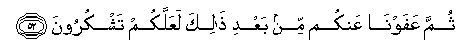

# البقرة
# 百格勒(黄牛章）
# Sūra II.: Baqara, or the Heifer.
- 麦地那(286)

---

## بِسْمِ اللَّهِ الرَّحْمَٰنِ الرَّحِيمِ
---
## ٢:١

### [2:1](002_001.md) الم
### 2:1 Alif-lam-meem
### 2:1 艾列弗，俩目，米目。
### 2:1 A.L.M.
---
## ٢:٢

### [2:2](002_002.md) ذَٰلِكَ الْكِتَابُ لَا رَيْبَ ۛ فِيهِ ۛ هُدًى لِلْمُتَّقِينَ
### 2:2 Thalika alkitabu la rayba feehi hudan lilmuttaqeena
### 2:2 这部经，其中毫无可疑，是敬畏者的向导。
### 2:2 This is the Book; in it is guidance sure, without doubt, to those who fear Allah;
---
## ٢:٣

### [2:3](002_003.md) ٱلَّذِينَ يُؤْمِنُونَ بِٱلْغَيْبِ وَيُقِيمُونَ ٱلصَّلَاوةَ وَمِمَّا رَزَقْنَاهُمْ يُنفِقُونَ
### 2:3 Allatheena yu/minoona bialghaybi wayuqeemoona alssalata wamimma razaqnahum yunfiqoona
### 2:3 他们确信幽玄，谨守拜功，并分舍我所给与他们的。
### 2:3 Who believe in the Unseen, are steadfast in prayer, and spend out of what We have provided for them;
---
## ٢:٤

### [2:4](002_004.md) وَٱلَّذِينَ يُؤْمِنونَ بِمَآ أُنْزِلَ إِلَيْكَ وَمَآ أُنْزِلَ مِنْ قَبْلِكَ وَبِٱلْأَخِرَةِ هُمْ يُوقِنُونَ
### 2:4 Waallatheena yu/minoona bima onzila ilayka wama onzila min qablika wabial-akhirati hum yooqinoona
### 2:4 他们确信降示你的经典，和在你以前降示的经典，并且笃信後世。
### 2:4 And who believe in the Revelation sent to thee, and sent before thy time, and (in their hearts) have the assurance of the Hereafter.
---
## ٢:٥

### [2:5](002_005.md) أُوْلَٰٓئِكَ عَلَىٰ هُدًى مِّنْ رَّبِّهِمْ وَأُوْلَٰٓئِكَ هُمُ ٱلْمُفْلِحُونَ
### 2:5 Ola-ika AAala hudan min rabbihim waola-ika humu almuflihoona
### 2:5 这等人，是遵守他们的主的正道的；这等人，确是成功的。
### 2:5 They are on (true) guidance, from their Lord, and it is these who will prosper.
---
## ٢:٦

### [2:6](002_006.md) إِنَّ الَّذِينَ كَفَرُوا سَوَاءٌ عَلَيْهِمْ أَأَنْذَرْتَهُمْ أَمْ لَمْ تُنْذِرْهُمْ لَا يُؤْمِنُونَ
### 2:6 Inna allatheena kafaroo sawaon AAalayhim aanthartahum am lam tunthirhum la yu/minoona
### 2:6 不信道者，你对他们加以警告与否，这在他们是一样的，他们毕竟不信道。
### 2:6 As to those who reject Faith, it is the same to them whether thou warn them or do not warn them; they will not believe.
---
## ٢:٧

### [2:7](002_007.md) خَتَمَ اللَّهُ عَلَىٰ قُلُوبِهِمْ وَعَلَىٰ سَمْعِهِمْ ۖ وَعَلَىٰ أَبْصَارِهِمْ غِشَاوَةٌ ۖ وَلَهُمْ عَذَابٌ عَظِيمٌ
### 2:7 Khatama Allahu AAala quloobihim waAAala samAAihim waAAala absarihim ghishawatun walahum AAathabun AAatheemun
### 2:7 真主已封闭他们的心和耳，他们的眼上有翳膜；他们将受重大的刑罚。
### 2:7 Allah hath set a seal on their hearts and on their hearing, and on their eyes is a veil; great is the penalty they (incur).
---
## ٢:٨

### [2:8](002_008.md) وَمِنَ النَّاسِ مَنْ يَقُولُ آمَنَّا بِاللَّهِ وَبِالْيَوْمِ الْآخِرِ وَمَا هُمْ بِمُؤْمِنِينَ
### 2:8 Wamina alnnasi man yaqoolu amanna biAllahi wabialyawmi al-akhiri wama hum bimu/mineena
### 2:8 有些人说：我们已信真主和末日了。其实，他们绝不是信士。
### 2:8 Of the people there are some who say: "We believe in Allah and the Last Day;" but they do not (really) believe.
---
## ٢:٩

### [2:9](002_009.md) يُخَادِعُونَ اللَّهَ وَالَّذِينَ آمَنُوا وَمَا يَخْدَعُونَ إِلَّا أَنْفُسَهُمْ وَمَا يَشْعُرُونَ
### 2:9 YukhadiAAoona Allaha waallatheena amanoo wama yakhdaAAoona illa anfusahum wamayashAAuroona
### 2:9 他们想欺瞒真主和信士，其实，他们只是自欺，却不觉悟。
### 2:9 Fain would they deceive Allah and those who believe, but they only deceive themselves, and realise (it) not!
---
## ٢:١٠

### [2:10](002_010.md) فِي قُلُوبِهِمْ مَرَضٌ فَزَادَهُمُ اللَّهُ مَرَضًا ۖ وَلَهُمْ عَذَابٌ أَلِيمٌ بِمَا كَانُوا يَكْذِبُونَ
### 2:10 Fee quloobihim maradun fazadahumu Allahu maradan walahum AAathabun aleemun bima kanoo yakthiboona
### 2:10 他们的心里有病，故真主增加他们的心病；他们将为说谎而遭受重大的刑罚。
### 2:10 In their hearts is a disease; and Allah has increased their disease: And grievous is the penalty they (incur), because they are false (to themselves).
---
## ٢:١١

### [2:11](002_011.md) وَإِذَا قِيلَ لَهُمْ لَا تُفْسِدُوا فِي الْأَرْضِ قَالُوا إِنَّمَا نَحْنُ مُصْلِحُونَ
### 2:11 Wa-itha qeela lahum la tufsidoo fee al-ardi qaloo innama nahnu muslihoona
### 2:11 有人对他们说：你们不要在地方上作恶。他们就说：我们只是调解的人。
### 2:11 When it is said to them: "Make not mischief on the earth," they say: "Why, we only Want to make peace!"
---
## ٢:١٢

### [2:12](002_012.md) أَلَا إِنَّهُمْ هُمُ الْمُفْسِدُونَ وَلَٰكِنْ لَا يَشْعُرُونَ
### 2:12 Ala innahum humu almufsidoona walakin la yashAAuroona
### 2:12 真的，他们确是作恶者，但他们不觉悟。
### 2:12 Of a surety, they are the ones who make mischief, but they realise (it) not.
---
## ٢:١٣

### [2:13](002_013.md) وَإِذَا قِيلَ لَهُمْ آمِنُوا كَمَا آمَنَ النَّاسُ قَالُوا أَنُؤْمِنُ كَمَا آمَنَ السُّفَهَاءُ ۗ أَلَا إِنَّهُمْ هُمُ السُّفَهَاءُ وَلَٰكِنْ لَا يَعْلَمُونَ
### 2:13 Wa-itha qeela lahum aminoo kama amana alnnasu qaloo anu/minu kama amana alssufahao alainnahum humu alssufahao walakin la yaAAlamoona
### 2:13 有人对他们说：你们应当象众人那样信道。他们就说：我们能象愚人那样轻信吗？真的，他们确是愚人，但他们不知道。
### 2:13 When it is said to them: "Believe as the others believe:" They say: "Shall we believe as the fools believe?" Nay, of a surety they are the fools, but they do not know.
---
## ٢:١٤

### [2:14](002_014.md) وَإِذَا لَقُوا الَّذِينَ آمَنُوا قَالُوا آمَنَّا وَإِذَا خَلَوْا إِلَىٰ شَيَاطِينِهِمْ قَالُوا إِنَّا مَعَكُمْ إِنَّمَا نَحْنُ مُسْتَهْزِئُونَ
### 2:14 Wa-itha laqoo allatheena amanoo qaloo amanna wa-itha khalaw ila shayateenihim qaloo innamaAAakum innama nahnu mustahzi-oona
### 2:14 他们遇见信士们就说：我们已信道了。他们回去见了自己的恶魔，就说：我们确是你们的同党，我们不过是愚弄他们罢了。
### 2:14 When they meet those who believe, they say: "We believe;" but when they are alone with their evil ones, they say: "We are really with you: We (were) only jesting."
---
## ٢:١٥

### [2:15](002_015.md) اللَّهُ يَسْتَهْزِئُ بِهِمْ وَيَمُدُّهُمْ فِي طُغْيَانِهِمْ يَعْمَهُونَ
### 2:15 Allahu yastahzi-o bihim wayamudduhum fee tughyanihim yaAAmahoona
### 2:15 真主将用他们的愚弄还报他们，将任随他们彷徨於悖逆之中。
### 2:15 Allah will throw back their mockery on them, and give them rope in their trespasses; so they will wander like blind ones (To and fro).
---
## ٢:١٦

### [2:16](002_016.md) أُولَٰئِكَ الَّذِينَ اشْتَرَوُا الضَّلَالَةَ بِالْهُدَىٰ فَمَا رَبِحَتْ تِجَارَتُهُمْ وَمَا كَانُوا مُهْتَدِينَ
### 2:16 Ola-ika allatheena ishtarawoo alddalalata bialhuda fama rabihat tijaratuhum wama kanoo muhtadeena
### 2:16 这等人，以正道换取迷误，所以他们的交易并未获利，他们不是遵循正道的。
### 2:16 These are they who have bartered Guidance for error: But their traffic is profitless, and they have lost true direction,
---
## ٢:١٧

### [2:17](002_017.md) مَثَلُهُمْ كَمَثَلِ الَّذِي اسْتَوْقَدَ نَارًا فَلَمَّا أَضَاءَتْ مَا حَوْلَهُ ذَهَبَ اللَّهُ بِنُورِهِمْ وَتَرَكَهُمْ فِي ظُلُمَاتٍ لَا يُبْصِرُونَ
### 2:17 Mathaluhum kamathali allathee istawqada naran falamma adaat ma hawlahu thahaba Allahu binoorihim watarakahum fee thulumatin la yubsiroona
### 2:17 他们譬如燃火的人，当火光照亮了他们的四周的时候，真主把他们的火光拿去，让他们在重重的黑暗中，甚麽也看不见。
### 2:17 Their similitude is that of a man who kindled a fire; when it lighted all around him, Allah took away their light and left them in utter darkness. So they could not see.
---
## ٢:١٨

### [2:18](002_018.md) صُمٌّ بُكْمٌ عُمْيٌ فَهُمْ لَا يَرْجِعُونَ
### 2:18 Summun bukmun AAumyun fahum la yarjiAAoona
### 2:18 （他们）是聋的，是哑的，是瞎的，所以他们执迷不悟。
### 2:18 Deaf, dumb, and blind, they will not return (to the path).
---
## ٢:١٩

### [2:19](002_019.md) أَوْ كَصَيِّبٍ مِنَ السَّمَاءِ فِيهِ ظُلُمَاتٌ وَرَعْدٌ وَبَرْقٌ يَجْعَلُونَ أَصَابِعَهُمْ فِي آذَانِهِمْ مِنَ الصَّوَاعِقِ حَذَرَ الْمَوْتِ ۚ وَاللَّهُ مُحِيطٌ بِالْكَافِرِينَ
### 2:19 Aw kasayyibin mina alssama-i feehi thulumatun waraAAdun wabarqun yajAAaloona asabiAAahum fee athanihim mina alssawaAAiqi hathara almawti waAllahu muheetun bialkafireena
### 2:19 或者如遭遇倾盆大雨者，雨里有重重黑暗，又有雷和电，他们恐怕震死，故用手指塞住耳朵，以避疾雷。真主是周知不信道的人们的。
### 2:19 Or (another similitude) is that of a rain-laden cloud from the sky: In it are zones of darkness, and thunder and lightning: They press their fingers in their ears to keep out the stunning thunder-clap, the while they are in terror of death. But Allah is ever round the rejecters of Faith!
---
## ٢:٢٠

### [2:20](002_020.md) يَكَادُ الْبَرْقُ يَخْطَفُ أَبْصَارَهُمْ ۖ كُلَّمَا أَضَاءَ لَهُمْ مَشَوْا فِيهِ وَإِذَا أَظْلَمَ عَلَيْهِمْ قَامُوا ۚ وَلَوْ شَاءَ اللَّهُ لَذَهَبَ بِسَمْعِهِمْ وَأَبْصَارِهِمْ ۚ إِنَّ اللَّهَ عَلَىٰ كُلِّ شَيْءٍ قَدِيرٌ
### 2:20 Yakadu albarqu yakhtafu absarahum kullama adaa lahum mashaw feehi wa-itha athlama AAalayhim qamoo walaw shaa Allahu lathahaba bisamAAihim waabsarihim inna Allaha AAala kulli shay-in qadeerun
### 2:20 电光几乎夺了他们的视觉，每逢电光为他们而照耀的时候，他们在电光中前进；黑暗的时候，他们就站住。假如真主意欲，他必褫夺他们的听觉和视觉。真主对於万事确是全能的。
### 2:20 The lightning all but snatches away their sight; every time the light (Helps) them, they walk therein, and when the darkness grows on them, they stand still. And if Allah willed, He could take away their faculty of hearing and seeing; for Allah hath power over all things.
---
## ٢:٢١

### [2:21](002_021.md) يَا أَيُّهَا النَّاسُ اعْبُدُوا رَبَّكُمُ الَّذِي خَلَقَكُمْ وَالَّذِينَ مِنْ قَبْلِكُمْ لَعَلَّكُمْ تَتَّقُونَ
### 2:21 Ya ayyuha alnnasu oAAbudoo rabbakumu allathee khalaqakum waallatheena min qablikum laAAallakum tattaqoona
### 2:21 众人啊！你们的主，创造了你们，和你们以前的人，你们当崇拜他，以便你们敬畏。
### 2:21 O ye people! Adore your Guardian-Lord, who created you and those who came before you, that ye may have the chance to learn righteousness;
---
## ٢:٢٢

### [2:22](002_022.md) الَّذِي جَعَلَ لَكُمُ الْأَرْضَ فِرَاشًا وَالسَّمَاءَ بِنَاءً وَأَنْزَلَ مِنَ السَّمَاءِ مَاءً فَأَخْرَجَ بِهِ مِنَ الثَّمَرَاتِ رِزْقًا لَكُمْ ۖ فَلَا تَجْعَلُوا لِلَّهِ أَنْدَادًا وَأَنْتُمْ تَعْلَمُونَ
### 2:22 Allathee jaAAala lakumu al-arda firashan waalssamaa binaan waanzala mina alssama-i maan faakhraja bihi mina alththamarati rizqan lakum fala tajAAaloo lillahi andadan waantum taAAlamoona
### 2:22 他以大地为你们的席，以天空为你们的幕，并且从云中降下雨水，而借雨水生许多果实，做你们的给养，所以你们不要明知故犯地给真主树立匹敌。
### 2:22 Who has made the earth your couch, and the heavens your canopy; and sent down rain from the heavens; and brought forth therewith Fruits for your sustenance; then set not up rivals unto Allah when ye know (the truth).
---
## ٢:٢٣

### [2:23](002_023.md) وَإِنْ كُنْتُمْ فِي رَيْبٍ مِمَّا نَزَّلْنَا عَلَىٰ عَبْدِنَا فَأْتُوا بِسُورَةٍ مِنْ مِثْلِهِ وَادْعُوا شُهَدَاءَكُمْ مِنْ دُونِ اللَّهِ إِنْ كُنْتُمْ صَادِقِينَ
### 2:23 Wa-in kuntum fee raybin mimma nazzalna AAala AAabdina fa/too bisooratin min mithlihi waodAAoo shuhadaakum min dooni Allahi in kuntum sadiqeena
### 2:23 如果你们怀疑我所降示给我的仆人的经典，那末，你们试拟作一章，并舍真主而祈祷你们的见证，如果你们是诚实的。
### 2:23 And if ye are in doubt as to what We have revealed from time to time to Our servant, then produce a Sura like thereunto; and call your witnesses or helpers (If there are any) besides Allah, if your (doubts) are true.
---
## ٢:٢٤

### [2:24](002_024.md) فَإِنْ لَمْ تَفْعَلُوا وَلَنْ تَفْعَلُوا فَاتَّقُوا النَّارَ الَّتِي وَقُودُهَا النَّاسُ وَالْحِجَارَةُ ۖ أُعِدَّتْ لِلْكَافِرِينَ
### 2:24 Fa-in lam tafAAaloo walan tafAAaloo faittaqoo alnnara allatee waqooduha alnnasu waalhijaratu oAAiddat lilkafireena
### 2:24 如果你们不能作──你们绝不能作──那末，你们当防备火狱，那是用人和石做燃料的，已为不信道的人们预备好了。
### 2:24 But if ye cannot- and of a surety ye cannot- then fear the Fire whose fuel is men and stones,- which is prepared for those who reject Faith.
---
## ٢:٢٥

### [2:25](002_025.md) وَبَشِّرِ الَّذِينَ آمَنُوا وَعَمِلُوا الصَّالِحَاتِ أَنَّ لَهُمْ جَنَّاتٍ تَجْرِي مِنْ تَحْتِهَا الْأَنْهَارُ ۖ كُلَّمَا رُزِقُوا مِنْهَا مِنْ ثَمَرَةٍ رِزْقًا ۙ قَالُوا هَٰذَا الَّذِي رُزِقْنَا مِنْ قَبْلُ ۖ وَأُتُوا بِهِ مُتَشَابِهًا ۖ وَلَهُمْ فِيهَا أَزْوَاجٌ مُطَهَّرَةٌ ۖ وَهُمْ فِيهَا خَالِدُونَ
### 2:25 Wabashshiri allatheena amanoo waAAamiloo alssalihati anna lahum jannatin tajree min tahtiha al-anharu kullama ruziqoo minha min thamaratin rizqan qaloo hatha allathee ruziqna min qablu waotoo bihi mutashabihan walahum feeha azwajun mutahharatun wahum feeha khalidoona
### 2:25 你当向信道而行善的人报喜；他们将享有许多下临诸河的乐园，每当他们得以园里的一种水果为给养的时候，他们都说：这是我们以前所受赐的。其实，他们所受赐的是类似的。他们在乐园里将享有纯洁的配偶，他们将永居其中。
### 2:25 But give glad tidings to those who believe and work righteousness, that their portion is Gardens, beneath which rivers flow. Every time they are fed with fruits therefrom, they say: "Why, this is what we were fed with before," for they are given things in similitude; and they have therein companions pure (and holy); and they abide therein (for ever).
---
## ٢:٢٦

### [2:26](002_026.md) ۞ إِنَّ اللَّهَ لَا يَسْتَحْيِي أَنْ يَضْرِبَ مَثَلًا مَا بَعُوضَةً فَمَا فَوْقَهَا ۚ فَأَمَّا الَّذِينَ آمَنُوا فَيَعْلَمُونَ أَنَّهُ الْحَقُّ مِنْ رَبِّهِمْ ۖ وَأَمَّا الَّذِينَ كَفَرُوا فَيَقُولُونَ مَاذَا أَرَادَ اللَّهُ بِهَٰذَا مَثَلًا ۘ يُضِلُّ بِهِ كَثِيرًا وَيَهْدِي بِهِ كَثِيرًا ۚ وَمَا يُضِلُّ بِهِ إِلَّا الْفَاسِقِينَ
### 2:26 Inna Allaha la yastahyee an yadriba mathalan ma baAAoodatan fama fawqaha faamma allatheenaamanoo fayaAAlamoona annahu alhaqqu min rabbihim waamma allatheena kafaroo fayaqooloona matha arada Allahu bihatha mathalan yudillu bihi katheeran wayahdee bihi katheeran wama yudillu bihi illa alfasiqeena
### 2:26 真主的确不嫌以蚊子或更小的事物设任何譬喻；信道者，都知道那是从他们的主降示的真理；不信道者，却说：真主设这个譬喻的宗旨是甚麽？他以譬喻使许多人入迷途，也以譬喻使许多人上正路；但除悖逆者外，他不以譬喻使人入迷途。
### 2:26 Allah disdains not to use the similitude of things, lowest as well as highest. Those who believe know that it is truth from their Lord; but those who reject Faith say: "What means Allah by this similitude?" By it He causes many to stray, and many He leads into the right path; but He causes not to stray, except those who forsake (the path),-
---
## ٢:٢٧

### [2:27](002_027.md) الَّذِينَ يَنْقُضُونَ عَهْدَ اللَّهِ مِنْ بَعْدِ مِيثَاقِهِ وَيَقْطَعُونَ مَا أَمَرَ اللَّهُ بِهِ أَنْ يُوصَلَ وَيُفْسِدُونَ فِي الْأَرْضِ ۚ أُولَٰئِكَ هُمُ الْخَاسِرُونَ
### 2:27 Allatheena yanqudoona AAahda Allahi min baAAdi meethaqihi wayaqtaAAoona ma amara Allahu bihi an yoosala wayufsidoona fee al-ardi ola-ika humu alkhasiroona
### 2:27 他们与真主缔约之後，并断绝真主命人联络的，且在地方上作恶；这等人，确是亏折的。
### 2:27 Those who break Allah's Covenant after it is ratified, and who sunder what Allah Has ordered to be joined, and do mischief on earth: These cause loss (only) to themselves.
---
## ٢:٢٨

### [2:28](002_028.md) كَيْفَ تَكْفُرُونَ بِاللَّهِ وَكُنْتُمْ أَمْوَاتًا فَأَحْيَاكُمْ ۖ ثُمَّ يُمِيتُكُمْ ثُمَّ يُحْيِيكُمْ ثُمَّ إِلَيْهِ تُرْجَعُونَ
### 2:28 Kayfa takfuroona biAllahi wakuntum amwatan faahyakum thumma yumeetukum thumma yuhyeekum thumma ilayhi turjaAAoona
### 2:28 你们怎麽不信真主呢？你们原是死的，而他以生命赋予你们，然後使你们死亡，然後使你们复活；然後你们要被召归於他。
### 2:28 How can ye reject the faith in Allah?- seeing that ye were without life, and He gave you life; then will He cause you to die, and will again bring you to life; and again to Him will ye return.
---
## ٢:٢٩

### [2:29](002_029.md) هُوَ الَّذِي خَلَقَ لَكُمْ مَا فِي الْأَرْضِ جَمِيعًا ثُمَّ اسْتَوَىٰ إِلَى السَّمَاءِ فَسَوَّاهُنَّ سَبْعَ سَمَاوَاتٍ ۚ وَهُوَ بِكُلِّ شَيْءٍ عَلِيمٌ
### 2:29 Huwa allathee khalaqa lakum ma fee al-ardi jameeAAan thumma istawa ila alssama-i fasawwahunna sabAAa samawatin wahuwa bikulli shay-in AAaleemun
### 2:29 他已为你们创造了大地上的一切事物，复经营诸天，完成了七层天。他对於万物是全知的。
### 2:29 It is He Who hath created for you all things that are on earth; Moreover His design comprehended the heavens, for He gave order and perfection to the seven firmaments; and of all things He hath perfect knowledge.
---
## ٢:٣٠

### [2:30](002_030.md) وَإِذْ قَالَ رَبُّكَ لِلْمَلَائِكَةِ إِنِّي جَاعِلٌ فِي الْأَرْضِ خَلِيفَةً ۖ قَالُوا أَتَجْعَلُ فِيهَا مَنْ يُفْسِدُ فِيهَا وَيَسْفِكُ الدِّمَاءَ وَنَحْنُ نُسَبِّحُ بِحَمْدِكَ وَنُقَدِّسُ لَكَ ۖ قَالَ إِنِّي أَعْلَمُ مَا لَا تَعْلَمُونَ
### 2:30 Wa-ith qala rabbuka lilmala-ikati innee jaAAilun fee al-ardi khaleefatan qaloo atajAAalu feeha man yufsidu feeha wayasfiku alddimaa wanahnu nusabbihu bihamdika wanuqaddisu laka qala innee aAAlamu ma la taAAlamoona
### 2:30 当时，你的主对众天神说：我必定在大地上设置一个代理人。他们说：我们赞你超绝，我们赞你清净，你还要在大地上设置作恶和流血者吗？他说：我知道你们所不知道的。
### 2:30 Behold, thy Lord said to the angels: "I will create a vicegerent on earth." They said: "Wilt Thou place therein one who will make mischief therein and shed blood?- whilst we do celebrate Thy praises and glorify Thy holy (name)?" He said: "I know what ye know not."
---
## ٢:٣١

### [2:31](002_031.md) وَعَلَّمَ آدَمَ الْأَسْمَاءَ كُلَّهَا ثُمَّ عَرَضَهُمْ عَلَى الْمَلَائِكَةِ فَقَالَ أَنْبِئُونِي بِأَسْمَاءِ هَٰؤُلَاءِ إِنْ كُنْتُمْ صَادِقِينَ
### 2:31 WaAAallama adama al-asmaa kullaha thumma AAaradahum AAala almala-ikati faqala anbi-oonee bi-asma-i haola-i in kuntum sadiqeena
### 2:31 他将万物的名称，都教授阿丹，然後以万物昭示众天神，说：你们把这些事物的名称告诉我吧，如果你们是诚实的。
### 2:31 And He taught Adam the names of all things; then He placed them before the angels, and said: "Tell me the names of these if ye are right."
---
## ٢:٣٢

### [2:32](002_032.md) قَالُوا سُبْحَانَكَ لَا عِلْمَ لَنَا إِلَّا مَا عَلَّمْتَنَا ۖ إِنَّكَ أَنْتَ الْعَلِيمُ الْحَكِيمُ
### 2:32 Qaloo subhanaka la AAilma lana illa ma AAallamtana innaka anta alAAaleemu alhakeemu
### 2:32 他们说：赞你超绝，除了你所教授我们的知识外，我们毫无知识，你确是全知的，确是至睿的。
### 2:32 They said: "Glory to Thee, of knowledge We have none, save what Thou Hast taught us: In truth it is Thou Who art perfect in knowledge and wisdom."
---
## ٢:٣٣

### [2:33](002_033.md) قَالَ يَا آدَمُ أَنْبِئْهُمْ بِأَسْمَائِهِمْ ۖ فَلَمَّا أَنْبَأَهُمْ بِأَسْمَائِهِمْ قَالَ أَلَمْ أَقُلْ لَكُمْ إِنِّي أَعْلَمُ غَيْبَ السَّمَاوَاتِ وَالْأَرْضِ وَأَعْلَمُ مَا تُبْدُونَ وَمَا كُنْتُمْ تَكْتُمُونَ
### 2:33 Qala ya adamu anbi/hum bi-asma-ihim falamma anbaahum bi-asma-ihim qala alam aqul lakum innee aAAlamu ghayba alssamawati waal-ardi waaAAlamu ma tubdoona wama kuntum taktumoona
### 2:33 他说：阿丹啊！你把这些事物的名称告诉他们吧。当他把那些事物的名称告诉他们的时候，真主说：难道我没有对你们说过吗？我的确知道天地的幽玄，我的确知道你们所表白的，和你们所隐讳的。
### 2:33 He said: "O Adam! Tell them their names." When he had told them, Allah said: "Did I not tell you that I know the secrets of heaven and earth, and I know what ye reveal and what ye conceal?"
---
## ٢:٣٤

### [2:34](002_034.md) وَإِذْ قُلْنَا لِلْمَلَائِكَةِ اسْجُدُوا لِآدَمَ فَسَجَدُوا إِلَّا إِبْلِيسَ أَبَىٰ وَاسْتَكْبَرَ وَكَانَ مِنَ الْكَافِرِينَ
### 2:34 Wa-ith qulna lilmala-ikati osjudoo li-adama fasajadoo illa ibleesa aba waistakbara wakana mina alkafireena
### 2:34 当时，我对众天神说：你们向阿丹叩头吧！他们就叩头，惟有易卜劣厮不肯，他自大，他原是不信道的。
### 2:34 And behold, We said to the angels: "Bow down to Adam" and they bowed down. Not so Iblis: he refused and was haughty: He was of those who reject Faith.
---
## ٢:٣٥

### [2:35](002_035.md) وَقُلْنَا يَا آدَمُ اسْكُنْ أَنْتَ وَزَوْجُكَ الْجَنَّةَ وَكُلَا مِنْهَا رَغَدًا حَيْثُ شِئْتُمَا وَلَا تَقْرَبَا هَٰذِهِ الشَّجَرَةَ فَتَكُونَا مِنَ الظَّالِمِينَ
### 2:35 Waqulna ya adamu oskun anta wazawjuka aljannata wakula minha raghadan haythu shi/tuma walataqraba hathihi alshshajarata fatakoona mina alththalimeena
### 2:35 我说：阿丹啊！你和你的妻子同住乐园吧！你们俩可以任意吃园里所有丰富的食物，你们俩不要临近这棵树；否则，就要变成不义的人。
### 2:35 We said: "O Adam! dwell thou and thy wife in the Garden; and eat of the bountiful things therein as (where and when) ye will; but approach not this tree, or ye run into harm and transgression."
---
## ٢:٣٦

### [2:36](002_036.md) فَأَزَلَّهُمَا الشَّيْطَانُ عَنْهَا فَأَخْرَجَهُمَا مِمَّا كَانَا فِيهِ ۖ وَقُلْنَا اهْبِطُوا بَعْضُكُمْ لِبَعْضٍ عَدُوٌّ ۖ وَلَكُمْ فِي الْأَرْضِ مُسْتَقَرٌّ وَمَتَاعٌ إِلَىٰ حِينٍ
### 2:36 Faazallahuma alshshaytanu AAanha faakhrajahuma mimma kana feehi waqulna ihbitoo baAAdukum libaAAdin AAaduwwun walakum fee al-ardi mustaqarrun wamataAAun ila heenin
### 2:36 然後，恶魔使他们俩为那棵树而犯罪，遂将他们俩人从所居的乐园中诱出。我说：你们互相仇视下去吧。大地上有你们暂时的住处和享受。
### 2:36 Then did Satan make them slip from the (garden), and get them out of the state (of felicity) in which they had been. We said: "Get ye down, all (ye people), with enmity between yourselves. On earth will be your dwelling-place and your means of livelihood - for a time."
---
## ٢:٣٧

### [2:37](002_037.md) فَتَلَقَّىٰ آدَمُ مِنْ رَبِّهِ كَلِمَاتٍ فَتَابَ عَلَيْهِ ۚ إِنَّهُ هُوَ التَّوَّابُ الرَّحِيمُ
### 2:37 Fatalaqqa adamu min rabbihi kalimatin fataba AAalayhi innahu huwa alttawwabu alrraheemu
### 2:37 然後，阿丹奉到从主降示的几件诫命，主就恕宥了他。主确是至宥的，确是至慈的。
### 2:37 Then learnt Adam from his Lord words of inspiration, and his Lord Turned towards him; for He is Oft-Returning, Most Merciful.
---
## ٢:٣٨

### [2:38](002_038.md) قُلْنَا اهْبِطُوا مِنْهَا جَمِيعًا ۖ فَإِمَّا يَأْتِيَنَّكُمْ مِنِّي هُدًى فَمَنْ تَبِعَ هُدَايَ فَلَا خَوْفٌ عَلَيْهِمْ وَلَا هُمْ يَحْزَنُونَ 
### 2:38 Qulna ihbitoo minha jameeAAan fa-imma ya/tiyannakum minnee hudan faman tabiAAa hudaya falakhawfun AAalayhim wala hum yahzanoona
### 2:38 我说：你们都从这里下去吧！我的引导如果到达你们，那末，谁遵守我的引导，谁在将来没有恐惧，也不愁。
### 2:38 We said: "Get ye down all from here; and if, as is sure, there comes to you Guidance from me, whosoever follows My guidance, on them shall be no fear, nor shall they grieve.
---
## ٢:٣٩

### [2:39](002_039.md) وَالَّذِينَ كَفَرُوا وَكَذَّبُوا بِآيَاتِنَا أُولَٰئِكَ أَصْحَابُ النَّارِ ۖ هُمْ فِيهَا خَالِدُونَ
### 2:39 Waallatheena kafaroo wakaththaboo bi-ayatina ola-ika as-habu alnnari hum feeha khalidoona
### 2:39 不信道而且否认我的迹象的人，是火狱的居民，他们将永居其中。
### 2:39 "But those who reject Faith and belie Our Signs, they shall be companions of the Fire; they shall abide therein."
---
## ٢:٤٠

### [2:40](002_040.md) يَا بَنِي إِسْرَائِيلَ اذْكُرُوا نِعْمَتِيَ الَّتِي أَنْعَمْتُ عَلَيْكُمْ وَأَوْفُوا بِعَهْدِي أُوفِ بِعَهْدِكُمْ وَإِيَّايَ فَارْهَبُونِ
### 2:40 Ya banee isra-eela othkuroo niAAmatiya allatee anAAamtu AAalaykum waawfoo biAAahdee oofi biAAahdikum wa-iyyaya fairhabooni
### 2:40 以色列的後裔啊！你们当铭记我所赐你们的恩惠，你们当履行对我的约言，我就履行对你们的约言；你们应当只畏惧我。
### 2:40 O Children of Israel! call to mind the (special) favour which I bestowed upon you, and fulfil your covenant with Me as I fulfil My Covenant with you, and fear none but Me.
---
## ٢:٤١

### [2:41](002_041.md) وَآمِنُوا بِمَا أَنْزَلْتُ مُصَدِّقًا لِمَا مَعَكُمْ وَلَا تَكُونُوا أَوَّلَ كَافِرٍ بِهِ ۖ وَلَا تَشْتَرُوا بِآيَاتِي ثَمَنًا قَلِيلًا وَإِيَّايَ فَاتَّقُونِ
### 2:41 Waaminoo bima anzaltu musaddiqan lima maAAakum wala takoonoo awwala kafirin bihi walatashtaroo bi-ayatee thamanan qaleelan wa-iyyaya faittaqooni
### 2:41 你们当信我所降示的，这能证实你们所有的经典，你们不要做首先不信的人，不要以廉价出卖我的迹象，你们应当只敬畏我。
### 2:41 And believe in what I reveal, confirming the revelation which is with you, and be not the first to reject Faith therein, nor sell My Signs for a small price; and fear Me, and Me alone.
---
## ٢:٤٢

### [2:42](002_042.md) وَلَا تَلْبِسُوا الْحَقَّ بِالْبَاطِلِ وَتَكْتُمُوا الْحَقَّ وَأَنْتُمْ تَعْلَمُونَ
### 2:42 Wala talbisoo alhaqqa bialbatili wataktumoo alhaqqa waantum taAAlamoona
### 2:42 你们不要明知故犯地以伪乱真，隐讳真理。
### 2:42 And cover not Truth with falsehood, nor conceal the Truth when ye know (what it is).
---
## ٢:٤٣

### [2:43](002_043.md) وَأَقِيمُوا الصَّلَاةَ وَآتُوا الزَّكَاةَ وَارْكَعُوا مَعَ الرَّاكِعِينَ
### 2:43 Waaqeemoo alssalata waatoo alzzakata wairkaAAoo maAAa alrrakiAAeena
### 2:43 你们当谨守拜功，完纳天课，与鞠躬者同齐鞠躬。
### 2:43 And be steadfast in prayer; practise regular charity; and bow down your heads with those who bow down (in worship).
---
## ٢:٤٤

### [2:44](002_044.md) ۞ أَتَأْمُرُونَ النَّاسَ بِالْبِرِّ وَتَنْسَوْنَ أَنْفُسَكُمْ وَأَنْتُمْ تَتْلُونَ الْكِتَابَ ۚ أَفَلَا تَعْقِلُونَ
### 2:44 Ata/muroona alnnasa bialbirri watansawna anfusakum waantum tatloona alkitaba afala taAAqiloona
### 2:44 你们是读经的人，怎麽劝人为善，而忘却自身呢？难道你们不了解吗？
### 2:44 Do ye enjoin right conduct on the people, and forget (To practise it) yourselves, and yet ye study the Scripture? Will ye not understand?
---
## ٢:٤٥

### [2:45](002_045.md) وَاسْتَعِينُوا بِالصَّبْرِ وَالصَّلَاةِ ۚ وَإِنَّهَا لَكَبِيرَةٌ إِلَّا عَلَى الْخَاشِعِينَ
### 2:45 WaistaAAeenoo bialssabri waalssalati wa-innaha lakabeeratun illa AAala alkhashiAAeena
### 2:45 你们当借坚忍和礼拜而求佑助。礼拜确是一件难事，但对恭敬的人却不难。
### 2:45 Nay, seek (Allah's) help with patient perseverance and prayer: It is indeed hard, except to those who bring a lowly spirit,-
---
## ٢:٤٦

### [2:46](002_046.md) الَّذِينَ يَظُنُّونَ أَنَّهُمْ مُلَاقُو رَبِّهِمْ وَأَنَّهُمْ إِلَيْهِ رَاجِعُونَ
### 2:46 Allatheena yathunnoona annahum mulaqoo rabbihim waannahum ilayhi rajiAAoona
### 2:46 他们确信自己必定见主，必定归主。
### 2:46 Who bear in mind the certainty that they are to meet their Lord, and that they are to return to Him.
---
## ٢:٤٧

### [2:47](002_047.md) يَا بَنِي إِسْرَائِيلَ اذْكُرُوا نِعْمَتِيَ الَّتِي أَنْعَمْتُ عَلَيْكُمْ وَأَنِّي فَضَّلْتُكُمْ عَلَى الْعَالَمِينَ
### 2:47 Ya banee isra-eela othkuroo niAAmatiya allatee anAAamtu AAalaykum waannee faddaltukum AAalaalAAalameena
### 2:47 以色列的後裔啊！你们当铭记我所赐你们的恩典，并铭记我曾使你们超越世人。
### 2:47 Children of Israel! call to mind the (special) favour which I bestowed upon you, and that I preferred you to all other (for My Message).
---
## ٢:٤٨

### [2:48](002_048.md) وَاتَّقُوا يَوْمًا لَا تَجْزِي نَفْسٌ عَنْ نَفْسٍ شَيْئًا وَلَا يُقْبَلُ مِنْهَا شَفَاعَةٌ وَلَا يُؤْخَذُ مِنْهَا عَدْلٌ وَلَا هُمْ يُنْصَرُونَ
### 2:48 Waittaqoo yawman la tajzee nafsun AAan nafsin shay-an wala yuqbalu minha shafaAAatun walayu/khathu minha AAadlun wala hum yunsaroona
### 2:48 你们当防备将来有这样的一日：任何人不能替任何人帮一点忙，任何人的说情，都不蒙接受，任何人的赎金，都不蒙采纳，他们也不获援助。
### 2:48 Then guard yourselves against a day when one soul shall not avail another nor shall intercession be accepted for her, nor shall compensation be taken from her, nor shall anyone be helped (from outside).
---
## ٢:٤٩

### [2:49](002_049.md) وَإِذْ نَجَّيْنَاكُمْ مِنْ آلِ فِرْعَوْنَ يَسُومُونَكُمْ سُوءَ الْعَذَابِ يُذَبِّحُونَ أَبْنَاءَكُمْ وَيَسْتَحْيُونَ نِسَاءَكُمْ ۚ وَفِي ذَٰلِكُمْ بَلَاءٌ مِنْ رَبِّكُمْ عَظِيمٌ
### 2:49 Wa-ith najjaynakum min ali firAAawna yasoomoonakum soo-a alAAathabi yuthabbihoona abnaakum wayastahyoona nisaakum wafee thalikum balaon min rabbikum AAatheemun
### 2:49 当时，我拯救你们脱离了法老的百姓。他们使你们遭受酷刑；屠杀你们的儿子，留存你们的女子；这是从你们的主降下的大难。
### 2:49 And remember, We delivered you from the people of Pharaoh: They set you hard tasks and punishments, slaughtered your sons and let your women-folk live; therein was a tremendous trial from your Lord.
---
## ٢:٥٠

### [2:50](002_050.md) وَإِذْ فَرَقْنَا بِكُمُ الْبَحْرَ فَأَنْجَيْنَاكُمْ وَأَغْرَقْنَا آلَ فِرْعَوْنَ وَأَنْتُمْ تَنْظُرُونَ
### 2:50 Wa-ith faraqna bikumu albahra faanjaynakum waaghraqna ala firAAawna waantum tanthuroona
### 2:50 我为你们分开海水，拯救了你们，并溺杀了法老的百姓，这是你们看著的。
### 2:50 And remember We divided the sea for you and saved you and drowned Pharaoh's people within your very sight.
---
## ٢:٥١

### [2:51](002_051.md) وَإِذْ وَاعَدْنَا مُوسَىٰ أَرْبَعِينَ لَيْلَةً ثُمَّ اتَّخَذْتُمُ الْعِجْلَ مِنْ بَعْدِهِ وَأَنْتُمْ ظَالِمُونَ
### 2:51 Wa-ith waAAadna moosa arbaAAeena laylatan thumma ittakhathtumu alAAijla min baAAdihi waantum thalimoona
### 2:51 当时，我与穆萨约期四十日，在他离别你们之後，你们认犊为神，你们是不义的。
### 2:51 And remember We appointed forty nights for Moses, and in his absence ye took the calf (for worship), and ye did grievous wrong.
---
## ٢:٥٢

### [2:52](002_052.md) ثُمَّ عَفَوْنَا عَنْكُمْ مِنْ بَعْدِ ذَٰلِكَ لَعَلَّكُمْ تَشْكُرُونَ
### 2:52 Thumma AAafawna AAankum min baAAdi thalika laAAallakum tashkuroona
### 2:52 在那件事之後，我恕饶了你们，以便你们感谢。
### 2:52 Even then We did forgive you; there was a chance for you to be grateful.
---
## ٢:٥٣

### [2:53](002_053.md) وَإِذْ آتَيْنَا مُوسَى الْكِتَابَ وَالْفُرْقَانَ لَعَلَّكُمْ تَهْتَدُونَ
### 2:53 Wa-ith atayna moosa alkitaba waalfurqana laAAallakum tahtadoona
### 2:53 当时，我以经典和证据赏赐穆萨，以便你们遵循正道。
### 2:53 And remember We gave Moses the Scripture and the Criterion (Between right and wrong): There was a chance for you to be guided aright.
---
## ٢:٥٤

### [2:54](002_054.md) وَإِذْ قَالَ مُوسَىٰ لِقَوْمِهِ يَا قَوْمِ إِنَّكُمْ ظَلَمْتُمْ أَنْفُسَكُمْ بِاتِّخَاذِكُمُ الْعِجْلَ فَتُوبُوا إِلَىٰ بَارِئِكُمْ فَاقْتُلُوا أَنْفُسَكُمْ ذَٰلِكُمْ خَيْرٌ لَكُمْ عِنْدَ بَارِئِكُمْ فَتَابَ عَلَيْكُمْ ۚ إِنَّهُ هُوَ التَّوَّابُ الرَّحِيمُ
### 2:54 Wa-ith qala moosa liqawmihi ya qawmi innakum thalamtum anfusakum biittikhathikumu alAAijla fatooboo ila bari-ikum faoqtuloo anfusakum thalikum khayrun lakum AAinda bari-ikum fataba AAalaykum innahu huwa alttawwabu alrraheemu
### 2:54 当时，穆萨对他的宗族说：我的宗族啊！你们确因认犊为神而自欺，故你们当向造物主悔罪，当处死罪人。在真主看来，这对於你们确是更好的。他就恕宥你们。他确是至宥的，确是至慈的。
### 2:54 And remember Moses said to his people: "O my people! Ye have indeed wronged yourselves by your worship of the calf: So turn (in repentance) to your Maker, and slay yourselves (the wrong-doers); that will be better for you in the sight of your Maker." Then He turned towards you (in forgiveness): For He is Oft-Returning, Most Merciful.
---

