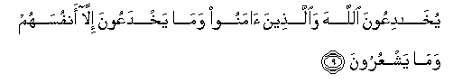

#  يُخَادِعُونَ اللَّهَ وَالَّذِينَ آمَنُوا وَمَا يَخْدَعُونَ إِلَّا أَنْفُسَهُمْ وَمَا يَشْعُرُونَ 

## YukhadiAAoona Allaha waallatheena amanoo wama yakhdaAAoona illa anfusahum wamayashAAuroona

## 翻译(Translation)：

| Translator | 译文(Translation)                                            |
|:----------:| ------------------------------------------------------------ |
| 马坚       | 他们想欺瞒真主和信士，其实，他们只是自欺，却不觉悟。         |
| YUSUFALI   | Fain would they deceive Allah and those who believe, but they only deceive themselves, and realise (it) not! |
| PICKTHAL   | They think to beguile Allah and those who believe, and they beguile none save themselves; but they perceive not. |
| SHAKIR     | They desire to deceive Allah and those who believe, and they deceive only themselves and they do not perceive. |

---

## 对位释义(Words Interpretation)：

| No     | العربية | 中文       | English    | 曾用词      |
| ------ | -------:| ---------- | ---------- | ----------- |
| 序号   | 阿文    | Chinese    | 英文       | Before      |
| 2:9.1  | يخادعون | 欺骗       | Deceiving  |             |
| 2:9.2  | الله    | 安拉，真主 | Allah      | 见1:1.2     |
| 2:9.3  | والذين  | 和那些     | and whose  | 见2:4.1     |
| 2:9.4  | آمنوا   | 信士       | Believers  |             |
| 2:9.5  | وما     | 和什么     | And what   | 见2:4.6     |
| 2:9.6  | يخدعون  | 欺骗       | Deceive    |             |
| 2:9.7  | إلا     | 但         | Except     |             |
| 2:9.8  | أنفسهم  | 他们自己   | themselves |             |
| 2:9.9  | وما     | 和不       | And not    | 不同于2:4.6 |
| 2:9.10 | يشعرون  | 感觉       | they feel  |             |

---
