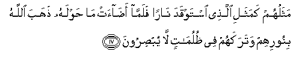

#  مَثَلُهُمْ كَمَثَلِ الَّذِي اسْتَوْقَدَ نَارًا فَلَمَّا أَضَاءَتْ مَا حَوْلَهُ ذَهَبَ اللَّهُ بِنُورِهِمْ وَتَرَكَهُمْ فِي ظُلُمَاتٍ لَا يُبْصِرُونَ 

## Mathaluhum kamathali allathee istawqada naran falamma adaat ma hawlahu thahaba Allahu binoorihim watarakahum fee thulumatin la yubsiroona

## 翻译(Translation)：

| Translator | 译文(Translation)                                            |
|:----------:| ------------------------------------------------------------ |
| 马坚       | 他们譬如燃火的人，当火光照亮了他们的四周的时候，真主把他们的火光拿去，让他们在重重的黑暗中，甚麽也看不见。 |
| YUSUFALI   | Their similitude is that of a man who kindled a fire; when it lighted all around him, Allah took away their light and left them in utter darkness. So they could not see. |
| PICKTHAL   | Their likeness is as the likeness of one who kindleth fire, and when it sheddeth its light around him Allah taketh away their light and leaveth them in darkness, where they cannot see, |
| SHAKIR     | Their parable is like the parable of one who kindled a fire but when it had illumined all around him, Allah took away their light, and left them in utter darkness-- they do not see. |

---

## 对位释义(Words Interpretation)：

| No      | العربية | 中文           | English           | 曾用词   |
| ------- | ------: | -------------- | ----------------- | -------- |
| 序号    |    阿文 | Chinese        | 英文              | Used     |
| 2:17.1  |   مَثَلُهُمْ | 像他们一样     | Like them         |          |
| 2:17.2  |    كَمَثَلِ | 犹如像         | as the parable of |          |
| 2:17.3  |    الَّذِي | 谁             | who               |          |
| 2:17.4  |  اسْتَوْقَدَ | 点燃           | kindle            |          |
| 2:17.5  |    نَارًا | 火             | fire              |          |
| 2:17.6  |    فَلَمَّا | 但是当         | but when          |          |
| 2:17.7  |   أَضَاءَتْ | 发光的         | Lit               |          |
| 2:17.8  |      مَا | 什么           | what/ that which  | 参2:4.6  |
| 2:17.9  |    حَوْلَهُ | 他周围         | Around him        |          |
| 2:17.10 |     ذَهَبَ | 去了，夺取     | Go                |          |
| 2:17.11 |    اللَّهُ | 安拉，真主     | Allah             | 见1:1.2  |
| 2:17.12 |  بِنُورِهِمْ | 光             | Light             |          |
|         |    بنور | 光             | Light             |          |
| 2:17.13 |  وَتَرَكَهُمْ | 让他们         | Leaving them      |          |
|         |     ترك | 撇弃           | leave             |          |
| 2:17.14 |      فِي | 在             | in                | 见2:10.1 |
| 2:17.15 |   ظُلُمَاتٍ | 黑暗           | Darkness          |          |
| 2:17.16 |      لَا | 不，不是，没有 | no                | 见2:2.3  |
| 2:17.17 |  يُبْصِرُونَ | 他们将看到的   | They shall see    |          |

---
