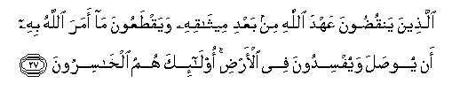

#  الَّذِينَ يَنْقُضُونَ عَهْدَ اللَّهِ مِنْ بَعْدِ مِيثَاقِهِ وَيَقْطَعُونَ مَا أَمَرَ اللَّهُ بِهِ أَنْ يُوصَلَ وَيُفْسِدُونَ فِي الْأَرْضِ ۚ أُولَٰئِكَ هُمُ الْخَاسِرُونَ 

## Allatheena yanqudoona AAahda Allahi min baAAdi meethaqihi wayaqtaAAoona ma amara Allahu bihi an yoosala wayufsidoona fee al-ardi ola-ika humu alkhasiroona

## 翻译(Translation)：

| Translator | 译文(Translation)                                            |
|:----------:| ------------------------------------------------------------ |
| 马坚       | 他们与真主缔约之後，并断绝真主命人联络的，且在地方上作恶；这等人，确是亏折的。 |
| YUSUFALI   | Those who break Allah's Covenant after it is ratified, and who sunder what Allah Has ordered to be joined, and do mischief on earth: These cause loss (only) to themselves. |
| PICKTHAL   | Those who break the covenant of Allah after ratifying it, and sever that which Allah ordered to be joined, and (who) make mischief in the earth: Those are they who are the losers. |
| SHAKIR     | Who break the covenant of Allah after its confirmation and cut asunder what Allah has ordered to be joined, and make mischief in the land; these it is that are the losers. |

---

## 对位释义(Words Interpretation)：

| No      | العربية  | 中文         | English          | 曾用词    |
| ------- | --------:| ------------ | ---------------- | --------- |
| 序号    | 阿文     | Chinese      | 英文             | Before    |
| 2:27.1  | الذين    | 谁，那些     | who, those       | 见1:7.2   |
| 2:27.2  | ينقضون   | 破坏         | Break            |           |
| 2:27.3  | عهد      | 盟约         | covenant         |           |
| 2:27.4  | الله     | 安拉，真主   | Allah            | 见1:1.2   |
| 2:27.5  | من       | 从           | from             | 见2:4.8   |
| 2:27.6  | بعد      | 之后         | after            |           |
| 2:27.7  | ميثاقه   | 协议         | agreement        |           |
| 2:27.8  | ويقطعون  | 和断绝       | And cut          |           |
| 2:27.9  | ما       | 什么         | what/ that which | 见2:17.8  |
| 2:27.10 | أمر      | 命令         | order            |           |
| 2:27.11 | الله     | 安拉，真主   | Allah            | 见1:1.2   |
| 2:27.12 | به       | 至           | To               | 见2:22.13 |
| 2:27.13 | أن       | 该           | that             | 见2:6.1   |
| 2:27.14 | يوصل     | 连接         | connect          |           |
| 2:27.15 | ويفسدون  | 和作恶       | And mischief     |           |
| 2:27.16 | في       | 在           | at               | 见2:10.1  |
| 2:27.17 | الارض    | 大地         | Earth            | 见2:22.4  |
| 2:27.18 | أولئك    | 那些，这等人 | Those            | 见2:5.1   |
| 2:27.19 | هم       | 他们         | they             | 见2:4.11  |
| 2:27.20 | الخاسرون | 失败者       | Losers           |           |

---
