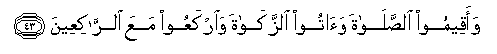

#  وَأَقِيمُوا الصَّلَاةَ وَآتُوا الزَّكَاةَ وَارْكَعُوا مَعَ الرَّاكِعِينَ 

## Waaqeemoo alssalata waatoo alzzakata wairkaAAoo maAAa alrrakiAAeena

## 翻译(Translation)：

| Translator | 译文(Translation)                                            |
|:----------:| ------------------------------------------------------------ |
| 马坚       | 你们当谨守拜功，完纳天课，与鞠躬者同齐鞠躬。                 |
| YUSUFALI   | And be steadfast in prayer; practise regular charity; and bow down your heads with those who bow down (in worship). |
| PICKTHAL   | Establish worship, pay the poor-due, and bow your heads with those who bow (in worship). |
| SHAKIR     | And keep up prayer and pay the poor-rate and bow down with those who bow down. |

---

## 对位释义(Words Interpretation)：

| No     | العربية  | 中文       | English            | 曾用词   |
| ------ | --------:| ---------- | ------------------ | -------- |
| 序号   | 阿文     | Chinese    | 英文               | Before   |
| 2:43.1 | وأقيموا  | 和谨守     | and keep up        |          |
| 2:43.2 | الصلاة   | 拜功，祈祷 | Prayer             | 参2:3.5  |
| 2:43.3 | وآتوا    | 并支付     | and pay            |          |
| 2:43.4 | الزكاة   | 天课       | Zakat              |          |
| 2:43.5 | واركعوا  | 和你们鞠躬 | And they bow down  |          |
| 2:43.6 | مع       | 共同       | With               |          |
| 2:43.7 | الراكعين | 鞠躬者     | Those who bow down | 参2:43.5 |

---
