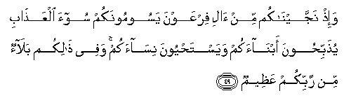

#  وَإِذْ نَجَّيْنَاكُمْ مِنْ آلِ فِرْعَوْنَ يَسُومُونَكُمْ سُوءَ الْعَذَابِ يُذَبِّحُونَ أَبْنَاءَكُمْ وَيَسْتَحْيُونَ نِسَاءَكُمْ ۚ وَفِي ذَٰلِكُمْ بَلَاءٌ مِنْ رَبِّكُمْ عَظِيمٌ 

## Wa-ith najjaynakum min ali firAAawna yasoomoonakum soo-a alAAathabi yuthabbihoona abnaakum wayastahyoona nisaakum wafee thalikum balaon min rabbikum AAatheemun

## 翻译(Translation)：

| Translator | 译文(Translation)                                            |
| ---------- | ------------------------------------------------------------ |
| 马坚       | 当时，我拯救你们脱离了法老的百姓。他们使你们遭受酷刑；屠杀你们的儿子，留存你们的女子；这是从你们的主降下的大难。 |
| YUSUFALI   | And remember, We delivered you from the people of Pharaoh: They set you hard tasks and punishments, slaughtered your sons and let your women-folk live; therein was a tremendous trial from your Lord. |
| PICKTHAL   | And (remember) when We did deliver you from Pharaoh's folk, who were afflicting you with dreadful torment, slaying your sons and sparing your women: that was a tremendous trial from your Lord. |
| SHAKIR     | And when We delivered you from Firon's people, who subjected you to severe torment, killing your sons and sparing your women, and in this there was a great trial from your Lord. |

---

## 对位释义(Words Interpretation)：

| No      | العربية  | 中文         | English              | 曾用词   |
| ------- | -------- | ------------ | -------------------- | -------- |
| 序号    | 阿文     | Chinese      | 英文                 | Before   |
| 2:49.1  | وإذ      | 当时         | and when             | 见2:30.1 |
| 2:49.2  | نجيناكم  | 我们拯救你们 | We deliver you       |          |
| 2:49.3  | من       | 从           | from                 | 见2:4.8  |
| 2:49.4  | آل       | 百姓         | The people           |          |
| 2:49.5  | فرعون    | 法老         | Pharaoh              |          |
| 2:49.6  | يسومونكم | 折磨你们     | afflicting you       |          |
| 2:49.7  | سوء      | 恐怖的       | dreadful             |          |
| 2:49.8  | العذاب   | 刑罚         | Torment              |          |
| 2:49.9  | يذبحون   | 他们屠杀     | They are slaughtered |          |
| 2:49.10 | أبناءكم  | 你们的儿子   | Your sons            |          |
| 2:49.11 | ويستحيون | 和留存       | and sparing          |          |
| 2:49.12 | نساءكم   | 你们的妇女   | Your women           |          |
| 2:49.13 | وفي      | 和在         | and at               | 参2:10.1 |
| 2:49.14 | ذلكم     | 那个是       | That's it            |          |
| 2:49.15 | بلاء     | 苦难         | trial                |          |
| 2:49.16 | من       | 从           | from                 | 见2:4.8  |
| 2:49.17 | ربكم     | 你们的主     | Your Lord            | 见2:21.5 |
| 2:49.18 | عظيم     | 重大         | Great                | 见2:7.12 |

---
