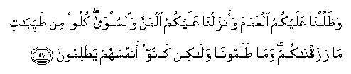

#  وَظَلَّلْنَا عَلَيْكُمُ الْغَمَامَ وَأَنْزَلْنَا عَلَيْكُمُ الْمَنَّ وَالسَّلْوَىٰ ۖ كُلُوا مِنْ طَيِّبَاتِ مَا رَزَقْنَاكُمْ ۖ وَمَا ظَلَمُونَا وَلَٰكِنْ كَانُوا أَنْفُسَهُمْ يَظْلِمُونَ 

## Wathallalna AAalaykumu alghamama waanzalna AAalaykumu almanna waalssalwa kuloo mintayyibati ma razaqnakum wama thalamoona walakin kanoo anfusahum yathlimoona

## 翻译(Translation)：

| Translator | 译文(Translation)                                            |
|:----------:| ------------------------------------------------------------ |
| 马坚       | 我曾使白云荫蔽你们，又降甘露和鹌鹑给你们。你们可以吃我所供给你们的佳美食物。他们没有损害我，但他们自欺。 |
| YUSUFALI   | And We gave you the shade of clouds and sent down to you Manna and quails, saying: "Eat of the good things We have provided for you:" (But they rebelled); to us they did no harm, but they harmed their own souls. |
| PICKTHAL   | And We caused the white cloud to overshadow you and sent down on you the manna and the quails, (saying): Eat of the good things wherewith We have provided you - they wronged Us not, but they did wrong themselves. |
| SHAKIR     | And We made the clouds to give shade over you and We sent to you manna and quails: Eat of the good things that We have given you; and they did not do Us any harm, but they made their own souls suffer the loss. |

---

## 对位释义(Words Interpretation)：

| No      | العربية | 中文         | English                  | 曾用词    |
| ------- | ------: | ------------ | ------------------------ | --------- |
| 序号    |    阿文 | Chinese      | 英文                     | Used      |
| 2:57.1  |  وَظَلَّلْنَا | 和我们荫蔽   | And We gave the shade of |           |
| 2:57.2  |   عَلَيْكُمُ | 在你们       | on you                   | 见2:40.8  |
| 2:57.3  |  الْغَمَامَ | 白云         | The clouds               |           |
| 2:57.4  | وَأَنْزَلْنَا | 和我们降下   | And we sent down         |           |
| 2:57.5  |   عَلَيْكُمُ | 在你们       | on you                   | 见2:40.8  |
| 2:57.6  |    الْمَنَّ | 甘露         | Manna                    |           |
| 2:57.7  | وَالسَّلْوَىٰ | 和鹌鹑       | and quails               |           |
| 2:57.8  |    كُلُوا | 吃           | Eat                      |           |
| 2:57.9  |      مِنْ | 从           | from                     | 见2:4.8   |
| 2:57.10 |   طَيِّبَاتِ | 好的，佳美   | Good                     |           |
| 2:57.11 |      مَا | 什么         | what/ that which         | 见2:17.8  |
| 2:57.12 | رَزَقْنَاكُمْ | 我们供给你们 | We have provided you     |           |
| 2:57.13 |     وَمَا | 和不         | And not                  | 见2:9.9   |
| 2:57.14 |  ظَلَمُونَا | 他们损害我们 | They wronged us          |           |
| 2:57.15 |    وَلَٰكِنْ | 并且但是     | and but                  | 见2:12.5  |
| 2:57.16 |   كَانُوا | 他们是       | they were                | 见2:10:11 |
| 2:57.17 |  أَنْفُسَهُمْ | 他们自己     | themselves               | 见2:9.8   |
| 2:57.18 |  يَظْلِمُونَ | 他们欺骗     | They are wronged         | 参2:57.14 |

---
