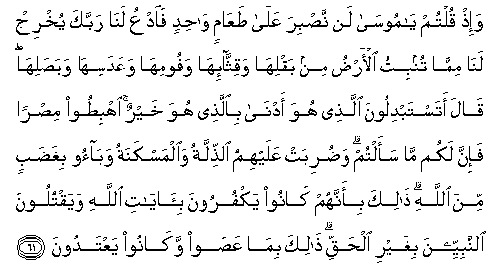

#  وَإِذْ قُلْتُمْ يَا مُوسَىٰ لَنْ نَصْبِرَ عَلَىٰ طَعَامٍ وَاحِدٍ فَادْعُ لَنَا رَبَّكَ يُخْرِجْ لَنَا مِمَّا تُنْبِتُ الْأَرْضُ مِنْ بَقْلِهَا وَقِثَّائِهَا وَفُومِهَا وَعَدَسِهَا وَبَصَلِهَا ۖ قَالَ أَتَسْتَبْدِلُونَ الَّذِي هُوَ أَدْنَىٰ بِالَّذِي هُوَ خَيْرٌ ۚ اهْبِطُوا مِصْرًا فَإِنَّ لَكُمْ مَا سَأَلْتُمْ ۗ وَضُرِبَتْ عَلَيْهِمُ الذِّلَّةُ وَالْمَسْكَنَةُ وَبَاءُوا بِغَضَبٍ مِنَ اللَّهِ ۗ ذَٰلِكَ بِأَنَّهُمْ كَانُوا يَكْفُرُونَ بِآيَاتِ اللَّهِ وَيَقْتُلُونَ النَّبِيِّينَ بِغَيْرِ الْحَقِّ ۗ ذَٰلِكَ بِمَا عَصَوْا وَكَانُوا يَعْتَدُونَ 

## Wa-ith qultum ya moosa lan nasbira AAala taAAamin wahidin faodAAu lana rabbaka yukhrij lanamimma tunbitu al-ardu min baqliha waqiththa-iha wafoomiha waAAadasiha wabasaliha qala atastabdiloona allathee huwa adna biallathee huwa khayrun ihbitoo misran fa-inna lakum ma saaltum waduribat AAalayhimu alththillatu waalmaskanatu wabaoo bighadabin mina Allahi thalika bi-annahum kanoo yakfuroona bi-ayati Allahi wayaqtuloona alnnabiyyeena bighayri alhaqqi thalika bima AAasaw wakanoo yaAAtadoona

## 翻译(Translation)：

| Translator | 译文(Translation)                                            |
| ---------- | ------------------------------------------------------------ |
| 马坚       | 当时，你们说：穆萨啊！专吃一样食物，我们绝不能忍受，所以请你替我们请求你的主，为我们生出大地所产的蔬菜──黄瓜、大蒜、扁豆和玉葱。他说：难道你们要以较贵的换取较贱的吗？你们到一座城里去吧！你们必得自己所请求的食物。他们陷於卑贱和穷困中，他们应受真主的谴怒。这是因为他们不信真主的迹象，而且枉杀众先知；这又是因为他们违抗主命，超越法度。 |
| YUSUFALI   | And remember ye said: "O Moses! we cannot endure one kind of food (always); so beseech thy Lord for us to produce for us of what the earth groweth, -its pot-herbs, and cucumbers, Its garlic, lentils, and onions." He said: "Will ye exchange the better for the worse? Go ye down to any town, and ye shall find what ye want!" They were covered with humiliation and misery; they drew on themselves the wrath of Allah. This because they went on rejecting the Signs of Allah and slaying His Messengers without just cause. This because they rebelled and went on transgressing. |
| PICKTHAL   | And when ye said: O Moses! We are weary of one kind of food; so call upon thy Lord for us that He bring forth for us of that which the earth groweth - of its herbs and its cucumbers and its corn and its lentils and its onions. He said: Would ye exchange that which is higher for that which is lower? Go down to settled country, thus ye shall get that which ye demand. And humiliation and wretchedness were stamped upon them and they were visited with wrath from Allah. That was because they disbelieved in Allah's revelations and slew the prophets wrongfully. That was for their disobedience and transgression. |
| SHAKIR     | And when you said: O Musa! we cannot bear with one food, therefore pray Lord on our behalf to bring forth for us out of what the earth grows, of its herbs and its cucumbers and its garlic and its lentils and its onions. He said: Will you exchange that which is better for that which is worse? Enter a city, so you will have what you ask for. And abasement and humiliation were brought down upon them, and they became deserving of Allah's wrath; this was so because they disbelieved in the communications of Allah and killed the prophets unjustly; this was so because they disobeyed and exceeded the limits. |

---

## 对位释义(Words Interpretation)：

| No      | العربية   | 中文               | English                      | 曾用词    |
| ------- | --------- | ------------------ | ---------------------------- | --------- |
| 序号    | 阿文      | Chinese            | 英文                         | Before    |
| 2:61.1  | وإذ       | 当时               | and when                     | 见2:30.1  |
| 2:61.2  | قلتم      | 你们说             | You said                     | 见2:55.2  |
| 2:61.3  | يا        | 啊                 | Oh                           | 见2:21.1  |
| 2:61.4  | موسى      | 穆萨               | Moses                        | 见2:51.3  |
| 2:61.5  | لن        | 不                 | will not                     | 见2:55.5  |
| 2:61.6  | نصبر      | 我们忍受           | we endure                    |           |
| 2:61.7  | على       | 至                 | On                           | 见2:5.2   |
| 2:61.8  | طعام      | 食物               | food                         |           |
| 2:61.9  | واحد      | 单一的             | one                          |           |
| 2:61.10 | فادع      | 请求               | call                         |           |
| 2:61.11 | لنا       | 为我们             | Our                          | 见2:32.5  |
| 2:61.12 | ربك       | 您的主             | Your Lord                    | 见2:30.3  |
| 2:61.13 | يخرج      | 生产               | bring forth                  |           |
| 2:61.14 | لنا       | 为我们             | Our                          | 见2:32.5  |
| 2:61.15 | مما       | 关于什么           | to what                      | 见2:23.5  |
| 2:61.16 | تنبت      | 生产               | groweth                      |           |
| 2:61.17 | الأرض     | 土地               | Earth                        | 见2:11.7  |
| 2:61.18 | من        | 从                 | from                         | 见2:4.8   |
| 2:61.19 | بقلها     | 它的蔬菜           | its herbs                    |           |
| 2:61.20 | وقثائها   | 和它的黄瓜         | and its cucumbers            |           |
| 2:61.21 | وفومها    | 和它的大蒜         | and its garlic               |           |
| 2:61.22 | وعدسها    | 和它的扁豆         | and its lentils              |           |
| 2:61.23 | وبصلها    | 和它的洋葱         | and its onions               |           |
| 2:61.24 | قال       | 他说，             | He said                      | 见2:30.2  |
| 2:61.25 | أتستبدلون | 难道你们换取       | Will you exchange            |           |
| 2:61.26 | الذي      | 谁                 | who                          | 见2:17.3  |
| 2:61.27 | هم        | 他们               | they                         | 见2:4.11  |
| 2:61.28 | أدنى      | 较贱的             | the worse                    |           |
| 2:61.29 | بالذي     | 对那个             | With that                    | 参2:17.3  |
| 2:61.30 | هو        | 他                 | He                           | 见2:29.1  |
| 2:61.31 | خير       | 较好的             | be better                    | 见2:54.18 |
| 2:61.32 | اهبطوا    | 你们下去           | get ye down                  | 见2:36.9  |
| 2:61.33 | مصرا      | 城市               | town                         |           |
| 2:61.34 | فإن       | 和确实             | and if                       | 见2:24.1  |
| 2:61.35 | لكم       | 为你们             | For you                      | 见2:22.3  |
| 2:61.36 | ما        | 什么               | what/ that which             | 见2:17.8  |
| 2:61.37 | سألتم     | 你们要求           | You asked                    |           |
| 2:61.38 | وضربت     | 陷于               | and were covered with        |           |
| 2:61.39 | عليهم     | 在他们             | on they                      | 见1:7.4   |
| 2:61.40 | الذلة     | 卑贱               | Humiliation                  |           |
| 2:61.41 | والمسكنة  | 和穷困             | and wretchedness             |           |
| 2:61.42 | وباءوا    | 和他们应受         | and they became deserving of |           |
| 2:61.43 | بغضب      | 愤怒               | wrath                        |           |
| 2:61.44 | من        | 从                 | from                         | 见2:4.8   |
| 2:61.45 | الله      | 安拉，真主         | Allah                        | 见1:1.2   |
| 2:61.46 | ذلك       | 那，那个，那些，该 | that                         | 见2:2.1   |
| 2:61.47 | بأنهم     | 因为那个他们       | That they are                |           |
| 2:61.48 | كانوا     | 他们是             | they were                    | 见2:10:11 |
| 2:61.49 | يكفرون    | 他们不信           | They disbelieve              | 参2:6.3   |
| 2:61.50 | بآيات     | 众迹象             | the Signs of                 | 参2:39.4  |
| 2:61.51 | الله      | 安拉，真主         | Allah                        | 见1:1.2   |
| 2:61.52 | ويقتلون   | 和他们杀害         | and they are killed          |           |
| 2:61.53 | النبيين   | 众先知             | The Prophets                 |           |
| 2:61.54 | بغير      | 没有               | without                      |           |
| 2:61.55 | الحق      | 正确的，真理       | Right, truth                 | 见2:26.17 |
| 2:61.56 | ذلك       | 那，那个，那些，该 | that                         | 见2:2.1   |
| 2:61.57 | بما       | 在什么             | in what                      | 见2:4.3   |
| 2:61.58 | عصوا      | 违抗               | Disobeyed                    |           |
| 2:61.59 | وكانوا    | 他们是             | and they were                | 参2:10:11 |
| 2:61.60 | يعتدون    | 超越法度           | transgression                |           |

---
