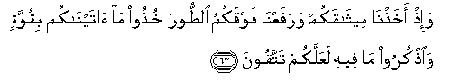

#  وَإِذْ أَخَذْنَا مِيثَاقَكُمْ وَرَفَعْنَا فَوْقَكُمُ الطُّورَ خُذُوا مَا آتَيْنَاكُمْ بِقُوَّةٍ وَاذْكُرُوا مَا فِيهِ لَعَلَّكُمْ تَتَّقُونَ 

## Wa-ith akhathna meethaqakum warafaAAna fawqakumu alttoora khuthoo ma ataynakum biquwwatin waothkuroo ma feehi laAAallakum tattaqoona

## 翻译(Translation)：

| Translator | 译文(Translation)                                            |
|:----------:| ------------------------------------------------------------ |
| 马坚       | 当时，我与你们缔约，并将山树立在你们的上面，我说：你们当坚守我所赐你们的经典，并且当牢记其中的律例，以便你们敬畏。 |
| YUSUFALI   | And remember We took your covenant and We raised above you (The towering height) of Mount (Sinai) : (Saying): "Hold firmly to what We have given you and bring (ever) to remembrance what is therein: Perchance ye may fear Allah." |
| PICKTHAL   | And (remember, O Children of Israel) when We made a covenant with you and caused the mount to tower above you, (saying): Hold fast that which We have given you, and remember that which is therein, that ye may ward off (evil). |
| SHAKIR     | And when We took a promise from you and lifted the mountain over you: Take hold of the law (Tavrat) We have given you with firmness and bear in mind what is in it, so that you may guard (against evil). |

---

## 对位释义(Words Interpretation)：

| No      | العربية | 中文         | English           | 曾用词    |
| ------- | ------: | ------------ | ----------------- | --------- |
| 序号    |    阿文 | Chinese      | 英文              | Used      |
| 2:63.1  |     وَإِذْ | 当时         | and when          | 见2:30.1  |
| 2:63.2  |   أَخَذْنَا | 我们缔结     | we took           |           |
| 2:63.3  | مِيثَاقَكُمْ | 你们的约     | Your covenant     |           |
| 2:63.4  |  وَرَفَعْنَا | 和我们树立   | and we raised     |           |
| 2:63.5  |   فَوْقَكُمُ | 你们的上面   | Over you          |           |
| 2:63.6  |   الطُّورَ | 山           | the mountain      |           |
| 2:63.7  |    خُذُوا | 你们守       | Take hold of      |           |
| 2:63.8  |      مَا | 什么         | what/ that which  | 见2:17.8  |
| 2:63.9  | آتَيْنَاكُمْ | 我们赐给你们 | We have given you |           |
| 2:63.10 |    بِقُوَّةٍ | 以坚定       | with firmness     |           |
| 2:63.11 | وَاذْكُرُوا | 和记得       | and remember      | 参2:40.4  |
| 2:63.12 |      مَا | 什么         | what/ that which  | 见2:17.8  |
| 2:63.13 |     فِيهِ | 它，其中     | in it             | 见2:2.5   |
| 2:63.14 |   لَعَلَّكُمْ | 以便你们     | you may           | 见2:21.11 |
| 2:63.15 |   تَتَّقُونَ | 敬畏         | Cautious          | 见2:21.12 |

---
