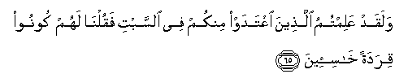

#  وَلَقَدْ عَلِمْتُمُ الَّذِينَ اعْتَدَوْا مِنْكُمْ فِي السَّبْتِ فَقُلْنَا لَهُمْ كُونُوا قِرَدَةً خَاسِئِينَ 

## Walaqad AAalimtumu allatheena iAAtadaw minkum fee alssabti faqulna lahum koonoo qiradatan khasi-eena

## 翻译(Translation)：

| Translator | 译文(Translation)                                            |
|:----------:| ------------------------------------------------------------ |
| 马坚       | 你们确已认识你们中有些人，在安息日超越法度，故我对他们说：你们变成卑贱的猿猴吧。 |
| YUSUFALI   | And well ye knew those amongst you who transgressed in the matter of the Sabbath: We said to them: "Be ye apes, despised and rejected." |
| PICKTHAL   | And ye know of those of you who broke the Sabbath, how We said unto them: Be ye apes, despised and hated! |
| SHAKIR     | And certainly you have known those among you who exceeded the limits of the Sabbath, so We said to them: Be (as) apes, despised and hated. |

---

## 对位释义(Words Interpretation)：

| No      | العربية | 中文             | English            | 曾用词   |
| ------- | ------: | ---------------- | ------------------ | -------- |
| 序号    |    阿文 | Chinese          | 英文               | Used     |
| 2:65.1  |    وَلَقَدْ | 和确实           | And certainly      |          |
| 2:65.2  |   عَلِمْتُمُ | 你们知道         | You know           |          |
| 2:65.3  |   الَّذِينَ | 谁，那些         | those who          | 见2:6.2  |
| 2:65.4  |  اعْتَدَوْا | 他们超越         | who exceeded       |          |
| 2:65.5  |    مِنْكُمْ | 从你们           | Of you             |          |
| 2:65.6  |      فِي | 在               | in                 | 见2:10.1 |
| 2:65.7  |   السَّبْتِ | 星期六（安息日） | the Sabbath        |          |
| 2:65.8  |   فَقُلْنَا | 因此我们说       | so We said         | 见2:60.5 |
| 2:65.9  |     لَهُمْ | 对他们来说，     | for them           | 见2:11.3 |
| 2:65.10 |   كُونُوا | 你们是           | Be you             |          |
| 2:65.11 |    قِرَدَةً | 猿猴             | apes               |          |
| 2:65.12 |  خَاسِئِينَ | 卑贱的           | despised and hated |          |

---
