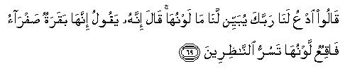

#  قَالُوا ادْعُ لَنَا رَبَّكَ يُبَيِّنْ لَنَا مَا لَوْنُهَا ۚ قَالَ إِنَّهُ يَقُولُ إِنَّهَا بَقَرَةٌ صَفْرَاءُ فَاقِعٌ لَوْنُهَا تَسُرُّ النَّاظِرِينَ 

## Qaloo odAAu lana rabbaka yubayyin lana ma lawnuha qala innahu yaqoolu innaha baqaratunsafrao faqiAAun lawnuha tasurru alnnathireena

## 翻译(Translation)：

| Translator | 译文(Translation)                                            |
|:----------:| ------------------------------------------------------------ |
| 马坚       | 他们说：请你替我们请求你的主为我们说明那头牛的毛色。他说我的主说：那头牛毛色纯黄，见者喜悦。 |
| YUSUFALI   | They said: "Beseech on our behalf Thy Lord to make plain to us Her colour." He said: "He says: A fawn-coloured heifer, pure and rich in tone, the admiration of beholders!" |
| PICKTHAL   | They said: Pray for us unto thy Lord that He make clear to us of what colour she is. (Moses) answered: Lo! He saith: Verily she is a yellow cow. Bright is her colour, gladdening beholders. |
| SHAKIR     | They said: Call on your Lord for our sake to make it plain to us what her color is. Musa said: He says, Surely she is a yellow cow; her color is intensely yellow, giving delight to the beholders. |

---

## 对位释义(Words Interpretation)：

| No      |  العربية | 中文     | English          | 曾用词    |
| ------- | -------: | -------- | ---------------- | --------- |
| 序号    |     阿文 | Chinese  | 英文             | Used      |
| 2:69.1  |    قَالُوا | 他们说， | They said        | 见2:11.8  |
| 2:69.2  |      ادْعُ | 请你祈求 | call on          | 见2:68.2  |
| 2:69.3  |      لَنَا | 为我们   | Our              | 见2:32.5  |
| 2:69.4  |      رَبَّكَ | 您的主   | Your Lord        | 见2:30.3  |
| 2:69.5  |     يُبَيِّنْ | 说明     | make plain       | 见2:68.5  |
| 2:69.6  |      لَنَا | 为我们   | Our              | 见2:32.5  |
| 2:69.7  |       مَا | 什么     | what/ that which | 见2:17.8  |
| 2:69.8  |    لَوْنُهَا | 她的颜色 | her colour       |           |
| 2:69.9  |      قَالَ | 他说，   | He said          | 见2:30.2  |
| 2:69.10 |      إِنَّهُ | 确实他   | he is            | 见2:37.8  |
| 2:69.11 |     يَقُولُ | 说       | Says             | 见2:8.4   |
| 2:69.12 |     إِنَّهَا | 确实它   | it is            | 见2:68.12 |
| 2:69.13 |     بَقَرَةٌ | 一头牛   | a heifer         | 见2:67.10 |
| 2:69.14 |    صَفْرَاءُ | 黄色的   | Yellow           |           |
| 2:69.15 |     فَاقِعٌ | 明亮的   | bright           |           |
| 2:69.16 |    لَوْنُهَا | 她的颜色 | her colour       | 见2:69.8  |
| 2:69.17 |      تَسُرُّ | 喜悦     | gladdening       |           |
| 2:69.18 | النَّاظِرِينَ | 见者     | beholder         |           |

---
