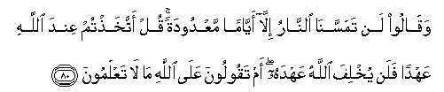

#  وَقَالُوا لَنْ تَمَسَّنَا النَّارُ إِلَّا أَيَّامًا مَعْدُودَةً ۚ قُلْ أَتَّخَذْتُمْ عِنْدَ اللَّهِ عَهْدًا فَلَنْ يُخْلِفَ اللَّهُ عَهْدَهُ ۖ أَمْ تَقُولُونَ عَلَى اللَّهِ مَا لَا تَعْلَمُونَ 

## Waqaloo lan tamassana alnnaru illa ayyaman maAAdoodatan qul attakhathtum AAinda Allahi AAahdan falan yukhlifa Allahu AAahdahu am taqooloona AAala Allahi ma la taAAlamoona

## 翻译(Translation)：

| Translator | 译文(Translation)                                            |
|:----------:| ------------------------------------------------------------ |
| 马坚       | 他们说：火绝不接触我们，除非若干有数的日子。你说：真主是绝不爽约的，你们曾与真主缔约呢？还是假借真主的名义而说出自己所不知道的事呢？ |
| YUSUFALI   | And they say: "The Fire shall not touch us but for a few numbered days:" Say: "Have ye taken a promise from Allah, for He never breaks His promise? or is it that ye say of Allah what ye do not know?" |
| PICKTHAL   | And they say: The Fire (of punishment) will not touch us save for a certain number of days. Say: Have ye received a covenant from Allah - truly Allah will not break His covenant - or tell ye concerning Allah that which ye know not? |
| SHAKIR     | And they say: Fire shall not touch us but for a few days. Say: Have you received a promise from Allah, then Allah will not fail to perform His promise, or do you speak against Allah what you do not know? |

---

## 对位释义(Words Interpretation)：

| No      | العربية | 中文           | English          | 曾用词    |
| ------- | ------: | -------------- | ---------------- | --------- |
| 序号    |    阿文 | Chinese        | 英文             | Used      |
| 2:80.1  |  وَقَالُوا | 和他们说       | and they say     | 参2:11.8  |
| 2:80.2  |      لَنْ | 绝不           | will not         | 见2:55.5  |
| 2:80.3  |   تَمَسَّنَا | 接触我们       | touch us         |           |
| 2:80.4  |   النَّارُ | 火             | fire             | 见2:24.7  |
| 2:80.5  |     إِلَّا | 除了           | Except           | 见2:9.7   |
| 2:80.6  |   أَيَّامًا | 日子           | Days             |           |
| 2:80.7  |  مَعْدُودَةً | 若干可数的     | a few numbered   |           |
| 2:80.8  |      قُلْ | 你说           | Say              |           |
| 2:80.9  |  أَتَّخَذْتُمْ | 你们缔结…吗？  | Have you taken   |           |
| 2:80.10 |     عِنْدَ | 以             | with             | 见2:54.20 |
| 2:80.11 |    اللَّهِ | 安拉，真主     | Allah            | 见1:1.2   |
| 2:80.12 |    عَهْدًا | 约             | Promise          | 参2:27.3  |
| 2:80.13 |     فَلَنْ | 因此绝不       | then will not    |           |
| 2:80.14 |    يُخْلِفَ | 破坏           | break            |           |
| 2:80.15 |    اللَّهُ | 安拉，真主     | Allah            | 见1:1.2   |
| 2:80.16 |    عَهْدَهُ | 他的约         | His promise      | 参2:80.12 |
| 2:80.17 |      أَمْ | 或             | or               | 见2:6.7   |
| 2:80.18 |  تَقُولُونَ | 你们说         | You say          |           |
| 2:80.19 |     عَلَى | 至             | On               | 见2:5.2   |
| 2:80.20 |    اللَّهِ | 安拉，真主     | Allah            | 见1:1.2   |
| 2:80.21 |      مَا | 什么           | what/ that which | 见2:17.8  |
| 2:80.22 |      لَا | 不，不是，没有 | no               | 见2:2.3   |
| 2:80.23 |  تَعْلَمُونَ | 你知道         | You know         | 见2:22.23 |

---
