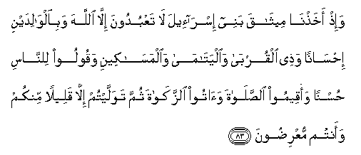

#  وَإِذْ أَخَذْنَا مِيثَاقَ بَنِي إِسْرَائِيلَ لَا تَعْبُدُونَ إِلَّا اللَّهَ وَبِالْوَالِدَيْنِ إِحْسَانًا وَذِي الْقُرْبَىٰ وَالْيَتَامَىٰ وَالْمَسَاكِينِ وَقُولُوا لِلنَّاسِ حُسْنًا وَأَقِيمُوا الصَّلَاةَ وَآتُوا الزَّكَاةَ ثُمَّ تَوَلَّيْتُمْ إِلَّا قَلِيلًا مِنْكُمْ وَأَنْتُمْ مُعْرِضُونَ 

## Wa-ith akhathna meethaqa banee isra-eela la taAAbudoona illa Allaha wabialwalidayni ihsanan wathee alqurba waalyatama waalmasakeeni waqooloo lilnnasi husnan waaqeemoo alssalata waatoo alzzakata thumma tawallaytum illa qaleelan minkum waantum muAAridoona

## 翻译(Translation)：

| Translator | 译文(Translation)                                            |
|:----------:| ------------------------------------------------------------ |
| 马坚       | 当时，我与以色列的後裔缔约，说：你们应当只崇拜真主，并当孝敬父母，和睦亲戚，怜恤孤儿，赈济贫民，对人说善言，谨守拜功，完纳天课。然後，你们除少数人外，都违背约言，你们是常常爽约的。 |
| YUSUFALI   | And remember We took a covenant from the Children of Israel (to this effect): Worship none but Allah; treat with kindness your parents and kindred, and orphans and those in need; speak fair to the people; be steadfast in prayer; and practise regular charity. Then did ye turn back, except a few among you, and ye backslide (even now). |
| PICKTHAL   | And (remember) when We made a covenant with the Children of Israel, (saying): Worship none save Allah (only), and be good to parents and to kindred and to orphans and the needy, and speak kindly to mankind; and establish worship and pay the poor-due. Then, after that, ye slid back, save a few of you, being averse. |
| SHAKIR     | And when We made a covenant with the children of Israel: You shall not serve any but Allah and (you shall do) good to (your) parents, and to the near of kin and to the orphans and the needy, and you shall speak to men good words and keep up prayer and pay the poor-rate. Then you turned back except a few of you and (now too) you turn aside. |

---

## 对位释义(Words Interpretation)：

| No      |    العربية | 中文           | English         | 曾用词    |
| ------- | ---------: | -------------- | --------------- | --------- |
| 序号    |       阿文 | Chinese        | 英文            | Used      |
| 2:83.1  |        وَإِذْ | 当时           | and when        | 见2:30.1  |
| 2:83.2  |      أَخَذْنَا | 我们缔结       | we took         | 见2:63.2  |
| 2:83.3  |      مِيثَاقَ | 约             | a covenant      |           |
| 2:83.4  |        بَنِي | 后裔           | Children        | 见2:40.2  |
| 2:83.5  |    إِسْرَائِيلَ | 以色列         | Israel          | 见2:40.3  |
| 2:83.6  |         لَا | 不，不是，没有 | no              | 见2:2.3   |
| 2:83.7  |     تَعْبُدُونَ | 敬拜           | worship         |           |
| 2:83.8  |        إِلَّا | 除了           | Except          | 见2:9.7   |
| 2:83.9  |       اللَّهَ | 安拉，真主     | Allah           | 见1:1.2   |
| 2:83.10 | وَبِالْوَالِدَيْنِ | 和至父母       | And to parents  |           |
| 2:83.11 |     إِحْسَانًا | 孝敬           | kindness        |           |
| 2:83.12 |        وَذِي | 和睦           | And that        |           |
| 2:83.13 |     الْقُرْبَىٰ | 亲属           | kindred         |           |
| 2:83.14 |   وَالْيَتَامَىٰ | 和孤儿         | And orphans     |           |
| 2:83.15 |  وَالْمَسَاكِينِ | 和贫民         | And the poor    |           |
| 2:83.16 |     وَقُولُوا | 和你们说       | And you said    | 见2:58.14 |
| 2:83.17 |      لِلنَّاسِ | 对世人         | For people      | 参2:8.2   |
| 2:83.18 |       حُسْنًا | 好的           | good            |           |
| 2:83.19 |    وَأَقِيمُوا | 和谨守         | and keep up     | 见2:43.1  |
| 2:83.20 |     الصَّلَاةَ | 拜功，祈祷     | Prayer          | 见2:43.2  |
| 2:83.21 |      وَآتُوا | 并支付         | and pay         | 见2:43.3  |
| 2:83.22 |     الزَّكَاةَ | 天课           | Zakat           | 见2:43.4  |
| 2:83.23 |         ثُمَّ | 然后           | Then            | 见2:28.7  |
| 2:83.24 |     تَوَلَّيْتُمْ | 你们背叛       | you turned back | 见2:64.2  |
| 2:83.25 |        إِلَّا | 除了           | Except          | 见2:9.7   |
| 2:83.26 |      قَلِيلًا | 微小的         | A little        | 见2:41.16 |
| 2:83.27 |       مِنْكُمْ | 从你们         | Of you          | 见2:65.5  |
| 2:83.28 |      وَأَنْتُمْ | 和你们         | and you         | 见2:22.22 |
| 2:83.29 |     مُعْرِضُونَ | 爽约           | backslide       |           |

---
