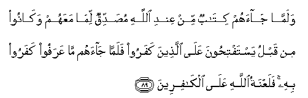

#  وَلَمَّا جَاءَهُمْ كِتَابٌ مِنْ عِنْدِ اللَّهِ مُصَدِّقٌ لِمَا مَعَهُمْ وَكَانُوا مِنْ قَبْلُ يَسْتَفْتِحُونَ عَلَى الَّذِينَ كَفَرُوا فَلَمَّا جَاءَهُمْ مَا عَرَفُوا كَفَرُوا بِهِ ۚ فَلَعْنَةُ اللَّهِ عَلَى الْكَافِرِينَ 

## Walamma jaahum kitabun min AAindi Allahi musaddiqun lima maAAahum wakanoo min qablu yastaftihoona AAala allatheena kafaroo falamma jaahum ma AAarafoo kafaroo bihi falaAAnatu Allahi AAala alkafireena

## 翻译(Translation)：

| Translator | 译文(Translation)                                            |
|:----------:| ------------------------------------------------------------ |
| 马坚       | 当一部经典能证实他们所有的经典，从真主降临他们的时候，（他们不信它）。以前他们常常祈祷，希望借它来克服不信道者，然而当他们业已认识的真理降临他们的时候，他们不信它。故真主的弃绝加於不信道者。 |
| YUSUFALI   | And when there comes to them a Book from Allah, confirming what is with them,- although from of old they had prayed for victory against those without Faith,- when there comes to them that which they (should) have recognised, they refuse to believe in it but the curse of Allah is on those without Faith. |
| PICKTHAL   | And when there cometh unto them a scripture from Allah, confirming that in their possession - though before that they were asking for a signal triumph over those who disbelieved - and when there cometh unto them that which they know (to be the truth) they disbelieve therein. The curse of Allah is on disbelievers. |
| SHAKIR     | And when there came to them a Book from Allah verifying that which they have, and aforetime they used to pray for victory against those who disbelieve, but when there came to them (Prophet) that which they did not recognize, they disbelieved in him; so Allah's curse is on the unbelievers. |

---

## 对位释义(Words Interpretation)：

| No      |  العربية | 中文         | English                     | 曾用词    |
| ------- | -------: | ------------ | --------------------------- | --------- |
| 序号    |     阿文 | Chinese      | 英文                        | Used      |
| 2:89.1  |     وَلَمَّا | 和当         | and when                    | 参2:41.5  |
| 2:89.2  |    جَاءَهُمْ | 他来到他们   | there came to them          | 参2:87.18 |
| 2:89.3  |     كِتَابٌ | 经典         | a book                      | 参2:2.2   |
| 2:89.4  |       مِنْ | 从           | from                        | 见2:4.8   |
| 2:89.5  |      عِنْدِ | 以           | with                        | 见2:54.20 |
| 2:89.6  |     اللَّهِ | 安拉，真主   | Allah                       | 见1:1.2   |
| 2:89.7  |     مُصَدِّقٌ | 证实         | confirming                  | 参2:41.1  |
| 2:89.8  |      لِمَا | 什么是       | that which                  | 见2:41.5  |
| 2:89.9  |     مَعَهُمْ | 伴随他们     | with them                   |           |
| 2:89.10 |   وَكَانُوا | 他们是       | and they were               | 见2:61.59 |
| 2:89.11 |       مِنْ | 从           | from                        | 见2:4.8   |
| 2:89.12 |      قَبْلُ | 以前         | Before                      | 见2:25.24 |
| 2:89.13 | يَسْتَفْتِحُونَ | 他们祈求克服 | they had prayed for victory |           |
| 2:89.14 |      عَلَى | 至           | On                          | 见2:5.2   |
| 2:89.15 |    الَّذِينَ | 谁，那些     | who, those                  | 见1:7.2   |
| 2:89.16 |    كَفَرُوا | 不信         | Disbelieved                 | 见2:6.3   |
| 2:89.17 |     فَلَمَّا | 当           | When                        | 见2:17.6  |
| 2:89.18 |    جَاءَهُمْ | 他来到他们   | there came to them          | 见2:89.2  |
| 2:89.19 |       مَا | 什么         | what/ that which            | 见2:17.8  |
| 2:89.20 |    عَرَفُوا | 他们认识     | They knew                   |           |
| 2:89.21 |    كَفَرُوا | 不信         | Disbelieved                 | 见2:6.3   |
| 2:89.22 |       بِهِ | 至           | To                          | 见2:22.13 |
| 2:89.23 |    فَلَعْنَةُ | 因此弃绝     | so the curse                |           |
| 2:89.24 |     اللَّهِ | 安拉，真主   | Allah                       | 见1:1.2   |
| 2:89.25 |      عَلَى | 至           | On                          | 见2:5.2   |
| 2:89.26 | الْكَافِرِينَ | 不信道者     | Unbelievers                 | 见2:34.13 |

---
