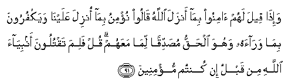

#  وَإِذَا قِيلَ لَهُمْ آمِنُوا بِمَا أَنْزَلَ اللَّهُ قَالُوا نُؤْمِنُ بِمَا أُنْزِلَ عَلَيْنَا وَيَكْفُرُونَ بِمَا وَرَاءَهُ وَهُوَ الْحَقُّ مُصَدِّقًا لِمَا مَعَهُمْ ۗ قُلْ فَلِمَ تَقْتُلُونَ أَنْبِيَاءَ اللَّهِ مِنْ قَبْلُ إِنْ كُنْتُمْ مُؤْمِنِينَ 

## Wa-itha qeela lahum aminoo bima anzala Allahu qaloo nu/minu bima onzila AAalayna wayakfuroona bima waraahu wahuwa alhaqqu musaddiqan lima maAAahum qul falima taqtuloona anbiyaa Allahi min qablu in kuntum mu/mineena

## 翻译(Translation)：

| Translator | 译文(Translation)                                            |
| :--------: | ------------------------------------------------------------ |
|    马坚    | 有人对他们说：你们应当信真主所降示的经典。他们就说：我们信我们所受的启示。他们不信此後的经典，其实，这部经典是真实的，能证实他们所有的经典。你说：如果你们是信道的人，以前你们为甚麽杀害众先知呢？ |
|  YUSUFALI  | When it is said to them, "Believe in what Allah Hath sent down, "they say, "We believe in what was sent down to us:" yet they reject all besides, even if it be Truth confirming what is with them. Say: "Why then have ye slain the prophets of Allah in times gone by, if ye did indeed believe?" |
| PICKTHALL  | And when it is said unto them: Believe in that which Allah hath revealed, they say: We believe in that which was revealed unto us. And they disbelieve in that which cometh after it, though it is the truth confirming that which they possess. Say (unto them, O Muhammad): Why then slew ye the prophets of Allah aforetime, if ye are (indeed) believers? |
|   SHAKIR   | And when it is said to them, Believe in what Allah has revealed, they say: We believe in that which was revealed to us; and they deny what is besides that, while it is the truth verifying that which they have. Say: Why then did you kill Allah's Prophets before if you were indeed believers? |

---

## 对位释义(Words Interpretation)：

| No      | العربية | 中文                   | English             | 曾用词    |
| ------- | ------: | ---------------------- | ------------------- | --------- |
| 序号    |    阿文 | Chinese                | 英文                | Used      |
| 2:91.1  |    وَإِذَا | 和当                   | and when            | 见2:11.1  |
| 2:91.2  |     قِيلَ | 告诉                   | said                | 见2:11.2  |
| 2:91.3  |     لَهُمْ | 对他们                 | for them            | 见2:11.3  |
| 2:91.4  |   آمِنُوا | 诚信                   | believe             | 见2:9.4   |
| 2:91.5  |     بِمَا | 在什么                 | in what             | 见2:4.3   |
| 2:91.6  |    أَنْزَلَ | 下降，颁降，降示，揭秘 | get down            | 见2:4.4   |
| 2:91.7  |    اللَّهُ | 安拉，真主             | Allah               | 见2:7.2   |
| 2:91.8  |   قَالُوا | 他们说，               | They said           | 见2:11.8  |
| 2:91.9  |    نُؤْمِنُ | 我们相信               | We believe          | 见2:55.6  |
| 2:91.10 |     بِمَا | 在什么                 | in what             | 见2:4.3   |
| 2:91.11 |    أُنْزِلَ | 下降，颁降，降示，揭秘 | get down            | 见2:4.4   |
| 2:91.12 |   عَلَيْنَا | 在我们                 | to us               | 见2:70.12 |
| 2:91.13 | وَيَكْفُرُونَ | 和他们不信             | and they disbelieve | 参2:61.49 |
| 2:91.14 |     بِمَا | 在什么                 | in what             | 见2:4.3   |
| 2:91.15 |   وَرَاءَهُ | 之后它的               | after it            |           |
| 2:91.16 |     وَهُوَ | 和他                   | and he              | 见2:29.16 |
| 2:91.17 |    الْحَقُّ | 正确的，真理           | Right, truth        | 见2:26.17 |
| 2:91.18 |   مُصَدِّقًا | 证实                   | confirming          | 见2:41.4  |
| 2:91.19 |     لِمَا | 至什么                 | for what            | 见2:41.5  |
| 2:91.20 |    مَعَهُمْ | 伴随他们               | with them           | 见2:89.9  |
| 2:91.21 |      قُلْ | 你说                   | Say                 | 见2:80.8  |
| 2:91.22 |     فَلِمَ | 为什么然后             | Why then            |           |
| 2:91.23 |  تَقْتُلُونَ | 你们杀害               | slay                | 见2:85.4  |
| 2:91.24 |  أَنْبِيَاءَ | 众先知                 | Prophets            | 参2:61.53 |
| 2:91.25 |    اللَّهِ | 真主的                 | of Allah            | 见2:23.17 |
| 2:91.26 |      مِنْ | 从                     | from                | 见2:4.8   |
| 2:91.27 |     قَبْلُ | 以前                   | Before              | 见2:25.24 |
| 2:91.28 |      إِنْ | 如果                   | if                  | 见2:23.18 |
| 2:91.29 |    كُنْتُمْ | 你们是                 | You are             | 见2:23.2  |
| 2:91.30 |  مُؤْمِنِينَ | 信道者                 | Believers           |           |

---
