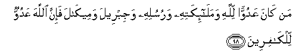

#   مَنْ كَانَ عَدُوًّا لِلَّهِ وَمَلَائِكَتِهِ وَرُسُلِهِ وَجِبْرِيلَ وَمِيكَالَ فَإِنَّ اللَّهَ عَدُوٌّ لِلْكَافِرِينَ 

## Man kana AAaduwwan lillahi wamala-ikatihi warusulihi wajibreela wameekala fa-inna Allaha AAaduwwun lilkafireena

## 翻译(Translation)：

| Translator | 译文(Translation)                                            |
|:----------:| ------------------------------------------------------------ |
| 马坚       | 凡仇视真主、众天神、众使者，以及吉卜利里和米卡里的，须知真主是仇视不信道的人们的。 |
| YUSUFALI   | Whoever is an enemy to Allah and His angels and messengers, to Gabriel and Michael,- Lo! Allah is an enemy to those who reject Faith. |
| PICKTHAL   | Who is an enemy to Allah, and His angels and His messengers, and Gabriel and Michael! Then, lo! Allah (Himself) is an enemy to the disbelievers. |
| SHAKIR     | Whoever is the enemy of Allah and His angels and His messengers and Jibreel and Meekaeel, so surely Allah is the enemy of the unbelievers. |

---

## 对位释义(Words Interpretation)：

| No      | العربية  | 中文         | English            | 曾用词    |
| ------- | --------:| ------------ | ------------------ | --------- |
| 序号    | 阿文     | Chinese      | 英文               | Before    |
| 2:98.1  | من       | 谁           | who                | 见2:97.2  |
| 2:98.2  | كان      | 他是         | It was             | 见2:75.6  |
| 2:98.3  | عدوا     | 仇视         | Enemy              | 见2:97.4  |
| 2:98.4  | لله      | 安拉，真主   | Allah              | 见1:2.2   |
| 2:98.5  | وملائكته | 和他的众天使 | And his angels     | 参2:30.4  |
| 2:98.6  | ورسله    | 和他的众使者 | And his messengers | 参2:87.8  |
| 2:98.7  | وجبريل   | 和吉卜利里   | and Gabriel        | 参2:97.5  |
| 2:98.8  | وميكال   | 和米卡里     | And Michael        |           |
| 2:98.9  | فإن      | 和确实       | and if             | 见2:24.1  |
| 2:98.10 | الله     | 安拉，真主   | Allah              | 见1:1.2   |
| 2:98.11 | عدو      | 仇视         | Enemy              | 见2:36.12 |
| 2:98.12 | للكافرين | 对于不信道者 | For disbelievers   | 见2:24.13 |

---
