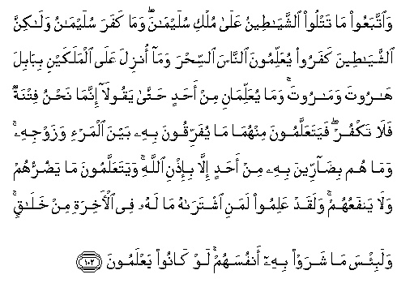

#   وَاتَّبَعُوا مَا تَتْلُو الشَّيَاطِينُ عَلَىٰ مُلْكِ سُلَيْمَانَ ۖ وَمَا كَفَرَ سُلَيْمَانُ وَلَٰكِنَّ الشَّيَاطِينَ كَفَرُوا يُعَلِّمُونَ النَّاسَ السِّحْرَ وَمَا أُنْزِلَ عَلَى الْمَلَكَيْنِ بِبَابِلَ هَارُوتَ وَمَارُوتَ ۚ وَمَا يُعَلِّمَانِ مِنْ أَحَدٍ حَتَّىٰ يَقُولَا إِنَّمَا نَحْنُ فِتْنَةٌ فَلَا تَكْفُرْ ۖ فَيَتَعَلَّمُونَ مِنْهُمَا مَا يُفَرِّقُونَ بِهِ بَيْنَ الْمَرْءِ وَزَوْجِهِ ۚ وَمَا هُمْ بِضَارِّينَ بِهِ مِنْ أَحَدٍ إِلَّا بِإِذْنِ اللَّهِ ۚ وَيَتَعَلَّمُونَ مَا يَضُرُّهُمْ وَلَا يَنْفَعُهُمْ ۚ وَلَقَدْ عَلِمُوا لَمَنِ اشْتَرَاهُ مَا لَهُ فِي الْآخِرَةِ مِنْ خَلَاقٍ ۚ وَلَبِئْسَ مَا شَرَوْا بِهِ أَنْفُسَهُمْ ۚ لَوْ كَانُوا يَعْلَمُونَ 

## WaittabaAAoo ma tatloo alshshayateenu AAala mulki sulaymana wama kafara sulaymanu walakinna alshshayateena kafaroo yuAAallimoona alnnasa alssihra wama onzila AAala almalakayni bibabila haroota wamaroota wama yuAAallimani min ahadin hatta yaqoola innama nahnu fitnatun falatakfur fayataAAallamoona minhuma ma yufarriqoona bihi bayna almar-i wazawjihi wama hum bidarreena bihi min ahadin illa bi-ithni Allahi wayataAAallamoona ma yadurruhum wala yanfaAAuhum walaqad AAalimoo lamani ishtarahu ma lahu fee al-akhirati min khalaqin walabi/sa ma sharaw bihi anfusahum law kanoo yaAAlamoona

## 翻译(Translation)：

| Translator | 译文(Translation)                                            |
| :--------: | ------------------------------------------------------------ |
|    马坚    | 他们遵随众恶魔对於素莱曼的国权所宣读的诬蔑言论──素莱曼没有叛道，众恶魔却叛道了──他们教人魔术，并将巴比伦的两个天神哈鲁特和马鲁特所得的魔术教人。他们俩在教授任何人之前，必说：我们只是试验，故你不可叛道。他们就从他们俩学了可以离间夫妻的魔术，但不得真主的许可，他们绝不能用魔术伤害任何人。他们学了对自己有害而无益的东西。他们确已知道谁购取魔术，谁在後世绝无福分。他们只以此出卖自己，这代价真恶劣！假若他们知道，（必不肯学）。 |
|  YUSUFALI  | They followed what the evil ones gave out (falsely) against the power of Solomon: the blasphemers Were, not Solomon, but the evil ones, teaching men Magic, and such things as came down at babylon to the angels Harut and Marut. But neither of these taught anyone (Such things) without saying: "We are only for trial; so do not blaspheme." They learned from them the means to sow discord between man and wife. But they could not thus harm anyone except by Allah's permission. And they learned what harmed them, not what profited them. And they knew that the buyers of (magic) would have no share in the happiness of the Hereafter. And vile was the price for which they did sell their souls, if they but knew! |
| PICKTHALL  | And follow that which the devils falsely related against the kingdom of Solomon. Solomon disbelieved not; but the devils disbelieved, teaching mankind magic and that which was revealed to the two angels in Babel, Harut and Marut. Nor did they (the two angels) teach it to anyone till they had said: We are only a temptation, therefore disbelieve not (in the guidance of Allah). And from these two (angles) people learn that by which they cause division between man and wife; but they injure thereby no-one save by Allah's leave. And they learn that which harmeth them and profiteth them not. And surely they do know that he who trafficketh therein will have no (happy) portion in the Hereafter; and surely evil is the price for which they sell their souls, if they but knew. |
|   SHAKIR   | And they followed what the Shaitans chanted of sorcery in the reign of Sulaiman, and Sulaiman was not an unbeliever, but the Shaitans disbelieved, they taught men sorcery and that was sent down to the two angels at Babel, Harut and Marut, yet these two taught no man until they had said, "Surely we are only a trial, therefore do not be a disbeliever." Even then men learned from these two, magic by which they might cause a separation between a man and his wife; and they cannot hurt with it any one except with Allah's permission, and they learned what harmed them and did not profit them, and certainly they know that he who bought it should have no share of good in the hereafter and evil was the price for which they sold their souls, had they but known this. |

---

## 对位释义(Words Interpretation)：

| No       |  العربية | 中文                   | English           | 曾用词        |
| -------- | -------: | ---------------------- | ----------------- | ------------- |
| 序号     |     阿文 | Chinese                | 英文              | Used          |
| 2:102.1  |  وَاتَّبَعُوا | 和他们追随             | And they followed |               |
| 2:102.2  |       مَا | 什么                   | what/ that which  | 见2:17.8      |
| 2:102.3  |     تَتْلُو | 诵读                   | read              | 参2:44.7      |
| 2:102.4  | الشَّيَاطِينُ | 众恶魔                 | The Shaitans      | 参2:14.10     |
| 2:102.5  |      عَلَىٰ | 至                     | On                | 见2:5.2       |
| 2:102.6  |      مُلْكِ | 国权                   | the kingdom       |               |
| 2:102.7  |   سُلَيْمَانَ | 素莱曼                 | Sulaiman          |               |
| 2:102.8  |      وَمَا | 和不                   | And not           | 见2:9.9       |
| 2:102.9  |      كَفَرَ | 不信                   | disbelieve        | 参2:99.7      |
| 2:102.10 |   سُلَيْمَانُ | 素莱曼                 | Sulaiman          | 见2:102.7     |
| 2:102.11 |     وَلَٰكِنَّ | 并且但是               | and but           | 见2:12.5      |
| 2:102.12 | الشَّيَاطِينَ | 众恶魔                 | The Shaitans      | 见2:102.4     |
| 2:102.13 |    كَفَرُوا | 不信                   | disbelieve        | 见2:6.3       |
| 2:102.14 |   يُعَلِّمُونَ | 教                     | teaching          | 与2:13.19不同 |
| 2:102.15 |    النَّاسَ | 人                     | People            | 见2:8.2       |
| 2:102.16 |    السِّحْرَ | 魔术                   | Magic             |               |
| 2:102.17 |      وَمَا | 和什么                 | and that          | 见2:4.6       |
| 2:102.18 |     أُنْزِلَ | 下降，颁降，降示，揭秘 | get down          | 见2:4.4       |
| 2:102.19 |      عَلَى | 至                     | On                | 见2:5.2       |
| 2:102.20 |  الْمَلَكَيْنِ | 两个天使               | the two angels    |               |
| 2:102.21 |    بِبَابِلَ | 在巴比伦               | at Babylon        |               |
| 2:102.22 |    هَارُوتَ | 哈鲁特                 | Harut             |               |
| 2:102.23 |   وَمَارُوتَ | 和马鲁特               | and Marut         |               |
| 2:102.24 |      وَمَا | 和什么                 | and that          | 见2:4.6       |
| 2:102.25 |   يُعَلِّمَانِ | 他们教                 | they taught       | 参2:102.14    |
| 2:102.26 |       مِنْ | 从                     | from              | 见2:4.8       |
| 2:102.27 |      أَحَدٍ | 任何人                 | anyone            | 参2:96.10     |
| 2:102.28 |      حَتَّىٰ | 直到                   | Until             | 见2:55.8      |
| 2:102.29 |    يَقُولَا | 他说                   | He says           | 参2:8.4       |
| 2:102.30 |     إِنَّمَا | 仅仅                   | only              | 见2:11.9      |
| 2:102.31 |      نَحْنُ | 我们                   | we                | 见2:11.10     |
| 2:102.32 |     فِتْنَةٌ | 试验                   | a trial           |               |
| 2:102.33 |      فَلَا | 因此不                 | shall not         | 见2:22.18     |
| 2:102.34 |     تَكْفُرْ | 你不信                 | you disbelieve    | 参2:102.9     |
| 2:102.35 | فَيَتَعَلَّمُونَ | 他们学习               | They learn        | 参2:22.23     |
| 2:102.36 |    مِنْهُمَا | 从他俩                 | from these two    |               |
| 2:102.37 |       مَا | 什么                   | what/ that which  | 见2:17.8      |
| 2:102.38 |   يُفَرِّقُونَ | 他们分离               | they separate     |               |
| 2:102.39 |       بِهِ | 以它                   | with it           | 见2:22.13     |
| 2:102.40 |      بَيْنَ | 之间                   | between           | 见2:66.4      |
| 2:102.41 |    الْمَرْءِ | 人                     | man               |               |
| 2:102.42 |    وَزَوْجِهِ | 和他的妻子             | And his wife      |               |
| 2:102.43 |      وَمَا | 和不                   | And not           | 见2:9.9       |
| 2:102.44 |       هُمْ | 他们                   | they              | 见2:4.11      |
| 2:102.45 |   بِضَارِّينَ | 伤害                   | hurt              |               |
| 2:102.46 |       بِهِ | 以它                   | with it           | 见2:22.13     |
| 2:102.47 |       مِنْ | 从                     | from              | 见2:4.8       |
| 2:102.48 |      أَحَدٍ | 任何人                 | anyone            | 见2:102.27    |
| 2:102.49 |      إِلَّا | 除了                   | Except            | 见2:9.7       |
| 2:102.50 |     بِإِذْنِ | 在许可                 | With permission   |               |
| 2:102.51 |     اللَّهِ | 真主的                 | of Allah          | 见2:23.17     |
| 2:102.52 | وَيَتَعَلَّمُونَ | 和他们学习             | and they learn    | 参2:102.35    |
| 2:102.53 |       مَا | 什么                   | what/ that which  | 见2:17.8      |
| 2:102.54 |    يَضُرُّهُمْ | 它伤害他们             | It hurts them     |               |
| 2:102.55 |      وَلَا | 也不                   | and not           | 见1:7.8       |
| 2:102.56 |   يَنْفَعُهُمْ | 对他们有益             | Benefit them      |               |
| 2:102.57 |     وَلَقَدْ | 和确实                 | And certainly     | 见2:65.1      |
| 2:102.58 |    عَلِمُوا | 他们知道               | They know         | 参2:13.19     |
| 2:102.59 |      لَمَنِ | 对谁                   | for who           |               |
| 2:102.60 |   اشْتَرَاهُ | 买它                   | Bought it         | 参2:16.3      |
| 2:102.61 |       مَا | 什么                   | what/ that which  | 见2:17.8      |
| 2:102.62 |       لَهُ | 对他                   | for he            |               |
| 2:102.63 |       فِي | 在                     | in                | 见2:10.1      |
| 2:102.64 |   الْآخِرَةِ | 后世                   | the Hereafter     | 参2:4.10      |
| 2:102.65 |       مِنْ | 从                     | from              | 见2:4.8       |
| 2:102.66 |     خَلَاقٍ | 福分                   | share of good     |               |
| 2:102.67 |    وَلَبِئْسَ | 和恶劣                 | and evil          | 参2:90.1      |
| 2:102.68 |       مَا | 什么                   | what/ that which  | 见2:17.8      |
| 2:102.69 |     شَرَوْا | 他们卖                 | they sell         |               |
| 2:102.70 |       بِهِ | 以它                   | with it           | 见2:22.13     |
| 2:102.71 |   أَنْفُسَهُمْ | 他们自己               | themselves        | 见2:9.8       |
| 2:102.72 |       لَوْ | 如果                   | If                | 与2:96.11不同 |
| 2:102.73 |    كَانُوا | 他们是                 | they were         | 见2:10:11     |
| 2:102.74 |   يَعْلَمُونَ | 知道                   | Know              | 见2:13.19     |

---
