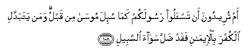

#   أَمْ تُرِيدُونَ أَنْ تَسْأَلُوا رَسُولَكُمْ كَمَا سُئِلَ مُوسَىٰ مِنْ قَبْلُ ۗ وَمَنْ يَتَبَدَّلِ الْكُفْرَ بِالْإِيمَانِ فَقَدْ ضَلَّ سَوَاءَ السَّبِيلِ 

## Am tureedoona an tas-aloo rasoolakum kama su-ila moosa min qablu waman yatabaddali alkufra bial-eemani faqad dalla sawaa alssabeeli

## 翻译(Translation)：

| Translator | 译文(Translation)                                            |
|:----------:| ------------------------------------------------------------ |
| 马坚       | 你们想请问你们的使者，像以前他们请问穆萨一样吗？以正信换取迷误的人，确已迷失正道了。 |
| YUSUFALI   | Would ye question your Messenger as Moses was questioned of old? but whoever changeth from Faith to Unbelief, Hath strayed without doubt from the even way. |
| PICKTHAL   | Or would ye question your messenger as Moses was questioned aforetime? He who chooseth disbelief instead of faith, verily he hath gone astray from a plain road. |
| SHAKIR     | Rather you wish to put questions to your Messenger, as Musa was questioned before; and whoever adopts unbelief instead of faith, he indeed has lost the right direction of the way. |

---

## 对位释义(Words Interpretation)：

| No       |  العربية | 中文       | English        | 曾用词      |
| -------- | -------: | ---------- | -------------- | ----------- |
| 序号     |     阿文 | Chinese    | 英文           | Used        |
| 2:108.1  |       أَمْ | 或         | or             | 见2:6.7     |
| 2:108.2  |   تُرِيدُونَ | 你们想     | You want       |             |
| 2:108.3  |       أَنْ | 该         | that           | 见2:26.5    |
| 2:108.4  |   تَسْأَلُوا | 你们问     | you question   |             |
| 2:108.5  |   رَسُولَكُمْ | 你们的使者 | your messenger | 参2:87.8    |
| 2:108.6  |      كَمَا | 如         | as such        | 见2:13.5    |
| 2:108.7  |      سُئِلَ | 被问       | was questioned | 参2:108.4   |
| 2:108.8  |     مُوسَىٰ | 穆萨       | Moses          | 见2:51.3    |
| 2:108.9  |       مِنْ | 从         | from           | 见2:4.8     |
| 2:108.10 |      قَبْلُ | 以前       | Before         | 见2:25.24   |
| 2:108.11 |      وَمَنْ | 和谁       | and who        | 与2:8.1不同 |
| 2:108.12 |    يَتَبَدَّلِ | 换取       | Changes        |             |
| 2:108.13 |    الْكُفْرَ | 不信       | disbelieve     | 参2:102.9   |
| 2:108.14 | بِالْإِيمَانِ | 以正信     | with faith     | 参2:93.24   |
| 2:108.15 |      فَقَدْ | 然后当然   | then may       | 参2:60.14   |
| 2:108.16 |       ضَلَّ | 迷失       | astray         | 参2:26.29   |
| 2:108.17 |     سَوَاءَ | 正确的     | right          | 与2:6.4不同 |
| 2:108.18 |   السَّبِيلِ | 道路       | The way        |             |

---
