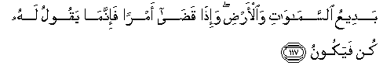

#   بَدِيعُ السَّمَاوَاتِ وَالْأَرْضِ ۖ وَإِذَا قَضَىٰ أَمْرًا فَإِنَّمَا يَقُولُ لَهُ كُنْ فَيَكُونُ 

## BadeeAAu alssamawati waal-ardi wa-itha qada amran fa-innama yaqoolu lahu kun fayakoonu

## 翻译(Translation)：

| Translator | 译文(Translation)                                            |
| :--------: | ------------------------------------------------------------ |
|    马坚    | 他是天地的创造者，当他判决一件事的时候，他只对那件事说声有，它就有了。 |
|  YUSUFALI  | To Him is due the primal origin of the heavens and the earth: When He decreeth a matter, He saith to it: "Be," and it is. |
| PICKTHALL  | The Originator of the heavens and the earth! When He decreeth a thing, He saith unto it only: Be! and it is. |
|   SHAKIR   | Wonderful Originator of the heavens and the earth, and when He decrees an affair, He only says to it, Be, so there it is. |

---

## 对位释义(Words Interpretation)：

| No       |  العربية | 中文           | English              | 曾用词     |
| -------- | -------: | -------------- | -------------------- | ---------- |
| 序号     |     阿文 | Chinese        | 英文                 | Used       |
| 2:117.1  |     بَدِيعُ | 创造者         | Wonderful Originator |            |
| 2:117.2  | السَّمَاوَاتِ | 天             | Heavens              | 见2:33.16  |
| 2:117.3  |   وَالْأَرْضِ | 和土地         | and earth            | 见2:33.17  |
| 2:117.4  |     وَإِذَا | 并且如果，当时 | and when             | 见2:11.1   |
| 2:117.5  |      قَضَىٰ | 他判决         | He decrees           |            |
| 2:117.6  |     أَمْرًا | 一件事         | a thing              |            |
| 2:117.7  |    فَإِنَّمَا | 因此仅仅       | only                 |            |
| 2:117.8  |     يَقُولُ | 说             | Says                 | 见2:8.4    |
| 2:117.9  |       لَهُ | 对他           | for he               | 见2:102.62 |
| 2:117.10 |       كُنْ | 是             | Be                   |            |
| 2:117.11 |    فَيَكُونُ | 然后它是       | So it is             |            |

---
