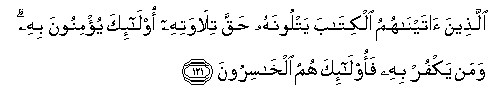

#   الَّذِينَ آتَيْنَاهُمُ الْكِتَابَ يَتْلُونَهُ حَقَّ تِلَاوَتِهِ أُولَٰئِكَ يُؤْمِنُونَ بِهِ ۗ وَمَنْ يَكْفُرْ بِهِ فَأُولَٰئِكَ هُمُ الْخَاسِرُونَ 

## Allatheena ataynahumu alkitaba yatloonahu haqqa tilawatihi ola-ika yu/minoona bihi waman yakfur bihi faola-ika humu alkhasiroona

## 翻译(Translation)：

| Translator | 译文(Translation)                                            |
|:----------:| ------------------------------------------------------------ |
| 马坚       | 蒙我赏赐经典而切实地加以遵守者，是信那经典的。不信那经典者，是亏折的。 |
| YUSUFALI   | Those to whom We have sent the Book study it as it should be studied: They are the ones that believe therein: Those who reject faith therein,- the loss is their own. |
| PICKTHAL   | Those unto whom We have given the Scripture, who read it with the right reading, those believe in it. And whoso disbelieveth in it, those are they who are the losers. |
| SHAKIR     | Those to whom We have given the Book read it as it ought to be read. These believe in it; and whoever disbelieves in it, these it is that are the losers. |

---

## 对位释义(Words Interpretation)：

| No       | العربية  | 中文           | English        | 曾用词     |
| -------- | --------:| -------------- | -------------- | ---------- |
| 序号     | 阿文     | Chinese        | 英文           | Used     |
| 2:121.1  | الَّذِينَ | 谁，那些       | those who      | 见2:6.2    |
| 2:121.2  | آتَيْنَاهُمُ | 我们给他们     | We gave them   | 参2:53.2   |
| 2:121.3  | الْكِتَابَ | 这部经，这本书 | the book       | 见2:2.2    |
| 2:121.4  | يَتْلُونَهُ | 他们诵读它     | They recite it | 参2:113.14 |
| 2:121.5  | حَقَّ | 正确的，真理   | Right, truth   | 参2:26.17  |
| 2:121.6  | تِلَاوَتِهِ | 被诵读         | be read        |            |
| 2:121.7  | أُولَٰئِكَ | 这等人         | These are      | 见2:5.1    |
| 2:121.8  | يُؤْمِنُونَ | 确信，相信     | Believe        | 见2:3.2    |
| 2:121.9  | بِهِ   | 以它           | with it        | 见2:22.13  |
| 2:121.10 | وَمَنْ | 和谁           | and who        | 见2:108.11 |
| 2:121.11 | يَكْفُرْ | 他不信         | he disbelieve | 见2:99.7   |
| 2:121.12 | بِهِ   | 以它           | with it        | 见2:22.13  |
| 2:121.13 | فَأُولَٰئِكَ | 然后那些人     | then those     | 见2:81.8   |
| 2:121.14 | هُمُ   | 他们           | they           | 见2:4.11   |
| 2:121.15 | الْخَاسِرُونَ | 失败者         | Losers         | 见2:27.20  |

---
