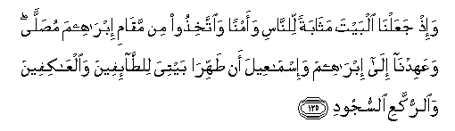

#   وَإِذْ جَعَلْنَا الْبَيْتَ مَثَابَةً لِلنَّاسِ وَأَمْنًا وَاتَّخِذُوا مِنْ مَقَامِ إِبْرَاهِيمَ مُصَلًّى ۖ وَعَهِدْنَا إِلَىٰ إِبْرَاهِيمَ وَإِسْمَاعِيلَ أَنْ طَهِّرَا بَيْتِيَ لِلطَّائِفِينَ وَالْعَاكِفِينَ وَالرُّكَّعِ السُّجُودِ 

## Wa-ith jaAAalna albayta mathabatan lilnnasi waamnan waittakhithoo min maqami ibraheema musallan waAAahidna ila ibraheema wa-ismaAAeela an tahhira baytiya liltta-ifeena waalAAakifeena waalrrukkaAAi alssujoodi

## 翻译(Translation)：

| Translator | 译文(Translation)                                            |
|:----------:| ------------------------------------------------------------ |
| 马坚       | 当时，我以天房为众人的归宿地和安宁地。你们当以易卜拉欣的立足地为礼拜处。我命易卜拉欣和易司马仪说：你们俩应当为旋绕致敬者、虔诚住守者、鞠躬叩头者，清洁我的房屋。 |
| YUSUFALI   | Remember We made the House a place of assembly for men and a place of safety; and take ye the station of Abraham as a place of prayer; and We covenanted with Abraham and Isma'il, that they should sanctify My House for those who compass it round, or use it as a retreat, or bow, or prostrate themselves (therein in prayer). |
| PICKTHAL   | And when We made the House (at Makka) a resort for mankind and sanctuary, (saying): Take as your place of worship the place where Abraham stood (to pray). And We imposed a duty upon Abraham and Ishmael, (saying): Purify My house for those who go around and those who meditate therein and those who bow down and prostrate themselves (in worship). |
| SHAKIR     | And when We made the House a pilgrimage for men and a (place of) security, and: Appoint for yourselves a place of prayer on the standing-place of Ibrahim. And We enjoined Ibrahim and Ismail saying: Purify My House for those who visit (it) and those who abide (in it) for devotion and those who bow down (and) those who prostrate themselves. |

---

## 对位释义(Words Interpretation)：

| No       | العربية   | 中文         | English              | 曾用词    |
| -------- | ---------:| ------------ | -------------------- | --------- |
| 序号     | 阿文      | Chinese      | 英文                 | Used    |
| 2:125.1  | وَإِذْ | 当时         | and when             | 见2:30.1  |
| 2:125.2  | جَعَلْنَا | 我们使       | we made              | 参2:66.1  |
| 2:125.3  | الْبَيْتَ | 天房         | the House            |           |
| 2:125.4  | مَثَابَةً | 归宿地       | a pilgrimage         |           |
| 2:125.5  | لِلنَّاسِ | 对世人       | For people           | 见2:83.17 |
| 2:125.6  | وَأَمْنًا | 安宁地       | and a security       |           |
| 2:125.7  | وَاتَّخِذُوا | 和采取       | and take             |           |
| 2:125.8  | مِنْ    | 从           | from                 | 见2:4.8   |
| 2:125.9  | مَقَامِ | 立足地       | standing-place       |           |
| 2:125.10 | إِبْرَاهِيمَ | 易卜拉欣     | Ibrahim              | 见2:124.3 |
| 2:125.11 | مُصَلًّى | 礼拜地       | a place of prayer    |           |
| 2:125.12 | وَعَهِدْنَا | 和我们约定   | and We covenanted    | 参2:27.3  |
| 2:125.13 | إِلَىٰ | 至           | to                   | 见2:14.9  |
| 2:125.14 | إِبْرَاهِيمَ | 易卜拉欣     | Ibrahim              | 见2:124.3 |
| 2:125.15 | وَإِسْمَاعِيلَ | 和易司马仪   | and Ismail           |           |
| 2:125.16 | أَنْ    | 该           | that                 | 见2:26.5  |
| 2:125.17 | طَهِّرَا | 洁净         | Purify               |           |
| 2:125.18 | بَيْتِيَ | 我的房屋     | My House             | 参2:125.3 |
| 2:125.19 | لِلطَّائِفِينَ | 旋绕致敬者   | go around            |           |
| 2:125.20 | وَالْعَاكِفِينَ | 和虔诚住守者 | and meditate therein |           |
| 2:125.21 | وَالرُّكَّعِ | 和鞠躬者     | And bow down         | 参2:43.5  |
| 2:125.22 | السُّجُودِ | 叩头者       | prostrate            |           |

---
