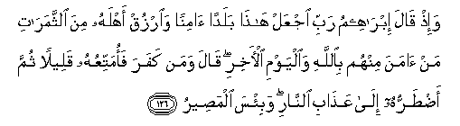

#   وَإِذْ قَالَ إِبْرَاهِيمُ رَبِّ اجْعَلْ هَٰذَا بَلَدًا آمِنًا وَارْزُقْ أَهْلَهُ مِنَ الثَّمَرَاتِ مَنْ آمَنَ مِنْهُمْ بِاللَّهِ وَالْيَوْمِ الْآخِرِ ۖ قَالَ وَمَنْ كَفَرَ فَأُمَتِّعُهُ قَلِيلًا ثُمَّ أَضْطَرُّهُ إِلَىٰ عَذَابِ النَّارِ ۖ وَبِئْسَ الْمَصِيرُ 

## Wa-ith qala ibraheemu rabbi ijAAal hatha baladan aminan waorzuq ahlahu mina alththamarati manamana minhum biAllahi waalyawmi al-akhiri qala waman kafara faomattiAAuhu qaleelan thumma adtarruhu ila AAathabi alnnari wabi/sa almaseeru

## 翻译(Translation)：

| Translator | 译文(Translation)                                            |
|:----------:| ------------------------------------------------------------ |
| 马坚       | 当时，易卜拉欣说：我的主啊！求你使这里变成安宁的地方，求你以各种粮食供给这里的居民──他们中信真主和末日的人。他说：不信道者，我将使他暂时享受，然後强逼他去受火刑。那结果真恶劣！ |
| YUSUFALI   | And remember Abraham said: "My Lord, make this a City of Peace, and feed its people with fruits,-such of them as believe in Allah and the Last Day." He said: "(Yea), and such as reject Faith,-for a while will I grant them their pleasure, but will soon drive them to the torment of Fire,- an evil destination (indeed)!" |
| PICKTHAL   | And when Abraham prayed: My Lord! Make this a region of security and bestow upon its people fruits, such of them as believe in Allah and the Last Day, He answered: As for him who disbelieveth, I shall leave him in contentment for a while, then I shall compel him to the doom of Fire - a hapless journey's end! |
| SHAKIR     | And when Ibrahim said: My Lord, make it a secure town and provide its people with fruits, such of them as believe in Allah and the last day. He said: And whoever disbelieves, I will grant him enjoyment for a short while, then I will drive him to the chastisement of the fire; and it is an evil destination. |

---

## 对位释义(Words Interpretation)：

| No       | العربية | 中文           | English                    | 曾用词      |
| -------- | ------: | -------------- | -------------------------- | ----------- |
| 序号     |    阿文 | Chinese        | 英文                       | Used        |
| 2:126.1  |     وَإِذْ | 当时           | and when                   | 见2:30.1    |
| 2:126.2  |     قَالَ | 他说，         | He said                    | 见2:30.2    |
| 2:126.3  | إِبْرَاهِيمُ | 易卜拉欣       | Ibrahim                    | 见2:124.3   |
| 2:126.4  |      رَبِّ | 主，养育，调养 | Lord                       | 见1:2.3     |
| 2:126.5  |    اجْعَلْ | 使             | make                       | 参2:22.2    |
| 2:126.6  |     هَٰذَا | 这个，此       | This                       | 见2:25.20   |
| 2:126.7  |    بَلَدًا | 城市           | a City                     |             |
| 2:126.8  |    آمِنًا | 安宁的         | Peace                      | 与2:8.5不同 |
| 2:126.9  |   وَارْزُقْ | 和供给         | and provide                |             |
| 2:126.10 |    أَهْلَهُ | 它的人们       | its people                 | 参2:105.6   |
| 2:126.11 |      مِنَ | 从             | from                       | 见2:4.8     |
| 2:126.12 | الثَّمَرَاتِ | 水果           | Fruits                     | 见2:22.15   |
| 2:126.13 |      مَنْ | 谁             | who                        | 见2:97.2    |
| 2:126.14 |     آمَنَ | 相信           | believe                    | 见2:13.6    |
| 2:126.15 |    مِنْهُمْ | 从他们         | from them                  | 见2:75.8    |
| 2:126.16 |   بِاللَّهِ | 安拉，真主     | in Allah                   | 见2:8.6     |
| 2:126.17 |  وَالْيَوْمِ | 和日子         | and the Day                | 见2:62.11   |
| 2:126.18 |   الْآخِرِ | 末             | Last                       | 见2:8.8     |
| 2:126.19 |     قَالَ | 他说，         | He said                    | 见2:30.2    |
| 2:126.20 |     وَمَنْ | 和谁           | and who                    | 见2:108.11  |
| 2:126.21 |     كَفَرَ | 不信           | disbelieve                 | 见2:102.9   |
| 2:126.22 |  فَأُمَتِّعُهُ | 然后我让他享受 | I will grant him enjoyment |             |
| 2:126.23 |   قَلِيلًا | 微小的         | A little                   | 见2:41.16   |
| 2:126.24 |      ثُمَّ | 然后           | Then                       | 见2:28.7    |
| 2:126.25 |   أَضْطَرُّهُ | 我强迫他       | I force him                |             |
| 2:126.26 |     إِلَىٰ | 至             | to                         | 见2:14.9    |
| 2:126.27 |    عَذَابِ | 煎熬，刑罚     | torment, punishment        | 见2:7.11    |
| 2:126.28 |   النَّارِ | 火狱           | the Fire                   | 见2:24.7    |
| 2:126.29 |    وَبِئْسَ | 和恶劣         | and evil                   | 参2:90.1    |
| 2:126.30 |  الْمَصِيرُ | 结果           | destination                |             |

---
