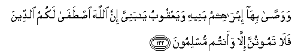

#   وَوَصَّىٰ بِهَا إِبْرَاهِيمُ بَنِيهِ وَيَعْقُوبُ يَا بَنِيَّ إِنَّ اللَّهَ اصْطَفَىٰ لَكُمُ الدِّينَ فَلَا تَمُوتُنَّ إِلَّا وَأَنْتُمْ مُسْلِمُونَ 

## Wawassa biha ibraheemu baneehi wayaAAqoobu ya baniyya inna Allaha istafa lakumu alddeena fala tamootunna illa waantum muslimoona

## 翻译(Translation)：

| Translator | 译文(Translation)                                            |
|:----------:| ------------------------------------------------------------ |
| 马坚       | 易卜拉欣和叶尔孤白都曾以此嘱咐自己的儿子说：我的儿子们啊！真主确已为你们拣选了这个宗教，所以你们除非成了归顺的人不可以死。 |
| YUSUFALI   | And this was the legacy that Abraham left to his sons, and so did Jacob; "Oh my sons! Allah hath chosen the Faith for you; then die not except in the Faith of Islam." |
| PICKTHAL   | The same did Abraham enjoin upon his sons, and also Jacob, (saying): O my sons! Lo! Allah hath chosen for you the (true) religion; therefore die not save as men who have surrendered (unto Him). |
| SHAKIR     | And the same did Ibrahim enjoin on his sons and (so did) Yaqoub. O my sons! surely Allah has chosen for you (this) faith, therefore die not unless you are Muslims. |

---

## 对位释义(Words Interpretation)：

| No       | العربية | 中文                   | English             | 曾用词     |
| -------- | ------: | ---------------------- | ------------------- | ---------- |
| 序号     |    阿文 | Chinese                | 英文                | Used       |
| 2:132.1  |    وَوَصَّىٰ | 和嘱咐                 | and enjoin on       |            |
| 2:132.2  |     بِهَا | 在他们                 | in them             | 见2:99.8   |
| 2:132.3  | إِبْرَاهِيمُ | 易卜拉欣               | Ibrahim             | 见2:124.3  |
| 2:132.4  |    بَنِيهِ | 他的儿子们             | his sons            | 参2:40.2   |
| 2:132.5  |  وَيَعْقُوبُ | 和叶尔孤白             | and Jacob           |            |
| 2:132.6  |      يَا | 啊                     | Oh                  | 见2:21.1   |
| 2:132.7  |     بَنِيَّ | 后裔                   | Children            | 见2:40.2   |
| 2:132.8  |      إِنَّ | 的确                   | surely              | 见2:6.1    |
| 2:132.9  |    اللَّهَ | 安拉，真主             | Allah               | 见1:1.2    |
| 2:132.10 |   اصْطَفَىٰ | 选择                   | choose              | 参2:130.11 |
| 2:132.11 |     لَكُمُ | 为你们                 | For you             | 见2:22.3   |
| 2:132.12 |   الدِّينَ | 宗教，信仰，报应，回报 | religion, judgment  | 见1:4.3    |
| 2:132.13 |     فَلَا | 因此不                 | shall not           | 见2:22.18  |
| 2:132.14 |   تَمُوتُنَّ | 死                     | die                 |            |
| 2:132.15 |     إِلَّا | 除了                   | Except              | 见2:9.7    |
| 2:132.16 |   وَأَنْتُمْ | 和你们                 | and you             | 见2:22.22  |
| 2:132.17 |  مُسْلِمُونَ | 穆斯林，顺民           | Muslims, submissive | 参2:128.3  |

---
