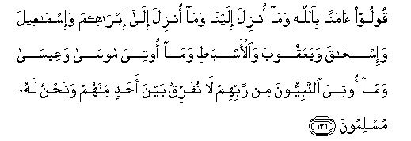

#  قُولُوا آمَنَّا بِاللَّهِ وَمَا أُنْزِلَ إِلَيْنَا وَمَا أُنْزِلَ إِلَىٰ إِبْرَاهِيمَ وَإِسْمَاعِيلَ وَإِسْحَاقَ وَيَعْقُوبَ وَالْأَسْبَاطِ وَمَا أُوتِيَ مُوسَىٰ وَعِيسَىٰ وَمَا أُوتِيَ النَّبِيُّونَ مِنْ رَبِّهِمْ لَا نُفَرِّقُ بَيْنَ أَحَدٍ مِنْهُمْ وَنَحْنُ لَهُ مُسْلِمُونَ 

## Qooloo amanna biAllahi wama onzila ilayna wama onzila ila ibraheema wa-ismaAAeela wa-ishaqa wayaAAqooba waal-asbati wama ootiya moosa waAAeesa wama ootiya alnnabiyyoona min rabbihim la nufarriqu bayna ahadin minhum wanahnu lahu muslimoona

## 翻译(Translation)：

| Translator | 译文(Translation)                                            |
| :--------: | ------------------------------------------------------------ |
|    马坚    | 你们说：我们信我们所受的启示，与易卜拉欣、易司马仪、易司哈格、叶尔孤白和各支派所受的启示，与穆萨和尔撒受赐的经典，与众先知受主所赐的经典；我们对他们中任何一个，都不加以歧视，我们只归顺真主。 |
|  YUSUFALI  | Say ye: "We believe in Allah, and the revelation given to us, and to Abraham, Isma'il, Isaac, Jacob, and the Tribes, and that given to Moses and Jesus, and that given to (all) prophets from their Lord: We make no difference between one and another of them: And we bow to Allah (in Islam)." |
| PICKTHALL  | Say (O Muslims): We believe in Allah and that which is revealed unto us and that which was revealed unto Abraham, and Ishmael, and Isaac, and Jacob, and the tribes, and that which Moses and Jesus received, and that which the prophets received from their Lord. We make no distinction between any of them, and unto Him we have surrendered. |
|   SHAKIR   | Say: We believe in Allah and (in) that which had been revealed to us, and (in) that which was revealed to Ibrahim and Ismail and Ishaq and Yaqoub and the tribes, and (in) that which was given to Musa and Isa, and (in) that which was given to the prophets from their Lord, we do not make any distinction between any of them, and to Him do we submit. |

---

## 对位释义(Words Interpretation)：

| No       |  العربية | 中文                   | English             | 曾用词     |
| -------- | -------: | ---------------------- | ------------------- | ---------- |
| 序号     |     阿文 | Chinese                | 英文                | Used       |
| 2:136.1  |    قُولُوا | 你们说                 | you said            | 参2:58.14  |
| 2:136.2  |     آمَنَّا | 我们相信               | we believe          | 见2:8.5    |
| 2:136.3  |    بِاللَّهِ | 在真主                 | in Allah            | 见2:8.6    |
| 2:136.4  |      وَمَا | 和什么                 | and that            | 见2:4.6    |
| 2:136.5  |     أُنْزِلَ | 下降，颁降，降示，揭秘 | get down            | 见2:4.4    |
| 2:136.6  |    إِلَيْنَا | 至我们                 | to us               | 参2:28.12  |
| 2:136.7  |      وَمَا | 和什么                 | and that            | 见2:4.6    |
| 2:136.8  |     أُنْزِلَ | 下降，颁降，降示，揭秘 | get down            | 见2:4.4    |
| 2:136.9  |      إِلَىٰ | 至                     | to                  | 见2:14.9   |
| 2:136.10 |  إِبْرَاهِيمَ | 易卜拉欣               | Ibrahim             | 见2:124.3  |
| 2:136.11 | وَإِسْمَاعِيلَ | 和易司马仪             | and Ismail          | 见2:125.15 |
| 2:136.12 |   وَإِسْحَاقَ | 和易司哈格             | And Ishaq           | 见2:133.22 |
| 2:136.13 |   وَيَعْقُوبَ | 和叶尔孤白             | and Jacob           | 见2:132.5  |
| 2:136.14 | وَالْأَسْبَاطِ | 和各支派               | And the tribes      |            |
| 2:136.15 |      وَمَا | 和什么                 | and that            | 见2:4.6    |
| 2:136.16 |     أُوتِيَ | 他被给                 | given to            | 参2:101.14 |
| 2:136.17 |     مُوسَىٰ | 穆萨                   | Moses               | 见2:51.3   |
| 2:136.18 |    وَعِيسَىٰ | 和尔撒                 | and Isa             | 参2:87.10  |
| 2:136.19 |      وَمَا | 和什么                 | and that            | 见2:4.6    |
| 2:136.20 |     أُوتِيَ | 他被给                 | given to            | 见2:136.16 |
| 2:136.21 |  النَّبِيُّونَ | 众先知                 | The prophets        | 参2:61.53  |
| 2:136.22 |       مِنْ | 从                     | from                | 见2:4.8    |
| 2:136.23 |     رَبِّهِمْ | 他们的主               | their Lord          | 见2:5.5    |
| 2:136.24 |       لَا | 不，不是，没有         | no                  | 见2:2.3    |
| 2:136.25 |     نُفَرِّقُ | 我们区别               | we distinction      |            |
| 2:136.26 |      بَيْنَ | 之间                   | between             | 见2:66.4   |
| 2:136.27 |      أَحَدٍ | 任何人                 | anyone              | 见2:102.27 |
| 2:136.28 |     مِنْهُمْ | 从他们                 | from them           | 见2:75.8   |
| 2:136.29 |     وَنَحْنُ | 和我们                 | and we              | 见2:30.18  |
| 2:136.30 |       لَهُ | 对他                   | for he              | 见2:102.62 |
| 2:136.31 |   مُسْلِمُونَ | 穆斯林，顺民           | Muslims, submissive | 见2:132.17 |

---
