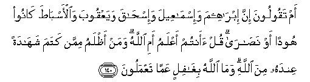

#   أَمْ تَقُولُونَ إِنَّ إِبْرَاهِيمَ وَإِسْمَاعِيلَ وَإِسْحَاقَ وَيَعْقُوبَ وَالْأَسْبَاطَ كَانُوا هُودًا أَوْ نَصَارَىٰ ۗ قُلْ أَأَنْتُمْ أَعْلَمُ أَمِ اللَّهُ ۗ وَمَنْ أَظْلَمُ مِمَّنْ كَتَمَ شَهَادَةً عِنْدَهُ مِنَ اللَّهِ ۗ وَمَا اللَّهُ بِغَافِلٍ عَمَّا تَعْمَلُونَ 

## Am taqooloona inna ibraheema wa-ismaAAeela wa-ishaqa wayaAAqooba waal-asbata kanoo hoodan aw nasara qul aantum aAAlamu ami Allahu waman athlamu mimman katama shahadatan AAindahu mina Allahi wama Allahu bighafilin AAamma taAAmaloona

## 翻译(Translation)：

| Translator | 译文(Translation)                                            |
|:----------:| ------------------------------------------------------------ |
| 马坚       | 难道你们说过易卜拉欣、易司马仪、易司哈格、叶尔孤白和各支派，都是犹太教徒，或基督教徒吗？你说：你们更有知识呢？还是真主更有知识呢？自己手中有从真主降示的证据，而加以隐讳的人，有谁比他还不义呢？真主绝不忽视你们的行为。 |
| YUSUFALI   | Or do ye say that Abraham, Isma'il Isaac, Jacob and the Tribes were Jews or Christians? Say: Do ye know better than Allah? Ah! who is more unjust than those who conceal the testimony they have from Allah? but Allah is not unmindful of what ye do! |
| PICKTHAL   | Or say ye that Abraham, and Ishmael, and Isaac, and Jacob, and the tribes were Jews or Christians? Say: Do ye know best, or doth Allah? And who is more unjust than he who hideth a testimony which he hath received from Allah? Allah is not unaware of what ye do. |
| SHAKIR     | Nay! do you say that Ibrahim and Ismail and Yaqoub and the tribes were Jews or Christians? Say: Are you better knowing or Allah? And who is more unjust than he who conceals a testimony that he has from Allah? And Allah is not at all heedless of what you do. |

---

## 对位释义(Words Interpretation)：

| No       |  العربية | 中文       | English        | 曾用词     |
| -------- | -------: | ---------- | -------------- | ---------- |
| 序号     |     阿文 | Chinese    | 英文           | Used       |
| 2:140.1  |       أَمْ | 或         | or             | 见2:6.7    |
| 2:140.2  |   تَقُولُونَ | 你们说     | You say        | 见2:80.18  |
| 2:140.3  |       إِنَّ | 该         | that           | 异2:6.1    |
| 2:140.4  |  إِبْرَاهِيمَ | 易卜拉欣   | Ibrahim        | 见2:124.3  |
| 2:140.5  | وَإِسْمَاعِيلَ | 和易司马仪 | and Ismail     | 见2:125.15 |
| 2:140.6  |   وَإِسْحَاقَ | 和易司哈格 | And Ishaq      | 见2:133.22 |
| 2:140.7  |   وَيَعْقُوبَ | 和叶尔孤白 | and Jacob      | 见2:132.5  |
| 2:140.8  | وَالْأَسْبَاطَ | 和各支派   | And the tribes | 见2:136.14 |
| 2:140.9  |    كَانُوا | 他们是     | they were      | 见2:10:11  |
| 2:140.10 |     هُودًا | 犹太教徒   | a Jew          | 见2:111.8  |
| 2:140.11 |       أَوْ | 或         | or             | 见2:19.1   |
| 2:140.12 |    نَصَارَىٰ | 基督教徒   | a Christian    | 见2:111.10 |
| 2:140.13 |       قُلْ | 你说       | Say            | 见2:80.8   |
| 2:140.14 |    أَأَنْتُمْ | 你们吗？   | are you        | 参2:22.22  |
| 2:140.15 |     أَعْلَمُ | 我知道     | I know         | 见2:30.25  |
| 2:140.16 |       أَمِ | 或         | or             | 见2:6.7    |
| 2:140.17 |     اللَّهُ | 安拉，真主 | Allah          | 见1:1.2    |
| 2:140.18 |      وَمَنْ | 和谁       | and who        | 见2:108.11 |
| 2:140.19 |     أَظْلَمُ | 较深，黑暗 | Darker         | 见2:20.11  |
| 2:140.20 |      مِمَّنْ | 比谁       | than who       | 见2:114.3  |
| 2:140.21 |      كَتَمَ | 隐讳       | hide           | 参2:33.23  |
| 2:140.22 |    شَهَادَةً | 证据       | a testimony    |            |
| 2:140.23 |     عِنْدَهُ | 他有       | he has         |            |
| 2:140.24 |       مِنَ | 从         | from           | 见2:4.8    |
| 2:140.25 |     اللَّهِ | 安拉，真主 | Allah          | 见1:1.2    |
| 2:140.26 |      وَمَا | 和不       | And not        | 见2:9.9    |
| 2:140.27 |     اللَّهُ | 安拉，真主 | Allah          | 见1:1.2    |
| 2:140.28 |    بِغَافِلٍ | 忽视       | unmindful      | 见2:74.35  |
| 2:140.29 |      عَمَّا | 在什么     | of what        | 见2:74.36  |
| 2:140.30 |   تَعْمَلُونَ | 你们行为   | you do         | 见2:74.37  |

---
