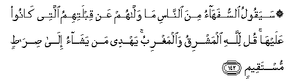

#   ۞ سَيَقُولُ السُّفَهَاءُ مِنَ النَّاسِ مَا وَلَّاهُمْ عَنْ قِبْلَتِهِمُ الَّتِي كَانُوا عَلَيْهَا ۚ قُلْ لِلَّهِ الْمَشْرِقُ وَالْمَغْرِبُ ۚ يَهْدِي مَنْ يَشَاءُ إِلَىٰ صِرَاطٍ مُسْتَقِيمٍ 

## Sayaqoolu alssufahao mina alnnasi ma wallahum AAan qiblatihimu allatee kanoo AAalayha qul lillahi almashriqu waalmaghribu yahdee man yashao ila siratin mustaqeemin

## 翻译(Translation)：

| Translator | 译文(Translation)                                            |
|:----------:| ------------------------------------------------------------ |
| 马坚       | 一般愚人将说：他们为甚麽要背弃他们原来所对的朝向呢？你说：东方和西方，都是真主的，他把他所意欲的人引上正路。 |
| YUSUFALI   | The fools among the people will say: "What hath turned them from the Qibla to which they were used?" Say: To Allah belong both east and West: He guideth whom He will to a Way that is straight. |
| PICKTHAL   | The foolish of the people will say: What hath turned them from the qiblah which they formerly observed? Say: Unto Allah belong the East and the West. He guideth whom He will unto a straight path. |
| SHAKIR     | The fools among the people will say: What has turned them from their qiblah which they had? Say: The East and the West belong only to Allah; He guides whom He likes to the right path. |

---

## 对位释义(Words Interpretation)：

| No       | العربية | 中文       | English          | 曾用词    |
| -------- | ------: | ---------- | ---------------- | --------- |
| 序号     |    阿文 | Chinese    | 英文             | Used      |
| 2:142.1  |   سَيَقُولُ | 将说       | will say         | 参2:8.4   |
| 2:142.2  | السُّفَهَاءُ | 愚人       | Foolish          | 见2:13.12 |
| 2:142.3  |      مِنَ | 从         | from             | 见2:4.8   |
| 2:142.4  |   النَّاسِ | 人         | People           | 见2:8.2   |
| 2:142.5  |      مَا | 什么       | what/ that which | 见2:17.8  |
| 2:142.6  |   وَلَّاهُمْ | 使他们转向 | turn them        |           |
| 2:142.7  |      عَنْ | 从         | on               | 见2:48.6  |
| 2:142.8  |  قِبْلَتِهِمُ | 他们的朝向 | their qiblah     |           |
| 2:142.9  |    الَّتِي | 哪         | Which            | 见2:24.8  |
| 2:142.10 |   كَانُوا | 他们是     | they were        | 见2:10:11 |
| 2:142.11 |   عَلَيْهَا | 在它       | on it            |           |
| 2:142.12 |      قُلْ | 你说       | Say              | 见2:80.8  |
| 2:142.13 |     لِلَّهِ | 为真主     | for Allah        | 见1:2.2   |
| 2:142.14 |  الْمَشْرِقُ | 东方       | the East         | 见2:115.2 |
| 2:142.15 | وَالْمَغْرِبُ | 和西方     | and the West     | 见2:115.3 |
| 2:142.16 |    يَهْدِي | 他引导     | he guides        | 参2:26.32 |
| 2:142.17 |      مَنْ | 谁         | who              | 见2:97.2  |
| 2:142.18 |    يَشَاءُ | 他意欲     | He pleases       | 见2:90.18 |
| 2:142.19 |     إِلَىٰ | 至         | to               | 见2:14.9  |
| 2:142.20 |    صِرَاطٍ | 路径       | path, way        | 见1:7.1   |
| 2:142.21 |  مُسْتَقِيمٍ | 端正的     | straight         | 参1:6.3   |

---
