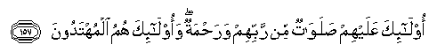

#أُولَٰئِكَ عَلَيْهِمْ صَلَوَاتٌ مِنْ رَبِّهِمْ وَرَحْمَةٌ ۖ وَأُولَٰئِكَ هُمُ الْمُهْتَدُونَ 

##Ola-ika AAalayhim salawatun min rabbihim warahmatun waola-ika humu almuhtadoona 

## 翻译(Translation)：

| Translator | 译文(Translation)                                            |
| :--------: | ------------------------------------------------------------ |
|    马坚    | 这等人，是蒙真主的祜佑和慈恩的；这等人，确是遵循正道的。     |
|  YUSUFALI  | They are those on whom (Descend) blessings from Allah, and Mercy, and they are the ones that receive guidance. |
|  PICKTHAL  | Such are they on whom are blessings from their Lord, and mercy. Such are the rightly guided. |
|   SHAKIR   | Those are they on whom are blessings and mercy from their Lord, and those are the followers of the right course. |

---

## 对位释义(Words Interpretation)：

| No      |  العربية | 中文         | English            | 曾用词   |
| ------- | -------: | ------------ | ------------------ | -------- |
| 序号    |     阿文 | Chinese      | 英文               | Used     |
| 2:157.1 |    أُولَٰئِكَ | 这等人       | These are          | 见2:5.1  |
| 2:157.2 |    عَلَيْهِمْ | 在他们       | on they            | 见1:7.4  |
| 2:157.3 |    صَلَوَاتٌ | 祝福         | blessings          |          |
| 2:157.4 |       مِنْ | 从           | from               | 见2:4.8  |
| 2:157.5 |     رَبِّهِمْ | 他们的主     | their Lord         | 见2:5.5  |
| 2:157.6 |    وَرَحْمَةٌ | 和慈恩       | and mercy          |          |
| 2:157.7 |   وَأُولَٰئِكَ | 和这等人     | and these are      | 见2:5.6  |
| 2:157.8 |       هُمُ | 他们         | they               | 见2:4.11 |
| 2:157.9 | الْمُهْتَدُونَ | 遵循正道者的 | the rightly guided |          |

---
