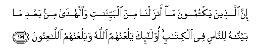

#إِنَّ الَّذِينَ يَكْتُمُونَ مَا أَنْزَلْنَا مِنَ الْبَيِّنَاتِ وَالْهُدَىٰ مِنْ بَعْدِ مَا بَيَّنَّاهُ لِلنَّاسِ فِي الْكِتَابِ ۙ أُولَٰئِكَ يَلْعَنُهُمُ اللَّهُ وَيَلْعَنُهُمُ اللَّاعِنُونَ 

##Inna allatheena yaktumoona ma anzalna mina albayyinati waalhuda min baAAdi ma bayyannahu lilnnasi fee alkitabi ola-ika yalAAanuhumu Allahu wayalAAanuhumu allaAAinoona 

## 翻译(Translation)：

| Translator | 译文(Translation)                                            |
| :--------: | ------------------------------------------------------------ |
|    马坚    | 我在经典中为世人阐明正道之後，隐讳我所降示的明证和正道的人，真主弃绝他们；一般诅咒者，都诅咒他们。 |
|  YUSUFALI  | Those who conceal the clear (Signs) We have sent down, and the Guidance, after We have made it clear for the people in the Book,-on them shall be Allah's curse, and the curse of those entitled to curse,- |
| PICKTHALL  | Lo! Those who hide the proofs and the guidance which We revealed, after We had made it clear to mankind in the Scripture: such are accursed of Allah and accursed of those who have the power to curse. |
|   SHAKIR   | Surely those who conceal the clear proofs and the guidance that We revealed after We made it clear in the Book for men, these it is whom Allah shall curse, and those who curse shall curse them (too). |

---

## 对位释义(Words Interpretation)：

| No       |  العربية | 中文       | English          | 曾用词     |
| -------- | -------: | ---------- | ---------------- | ---------- |
| 序号     |     阿文 | Chinese    | 英文             | Used       |
| 2:159.1  |       إِنَّ | 的确       | surely           | 见2:6.1    |
| 2:159.2  |    الَّذِينَ | 谁，那些   | those who        | 见2:6.2    |
| 2:159.3  |   يَكْتُمُونَ | 隐讳       | conceal          |            |
| 2:159.4  |       مَا | 什么       | what/ that which | 见2:17.8   |
| 2:159.5  |   أَنْزَلْنَا | 我们降下   | we sent down     | 见2:99.2   |
| 2:159.6  |       مِنَ | 从         | from             | 见2:4.8    |
| 2:159.7  |  الْبَيِّنَاتِ | 明证       | Clear Signs      | 见2:87.3   |
| 2:159.8  |   وَالْهُدَىٰ | 和正道     | and the Guidance | 参2:120.15 |
| 2:159.9  |       مِنْ | 从         | from             | 见2:4.8    |
| 2:159.10 |      بَعْدِ | 之后       | after            | 见2:27.6   |
| 2:159.11 |       مَا | 什么       | what/ that which | 见2:17.8   |
| 2:159.12 |    بَيَّنَّاهُ | 阐明       | made it clear    |            |
| 2:159.13 |    لِلنَّاسِ | 对世人     | For people       | 见2:83.17  |
| 2:159.14 |       فِي | 在         | in               | 见2:10.1   |
| 2:159.15 |   الْكِتَابِ | 这部经的   | of the Book      | 见2:85.25  |
| 2:159.16 |    أُولَٰئِكَ | 这等人     | These are        | 见2:5.1    |
| 2:159.17 |   يَلْعَنُهُمُ | 诅咒他们   | curse them       |            |
| 2:159.18 |     اللَّهُ | 安拉，真主 | Allah            | 见1:1.2    |
| 2:159.19 |  وَيَلْعَنُهُمُ | 和诅咒他们 | and curse them   | 参2:159.17 |
| 2:159.20 | اللَّاعِنُونَ | 一般诅咒者 | those who curse  |            |

---
