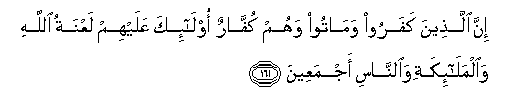

#إِنَّ الَّذِينَ كَفَرُوا وَمَاتُوا وَهُمْ كُفَّارٌ أُولَٰئِكَ عَلَيْهِمْ لَعْنَةُ اللَّهِ وَالْمَلَائِكَةِ وَالنَّاسِ أَجْمَعِينَ  

##Inna allatheena kafaroo wamatoo wahum kuffarun ola-ika AAalayhim laAAnatu Allahi waalmala-ikati waalnnasi ajmaAAeena 

## 翻译(Translation)：

| Translator | 译文(Translation)                                            |
| :--------: | ------------------------------------------------------------ |
|    马坚    | 终身不信道、临死还不信道的人，必受真主的弃绝，必受天神和人类全体的诅咒。 |
|  YUSUFALI  | Those who reject Faith, and die rejecting,- on them is Allah's curse, and the curse of angels, and of all mankind; |
|  PICKTHAL  | Lo! Those who disbelieve, and die while they are disbelievers; on them is the curse of Allah and of angels and of men combined. |
|   SHAKIR   | Surely those who disbelieve and die while they are disbelievers, these it is on whom is the curse of Allah and the angels and men all; |

---

## 对位释义(Words Interpretation)：

| No       |   العربية | 中文       | English      | 曾用词    |
| -------- | --------: | ---------- | ------------ | --------- |
| 序号     |      阿文 | Chinese    | 英文         | Used      |
| 2:161.1  |        إِنَّ | 的确       | surely       | 见2:6.1   |
| 2:161.2  |     الَّذِينَ | 谁，那些   | who, those   | 见2:6.2   |
| 2:161.3  |     كَفَرُوا | 不信       | disbelieve   | 见2:6.3   |
| 2:161.4  |    وَمَاتُوا | 和至死     | and die      |           |
| 2:161.5  |       وَهُمْ | 和他们     | and in them  | 见2:25.32 |
| 2:161.6  |      كُفَّارٌ | 不信道者   | disbelievers |           |
| 2:161.7  |     أُولَٰئِكَ | 这等人     | These are    | 见2:5.1   |
| 2:161.8  |     عَلَيْهِمْ | 在他们     | on they      | 见1:7.4   |
| 2:161.9  |      لَعْنَةُ | 诅咒       | curse        |           |
| 2:161.10 |      اللَّهِ | 安拉，真主 | Allah        | 见1:1.2   |
| 2:161.11 | وَالْمَلَائِكَةِ | 和天神     | and Angels   | 参2:31.8  |
| 2:161.12 |    وَالنَّاسِ | 和人       | and People   | 参2:8.2   |
| 2:161.13 |    أَجْمَعِينَ | 全体       | all          |           |

---

