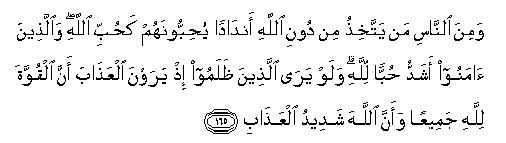

#وَمِنَ النَّاسِ مَنْ يَتَّخِذُ مِنْ دُونِ اللَّهِ أَنْدَادًا يُحِبُّونَهُمْ كَحُبِّ اللَّهِ ۖ وَالَّذِينَ آمَنُوا أَشَدُّ حُبًّا لِلَّهِ ۗ وَلَوْ يَرَى الَّذِينَ ظَلَمُوا إِذْ يَرَوْنَ الْعَذَابَ أَنَّ الْقُوَّةَ لِلَّهِ جَمِيعًا وَأَنَّ اللَّهَ شَدِيدُ الْعَذَابِ 

##Wamina alnnasi man yattakhithu min dooni Allahi andadan yuhibboonahum kahubbi Allahi waallatheena amanoo ashaddu hubban lillahi walaw yara allatheena thalamoo ith yarawna alAAathaba anna alquwwata lillahi jameeAAan waanna Allaha shadeedu alAAathabi 

## 翻译(Translation)：

| Translator | 译文(Translation)                                            |
| :--------: | ------------------------------------------------------------ |
|    马坚    | 有些人，在真主之外，别有崇拜，当做真主的匹敌；他们敬爱那些匹敌，象敬爱真主一样──信道的人们，对於敬爱真主，尤为恳挚──当不义的人，看见刑罚的时候，假若他们知道一切权力都是真主的，真主是刑罚严厉的。 |
|  YUSUFALI  | Yet there are men who take (for worship) others besides Allah, as equal (with Allah): They love them as they should love Allah. But those of Faith are overflowing in their love for Allah. If only the unrighteous could see, behold, they would see the penalty: that to Allah belongs all power, and Allah will strongly enforce the penalty. |
|  PICKTHAL  | Yet of mankind are some who take unto themselves (objects of worship which they set as) rivals to Allah, loving them with a love like (that which is the due) of Allah (only) - those who believe are stauncher in their love for Allah - Oh, that those who do evil had but known, (on the day) when they behold the doom, that power belongeth wholly to Allah, and that Allah is severe in punishment! |
|   SHAKIR   | And there are some among men who take for themselves objects of worship besides Allah, whom they love as they love Allah, and those who believe are stronger in love for Allah and O, that those who are unjust had seen, when they see the chastisement, that the power is wholly Allah's and that Allah is severe in requiting (evil). |

---

## 对位释义(Words Interpretation)：

| No       | العربية | 中文                       | English        | 曾用词    |
| -------- | ------: | -------------------------- | -------------- | --------- |
| 序号     |    阿文 | Chinese                    | 英文           | Used      |
| 2:165.1  |     وَمِنَ | 从                         | And from       | 见2:8.1   |
| 2:165.2  |   النَّاسِ | 人                         | People         | 见2:8.2   |
| 2:165.3  |      مَنْ | 谁                         | who            | 见2:97.2  |
| 2:165.4  |    يَتَّخِذُ | 采取                       | take           |           |
| 2:165.5  |      مِنْ | 从                         | from           | 见2:4.8   |
| 2:165.6  |     دُونِ | 之外                       | Without        | 见2:23.16 |
| 2:165.7  |    اللَّهِ | 安拉，真主                 | Allah          | 见1:1.2   |
| 2:165.8  |  أَنْدَادًا | 对手，匹敌，类似崇拜的佛像 | Rivals         | 见2:22.21 |
| 2:165.9  | يُحِبُّونَهُمْ | 他们爱他们                 | They love them |           |
| 2:165.10 |     كَحُبِّ | 像爱                       | as love        |           |
| 2:165.11 |    اللَّهِ | 安拉，真主                 | Allah          | 见1:1.2   |
| 2:165.12 |  وَالَّذِينَ | 和那些                     | and whose      | 见2:4.1   |
| 2:165.13 |   آمَنُوا | 信士                       | Believers      | 见2:9.4   |
| 2:165.14 |     أَشَدُّ | 更                         | Even           | 见2:74.10 |
| 2:165.15 |     حُبًّا | 爱                         | love           |           |
| 2:165.16 |     لِلَّهِ | 安拉，真主                 | Allah          | 见1:2.2   |
| 2:165.17 |     وَلَوْ | 和如果                     | and if         | 见2:20.14 |
| 2:165.18 |     يَرَى | 看                         | see            |           |
| 2:165.19 |   الَّذِينَ | 谁，那些                   | who, those     | 见2:6.2   |
| 2:165.20 |   ظَلَمُوا | 不义的人                   | unjust         | 见2:59.3  |
| 2:165.21 |      إِذْ | 当时                       | when           | 见2:131.1 |
| 2:165.22 |    يَرَوْنَ | 他们看见                   | they see       |           |
| 2:165.23 |  الْعَذَابَ | 刑罚                       | Torment        | 见2:49.8  |
| 2:165.24 |      أَنَّ | 该                         | that           | 见2:26.5  |
| 2:165.25 |   الْقُوَّةَ | 权利                       | the power      |           |
| 2:165.26 |     لِلَّهِ | 安拉，真主                 | Allah          | 见1:2.2   |
| 2:165.27 |   جَمِيعًا | 所有                       | All            | 见2:29.8  |
| 2:165.28 |     وَأَنَّ | 和那个                     | and that       | 参2:26.5  |
| 2:165.29 |    اللَّهَ | 安拉，真主                 | Allah          | 见1:1.2   |
| 2:165.30 |    شَدِيدُ | 严厉                       | strongly       |           |
| 2:165.31 |  الْعَذَابِ | 刑罚                       | Torment        | 见2:49.8  |

---
