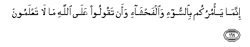

#إِنَّمَا يَأْمُرُكُمْ بِالسُّوءِ وَالْفَحْشَاءِ وَأَنْ تَقُولُوا عَلَى اللَّهِ مَا لَا تَعْلَمُونَ 

##Innama ya/murukum bialssoo-i waalfahsha-i waan taqooloo AAala Allahi ma la taAAlamoona 

## 翻译(Translation)：

| Translator | 译文(Translation)                                            |
| :--------: | ------------------------------------------------------------ |
|    马坚    | 他只以罪恶和丑事命令你们，并教你们假借真主的名义，而说出你们所不知道的事。 |
|  YUSUFALI  | For he commands you what is evil and shameful, and that ye should say of Allah that of which ye have no knowledge. |
| PICKTHALL  | He enjoineth upon you only the evil and the foul, and that ye should tell concerning Allah that which ye know not. |
|   SHAKIR   | He only enjoins you evil and indecency, and that you may speak against Allah what you do not know. |

---

## 对位释义(Words Interpretation)：

| No       |  العربية | 中文           | English          | 曾用词    |
| -------- | -------: | -------------- | ---------------- | --------- |
| 序号     |     阿文 | Chinese        | 英文             | Used      |
| 2:169.1  |     إِنَّمَا | 仅仅           | only             | 见2:11.9  |
| 2:169.2  |   يَأْمُرُكُمْ | 命令你们       | command you      | 见2:67.7  |
| 2:169.3  |   بِالسُّوءِ | 在恶           | with evil        |           |
| 2:169.4  | وَالْفَحْشَاءِ | 和丑事         | and shameful     |           |
| 2:169.5  |      وَأَنْ | 和那个         | and that         |           |
| 2:169.6  |   تَقُولُوا | 你们说         | You say          | 见2:104.6 |
| 2:169.7  |      عَلَى | 至             | On               | 见2:5.2   |
| 2:169.8  |     اللَّهِ | 真主的         | of Allah         | 见2:23.17 |
| 2:169.9  |       مَا | 什么           | what/ that which | 见2:17.8  |
| 2:169.10 |       لَا | 不，不是，没有 | no               | 见2:2.3   |
| 2:169.11 |   تَعْلَمُونَ | 你知道         | You know         | 见2:22.23 |

---

