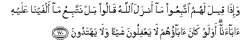

#وَإِذَا قِيلَ لَهُمُ اتَّبِعُوا مَا أَنْزَلَ اللَّهُ قَالُوا بَلْ نَتَّبِعُ مَا أَلْفَيْنَا عَلَيْهِ آبَاءَنَا ۗ أَوَلَوْ كَانَ آبَاؤُهُمْ لَا يَعْقِلُونَ شَيْئًا وَلَا يَهْتَدُونَ 

##Wa-itha qeela lahumu ittabiAAoo ma anzala Allahu qaloo bal nattabiAAu ma alfayna AAalayhiabaana awa law kana abaohum la yaAAqiloona shay-an wala yahtadoona 

## 翻译(Translation)：

| Translator | 译文(Translation)                                            |
| :--------: | ------------------------------------------------------------ |
|    马坚    | 有人劝他们说：你们应当遵守真主所降示的经典。他们就说：不然，我们要遵守我们祖先的遗教。即使他们的祖先无知无识，不循正道（他们仍要遵守他们的遗教）吗？ |
|  YUSUFALI  | When it is said to them: "Follow what Allah hath revealed:" They say: "Nay! we shall follow the ways of our fathers." What! even though their fathers Were void of wisdom and guidance? |
|  PICKTHAL  | And when it is said unto them: Follow that which Allah hath revealed, they say: We follow that wherein we found our fathers. What! Even though their fathers were wholly unintelligent and had no guidance? |
|   SHAKIR   | And when it is said to them, Follow what Allah has revealed, they say: Nay! we follow what we found our fathers upon. What! and though their fathers had no sense at all, nor did they follow the right way. |

---

## 对位释义(Words Interpretation)：

| No       | العربية | 中文                   | English                   | 曾用词     |
| -------- | ------: | ---------------------- | ------------------------- | ---------- |
| 序号     |    阿文 | Chinese                | 英文                      | Used       |
| 2:170.1  |    وَإِذَا | 并且如果，当时         | and when                  | 见2:11.1   |
| 2:170.2  |     قِيلَ | 告诉                   | said                      | 见2:11.2   |
| 2:170.3  |     لَهُمُ | 对他们来说，           | for them                  | 见2:11.3   |
| 2:170.4  |  اتَّبِعُوا | 追随                   | follow                    | 见2:166.4  |
| 2:170.5  |      مَا | 什么                   | what/ that which          | 见2:17.8   |
| 2:170.6  |    أَنْزَلَ | 下降，颁降，降示，揭秘 | get down                  | 见2:4.4    |
| 2:170.7  |    اللَّهُ | 安拉，真主             | Allah                     | 见1:1.2    |
| 2:170.8  |   قَالُوا | 他们说，               | They said                 | 见2:11.8   |
| 2:170.9  |      بَلْ | 不然                   | Nay, but                  | 见2:88.4   |
| 2:170.10 |    نَتَّبِعُ | 我们遵守               | we follow                 | 参2:166.4  |
| 2:170.11 |      مَا | 什么                   | what/ that which          | 见2:17.8   |
| 2:170.12 |  أَلْفَيْنَا | 我们发现               | we found                  |            |
| 2:170.13 |    عَلَيْهِ | 在他                   | on him                    | 见2:37.7   |
| 2:170.14 |  آبَاءَنَا | 我们的祖先             | our fathers               |            |
| 2:170.15 |    أَوَلَوْ | 什么？和假如           | What! and though          |            |
| 2:170.16 |     كَانَ | 他是                   | It was                    | 见2:75.6   |
| 2:170.17 |  آبَاؤُهُمْ | 他们的祖先             | their fathers             |            |
| 2:170.18 |      لَا | 不，不是，没有         | no                        | 见2:2.3    |
| 2:170.19 |  يَعْقِلُونَ | 他们了解               | They understand           | 见2:164.43 |
| 2:170.20 |    شَيْئًا | 任何事情               | anything                  | 见2:48.8   |
| 2:170.21 |     وَلَا | 也不                   | and not                   | 见1:7.8    |
| 2:170.22 |  يَهْتَدُونَ | 他们遵循正道           | they follow the right way |            |

---
