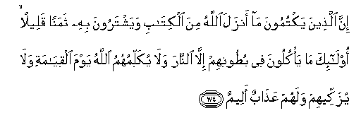

#إِنَّ الَّذِينَ يَكْتُمُونَ مَا أَنْزَلَ اللَّهُ مِنَ الْكِتَابِ وَيَشْتَرُونَ بِهِ ثَمَنًا قَلِيلًا ۙ أُولَٰئِكَ مَا يَأْكُلُونَ فِي بُطُونِهِمْ إِلَّا النَّارَ وَلَا يُكَلِّمُهُمُ اللَّهُ يَوْمَ الْقِيَامَةِ وَلَا يُزَكِّيهِمْ وَلَهُمْ عَذَابٌ أَلِيمٌ 

##Inna allatheena yaktumoona ma anzala Allahu mina alkitabi wayashtaroona bihi thamanan qaleelan ola-ika ma ya/kuloona fee butoonihim illa alnnara wala yukallimuhumu Allahu yawma alqiyamati wala yuzakkeehim walahum AAathabun aleemun 

## 翻译(Translation)：

| Translator | 译文(Translation)                                            |
| :--------: | ------------------------------------------------------------ |
|    马坚    | 隐讳真主所降示的经典，而以廉价出卖它的人，只是把火吞到肚子里去，在复活日，真主既不和他们说话，又不涤除他们的罪恶，他们将受痛苦的刑罚。 |
|  YUSUFALI  | Those who conceal Allah's revelations in the Book, and purchase for them a miserable profit,- they swallow into themselves naught but Fire; Allah will not address them on the Day of Resurrection. Nor purify them: Grievous will be their penalty. |
| PICKTHALL  | Lo! those who hide aught of the Scripture which Allah hath revealed and purchase a small gain therewith, they eat into their bellies nothing else than fire. Allah will not speak to them on the Day of Resurrection, nor will He make them grow. Theirs will be a painful doom. |
|   SHAKIR   | Surely those who conceal any part of the Book that Allah has revealed and take for it a small price, they eat nothing but fire into their bellies, and Allah will not speak to them on the day of resurrection, nor will He purify them, and they shall have a painful chastisement. |

---

## 对位释义(Words Interpretation)：

| No   | العربية | 中文    | English | 曾用词 |
| ---- | ------: | ------- | ------- | ------ |
| 序号 |    阿文 | Chinese | 英文    | Used   |
| 2:174.1  | إِنَّ      | 的确                   | surely              | 见2:6.1   |
| 2:174.2  | الَّذِينَ   | 谁，那些               | those who           | 见2:6.2   |
| 2:174.3  | يَكْتُمُونَ  | 隐讳                   | conceal             | 见2:159.3 |
| 2:174.4  | مَا      | 什么                   | what/ that which    | 见2:17.8  |
| 2:174.5  | أَنْزَلَ    | 下降，颁降，降示，揭秘 | get down            | 见2:4.4   |
| 2:174.6  | اللَّهُ    | 安拉，真主             | Allah               | 见1:1.2   |
| 2:174.7  | مِنَ      | 从                     | from                | 见2:4.8   |
| 2:174.8  | الْكِتَابِ  | 这部经的        | of the Book        | 见2:85.25 |
| 2:174.9  | وَيَشْتَرُونَ | 和出卖                 | and purchase        |           |
| 2:174.10 | بِهِ      | 以它                   | with it             | 见2:22.13 |
| 2:174.11 | ثَمَنًا    | 价钱                   | Price               | 见2:41.15 |
| 2:174.12 | قَلِيلًا   | 微小的                 | A little            | 见2:41.16 |
| 2:174.13 | أُولَٰئِكَ   | 这等人                 | These are           | 见2:5.1   |
| 2:174.14 | مَا      | 什么                   | what/ that which    | 见2:17.8  |
| 2:174.15 | يَأْكُلُونَ  | 他们吃                 | they eat            |           |
| 2:174.16 | فِي      | 在                     | in                  | 见2:10.1  |
| 2:174.17 | بُطُونِهِمْ  | 他们的肚子             | their bellies       |           |
| 2:174.18 | إِلَّا     | 除了                   | Except              | 见2:9.7   |
| 2:174.19 | النَّارَ   | 火狱                   | the Fire            | 见2:24.7  |
| 2:174.20 | وَلَا     | 也不                   | and not             | 见1:7.8   |
| 2:174.21 | يُكَلِّمُهُمُ  | 和他们说话             | speak to them       |           |
| 2:174.22 | اللَّهُ    | 安拉，真主             | Allah               | 见1:1.2   |
| 2:174.23 | يَوْمَ     | 日，日子，时候的       | day                 | 见1:4.2   |
| 2:174.24 | الْقِيَامَةِ | 复活的                 | Resurrection        | 见2:85.40 |
| 2:174.25 | وَلَا     | 也不                   | and not             | 见1:7.8   |
| 2:174.26 | يُزَكِّيهِمْ  | 洁净他们               | purify them         |           |
| 2:174.27 | وَلَهُمْ    | 和对他们               | and for them        | 见2:7.10  |
| 2:174.28 | عَذَابٌ    | 煎熬，刑罚             | torment, punishment | 见2:7.11  |
| 2:174.29 | أَلِيمٌ    | 痛苦，疼痛             | A painful           | 见2:10.9  |

---
