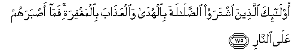

#أُولَٰئِكَ الَّذِينَ اشْتَرَوُا الضَّلَالَةَ بِالْهُدَىٰ وَالْعَذَابَ بِالْمَغْفِرَةِ ۚ فَمَا أَصْبَرَهُمْ عَلَى النَّارِ 

##Ola-ika allatheena ishtarawoo alddalalata bialhuda waalAAathaba bialmaghfirati fama asbarahum AAala alnnari 

## 翻译(Translation)：

| Translator | 译文(Translation)                                            |
| :--------: | :----------------------------------------------------------- |
|    马坚    | 这等人，以正道换取迷误，以赦宥换取刑罚，他们真能忍受火刑！   |
|  YUSUFALI  | They are the ones who buy Error in place of Guidance and Torment in place of Forgiveness. Ah! what boldness (They show) for the Fire! |
| PICKTHALL  | Those are they who purchase error at the price of guidance, and torment at the price of pardon. How constant are they in their strife to reach the Fire! |
|   SHAKIR   | These are they who buy error for the right direction and chastisement for forgiveness; how bold they are to encounter fire. |

---

## 对位释义(Words Interpretation)：

| No   | العربية | 中文    | English | 曾用词 |
| ---- | ------: | ------- | ------- | ------ |
| 序号 |    阿文 | Chinese | 英文    | Used   |
| 2:175.1  | أُولَٰئِكَ    | 这等人     | These are       | 见2:5.1  |
| 2:175.2  | الَّذِينَ    | 谁，那些   | those who       | 见2:6.2  |
| 2:175.3  | اشْتَرَوُا   | 买，换取   | they bought     | 见2:16.3 |
| 2:175.4  | الضَّلَالَةَ  | 误导，迷路 | Misguidance     | 见2:16.4 |
| 2:175.5  | بِالْهُدَىٰ   | 以正道     | with Guidance   | 见2:16.5 |
| 2:175.6  | وَالْعَذَابَ  | 和刑罚     | and Torment     | 参2:49.8 |
| 2:175.7  | بِالْمَغْفِرَةِ | 以赦宥     | for forgiveness |          |
| 2:175.8  | فَمَا      | 什么，并未 | What            | 见2:16.6 |
| 2:175.9  | أَصْبَرَهُمْ   | 他们大胆   | bold they are   |          |
| 2:175.10 | عَلَى      | 至         | On              | 见2:5.2  |
| 2:175.11 | النَّارِ    | 火狱       | the Fire        | 见2:24.7 |

---
