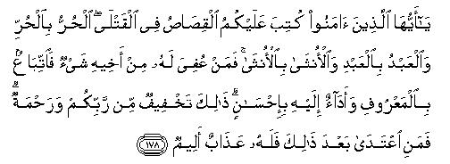

#يَا أَيُّهَا الَّذِينَ آمَنُوا كُتِبَ عَلَيْكُمُ الْقِصَاصُ فِي الْقَتْلَى ۖ الْحُرُّ بِالْحُرِّ وَالْعَبْدُ بِالْعَبْدِ وَالْأُنْثَىٰ بِالْأُنْثَىٰ ۚ فَمَنْ عُفِيَ لَهُ مِنْ أَخِيهِ شَيْءٌ فَاتِّبَاعٌ بِالْمَعْرُوفِ وَأَدَاءٌ إِلَيْهِ بِإِحْسَانٍ ۗ ذَٰلِكَ تَخْفِيفٌ مِنْ رَبِّكُمْ وَرَحْمَةٌ ۗ فَمَنِ اعْتَدَىٰ بَعْدَ ذَٰلِكَ فَلَهُ عَذَابٌ أَلِيمٌ 

##Ya ayyuha allatheena amanoo kutiba AAalaykumu alqisasu fee alqatla alhurru bialhurri waalAAabdu bialAAabdi waalontha bialontha faman AAufiya lahu min akheehi shay-on faittibaAAun bialmaAAroofi waadaon ilayhi bi-ihsanin thalika takhfeefun min rabbikum warahmatun famani iAAtada baAAda thalika falahu AAathabun aleemun 

## 翻译(Translation)：

| Translator | 译文(Translation)                                            |
| :--------: | ------------------------------------------------------------ |
|    马坚    | 信道的人们啊！今以杀人者抵罪为你们的定制，公民抵偿公民，奴隶抵偿奴隶，妇女抵偿妇女。如果尸亲有所宽赦，那末，一方应依例提出要求，一方应依礼给予赔偿，这是你们的主所降示的减轻和慈恩。事後，过分的人，将受痛苦的刑罚。 |
|  YUSUFALI  | O ye who believe! the law of equality is prescribed to you in cases of murder: the free for the free, the slave for the slave, the woman for the woman. But if any remission is made by the brother of the slain, then grant any reasonable demand, and compensate him with handsome gratitude, this is a concession and a Mercy from your Lord. After this whoever exceeds the limits shall be in grave penalty. |
|  PICKTHAL  | O ye who believe! Retaliation is prescribed for you in the matter of the murdered; the freeman for the freeman, and the slave for the slave, and the female for the female. And for him who is forgiven somewhat by his (injured) brother, prosecution according to usage and payment unto him in kindness. This is an alleviation and a mercy from your Lord. He who transgresseth after this will have a painful doom. |
|   SHAKIR   | O you who believe! retaliation is prescribed for you in the matter of the slain, the free for the free, and the slave for the slave, and the female for the female, but if any remission is made to any one by his (aggrieved) brother, then prosecution (for the bloodwit) should be made according to usage, and payment should be made to him in a good manner; this is an alleviation from your Lord and a mercy; so whoever exceeds the limit after this he shall have a painful chastisement. |

---

## 对位释义(Words Interpretation)：

| No   | العربية | 中文    | English | 曾用词 |
| ---- | ------: | ------- | ------- | ------ |
| 序号 |    阿文 | Chinese | 英文    | Used   |
| 2:178.1  | يَا       | 啊                 | Oh                         | 见2:21.1   |
| 2:178.2  | أَيُّهَا     | 语气词             | O                          | 见2:21.2   |
| 2:178.3  | الَّذِينَ    | 谁，那些           | those who                  | 见2:6.2    |
| 2:178.4  | آمَنُوا    | 诚信               | believe                    | 见2:9.4    |
| 2:178.5  | كُتِبَ      | 被规定             | is prescribed              |            |
| 2:178.6  | عَلَيْكُمُ    | 在你们             | on you                     | 见2:40.8   |
| 2:178.7  | الْقِصَاصُ   | 抵罪律    | the law of equality        |            |
| 2:178.8  | فِي       | 在                 | in                         | 见2:10.1   |
| 2:178.9  | الْقَتْلَى   | 谋杀               | the matter of the murdered |            |
| 2:178.10 | الْحُرُّ     | 公民               | the free                   |            |
| 2:178.11 | بِالْحُرِّ    | 对公民             | for the free               | 参2:178.10 |
| 2:178.12 | وَالْعَبْدُ   | 和奴隶             | and the slave              |            |
| 2:178.13 | بِالْعَبْدِ   | 对奴隶             | for the slave              | 参2:178.12 |
| 2:178.14 | وَالْأُنْثَىٰ  | 和妇女             | and the female             |            |
| 2:178.15 | بِالْأُنْثَىٰ  | 对妇女             | for the female             | 参2:178.14 |
| 2:178.16 | فَمَنْ      | 无论谁             | whosoever                  | 见2:38.9   |
| 2:178.17 | عُفِيَ      | 被宽恕             | is forgiven                |            |
| 2:178.18 | لَهُ       | 对他               | for he                     | 见2:102.62 |
| 2:178.19 | مِنْ       | 从                 | from                       | 见2:4.8    |
| 2:178.20 | أَخِيهِ     | 他兄弟             | his brother                |            |
| 2:178.21 | شَيْءٌ      | 事物               | Thing                      | 见2:20.24  |
| 2:178.22 | فَاتِّبَاعٌ   | 因此提出           | then prosecution           |            |
| 2:178.23 | بِالْمَعْرُوفِ | 依照惯例           | according to usage         |            |
| 2:178.24 | وَأَدَاءٌ    | 和赔偿             | and payment                |            |
| 2:178.25 | إِلَيْهِ     | 至他               | to him                     | 见2:28.12  |
| 2:178.26 | بِإِحْسَانٍ   | 以好的礼节         | in kindness                |            |
| 2:178.27 | ذَٰلِكَ      | 那，那个，那些，该 | that                       | 见2:2.1    |
| 2:178.28 | تَخْفِيفٌ    | 减轻               | an alleviation             |            |
| 2:178.29 | مِنْ       | 从                 | from                       | 见2:4.8    |
| 2:178.30 | رَبِّكُمْ     | 你们的主           | Your Lord                  | 见2:21.5   |
| 2:178.31 | وَرَحْمَةٌ    | 和慈恩             | and mercy                  | 见2:157.6  |
| 2:178.32 | فَمَنِ      | 但是谁             | but who                    | 见2:173.13 |
| 2:178.33 | اعْتَدَىٰ    | 过分               | exceeds the limit          | 参2:173.18 |
| 2:178.34 | بَعْدَ      | 之后               | after                      | 见2:27.6   |
| 2:178.35 | ذَٰلِكَ      | 那，那个，那些，该 | that                       | 见2:2.1    |
| 2:178.36 | فَلَهُ      | 必定他             | surly he                   | 见2:112.8  |
| 2:178.37 | عَذَابٌ     | 煎熬，刑罚         | torment, punishment        | 见2:7.11   |
| 2:178.38 | أَلِيمٌ     | 痛苦，疼痛         | A painful                  | 见2:10.9   |

---
