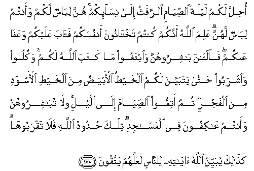

#أُحِلَّ لَكُمْ لَيْلَةَ الصِّيَامِ الرَّفَثُ إِلَىٰ نِسَائِكُمْ ۚ هُنَّ لِبَاسٌ لَكُمْ وَأَنْتُمْ لِبَاسٌ لَهُنَّ ۗ عَلِمَ اللَّهُ أَنَّكُمْ كُنْتُمْ تَخْتَانُونَ أَنْفُسَكُمْ فَتَابَ عَلَيْكُمْ وَعَفَا عَنْكُمْ ۖ فَالْآنَ بَاشِرُوهُنَّ وَابْتَغُوا مَا كَتَبَ اللَّهُ لَكُمْ ۚ وَكُلُوا وَاشْرَبُوا حَتَّىٰ يَتَبَيَّنَ لَكُمُ الْخَيْطُ الْأَبْيَضُ مِنَ الْخَيْطِ الْأَسْوَدِ مِنَ الْفَجْرِ ۖ ثُمَّ أَتِمُّوا الصِّيَامَ إِلَى اللَّيْلِ ۚ وَلَا تُبَاشِرُوهُنَّ وَأَنْتُمْ عَاكِفُونَ فِي الْمَسَاجِدِ ۗ تِلْكَ حُدُودُ اللَّهِ فَلَا تَقْرَبُوهَا ۗ كَذَٰلِكَ يُبَيِّنُ اللَّهُ آيَاتِهِ لِلنَّاسِ لَعَلَّهُمْ يَتَّقُونَ 

##Ohilla lakum laylata alssiyami alrrafathu ila nisa-ikum hunna libasun lakum waantum libasun lahunna AAalima Allahu annakum kuntum takhtanoona anfusakum fataba AAalaykum waAAafa AAankum faal-ana bashiroohunna waibtaghoo ma kataba Allahu lakum wakuloo waishraboo hatta yatabayyana lakumu alkhaytu al-abyadu mina alkhayti al-aswadi mina alfajri thumma atimmoo alssiyama ila allayli wala tubashiroohunna waantum AAakifoona fee almasajidi tilka hudoodu Allahi fala taqraboohakathalika yubayyinu Allahu ayatihi lilnnasi laAAallahum yattaqoona 

## 翻译(Translation)：

| Translator | 译文(Translation)                                            |
| :--------: | ------------------------------------------------------------ |
|    马坚    | 斋戒的夜间，准你们和妻室交接。她们是你们的衣服，你们是她们的衣服。真主已知道你们自欺，而恕饶你们，赦免你们；现在，你们可以和她们交接，可以求真主为你们注定的（子女），可以吃，可以饮，至黎明时天边的黑线和白线对你们截然划分。然後整日斋戒，至於夜间。你们在清真寺幽居的时候，不要和她们交接。这是真主的法度，你们不要临近它。真主这样为世人阐明他的迹象，以便他们敬畏。 |
|  YUSUFALI  | Permitted to you, on the night of the fasts, is the approach to your wives. They are your garments and ye are their garments. Allah knoweth what ye used to do secretly among yourselves; but He turned to you and forgave you; so now associate with them, and seek what Allah Hath ordained for you, and eat and drink, until the white thread of dawn appear to you distinct from its black thread; then complete your fast Till the night appears; but do not associate with your wives while ye are in retreat in the mosques. Those are Limits (set by) Allah: Approach not nigh thereto. Thus doth Allah make clear His Signs to men: that they may learn self-restraint. |
| PICKTHALL  | It is made lawful for you to go in unto your wives on the night of the fast. They are raiment for you and ye are raiment for them. Allah is Aware that ye were deceiving yourselves in this respect and He hath turned in mercy toward you and relieved you. So hold intercourse with them and seek that which Allah hath ordained for you, and eat and drink until the white thread becometh distinct to you from the black thread of the dawn. Then strictly observe the fast till nightfall and touch them not, but be at your devotions in the mosques. These are the limits imposed by Allah, so approach them not. Thus Allah expoundeth His revelation to mankind that they may ward off (evil). |
|   SHAKIR   | It is made lawful to you to go into your wives on the night of the fast; they are an apparel for you and you are an apparel for them; Allah knew that you acted unfaithfully to yourselves, so He has turned to you (mercifully) and removed from you (this burden); so now be in contact with them and seek what Allah has ordained for you, and eat and drink until the whiteness of the day becomes distinct from the blackness of the night at dawn, then complete the fast till night, and have not contact with them while you keep to the mosques; these are the limits of Allah, so do not go near them. Thus does Allah make clear His communications for men that they may guard (against evil). |

---

## 对位释义(Words Interpretation)：

| No   | العربية | 中文    | English | 曾用词 |
| ---- | ------: | ------- | ------- | ------ |
| 序号 |    阿文 | Chinese | 英文    | Used   |
| 2:187.1  | أُحِلَّ      | 被允许     | Permitted            |            |
| 2:187.2  | لَكُمْ      | 为你们     | For you              | 见2:22.3   |
| 2:187.3  | لَيْلَةَ     | 夜         | the night            |            |
| 2:187.4  | الصِّيَامِ   | 斋戒的     | of the fast          |            |
| 2:187.5  | الرَّفَثُ    | 交接       | go into              |            |
| 2:187.6  | إِلَىٰ      | 至         | to                   | 见2:14.9   |
| 2:187.7  | نِسَائِكُمْ   | 你们的妻室 | your wives           |            |
| 2:187.8  | هُنَّ       | 她们是     | they are             |            |
| 2:187.9  | لِبَاسٌ     | 衣服       | raiment              |            |
| 2:187.10 | لَكُمْ      | 为你们     | For you              | 见2:22.3   |
| 2:187.11 | وَأَنْتُمْ    | 和你们     | and you              | 见2:22.22  |
| 2:187.12 | لِبَاسٌ     | 衣服       | raiment              | 见2:187.9  |
| 2:187.13 | لَهُنَّ      | 为她们     | for them             |            |
| 2:187.14 | عَلِمَ      | 知道       | know                 | 见2:60.15  |
| 2:187.15 | اللَّهُ     | 安拉，真主 | Allah                | 见1:1.2    |
| 2:187.16 | أَنَّكُمْ     | 那个你们   | that you             |            |
| 2:187.17 | كُنْتُمْ     | 你们是     | You are              | 见2:23.2   |
| 2:187.18 | تَخْتَانُونَ  | 欺骗       | deceiving            |            |
| 2:187.19 | أَنْفُسَكُمْ   | 自己       | yourselves           | 见2:44.5   |
| 2:187.20 | فَتَابَ     | 接受忏悔   | turned … mercifully  | 见2:37.6   |
| 2:187.21 | عَلَيْكُمْ    | 在你们     | on you               | 见2:40.8   |
| 2:187.22 | وَعَفَا     | 和赦免     | and forgave          |            |
| 2:187.23 | عَنْكُمْ     | 在你们     | on you               | 见2:52.3   |
| 2:187.24 | فَالْآنَ    | 因此现在   | so now               |            |
| 2:187.25 | بَاشِرُوهُنَّ  | 与她们交接 | associate with them  |            |
| 2:187.26 | وَابْتَغُوا  | 和寻求     | and seek             |            |
| 2:187.27 | مَا       | 什么       | what/ that which     | 见2:17.8   |
| 2:187.28 | كَتَبَ      | 注定       | has ordained         |            |
| 2:187.29 | اللَّهُ     | 安拉，真主 | Allah                | 见1:1.2    |
| 2:187.30 | لَكُمْ      | 为你们     | For you              | 见2:22.3   |
| 2:187.31 | وَكُلُوا    | 和吃       | and eat              | 参2:57.8   |
| 2:187.32 | وَاشْرَبُوا  | 和饮       | And drink            | 见2:60.20  |
| 2:187.33 | حَتَّىٰ      | 直到       | Until                | 见2:55.8   |
| 2:187.34 | يَتَبَيَّنَ    | 截然划分   | distinct             |            |
| 2:187.35 | لَكُمُ      | 为你们     | For you              | 见2:22.3   |
| 2:187.36 | الْخَيْطُ    | 线         | thread               |            |
| 2:187.37 | الْأَبْيَضُ   | 白色的     | the white            |            |
| 2:187.38 | مِنَ       | 从         | from                 | 见2:4.8    |
| 2:187.39 | الْخَيْطِ    | 线         | thread               | 见2:187.36 |
| 2:187.40 | الْأَسْوَدِ   | 黑色的     | the black            |            |
| 2:187.41 | مِنَ       | 从         | from                 | 见2:4.8    |
| 2:187.42 | الْفَجْرِ    | 黎明       | the dawn             |            |
| 2:187.43 | ثُمَّ       | 然后       | Then                 | 见2:28.7   |
| 2:187.44 | أَتِمُّوا    | 完成       | complete             |            |
| 2:187.45 | الصِّيَامَ   | 斋戒的     | of the fast          | 见2:187.4  |
| 2:187.46 | إِلَى      | 至         | to                   | 见2:14.9   |
| 2:187.47 | اللَّيْلِ    | 夜         | the night            | 见2:164.7  |
| 2:187.48 | وَلَا      | 也不       | and not              | 见1:7.8    |
| 2:187.49 | تُبَاشِرُوهُنَّ | 与她们交接 | associate with them  | 参2:187.25 |
| 2:187.50 | وَأَنْتُمْ    | 和你们     | and you              | 见2:22.22  |
| 2:187.51 | عَاكِفُونَ   | 幽居       | in retreat           |            |
| 2:187.52 | فِي       | 在         | in                   | 见2:10.1   |
| 2:187.53 | الْمَسَاجِدِ  | 清真寺     | the mosques          |            |
| 2:187.54 | تِلْكَ      | 这些是    | These are            | 见2:111.11 |
| 2:187.55 | حُدُودُ     | 限度       | the limits           |            |
| 2:187.56 |     اللَّهِ | 真主的     | of Allah             | 见2:23.17  |
| 2:187.57 | فَلَا      | 因此不     | shall not            | 见2:22.18  |
| 2:187.58 | تَقْرَبُوهَا  | 临近它     | approach them        |            |
| 2:187.59 | كَذَٰلِكَ     | 像如此     | Thus                 | 见2:73.4   |
| 2:187.60 | يُبَيِّنُ     | 阐明       | make clear           |            |
| 2:187.61 | اللَّهُ     | 安拉，真主 | Allah                | 见1:1.2    |
| 2:187.62 | آيَاتِهِ    | 他的迹象   | His Signs            | 见2:73.9   |
| 2:187.63 | لِلنَّاسِ    | 对世人     | For people           | 见2:83.17  |
| 2:187.64 | لَعَلَّهُمْ    | 以便他们   | in order that they   | 见2:186.16 |
| 2:187.65 | يَتَّقُونَ    | 敬畏       | learn self-restraint | 参2:21.12  |

---

