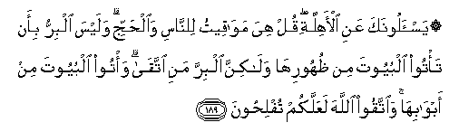

#۞ يَسْأَلُونَكَ عَنِ الْأَهِلَّةِ ۖ قُلْ هِيَ مَوَاقِيتُ لِلنَّاسِ وَالْحَجِّ ۗ وَلَيْسَ الْبِرُّ بِأَنْ تَأْتُوا الْبُيُوتَ مِنْ ظُهُورِهَا وَلَٰكِنَّ الْبِرَّ مَنِ اتَّقَىٰ ۗ وَأْتُوا الْبُيُوتَ مِنْ أَبْوَابِهَا ۚ وَاتَّقُوا اللَّهَ لَعَلَّكُمْ تُفْلِحُونَ 

##Yas-aloonaka AAani al-ahillati qul hiya mawaqeetu lilnnasi waalhajji walaysa albirru bi-an ta/too albuyoota min thuhooriha walakinna albirra mani ittaqa wa/too albuyoota min abwabiha waittaqoo Allaha laAAallakum tuflihoona 

## 翻译(Translation)：

| Translator | 译文(Translation)                                            |
| :--------: | ------------------------------------------------------------ |
|    马坚    | 他们询问新月的情状，你说：新月是人事和朝觐的时计。正义绝不是从房屋後面穿洞进去，但正义是敬畏。你们当从门户走进房屋，当敬畏真主，以便你们成功。 |
|  YUSUFALI  | They ask thee concerning the New Moons. Say: They are but signs to mark fixed periods of time in (the affairs of) men, and for Pilgrimage. It is no virtue if ye enter your houses from the back: It is virtue if ye fear Allah. Enter houses through the proper doors: And fear Allah: That ye may prosper. |
|  PICKTHAL  | They ask thee, (O Muhammad), of new moons, say: They are fixed seasons for mankind and for the pilgrimage. It is not righteousness that ye go to houses by the backs thereof (as do the idolaters at certain seasons), but the righteous man is he who wardeth off (evil). So go to houses by the gates thereof, and observe your duty to Allah, that ye may be successful. |
|   SHAKIR   | They ask you concerning the new moon. Say: They are times appointed for (the benefit of) men, and (for) the pilgrimage; and it is not righteousness that you should enter the houses at their backs, but righteousness is this that one should guard (against evil); and go into the houses by their doors and be careful (of your duty) to Allah, that you may be successful. |

---

## 对位释义(Words Interpretation)：

| No   | العربية | 中文    | English | 曾用词 |
| ---- | ------: | ------- | ------- | ------ |
| 序号 |    阿文 | Chinese | 英文    | Used   |
| 2:189.1  | يَسْأَلُونَكَ | 他们问你   | They ask you       |            |
| 2:189.2  | عَنِ      | 关于       | about              | 异2:48.6   |
| 2:189.3  | الْأَهِلَّةِ  | 新月       | the new moon       |            |
| 2:189.4  | قُلْ      | 你说       | Say                | 见2:80.8   |
| 2:189.5  | هِيَ      | 她         | she                | 见2:68.8   |
| 2:189.6  | مَوَاقِيتُ  | 计时       | times appointed    |            |
| 2:189.7  | لِلنَّاسِ   | 对世人     | For people         | 见2:83.17  |
| 2:189.8  | وَالْحَجِّ   | 和朝觐     | and the pilgrimage |            |
| 2:189.9  | وَلَيْسَ    | 和它不     | and it is not      |            |
| 2:189.10 | الْبِرُّ    | 正义       | righteousness      |            |
| 2:189.11 | بِأَنْ     | 以那个     | with that          |            |
| 2:189.12 | تَأْتُوا   | 你们进入   | you enter          |            |
| 2:189.13 | الْبُيُوتَ  | 房屋       | the houses         |            |
| 2:189.14 | مِنْ      | 从         | from               | 见2:4.8    |
| 2:189.15 | ظُهُورِهَا  | 它的背后   | their backs        |            |
| 2:189.16 | وَلَٰكِنَّ    | 并且但是   | and but            | 见2:12.5   |
| 2:189.17 | الْبِرَّ    | 正义       | righteousness      | 见2:189.10 |
| 2:189.18 | مَنِ      | 谁         | who                | 参2:97.2   |
| 2:189.19 | اتَّقَىٰ    | 敬畏       | fear Allah         | 参2:21.12  |
| 2:189.20 | وَأْتُوا   | 和进入     | and enter          | 参2:189.12 |
| 2:189.21 | الْبُيُوتَ  | 房屋       | the houses         | 见2:189.13 |
| 2:189.22 | مِنْ      | 从         | from               | 见2:4.8    |
| 2:189.23 | أَبْوَابِهَا | 它的门     | their doors        |            |
| 2:189.24 | وَاتَّقُوا  | 和畏惧     | And fear           | 见2:48.1   |
| 2:189.25 | اللَّهَ    | 安拉，真主 | Allah              | 见1:1.2    |
| 2:189.26 | لَعَلَّكُمْ   | 以便你们   | you may            | 见2:21.11  |
| 2:189.27 | تُفْلِحُونَ  | 成功       | be successful      |            |

---
