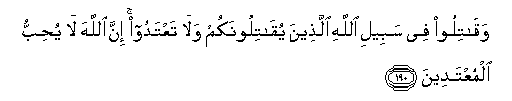

#وَقَاتِلُوا فِي سَبِيلِ اللَّهِ الَّذِينَ يُقَاتِلُونَكُمْ وَلَا تَعْتَدُوا ۚ إِنَّ اللَّهَ لَا يُحِبُّ الْمُعْتَدِينَ 

##Waqatiloo fee sabeeli Allahi allatheena yuqatiloonakum wala taAAtadoo inna Allaha la yuhibbu almuAAtadeena 

## 翻译(Translation)：

| Translator | 译文(Translation)                                            |
| :--------: | ------------------------------------------------------------ |
|    马坚    | 你们当为主道而抵抗进攻你们的人，你们不要过分，因为真主必定不喜爱过分者。 |
|  YUSUFALI  | Fight in the cause of Allah those who fight you, but do not transgress limits; for Allah loveth not transgressors. |
|  PICKTHAL  | Fight in the way of Allah against those who fight against you, but begin not hostilities. Lo! Allah loveth not aggressors. |
|   SHAKIR   | And fight in the way of Allah with those who fight with you, and do not exceed the limits, surely Allah does not love those who exceed the limits. |

---

## 对位释义(Words Interpretation)：

| No   | العربية | 中文    | English | 曾用词 |
| ---- | ------: | ------- | ------- | ------ |
| 序号 |    阿文 | Chinese | 英文    | Used   |
| 2:190.1  | وَقَاتِلُوا   | 和战斗         | and fight                   |            |
| 2:190.2  | فِي        | 在             | in                          | 见2:10.1   |
| 2:190.3  | سَبِيلِ      | 道路           | the way                     | 见2:154.6  |
| 2:190.4  | اللَّهِ      | 安拉，真主     | Allah                       | 见1:1.2    |
| 2:190.5  | الَّذِينَ     | 谁，那些       | those who                   | 见2:6.2    |
| 2:190.6  | يُقَاتِلُونَكُمْ | 他们进攻你们   | they fight you              | 参2:190.1  |
| 2:190.7  | وَلَا       | 也不           | and not                     | 见1:7.8    |
| 2:190.8  | تَعْتَدُوا    | 过分           | exceeds the limit           | 参2:178.33 |
| 2:190.9  | إِنَّ        | 的确           | surely                      | 见2:6.1    |
| 2:190.10 | اللَّهَ      | 安拉，真主     | Allah                       | 见1:1.2    |
| 2:190.11 | لَا        | 不，不是，没有 | no                          | 见2:2.3    |
| 2:190.12 | يُحِبُّ       | 喜欢           | love                        |            |
| 2:190.13 | الْمُعْتَدِينَ  | 过分者         | those who exceed the limits | 参2:190.8  |

---

