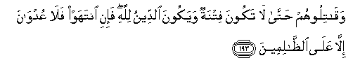

#وَقَاتِلُوهُمْ حَتَّىٰ لَا تَكُونَ فِتْنَةٌ وَيَكُونَ الدِّينُ لِلَّهِ ۖ فَإِنِ انْتَهَوْا فَلَا عُدْوَانَ إِلَّا عَلَى الظَّالِمِينَ 

##Waqatiloohum hatta la takoona fitnatun wayakoona alddeenu lillahi fa-ini intahaw fala AAudwana illa AAala alththalimeena 

## 翻译(Translation)：

| Translator | 译文(Translation)                                            |
| :--------: | ------------------------------------------------------------ |
|    马坚    | 你们当反抗他们，直到迫害消除，而宗教专为真主；如果他们停战，那末，除不义者外，你们绝不要侵犯任何人。 |
|  YUSUFALI  | And fight them on until there is no more Tumult or oppression, and there prevail justice and faith in Allah; but if they cease, Let there be no hostility except to those who practise oppression. |
| PICKTHALL  | And fight them until persecution is no more, and religion is for Allah. But if they desist, then let there be no hostility except against wrong-doers. |
|   SHAKIR   | And fight with them until there is no persecution, and religion should be only for Allah, but if they desist, then there should be no hostility except against the oppressors. |

---

## 对位释义(Words Interpretation)：

| No   | العربية | 中文    | English | 曾用词 |
| ---- | ------: | ------- | ------- | ------ |
| 序号 |    阿文 | Chinese | 英文    | Used   |
| 2:193.1  | وَقَاتِلُوهُمْ | 和进攻他们             | and fight them     | 参2:191.13 |
| 2:193.2  | حَتَّىٰ      | 直到                   | Until              | 见2:55.8   |
| 2:193.3  | لَا       | 不，不是，没有         | no                 | 见2:2.3    |
| 2:193.4  | تَكُونَ     | 它是                   | there is           |            |
| 2:193.5  | فِتْنَةٌ     | 试验                   | a trial            | 见2:102.32 |
| 2:193.6  | وَيَكُونَ    | 和他是                 | And he is          | 见2:143.9  |
| 2:193.7  | الدِّينُ    | 宗教，信仰，报应，回报 | religion, judgment | 见1:4.3    |
| 2:193.8  | لِلَّهِ      | 为真主                 | for Allah          | 见1:2.2    |
| 2:193.9  | فَإِنِ      | 和如果                 | and if             | 见2:24.1   |
| 2:193.10 | انْتَهَوْا   | 他们停止               | they desist        | 见2:192.2  |
| 2:193.11 | فَلَا      | 因此不                 | shall not          | 见2:22.18  |
| 2:193.12 | عُدْوَانَ    | 对抗                   | hostility          |            |
| 2:193.13 | إِلَّا      | 除了                   | Except             | 见2:9.7    |
| 2:193.14 | عَلَى      | 至                     | On                 | 见2:5.2    |
| 2:193.15 | الظَّالِمِينَ | 不义的人               | unjust             | 见2:35.19  |

---

