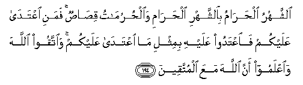

#الشَّهْرُ الْحَرَامُ بِالشَّهْرِ الْحَرَامِ وَالْحُرُمَاتُ قِصَاصٌ ۚ فَمَنِ اعْتَدَىٰ عَلَيْكُمْ فَاعْتَدُوا عَلَيْهِ بِمِثْلِ مَا اعْتَدَىٰ عَلَيْكُمْ ۚ وَاتَّقُوا اللَّهَ وَاعْلَمُوا أَنَّ اللَّهَ مَعَ الْمُتَّقِينَ 

##Alshshahru alharamu bialshshahri alharami waalhurumatu qisasun famani iAAtada AAalaykum faiAAtadoo AAalayhi bimithli ma iAAtada AAalaykum waittaqoo Allaha waiAAlamoo anna Allaha maAAa almuttaqeena 

## 翻译(Translation)：

| Translator | 译文(Translation)                                            |
| :--------: | ------------------------------------------------------------ |
|    马坚    | 禁月抵偿禁月，凡应当尊敬的事物，都是互相抵偿的。谁侵犯你们，你们可以同样的方法报复谁；你们当敬畏真主，当知道真主是与敬畏者同在的。 |
|  YUSUFALI  | The prohibited month for the prohibited month,- and so for all things prohibited,- there is the law of equality. If then any one transgresses the prohibition against you, Transgress ye likewise against him. But fear Allah, and know that Allah is with those who restrain themselves. |
|  PICKTHAL  | The forbidden month for the forbidden month, and forbidden things in retaliation. And one who attacketh you, attack him in like manner as he attacked you. Observe your duty to Allah, and know that Allah is with those who ward off (evil). |
|   SHAKIR   | The Sacred month for the sacred month and all sacred things are (under the law of) retaliation; whoever then acts aggressively against you, inflict injury on him according to the injury he has inflicted on you and be careful (of your duty) to Allah and know that Allah is with those who guard (against evil). |

---

## 对位释义(Words Interpretation)：

| No   | العربية | 中文    | English | 曾用词 |
| ---- | ------: | ------- | ------- | ------ |
| 序号 |    阿文 | Chinese | 英文    | Used   |
| 2:194.1  | الشَّهْرُ    | 这个月           | the month             | 见2:185.16 |
| 2:194.2  | الْحَرَامُ   | 禁止的           | The Sacred            |            |
| 2:194.3  | بِالشَّهْرِ   | 对这个月         | for the month         | 参2:185.16 |
| 2:194.4  | الْحَرَامِ   | 禁止的           | The Sacred            | 见2:194.2  |
| 2:194.5  | وَالْحُرُمَاتُ | 和所有禁止的事物 | and all sacred things |            |
| 2:194.6  | قِصَاصٌ     | 互相抵偿         | law of equality       | 参2:178.7  |
| 2:194.7  | فَمَنِ      | 然后谁           | then who              | 见2:173.13 |
| 2:194.8  | اعْتَدَىٰ    | 过分             | exceeds the limit     | 见2:178.33 |
| 2:194.9  | عَلَيْكُمْ    | 在你们           | on you                | 见2:40.8   |
| 2:194.10 | فَاعْتَدُوا  | 因此报复         | then transgress       |            |
| 2:194.11 | عَلَيْهِ     | 在他             | on him                | 见2:37.7   |
| 2:194.12 | بِمِثْلِ     | 在像             | in like               | 见2:137.3  |
| 2:194.13 | مَا       | 什么             | what/ that which      | 见2:17.8   |
| 2:194.14 | اعْتَدَىٰ    | 过分             | exceeds the limit     | 见2:178.33 |
| 2:194.15 | عَلَيْكُمْ    | 在你们           | on you                | 见2:40.8   |
| 2:194.16 | وَاتَّقُوا   | 和畏惧           | And fear              | 见2:48.1   |
| 2:194.17 | اللَّهَ     | 安拉，真主       | Allah                 | 见1:1.2    |
| 2:194.18 | وَاعْلَمُوا  | 和知道           | and know              |            |
| 2:194.19 | أَنَّ       | 该               | that                  | 见2:26.5   |
| 2:194.20 | اللَّهَ     | 安拉，真主       | Allah                 | 见1:1.2    |
| 2:194.21 | مَعَ       | 共同             | With                  | 见2:43.6   |
| 2:194.22 | الْمُتَّقِينَ  | 敬畏的           | the Allah-fearing     | 见2:180.16 |

---
