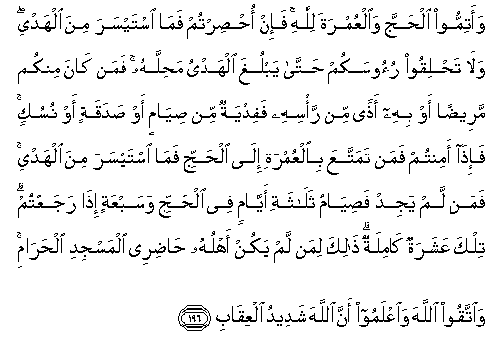

#وَأَتِمُّوا الْحَجَّ وَالْعُمْرَةَ لِلَّهِ ۚ فَإِنْ أُحْصِرْتُمْ فَمَا اسْتَيْسَرَ مِنَ الْهَدْيِ ۖ وَلَا تَحْلِقُوا رُءُوسَكُمْ حَتَّىٰ يَبْلُغَ الْهَدْيُ مَحِلَّهُ ۚ فَمَنْ كَانَ مِنْكُمْ مَرِيضًا أَوْ بِهِ أَذًى مِنْ رَأْسِهِ فَفِدْيَةٌ مِنْ صِيَامٍ أَوْ صَدَقَةٍ أَوْ نُسُكٍ ۚ فَإِذَا أَمِنْتُمْ فَمَنْ تَمَتَّعَ بِالْعُمْرَةِ إِلَى الْحَجِّ فَمَا اسْتَيْسَرَ مِنَ الْهَدْيِ ۚ فَمَنْ لَمْ يَجِدْ فَصِيَامُ ثَلَاثَةِ أَيَّامٍ فِي الْحَجِّ وَسَبْعَةٍ إِذَا رَجَعْتُمْ ۗ تِلْكَ عَشَرَةٌ كَامِلَةٌ ۗ ذَٰلِكَ لِمَنْ لَمْ يَكُنْ أَهْلُهُ حَاضِرِي الْمَسْجِدِ الْحَرَامِ ۚ وَاتَّقُوا اللَّهَ وَاعْلَمُوا أَنَّ اللَّهَ شَدِيدُ الْعِقَابِ 

##Waatimmoo alhajja waalAAumrata lillahi fa-in ohsirtum fama istaysara mina alhadyi wala tahliqoo ruoosakum hatta yablugha alhadyu mahillahu faman kana minkum mareedan aw bihi athan min ra/sihi fafidyatun min siyamin aw sadaqatin aw nusukin fa-itha amintum faman tamattaAAa bialAAumrati ilaalhajji fama istaysara mina alhadyi faman lam yajid fasiyamu thalathati ayyamin fee alhajji wasabAAatin itha rajaAAtum tilka AAasharatun kamilatun thalika liman lam yakun ahluhu hadiree almasjidi alharami waittaqoo Allaha waiAAlamoo anna Allaha shadeedu alAAiqabi 

## 翻译(Translation)：

| Translator | 译文(Translation)                                            |
| :--------: | ------------------------------------------------------------ |
|    马坚    | 你们当为真主而完成大朝和小朝。如果你们被困於中途，那末，应当献一只易得的牺牲。你们不要剃发，直到牺牲到达其定所。你们当中谁为生病或头部有疾而剃发，谁当以斋戒，或施舍，或献牲，作为罚赎。当你们平安的时候，凡在小朝後享受到大朝的人，都应当献一只易得的牺牲。凡不能献牲的，都应当在大朝期间斋戒三日，归家後斋戒七日，共计十日。这是家眷不在禁寺区域内的人所应尽的义务。你们当敬畏真主，你们当知道真主的刑罚是严厉的。 |
|  YUSUFALI  | And complete the Hajj or 'umra in the service of Allah. But if ye are prevented (From completing it), send an offering for sacrifice, such as ye may find, and do not shave your heads until the offering reaches the place of sacrifice. And if any of you is ill, or has an ailment in his scalp, (Necessitating shaving), (He should) in compensation either fast, or feed the poor, or offer sacrifice; and when ye are in peaceful conditions (again), if any one wishes to continue the 'umra on to the hajj, He must make an offering, such as he can afford, but if he cannot afford it, He should fast three days during the hajj and seven days on his return, Making ten days in all. This is for those whose household is not in (the precincts of) the Sacred Mosque. And fear Allah, and know that Allah Is strict in punishment. |
|  PICKTHAL  | Perform the pilgrimage and the visit (to Makka) for Allah. And if ye are prevented, then send such gifts as can be obtained with ease, and shave not your heads until the gifts have reached their destination. And whoever among you is sick or hath an ailment of the head must pay a ransom of fasting or almsgiving or offering. And if ye are in safety, then whosoever contenteth himself with the visit for the pilgrimage (shall give) such gifts as can be had with ease. And whosoever cannot find (such gifts), then a fast of three days while on the pilgrimage, and of seven when ye have returned; that is, ten in all. That is for him whoso folk are not present at the Inviolable Place of Worship. Observe your duty to Allah, and know that Allah is severe in punishment. |
|   SHAKIR   | And accomplish the pilgrimage and the visit for Allah, but if, you are prevented, (send) whatever offering is easy to obtain, and do not shave your heads until the offering reaches its destination; but whoever among you is sick or has an ailment of the head, he (should effect) a compensation by fasting or alms or sacrificing, then when you are secure, whoever profits by combining the visit with the pilgrimage (should take) what offering is easy to obtain; but he who cannot find (any offering) should fast for three days during the pilgrimage and for seven days when you return; these (make) ten (days) complete; this is for him whose family is not present in the Sacred Mosque, and be careful (of your duty) to Allah, and know that Allah is severe in requiting (evil). |

---

## 对位释义(Words Interpretation)：

| No   | العربية | 中文    | English | 曾用词 |
| ---- | ------: | ------- | ------- | ------ |
| 序号 |    阿文 | Chinese | 英文    | Used   |
| 2:196.1  | وَأَتِمُّوا  | 和完成             | and complete                   | 参2:187.44 |
| 2:196.2  | الْحَجَّ    | 大朝               | the pilgrimage                 | 参2:189.8  |
| 2:196.3  | وَالْعُمْرَةَ | 和小朝             | and the visit                  |            |
| 2:196.4  | لِلَّهِ     | 为真主             | for Allah                      | 见1:2.2    |
| 2:196.5  | فَإِنْ     | 和如果             | and if                         | 见2:24.1   |
| 2:196.6  | أُحْصِرْتُمْ  | 你们被阻           | you are prevented              |            |
| 2:196.7  | فَمَا     | 什么，并未         | What                           | 见2:16.6   |
| 2:196.8  | اسْتَيْسَرَ  | 易于得到           | easy to obtain                 |            |
| 2:196.9  | مِنَ      | 从                 | from                           | 见2:4.8    |
| 2:196.10 | الْهَدْيِ   | 奉献               | offering                       |            |
| 2:196.11 | وَلَا     | 也不               | and not                        | 见1:7.8    |
| 2:196.12 | تَحْلِقُوا  | 剃                 | shave                          |            |
| 2:196.13 | رُءُوسَكُمْ  | 你们的头           | your heads                     |            |
| 2:196.14 | حَتَّىٰ     | 直到               | Until                          | 见2:55.8   |
| 2:196.15 | يَبْلُغَ    | 达到               | reaches                        |            |
| 2:196.16 | الْهَدْيُ   | 奉献               | offering                       | 见2:196.10 |
| 2:196.17 | مَحِلَّهُ    | 它的地点           | its place                      |            |
| 2:196.18 | فَمَنْ     | 无论谁             | whosoever                      | 见2:38.9   |
| 2:196.19 | كَانَ     | 他是               | It was                         | 见2:75.6   |
| 2:196.20 | مِنْكُمْ    | 从你们             | Of you                         | 见2:65.5   |
| 2:196.21 | مَرِيضًا   | 生病               | sick                           | 见2:184.6  |
| 2:196.22 | أَوْ      | 或                 | or                             | 见2:19.1   |
| 2:196.23 | بِهِ      | 以它               | with it                        | 见2:22.13  |
| 2:196.24 | أَذًى     | 疾病               | ailment                        |            |
| 2:196.25 | مِنْ      | 从                 | from                           | 见2:4.8    |
| 2:196.26 | رَأْسِهِ    | 他的头             | his head                       |            |
| 2:196.27 | فَفِدْيَةٌ   | 然后买赎           | then in compensation           |            |
| 2:196.28 | مِنْ      | 从                 | from                           | 见2:4.8    |
| 2:196.29 | صِيَامٍ    | 斋戒               | fast                           | 参2:187.4  |
| 2:196.30 | أَوْ      | 或                 | or                             | 见2:19.1   |
| 2:196.31 | صَدَقَةٍ    | shishe             | almsgiving                     |            |
| 2:196.32 | أَوْ      | 或                 | or                             | 见2:19.1   |
| 2:196.33 | نُسُكٍ     | 献牲               | sacrificing                    |            |
| 2:196.34 | فَإِذَا    | 然后当             | then when                      | 参2:156.2  |
| 2:196.35 | أَمِنْتُمْ   | 你们平安           | you are in peaceful conditions |            |
| 2:196.36 | فَمَنْ     | 无论谁             | whosoever                      | 见2:38.9   |
| 2:196.37 | تَمَتَّعَ    | 享受               | profits                        |            |
| 2:196.38 | بِالْعُمْرَةِ | 在小朝             | with the visit                 | 参2:196.3  |
| 2:196.39 | إِلَى     | 至                 | to                             | 见2:14.9   |
| 2:196.40 | الْحَجِّ    | 大朝               | the pilgrimage                 | 见2:196.2  |
| 2:196.41 | فَمَا     | 什么，并未         | What                           | 见2:16.6   |
| 2:196.42 | اسْتَيْسَرَ  | 易于得到           | easy to obtain                 | 见2:196.8  |
| 2:196.43 | مِنَ      | 从                 | from                           | 见2:4.8    |
| 2:196.44 | الْهَدْيِ   | 奉献               | offering                       | 见2:196.10 |
| 2:196.45 | فَمَنْ     | 无论谁             | whosoever                      | 见2:38.9   |
| 2:196.46 | لَمْ      | 不，没有           | did not                        | 见2:6.8    |
| 2:196.47 | يَجِدْ     | 发现               | find                           |            |
| 2:196.48 | فَصِيَامُ   | 然后斋戒           | then a fast                    | 参2:196.29 |
| 2:196.49 | ثَلَاثَةِ   | 三                 | three                          |            |
| 2:196.50 | أَيَّامٍ    | 日子               | days                           | 见2:184.12 |
| 2:196.51 | فِي      | 在                 | in                             | 见2:10.1   |
| 2:196.52 | الْحَجِّ    | 大朝               | the pilgrimage                 | 见2:196.2  |
| 2:196.53 | وَسَبْعَةٍ   | 和七               | and seven                      |            |
| 2:196.54 | إِذَا     | 当时               | when                           | 见2:156.2  |
| 2:196.55 | رَجَعْتُمْ   | 你们返回           | you return                     |            |
| 2:196.56 | تِلْكَ     | 这些是            | These are                      | 见2:111.11 |
| 2:196.57 | عَشَرَةٌ    | 十                 | ten                            |            |
| 2:196.58 | كَامِلَةٌ   | 共计               | complete                       |            |
| 2:196.59 | ذَٰلِكَ     | 那，那个，那些，该 | that                           | 见2:2.1    |
| 2:196.60 | لِمَنْ     | 对谁               | of who                         | 见2:154.3  |
| 2:196.61 | لَمْ      | 不，没有           | did not                        | 见2:6.8    |
| 2:196.62 | يَكُنْ     | 他是               | it is                          |            |
| 2:196.63 | أَهْلُهُ    | 他的家人           | his family                     |            |
| 2:196.64 | حَاضِرِي   | 在                 | present                        |            |
| 2:196.65 | الْمَسْجِدِ  | 清真寺             | The mosque                     | 见2:144.13 |
| 2:196.66 | الْحَرَامِ  | 神圣的             | The Sacred                     | 见2:144.14 |
| 2:196.67 | وَاتَّقُوا  | 和畏惧             | And fear                       | 见2:48.1   |
| 2:196.68 | اللَّهَ    | 安拉，真主         | Allah                          | 见1:1.2    |
| 2:196.69 | وَاعْلَمُوا | 和知道             | and know                       | 见2:194.18 |
| 2:196.70 | أَنَّ      | 该                 | that                           | 见2:26.5   |
| 2:196.71 | اللَّهَ    | 安拉，真主         | Allah                          | 见1:1.2    |
| 2:196.72 | شَدِيدُ    | 严厉               | strongly                       | 见2:165.30 |
| 2:196.73 | الْعِقَابِ  | 刑罚               | punishment                     |            |

---
