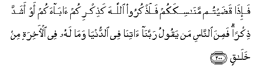

#فَإِذَا قَضَيْتُمْ مَنَاسِكَكُمْ فَاذْكُرُوا اللَّهَ كَذِكْرِكُمْ آبَاءَكُمْ أَوْ أَشَدَّ ذِكْرًا ۗ فَمِنَ النَّاسِ مَنْ يَقُولُ رَبَّنَا آتِنَا فِي الدُّنْيَا وَمَا لَهُ فِي الْآخِرَةِ مِنْ خَلَاقٍ 

##Fa-itha qadaytum manasikakum faothkuroo Allaha kathikrikum abaakum aw ashadda thikran famina alnnasi man yaqoolu rabbana atina fee alddunya wama lahu fee al-akhirati min khalaqin 

## 翻译(Translation)：

| Translator | 译文(Translation)                                            |
| :--------: | ------------------------------------------------------------ |
|    马坚    | 你们在举行朝觐的典礼之後，当记念真主，犹如记念你们的祖先一样，或记念得更多些。有人说：我们的主啊！求你在今世赏赐我们。他在後世，绝无福分。 |
|  YUSUFALI  | So when ye have accomplished your holy rites, celebrate the praises of Allah, as ye used to celebrate the praises of your fathers,- yea, with far more Heart and soul. There are men who say: "Our Lord! Give us (Thy bounties) in this world!" but they will have no portion in the Hereafter. |
| PICKTHALL  | And when ye have completed your devotions, then remember Allah as ye remember your fathers or with a more lively remembrance. But of mankind is he who saith: "Our Lord! Give unto us in the world," and he hath no portion in the Hereafter. |
|   SHAKIR   | So when you have performed your devotions, then laud Allah as you lauded your fathers, rather a greater lauding. But there are some people who say, Our Lord! give us in the world, and they shall have no resting place. |

---

## 对位释义(Words Interpretation)：

| No   | العربية | 中文    | English | 曾用词 |
| ---- | ------: | ------- | ------- | ------ |
| 序号 |    阿文 | Chinese | 英文    | Used   |
| 2:200.1  | فَإِذَا    | 然后当         | then when          | 见2:196.34 |
| 2:200.2  | قَضَيْتُمْ   | 你们完成       | you have completed |            |
| 2:200.3  | مَنَاسِكَكُمْ | 你们的朝觐典礼 | your holy rites    | 参2:128.11 |
| 2:200.4  | فَاذْكُرُوا | 然后纪念       | then remember      | 见2:198.13 |
| 2:200.5  | اللَّهَ    | 安拉，真主     | Allah              | 见2:9.2 |
| 2:200.6  | كَذِكْرِكُمْ  | 好像你们纪念   | as you remember    |            |
| 2:200.7  | آبَاءَكُمْ  | 你们的祖先     | your fathers       | 参2:170.14 |
| 2:200.8  | أَوْ      | 或             | or                 | 见2:19.1   |
| 2:200.9  | أَشَدَّ     | 更多           | more               |            |
| 2:200.10 | ذِكْرًا    | 纪念           | remembrance        |            |
| 2:200.11 | فَمِنَ     | 然后从         | then from          |            |
| 2:200.12 | النَّاسِ   | 人             | People             | 见2:8.2    |
| 2:200.13 | مَنْ      | 谁             | who                | 见2:97.2   |
| 2:200.14 | يَقُولُ    | 说             | Says               | 见2:8.4    |
| 2:200.15 | رَبَّنَا    | 我们的主       | Our Lord           | 见2:127.8  |
| 2:200.16 | آتِنَا    | 求你赏赐我们   | give us            |            |
| 2:200.17 | فِي      | 在             | in                 | 见2:10.1   |
| 2:200.18 | الدُّنْيَا  | 今世           | this world         | 见2:85.38  |
| 2:200.19 | وَمَا     | 和不           | And not            | 见2:9.9    |
| 2:200.20 | لَهُ      | 对他           | for he             | 见2:102.62 |
| 2:200.21 | فِي      | 在             | in                 | 见2:10.1   |
| 2:200.22 | الْآخِرَةِ  | 后世           | the Hereafter      | 见2:102.64 |
| 2:200.23 | مِنْ      | 从             | from               | 见2:4.8    |
| 2:200.24 | خَلَاقٍ    | 福分           | share of good      | 见2:102.66 |

---
