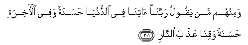

#وَمِنْهُمْ مَنْ يَقُولُ رَبَّنَا آتِنَا فِي الدُّنْيَا حَسَنَةً وَفِي الْآخِرَةِ حَسَنَةً وَقِنَا عَذَابَ النَّارِ 

##Waminhum man yaqoolu rabbana atina fee alddunya hasanatan wafee al-akhirati hasanatan waqina AAathaba alnnari 

## 翻译(Translation)：

| Translator | 译文(Translation)                                            |
| :--------: | ------------------------------------------------------------ |
|    马坚    | 我们的主啊！求你在今世赏赐我们美好的（生活），在後世也赏赐我们美好的（生活），求你保护我们，免受火狱的刑罚。 |
|  YUSUFALI  | And there are men who say: "Our Lord! Give us good in this world and good in the Hereafter, and defend us from the torment of the Fire!" |
| PICKTHALL  | And of them (also) is he who saith: "Our Lord! Give unto us in the world that which is good and in the Hereafter that which is good, and guard us from the doom of Fire." |
|   SHAKIR   | And there are some among them who say: Our Lord! grant us good in this world and good in the hereafter, and save us from the chastisement of the fire. |

---

## 对位释义(Words Interpretation)：

| No   | العربية | 中文    | English | 曾用词 |
| ---- | ------: | ------- | ------- | ------ |
| 序号 |    阿文 | Chinese | 英文    | Used   |
| 2:201.1  | وَمِنْهُمْ  | 和从他们   | and from them | 见2:78.1   |
| 2:201.2  | مَنْ     | 谁         | who           | 见2:97.2   |
| 2:201.3  | يَقُولُ   | 说         | Says          | 见2:8.4    |
| 2:201.4  | رَبَّنَا   | 我们的主   | Our Lord      | 见2:127.8  |
| 2:201.5  | آتِنَا   | 给我们     | give us       | 见2:200.16 |
| 2:201.6  | فِي     | 在         | in            | 见2:10.1   |
| 2:201.7  | الدُّنْيَا | 今世       | this world    | 见2:85.38  |
| 2:201.8  | حَسَنَةً   | 好的       | good          | 参2:83.18  |
| 2:201.9  | وَفِي    | 和在       | and at        | 见2:49.13  |
| 2:201.10 | الْآخِرَةِ | 后世       | the Hereafter | 见2:102.64 |
| 2:201.11 | حَسَنَةً   | 好的       | good          | 见2:201.8  |
| 2:201.12 | وَقِنَا   | 和求你保护我们 | and guard us  |            |
| 2:201.13 | عَذَابَ   | 刑罚       | the chastisement |            |
| 2:201.14 | النَّارِ  | 火狱       | the Fire      | 见2:24.7   |

---

