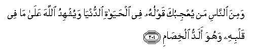

#وَمِنَ النَّاسِ مَنْ يُعْجِبُكَ قَوْلُهُ فِي الْحَيَاةِ الدُّنْيَا وَيُشْهِدُ اللَّهَ عَلَىٰ مَا فِي قَلْبِهِ وَهُوَ أَلَدُّ الْخِصَامِ 

##Wamina alnnasi man yuAAjibuka qawluhu fee alhayati alddunya wayushhidu Allaha AAala ma fee qalbihi wahuwa aladdu alkhisami 

## 翻译(Translation)：

| Translator | 译文(Translation)                                            |
| :--------: | ------------------------------------------------------------ |
|    马坚    | 有人谈论今世的生活，他的言论，使你赞叹，他还求真主作证他的存心。其实，他是最强悍的仇敌。 |
|  YUSUFALI  | There is the type of man whose speech about this world's life May dazzle thee, and he calls Allah to witness about what is in his heart; yet is he the most contentious of enemies. |
| PICKTHALL  | And of mankind there is he whoso conversation on the life of this world pleaseth thee (Muhammad), and he calleth Allah to witness as to that which is in his heart; yet he is the most rigid of opponents. |
|   SHAKIR   | And among men is he whose speech about the life of this world causes you to wonder, and he calls on Allah to witness as to what is in his heart, yet he is the most violent of adversaries. |

---

## 对位释义(Words Interpretation)：

| No   | العربية | 中文    | English | 曾用词 |
| ---- | ------: | ------- | ------- | ------ |
| 序号 |    阿文 | Chinese | 英文    | Used   |
| 2:204.1  | وَمِنَ    | 和从         | And from                | 见2:8.1   |
| 2:204.2  | النَّاسِ  | 人           | People                  | 见2:8.2   |
| 2:204.3  | مَنْ     | 谁           | who                     | 见2:97.2  |
| 2:204.4  | يُعْجِبُكَ  | 使你赞叹     | pleaseth thee           |           |
| 2:204.5  | قَوْلُهُ   | 谈论         | speech about            |           |
| 2:204.6  | فِي     | 在           | in                      | 见2:10.1  |
| 2:204.7  | الْحَيَاةِ | 生活         | Life                    | 见2:85.37 |
| 2:204.8  | الدُّنْيَا | 今世         | this world              | 见2:85.38 |
| 2:204.9  | وَيُشْهِدُ  | 和他要求作证 | and he calls to witness |           |
| 2:204.10 | اللَّهَ   | 安拉，真主   | Allah                   | 见1:1.2   |
| 2:204.11 | عَلَىٰ    | 至           | On                      | 见2:5.2   |
| 2:204.12 | مَا     | 什么         | what/ that which        | 见2:17.8  |
| 2:204.13 | فِي     | 在           | in                      | 见2:10.1  |
| 2:204.14 | قَلْبِهِ   | 他的心       | his heart               |           |
| 2:204.15 | وَهُوَ    | 和他         | and he                  | 见2:29.16 |
| 2:204.16 | أَلَدُّ    | 最强悍的     | the most rigid          |           |
| 2:204.17 | الْخِصَامِ | 仇敌         | adversaries             |           |

---
