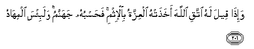

#وَإِذَا قِيلَ لَهُ اتَّقِ اللَّهَ أَخَذَتْهُ الْعِزَّةُ بِالْإِثْمِ ۚ فَحَسْبُهُ جَهَنَّمُ ۚ وَلَبِئْسَ الْمِهَادُ 

##Wa-itha qeela lahu ittaqi Allaha akhathat-hu alAAizzatu bial-ithmi fahasbuhu jahannamu walabi/sa almihadu 

## 翻译(Translation)：

| Translator | 译文(Translation)                                            |
| :--------: | ------------------------------------------------------------ |
|    马坚    | 有人对他说：你当敬畏真主，他就因羞愤而犯罪。火狱将使他满足，那卧褥真恶劣。 |
|  YUSUFALI  | When it is said to him, "Fear Allah", He is led by arrogance to (more) crime. Enough for him is Hell;-An evil bed indeed (To lie on)! |
| PICKTHALL  | And when it is said unto him: Be careful of thy duty to Allah, pride taketh him to sin. Hell will settle his account, an evil resting-place. |
|   SHAKIR   | And when it is said to him, guard against (the punish ment of) Allah; pride carries him off to sin, therefore hell is sufficient for him; and certainly it is an evil resting place. |

---

## 对位释义(Words Interpretation)：

| No   | العربية | 中文    | English | 曾用词 |
| ---- | ------: | ------- | ------- | ------ |
| 序号 |    阿文 | Chinese | 英文    | Used   |
| 2:206.1  | وَإِذَا   | 并且如果，当时 | and when                | 见2:11.1   |
| 2:206.2  | قِيلَ    | 告诉           | said                | 见2:11.2   |
| 2:206.3  | لَهُ     | 对他           | for he                  | 见2:102.62 |
| 2:206.4  | اتَّقِ    | 畏惧           | fear                    |            |
| 2:206.5  | اللَّهَ   | 安拉，真主     | Allah                   | 见2:9.2 |
| 2:206.6  | أَخَذَتْهُ  | 促使他         | he is led by            |            |
| 2:206.7  | الْعِزَّةُ  | 傲慢           | arrogance               |            |
| 2:206.8  | بِالْإِثْمِ | 在罪恶         | By sin                  | 见2:85.13  |
| 2:206.9  | فَحَسْبُهُ  | 因此满足他的   | then sufficient for him |            |
| 2:206.10 | جَهَنَّمُ   | 火狱           | hell                    |            |
| 2:206.11 | وَلَبِئْسَ  | 和恶劣         | and evil                | 见2:102.67 |
| 2:206.12 | الْمِهَادُ | 卧褥       | resting place           |            |

---

