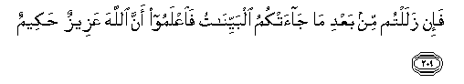

#فَإِنْ زَلَلْتُمْ مِنْ بَعْدِ مَا جَاءَتْكُمُ الْبَيِّنَاتُ فَاعْلَمُوا أَنَّ اللَّهَ عَزِيزٌ حَكِيمٌ 

##Fa-in zalaltum min baAAdi ma jaatkumu albayyinatu faiAAlamoo anna Allaha AAazeezun hakeemun 

## 翻译(Translation)：

| Translator | 译文(Translation)                                            |
| :--------: | ------------------------------------------------------------ |
|    马坚    | 如果你们在明证降临之後背离正道，那末，你们当知道真主是万能的，是至睿的。 |
|  YUSUFALI  | If ye backslide after the clear (Signs) have come to you, then know that Allah is Exalted in Power, Wise. |
| PICKTHALL  | And if ye slide back after the clear proofs have come unto you, then know that Allah is Mighty, Wise. |
|   SHAKIR   | But if you slip after clear arguments have come to you, then know that Allah is Mighty, Wise. |

---

## 对位释义(Words Interpretation)：

| No   | العربية | 中文    | English | 曾用词 |
| ---- | ------: | ------- | ------- | ------ |
| 序号 |    阿文 | Chinese | 英文    | Used   |
| 2:209.1  | فَإِنْ     | 因此如果   | then if          | 见2:24.1 |
| 2:209.2  | زَلَلْتُمْ   | 你们背叛   | you backslide    |          |
| 2:209.3  | مِنْ      | 从         | from             | 见2:4.8  |
| 2:209.4  | بَعْدِ     | 之后       | after            | 见2:27.6 |
| 2:209.5  | مَا      | 什么       | what/ that which | 见2:17.8 |
| 2:209.6  | جَاءَتْكُمُ  | 来至你们   | come to you      |          |
| 2:209.7  | الْبَيِّنَاتُ | 明证       | the clear Signs  |          |
| 2:209.8  | فَاعْلَمُوا | 然后知道   | then know        |          |
| 2:209.9  | أَنَّ      | 该         | that             | 见2:26.5 |
| 2:209.10 | اللَّهَ    | 安拉，真主 | Allah            | 见2:9.2 |
| 2:209.11 | عَزِيزٌ    | 万能的     | Mighty           |          |
| 2:209.12 | حَكِيمٌ    | 至睿的     | Wise             |          |

---
