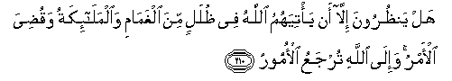

#هَلْ يَنْظُرُونَ إِلَّا أَنْ يَأْتِيَهُمُ اللَّهُ فِي ظُلَلٍ مِنَ الْغَمَامِ وَالْمَلَائِكَةُ وَقُضِيَ الْأَمْرُ ۚ وَإِلَى اللَّهِ تُرْجَعُ الْأُمُورُ 

##Hal yanthuroona illa an ya/tiyahumu Allahu fee thulalin mina alghamami waalmala-ikatu waqudiya al-amru wa-ila Allahi turjaAAu al-omooru 

## 翻译(Translation)：

| Translator | 译文(Translation)                                            |
| :--------: | ------------------------------------------------------------ |
|    马坚    | 他们只等待真主在云荫中与众天神同齐降临，事情将被判决。一切事情，只归真主安排。 |
|  YUSUFALI  | Will they wait until Allah comes to them in canopies of clouds, with angels (in His train) and the question is (thus) settled? but to Allah do all questions go back (for decision). |
| PICKTHALL  | Wait they for naught else than that Allah should come unto them in the shadows of the clouds with the angels? Then the case would be already judged. All cases go back to Allah (for judgment). |
|   SHAKIR   | They do not wait aught but that Allah should come to them in the shadows of the clouds along with the angels, and the matter has (already) been decided; and (all) matters are returned to Allah. |

---

## 对位释义(Words Interpretation)：

| No   | العربية | 中文    | English | 曾用词 |
| ---- | ------: | ------- | ------- | ------ |
| 序号 |    阿文 | Chinese | 英文    | Used   |
| 2:210.1  | هَلْ        | 是吗？      | Do you         |          |
| 2:210.2  | يَنْظُرُونَ    | 他们等待   | they wait      |          |
| 2:210.3  | إِلَّا       | 除了       | Except         | 见2:9.7  |
| 2:210.4  | أَنْ        | 该         | that           | 见2:26.5 |
| 2:210.5  | يَأْتِيَهُمُ    | 来至他们   | come to them   |          |
| 2:210.6  | اللَّهُ      | 安拉，真主 | Allah          | 见1:1.2  |
| 2:210.7  | فِي        | 在         | in             | 见2:10.1 |
| 2:210.8  | ظُلَلٍ       | 阴影       | shadows        |          |
| 2:210.9  | مِنَ        | 从         | from           | 见2:4.8  |
| 2:210.10 | الْغَمَامِ    | 云         | the clouds     |          |
| 2:210.11 | وَالْمَلَائِكَةُ | 和众天使   | and the angels |          |
| 2:210.12 | وَقُضِيَ      | 和它被判决 | and be decided |          |
| 2:210.13 | الْأَمْرُ     | 事情       | the matter     |          |
| 2:210.14 | وَإِلَى      | 和至       | and to         | 参2:14.9 |
| 2:210.15 | اللَّهِ      | 安拉，真主 | Allah          | 见1:1.2  |
| 2:210.16 | تُرْجَعُ      | 它被返回   | are returned   |          |
| 2:210.17 | الْأُمُورُ    | 一切事情   | all matters    |          |

---
